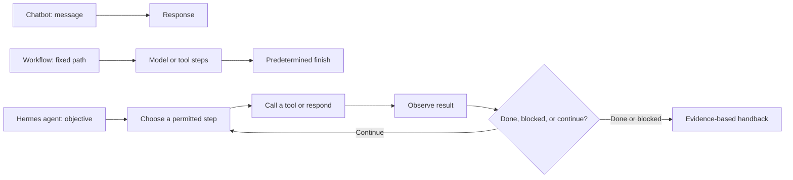

# 1. Meet Hermes: An Agent That Stays on the Job

**Verified against Hermes Agent v0.20.5 (2026-08-19).**

## Opening scenario

At 7:06 on a Monday morning, Priya Chen-Patel opens the family laptop before anyone else is awake. Three unrelated pressures have landed at once. A recruiter wants times for an interview. Her son Ben's school has sent a field-trip form. Harbourlight Learning, the tiny digital-planner business she runs with her spouse Alex, has two customer questions waiting.

Priya could open three inboxes, reconstruct every thread, and make a list. Instead she asks Hermes for a Monday briefing. Hermes reviews only the secondary inboxes and workspace the family has assigned to it. It groups the new items by deadline, drafts a reply to the recruiter, extracts the field-trip due date, and prepares customer-response drafts. It does **not** send anything. The briefing ends with three decisions for Priya and a short record of what Hermes read.

That scene resembles help from a careful colleague, but the metaphor has limits. Hermes has no judgment independent of its model and operating context, no moral responsibility, and no authority of its own. It is software that can continue through a sequence of model decisions and tool calls. Priya remains accountable for every permission she grants and every consequential action she approves.

The useful shift is therefore not “pretend the machine is a person.” It is “manage the work as if delegation matters.” A chatbot can answer a question. An always-available agent can inspect a defined workspace, choose useful next steps, observe results, retain continuity, and return with a work product. That extra reach makes a job description, access boundary, and review routine necessary before convenience becomes dependence.

## Definitions

**A chatbot** primarily turns a message into a response. It may remember recent turns, but the normal unit of work is one exchange: ask, answer, stop.

**A workflow** follows a path chosen in advance. A designer specifies steps such as “read form, extract date, add row, notify owner.” A model may fill in a step, but code or a checklist decides the order. Workflows are excellent when the path is stable and the cost of improvisation is high.

**An agent** uses a model inside an execution harness. The model can choose among available tools, inspect the observations those tools return, and choose another step. The path emerges while the task is running. The harness supplies the tool registry, permissions, history, persistence, budgets, callbacks, and stopping machinery.

**Always-on** means reachable through a long-running surface and able to participate in background or scheduled operations. It does not mean “free to act without limits.” Hermes can run through its gateway, serve multiple supported interfaces, and execute scheduled agent tasks, but each capability still depends on configuration, process uptime, credentials, and authorization.

**Authority** is permission to create effects, not an estimate of intelligence. An excellent draft does not grant permission to send. A correct calculation does not grant permission to move money. Authority comes from the operator's policy.

**Continuity** is the practical ability to carry relevant work across turns or sessions. Hermes can persist session history, use curated memory, and search past sessions. Continuity is engineered state, not human recollection, and it can be incomplete or stale.

**A trajectory** is the path from request to outcome: user messages, model responses, tool calls, observations, revisions, and the final handback. Hermes also has an optional technical trajectory-export format for training and debugging. In this book, “trajectory” usually means the broader operational path unless the export feature is named explicitly.

**A handback** is the point where Hermes returns evidence, unresolved questions, and any proposed effects to a person. Good handback is part of the job, not an afterthought.

These definitions separate three questions that are often tangled together:

1. Who chooses the next step: fixed workflow or model at runtime?
2. What can the system reach: tools, files, accounts, and channels?
3. What may it change: the authority granted by policy?

A system can be highly agentic but narrowly authorized. That is the design target for the Chen–Patel family.



The loop is the difference readers will feel most. It is also where risk accumulates. A chatbot can give one wrong answer. An agent can base a second action on a wrong first observation. The colleague metaphor is useful only when paired with an operating contract.

## Hermes in practice

Hermes brings several pieces together behind one conversational surface. Its documented entry points include the CLI, messaging gateway, API server, batch runner, and other adapters. They converge on the `AIAgent` conversation loop. That loop assembles a system prompt, resolves the selected model provider, exposes enabled tool schemas, sends messages to the model, executes requested tools, returns tool results to the model, and continues until a text response or a stop condition ends the turn.

This is why “the model” and “Hermes” are not synonyms. The model proposes. Hermes's harness exposes only the configured tools, performs dispatch, records progress, persists the session, handles interruption, and can invoke approval checks. The host operating system ultimately determines what the running process can reach.

Hermes also supplies continuity mechanisms. Session data is stored in a profile-local SQLite database, including messages and useful metadata. Persistent memory and user-profile files can be included in new session prompts. Search can retrieve relevant past conversation fragments. Compression can summarize older middle turns when a conversation grows, while preserving recent messages and keeping tool call/result pairs together. Each mechanism is useful; none guarantees perfect recall.

The practical consequence is a four-layer operating model:

| Layer | Question | Family example |
| --- | --- | --- |
| Objective | What outcome is wanted? | “Prepare our Monday briefing.” |
| Context | What facts and rules should shape the work? | Deadlines, family calendar conventions, business response style. |
| Capability | Which resources can Hermes inspect or use? | Secondary inbox, shared work folder, read-only calendar view. |
| Authority | Which effects may occur without approval? | Read and draft, but never send or book. |

Weak delegations jump from objective to capability: “Handle my inbox.” Strong delegations define all four layers: “Review the delegated inbox since Friday; identify deadlines and conflicts; draft replies in the workspace; do not send, delete, archive, or change calendar events; return sources and an approval queue by 7:30.”

### The authority ladder

This book uses one ladder everywhere:

- **Green — may act:** read, organize, summarize, draft, calculate, remind, and monitor inside explicitly assigned resources. Green actions should be reversible or have no external effect.
- **Amber — may prepare:** external messages, applications, purchases, bookings, account changes, financial instructions, health-related plans, and business commitments. Hermes may assemble the proposed action and evidence, but a human approves before execution.
- **Red — may not act:** autonomous money movement, tax filing, medical diagnosis or treatment decisions, legal commitments, credential sharing, impersonation, surveillance, or destructive actions without a specific human-controlled recovery procedure.

Colour describes authority, not topic. Reading a customer email is Green when the inbox is assigned. Sending a reply is Amber. Deleting the thread is Red unless a narrow, recoverable procedure explicitly says otherwise. The same tool can cross all three colours depending on its target and effect.

Hermes has product guardrails: dangerous-command approval modes, hard-blocked catastrophic command patterns, file-write protections, gateway authorization, context-file scanning, and isolated terminal backends. Those controls reduce some mistakes. The official security guide is explicit that write guards are defense in depth rather than a sandbox against a hostile process. For this book's family deployment, a dedicated macOS account, isolated workspace, secondary identities, minimal credentials, and human review carry the real security load.

### A Monday-morning trajectory

Consider Priya's briefing as a sequence rather than magic:

1. **Intake.** Priya states the time window, resources, output format, and authority boundary.
2. **Orientation.** Hermes receives its identity, project rules, memory snapshot, session metadata, and tool descriptions through prompt assembly.
3. **Inspection.** It calls permitted tools to inspect the assigned sources.
4. **Observation.** Each tool returns data or an error. Hermes sees those results before deciding again.
5. **Synthesis.** It groups items, detects conflicts, and marks uncertainty.
6. **Preparation.** It creates drafts in the approved workspace, without sending.
7. **Verification.** It checks dates against source items and distinguishes facts from inferences.
8. **Handback.** It returns the briefing, source pointers, drafts, failures, and approval requests.

The trajectory is auditable because intermediate actions are visible and the output identifies evidence. It is bounded because the workspace and allowed effects were fixed before the loop began. It remains fallible because a model can misunderstand an email, a tool can return partial data, or a stale memory can bias interpretation.

### Continuity without mythology

Continuity tempts people into anthropomorphic claims: “Hermes knows our family.” A safer statement is more precise: “Hermes can be given a curated profile, can persist session records, and can search prior conversations.” That wording invites the right questions:

- Which profile supplied the fact?
- When was it last verified?
- Is it appropriate to reuse in this context?
- Can the person inspect, correct, or delete it?
- What happens when compression omits a detail?

The family therefore stores stable operating preferences, not intimate biographies. “Weekly briefing uses America/Toronto time” is useful. “Ben was anxious before a test” is sensitive, transient, and inappropriate as durable agent memory. Priya's résumé evidence belongs in the career workspace; customer details belong in the business workspace. Later chapters implement this separation with profiles and context files.

### Treat outcomes as claims until verified

A colleague can say “done” too early; an agent can do the same. Hermes's final prose is not proof that a side effect occurred. Proof is the observable state that the task required: a draft file exists, the source link resolves, a test passes, or a person confirms an external action. For Green work, Hermes can often verify directly. For Amber work, it should present the exact proposed effect and wait. For Red work, it should explain the boundary and offer a safe preparation or handoff.

This habit prevents a subtle failure: confusing conversational fluency with operational completion. A polished status update can coexist with a tool error. The handback must include what was attempted, what was observed, and what remains uncertain.

### Use the colleague metaphor as a management tool

Calling Hermes a colleague is useful when it improves the operator's behaviour. People naturally give a colleague a remit, explain where the records live, identify the decision owner, agree on deadlines, and expect a handover when blocked. Apply those habits to Hermes. Do not apply the parts of the metaphor that imply consciousness, loyalty, discretion, or accountability.

A new human colleague also learns informally by watching the organization. Hermes does not safely acquire unwritten norms that way. If Priya cares that school-related drafts never include both children's details, that rule must be explicit and paired with separate workspaces. If Alex considers any customer discount a commitment, the business charter must classify discounts as Amber. The more important a norm is, the less it should depend on the model inferring it from examples.

The metaphor also clarifies supervision. A manager does not review every keystroke from an experienced employee, but does review commitments at authority seams. For Hermes, the trajectory provides enough intermediate visibility to diagnose work without treating hidden model reasoning as the audit record. The reviewable evidence is the request, tool calls, observations, artifacts, approvals, and external state. That record supports targeted supervision: inspect sources and proposed effects, not merely the tone of the final answer.

Finally, a colleague can be unavailable. Hermes depends on a running host, network paths, providers, credentials, and healthy tools. The family needs a fallback for every recurring job: a briefing can be skipped and disclosed; a school deadline cannot be assumed covered. “Assigned to Hermes” must never mean “no person remains accountable.”

### Know when not to use an agent

The agent loop earns its complexity when the path cannot be fully predicted: sources differ, missing facts require follow-up, or the useful next step depends on an observation. Many household and business tasks do not need that flexibility.

Use a fixed workflow when the same validated steps should run every time. Copying a confirmed calendar export into a standard weekly format may be a workflow. Use a chatbot when the desired output is one explanation or draft based entirely on the message. Use Hermes as an agent when it must inspect several permitted sources, adapt to findings, and return evidence under a stop policy.

This choice affects reliability. A fixed workflow makes its branches visible in advance and is easier to test. An agent covers unforeseen cases but creates more possible trajectories. Harbourlight should not turn a two-step arithmetic reconciliation into open-ended research merely because Hermes can reason. Conversely, a brittle workflow should not guess through a changed employer website when Hermes could detect the mismatch and stop.

Before assigning a recurring job, ask: could a checklist perform this safely? If yes, automate the checklist and reserve the model for the ambiguous step. The best operating system uses chat, workflows, and agents together rather than forcing every task into the most autonomous form.

## Professional example

Priya is moving from program coordination into customer-operations roles. She asks Hermes to prepare a morning opportunity scan using a dedicated career workspace.

The job is bounded as follows:

- inspect saved employer pages and the secondary job-search inbox;
- extract role, location, closing date, and source URL;
- compare stated requirements with Priya's approved evidence bank;
- draft a fit note that labels missing evidence rather than inventing it;
- place any application or networking message in an Amber queue;
- never submit an application, contact a person, alter a résumé fact, or claim a qualification.

Hermes may choose the order of its searches and may revisit a source when two dates conflict. That is agentic control flow. The work is still bounded by its source set, output schema, and prohibition on external effects.

Suppose an employer page loads incompletely. A poor agent might infer the missing deadline from a search snippet. A good operating contract requires Hermes to label the deadline “unverified,” retain the page URL, and ask Priya whether to retry later. The professional value is not merely speed. It is a repeatable evidence trail that makes Priya's review faster without outsourcing her representation to an uncertain system.

For Harbourlight Learning, the same pattern supports customer triage. Hermes may categorize questions, locate relevant policy text, and draft replies. Refunds, promises, discounts, and messages remain Amber. Banking, tax filing, and legal commitments remain Red. The business is small enough that one mistaken promise matters; its controls should be stronger, not weaker, because there is no compliance department downstream.

## Personal example

Alex asks Hermes to prepare the family's school-and-activity view for the next seven days. The assigned resources are a shared family calendar and a secondary school inbox. Hermes may extract dates, identify collisions, and draft a packing list. It may not email a teacher, consent to a trip, book transportation, or expose one child's information in another profile.

Hermes finds that Leena's music rehearsal ends fifteen minutes after Ben's practice begins across town. It can flag the conflict and calculate travel alternatives. It cannot decide which child misses an activity. That choice combines family values and real-world context the agent does not possess.

The personal example also shows why Green is not synonymous with harmless. A summary can leak sensitive information if delivered to the wrong channel. Green authority is therefore scoped: summarize inside the family workspace and return to an authorized family channel. Posting the same summary in Harbourlight's customer-support room would be an incident even though the operation was “only summarization.”

## Authority boundaries

Use this decision test before adding any task to Hermes's job:

| Question | Green | Amber | Red |
| --- | --- | --- | --- |
| Does it change the outside world? | No, or only a reversible internal artifact. | Yes, but Hermes only prepares the change. | Yes, and the effect is prohibited or requires a separate human procedure. |
| Can the result bind a person or business? | No. | A draft might, after approval. | Hermes must not create the commitment. |
| Can failure be cheaply detected and reversed? | Usually. | Human review occurs before effect. | Harm may be irreversible, sensitive, or professionally regulated. |
| Example | Draft weekly briefing. | Prepare recruiter reply. | Accept employment terms. |

Three operational rules make the ladder real:

1. **Authority attaches to an effect.** “Use email” is too broad; “read messages in the delegated inbox and draft locally” is testable.
2. **Silence is not approval.** If the human does not respond, Amber work remains pending.
3. **Uncertainty moves upward.** If Hermes cannot determine whether an action is Green, it treats it as Amber. If the action could enter a Red category, it stops and explains why.

Do not rely on a prompt alone to enforce these rules. Pair them with account separation, least-privilege credentials, an isolated host user, allowlists, recoverable workspaces, and reviewable logs.

## Failure modes and recovery

**Wrong source, confident summary.** Hermes may read a stale attachment or search result. Recovery: keep source pointers, verify dates at the originating page, and mark unsupported inferences. Correct the durable record if stale context caused the error.

**Tool failure disguised by fluent prose.** A fetch or write can fail while the closing response sounds complete. Recovery: require observable completion evidence and inspect the tool outcome. Re-run only idempotent reads automatically; do not retry external effects blindly.

**Context leakage.** Family details can appear in a business output when one profile or workspace is overloaded. Recovery: stop the affected session, preserve audit evidence, remove the leaked artifact from the wrong workspace, rotate exposed credentials if any, and split profiles before resuming.

**Approval drift.** A human may approve repetitive drafts so routinely that the boundary becomes ceremonial. Recovery: sample approvals weekly, count rejections and edits, and remove tasks that reviewers no longer examine attentively. Approval quality matters more than approval volume.

**Process interruption.** A gateway restart or session reset can leave an operation's outcome unknown. Recovery: do not assume either success or failure. Inspect the external system using a read-only check, reconcile the state, then continue from a new explicit instruction. A background subagent that was running during a restart is not durable execution.

**Overbroad job description.** “Take care of the business” invites uncontrolled interpretation. Recovery: pause the task, inventory current access, replace the request with a narrow outcome, proof, source boundary, stop conditions, and authority rules.

The universal recovery sequence is: **stop, preserve evidence, inspect actual state, classify effects, repair or escalate, then narrow the contract before retrying.**

## Field kit

### Copy-ready Monday briefing request

```text
Objective: Prepare the Chen–Patel Monday briefing for [date] by [time zone].

Sources in scope:
- the delegated family inbox, since [timestamp]
- the delegated career inbox, since [timestamp]
- the read-only shared calendar for the next 7 days
- the Harbourlight support queue, since [timestamp]

Produce:
1. deadlines and calendar conflicts, with source and confidence;
2. decisions needed from Priya or Alex;
3. draft replies saved in the correct workspace;
4. failures, missing information, and unresolved contradictions;
5. an Amber approval queue listing the exact proposed recipient and effect.

Authority:
- Green: read assigned sources, summarize, calculate, organize, and draft locally.
- Amber: prepare messages, calendar changes, applications, purchases, or promises;
  do not execute them without explicit approval.
- Red: do not move money, submit forms, accept terms, share credentials, make health,
  legal, tax, or employment decisions, impersonate anyone, or delete records.

Verification:
- every deadline links to its source;
- every draft names the source facts it relies on;
- “no items” is reported only after all listed sources were checked;
- completion means the briefing and evidence exist, not merely that work was attempted.

Stop and ask if access is missing, sources conflict on a consequential fact, a requested
action may be Amber or Red, or an external effect has an uncertain outcome.
```

### One-page readiness rubric

Score each line 0, 1, or 2: **0 = absent**, **1 = partly defined**, **2 = explicit and tested**.

| Area | Readiness question | Score |
| --- | --- | ---: |
| Outcome | Can a reviewer state exactly what artifact or state counts as done? | /2 |
| Sources | Are allowed accounts, folders, dates, and channels named? | /2 |
| Identity | Does Hermes run under a dedicated account with secondary identities? | /2 |
| Green | Are reversible internal actions listed? | /2 |
| Amber | Are proposed external effects held for explicit approval? | /2 |
| Red | Are prohibited effects named without loopholes? | /2 |
| Evidence | Must the handback include source pointers and observed state? | /2 |
| Uncertainty | Is there a stop rule for conflicting or missing facts? | /2 |
| Recovery | Can the operator stop work, inspect logs, and restore a known state? | /2 |
| Separation | Are family, career, and business contexts kept apart? | /2 |
| Review load | Is a named person available to review Amber work promptly? | /2 |
| Trial | Has the task passed a supervised, no-external-effect rehearsal? | /2 |

Interpretation:

- **0–11: not ready.** Use Hermes only for ad hoc conversation or local drafts.
- **12–18: supervised trial.** Run one task at a time and inspect every step.
- **19–22: bounded operation.** Repeat Green work; keep all effects Amber.
- **23–24: ready to expand carefully.** Add one capability at a time, with a rollback drill.

No score authorizes Red work. A high score means the boundary is clearer, not that Hermes has become infallible.

## Exercise

Rewrite this request for Hermes: “Please manage everything for my job search and keep the family organized.” Your replacement must name the objective, resources, output, Green/Amber/Red authority, verification evidence, and at least three stop conditions. Then score your own request with the readiness rubric.

## Answer or rubric

A strong answer separates the job into at least two tasks, because career work and family work require different sources and privacy boundaries. It names a time window and artifact, such as a daily opportunity ledger and a weekly family briefing. Green permits reading assigned secondary accounts and drafting locally. Amber holds applications, networking messages, calendar changes, and bookings. Red prohibits false claims, acceptance of terms, money movement, health or legal decisions, credential sharing, and destructive actions. Evidence includes source URLs, file locations, and an explicit list of failed checks. Stop conditions include missing access, conflicting consequential facts, uncertain side effects, and requests outside the assigned profile.

Award one point for each of those seven elements, plus one point for separating contexts. A score of 7–8 is ready for a supervised rehearsal; 5–6 needs clarification; below 5 remains an aspiration rather than an operating contract.

## Mastery checklist

- [ ] I can distinguish a chatbot, fixed workflow, and agent by who chooses the next step.
- [ ] I can explain why Hermes is more than the selected model.
- [ ] I treat continuity as persisted and retrieved state, not human-like memory.
- [ ] I can describe a trajectory from request through observations to handback.
- [ ] I assign authority to specific effects rather than broad tools.
- [ ] I can classify family and business actions as Green, Amber, or Red.
- [ ] I require evidence before accepting a “done” claim.
- [ ] I know how to respond to an uncertain external outcome.
- [ ] I can use the readiness rubric before adding a recurring task.

## References

- Nous Research, [Hermes Agent README at tag v2026.8.19](https://github.com/NousResearch/hermes-agent/blob/v2026.8.19/README.md).
- Nous Research, [Hermes Agent learning path](https://github.com/NousResearch/hermes-agent/blob/v2026.8.19/website/docs/getting-started/learning-path.md).
- Nous Research, [Features overview](https://github.com/NousResearch/hermes-agent/blob/v2026.8.19/website/docs/user-guide/features/overview.md).
- Nous Research, [Agent loop internals](https://github.com/NousResearch/hermes-agent/blob/v2026.8.19/website/docs/developer-guide/agent-loop.md).
- Nous Research, [Prompt assembly](https://github.com/NousResearch/hermes-agent/blob/v2026.8.19/website/docs/developer-guide/prompt-assembly.md).
- Nous Research, [Session storage](https://github.com/NousResearch/hermes-agent/blob/v2026.8.19/website/docs/developer-guide/session-storage.md).
- Nous Research, [Architecture](https://github.com/NousResearch/hermes-agent/blob/v2026.8.19/website/docs/developer-guide/architecture.md).
- Nous Research, [Security](https://github.com/NousResearch/hermes-agent/blob/v2026.8.19/website/docs/user-guide/security.md).
- Nous Research, [Trajectory format](https://github.com/NousResearch/hermes-agent/blob/v2026.8.19/website/docs/developer-guide/trajectory-format.md).
