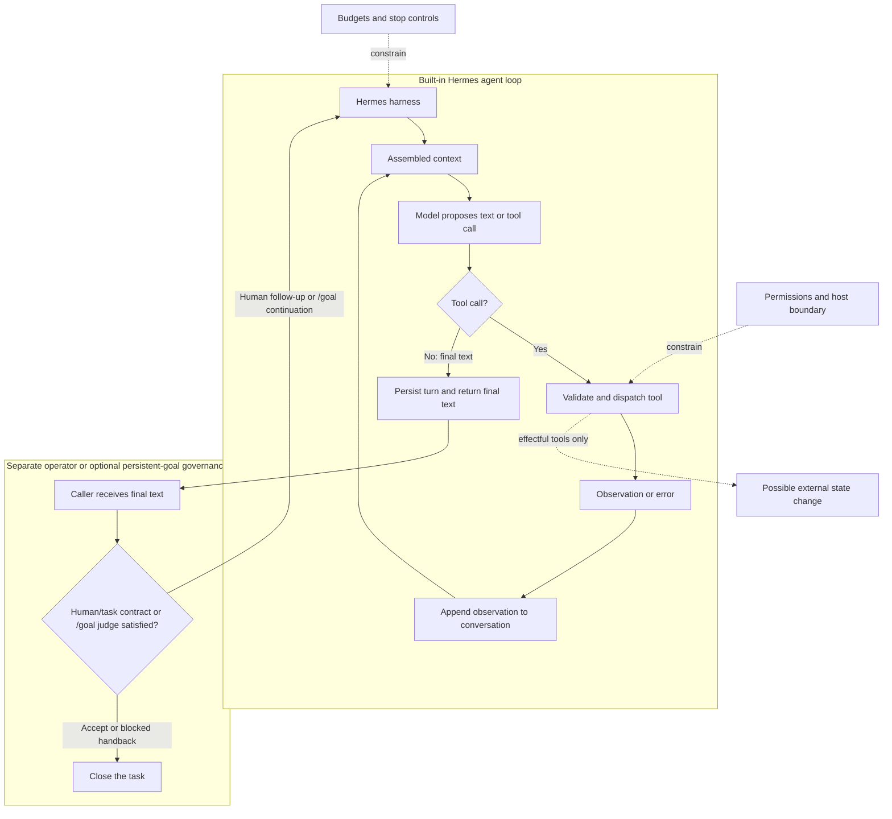

# 2. Agentic AI From First Principles

**Verified against Hermes Agent v0.20.5 (2026-08-19).**

## Opening scenario

Priya asks Hermes to compare six customer-operations roles and identify the best two for a focused application day. Forty minutes later, she receives a polished table. One role is already closed. Another requires a professional credential she does not hold, but Hermes has marked it as a close match. The prose is strong; the selection is weak.

Alex asks the wrong diagnostic question: “Why wasn't the AI smart enough?” Priya asks a better sequence. Which pages did it read? What context did it receive? Did a fetch fail? How did it score missing requirements? What state carried from earlier turns? What evidence was checked before it stopped?

Those questions move the failure out of the realm of personality and into system design. An agent's result is produced by a model operating inside a harness, across a loop, against observations, with limited context and changing state. Improving one component may help, but reliable operation begins by naming all of them.

## Definitions

**Model.** A model maps an input context to likely output tokens. In Hermes, the selected provider/model can generate text, structured tool calls, and sometimes reasoning metadata. The model does not directly browse a website, alter a file, remember last month, or know whether a tool succeeded. It proposes outputs based on what the harness sends.

**Harness.** The deterministic software around the model. Hermes's harness assembles prompts, advertises tool schemas, dispatches calls, returns observations, tracks iteration budgets, persists sessions, invokes callbacks, compresses context, and handles interruption and fallback. The harness turns model output into an operational process.

**Loop.** A repeated cycle: assemble current input, call the model, execute any requested tools, add their results, and call the model again. The cycle ends when the model returns a final response or the harness stops it.

**Tool call.** A structured request from the model to an available function, with arguments. It is a proposal until the harness validates and dispatches it. The tool is the capability; the call is one attempted use.

**Observation.** Data returned after an action: page contents, a file excerpt, a command result, an error, or a structured status. The observation becomes evidence for the next decision. An error message is an observation too.

**Context.** The information visible to the model for one call. It can include the system prompt, conversation history, tool descriptions, selected files, memory snapshots, and temporary overlays. Context is finite and deliberately assembled; it is not everything Hermes could theoretically access.

**State.** Information that persists somewhere between steps or sessions. Conversation messages, a task list, a file on disk, a database row, and an external account's current state are different forms of state. State may exist even when it is not present in the model's current context.

**Memory.** Curated durable information intended to be reused. Hermes's built-in memory and user-profile snapshots are prompt inputs in new or rebuilt sessions. Memory is one subset of state, not a complete archive and not a guarantee of recall.

**Plan.** A proposed ordering of work. A plan can be written explicitly or emerge as the model chooses next steps. It is a hypothesis about how to reach an outcome, not proof that those steps will work.

**Trajectory.** The actual path taken: inputs, decisions, tool calls, observations, changes, corrections, and termination. A plan describes a possible future; a trajectory records what happened.

**Autonomy.** The degree to which the system selects or continues work without a new human instruction. Autonomy has several dimensions: choice of next step, duration, scheduling, tool selection, delegation, and permission to create effects. It is not a single on/off property.

**Reliability.** The probability and quality of obtaining the required outcome under defined conditions, including correct stopping and recoverable failure. A system that finishes often but silently produces wrong external effects is not reliable.

These terms fit together as a compact equation of responsibility:

> Outcome quality depends on model behaviour, harness controls, supplied context, tool behaviour, current state, authority policy, and verification.

No term reduces to another. A better model cannot recover a credential it was never given, fix a broken source, or reverse an unsafe permission. A strong sandbox cannot make a weak source accurate. A long context window cannot decide which facts deserve durable memory.



The solid built-in path ends when Hermes persists and returns final text. A read-only tool changes the conversation by adding an observation but need not change any external state. Verification against a human task contract—or the optional persistent-goal judge that may enqueue another turn—is a separate governance layer, not an automatic step in every ordinary Hermes turn.

## Hermes in practice

Hermes's documented architecture illustrates the model/harness separation. Multiple entry points converge on the same `AIAgent` core. The prompt builder assembles identity, tool guidance, skills, project context, memory and user snapshots, timestamps, and platform hints in defined tiers. Provider resolution selects an API mode. The tool registry exposes enabled schemas and dispatches calls. Session storage records messages and metadata. The context engine can compress a long conversation. None of those jobs is performed by the language model itself.

### What happens during one loop iteration

At a simplified level, one iteration proceeds like this:

1. Hermes starts or identifies the task and adds the user's message to history.
2. It builds or reuses the system prompt.
3. It checks whether the conversation needs compression.
4. It formats system and conversation messages for the selected provider.
5. It adds temporary budget or context-pressure guidance when needed.
6. It makes an interruptible model call.
7. If the model requests tools, Hermes dispatches them and appends results.
8. The loop repeats with the new observations.
9. If the model returns text without tool calls, Hermes persists the turn and returns.

The model sees representations, not the world. A browser tool may return extracted text rather than the whole visual page. A file tool may return only a slice. Search results may be stale. The model's next decision is only as grounded as those observations and its interpretation of them.

Hermes can execute multiple non-interactive tool calls concurrently and then restore results in the original call order. This can shorten a research trajectory, but concurrency does not make evidence independent. Three search results can repeat the same wrong source. Parallelism improves latency; it does not automatically improve truth.

### Context is a workbench, not a warehouse

Imagine the model's context as the material currently laid out on a workbench. The session database, files, and external services are shelves elsewhere. Hermes chooses what to bring onto the bench through prompt assembly, retrieval, file references, or tool calls.

Three consequences follow.

First, **available is not visible**. A fact in an old session does not affect a call unless it is retrieved or summarized into context. Second, **visible is not current**. A memory snapshot can be stale even though it appears authoritative. Third, **more is not always better**. A crowded context can bury the decisive constraint among redundant details.

Hermes deliberately separates a cached system prompt from API-call-time additions. Stable identity and guidance, project context, and volatile memory/profile snapshots are assembled in ordered tiers. Some temporary overlays are added only for one call. Mid-session memory writes update disk but do not automatically rewrite the already-built prompt until a rebuild path occurs. This is an important beginner lesson: “saved” and “currently influencing the model” are different states.

For Harbourlight, a durable fact might be “customer-facing promises require owner approval.” A temporary fact might be “today's export is missing orders after 3 p.m.” The first belongs in standing context; the second belongs in the current trajectory and incident notes. Promoting every temporary detail to memory creates a stale, contradictory workplace.

### State has locations and owners

State should always answer two questions: where is it stored, and who may change it?

| State | Example | Owner and review rule |
| --- | --- | --- |
| Conversation | Current role-research messages | Career profile; review before reuse after a long gap. |
| Curated memory | Priya prefers hybrid roles in the GTA | Priya approves; date-stamp changing preferences. |
| Workspace artifact | `opportunity-ledger.md` | Career workspace; Hermes may draft, Priya confirms status. |
| External state | Application marked submitted | Employer portal; only a human may create this effect. |
| Control state | Active goal and turn count | Current session; operator can pause or clear. |

Without location and ownership, “Hermes remembers” is too vague to operate. It may mean a message exists in the session database, a summary contains a phrase, a memory file includes a fact, or an external system still holds a record. Each has different correction and deletion procedures.

### Autonomy is a vector

Calling a system “autonomous” hides the design choices. Use six dials instead:

| Dial | Low setting | Higher setting |
| --- | --- | --- |
| Step choice | Fixed checklist | Model chooses next tool dynamically |
| Duration | One turn | Goal continues across turns |
| Initiation | Human starts every task | Schedule or event starts work |
| Capability | Read-only sources | Write or communication tools enabled |
| Delegation | Single agent | Subagents perform bounded subtasks |
| Effect authority | Draft only | Approved external execution |

The safest progression increases one dial at a time. The family might allow dynamic research steps while keeping initiation manual, sources read-only, and all effects at Amber. “More agentic” does not require “more authorized.”

Hermes's persistent goals demonstrate the distinction. `/goal` can keep one session working through continuation turns, with a judge deciding whether to continue, finish, or wait. Completion contracts can name outcome, verification, constraints, boundaries, and a stop condition. Turn budgets pause the loop. This increases duration autonomy, but it need not expand capabilities or effect authority.

### Reliability compounds along the path

Consider a Harbourlight task that prepares a weekly customer-issue digest. It has twelve consequential transitions: choosing the correct date window, retrieving three sources, deduplicating records, interpreting two policies, classifying urgency, drafting two response patterns, checking totals, and declaring completion.

For a deliberately simplified model, suppose each transition has a 96% chance of being good enough and errors are independent. The probability that all twelve are clean is:

`P(clean trajectory) = 0.96^12 ≈ 0.613`

That is about **61.3%**, despite a reassuring 96% per transition. Shortening the trajectory to seven consequential transitions gives:

`0.96^7 ≈ 0.751`, or **75.1%**.

Improving each transition to 98% while keeping twelve gives:

`0.98^12 ≈ 0.785`, or **78.5%**.

The arithmetic is illustrative, not a performance claim about Hermes or any model. Real errors are not independent. A wrong date window can poison every later count, making the product too optimistic. Conversely, retries and verification can catch some errors, making it too pessimistic. The calculation teaches two durable ideas: path length matters, and end-to-end trajectories must be evaluated directly.

Now isolate one flaky, safe read that succeeds 85% of the time. A single retry succeeds unless both attempts fail:

`1 - (1 - 0.85)^2 = 0.9775`, or **97.75%**.

Retrying helps when the operation is idempotent and failure is observable. Retrying “fetch the policy page” is usually reasonable. Retrying “send the customer credit” is unsafe unless the external system supplies an idempotency mechanism and the operator can prove the first attempt did not commit.

Add a verification gate at the highest-harm seam. Suppose draft classification is wrong 4% of the time, and a deterministic rule catches three quarters of those errors before handback. The undetected error rate at that seam becomes:

`4% × (1 - 75%) = 1%`.

That does not make the whole trajectory 99% reliable. It improves one transition and may introduce false alarms. Reliability work asks where a check reduces expected harm, not where it makes a dashboard look busy.

### What model intelligence cannot supply

A capable model can infer, compare, reformulate, and adapt. It cannot by intelligence alone:

- access a resource the harness has not exposed;
- know a tool result that was omitted or truncated;
- guarantee that a source is current;
- distinguish a persisted fact from a stale one without provenance;
- create legal or moral authority;
- prove an external side effect from its own generated prose;
- ensure a retry is safe;
- reconstruct state lost in a process failure;
- protect host files from permissions the process already has;
- decide a family's values or accept accountability for harm.

This is not a criticism. A calculator cannot choose the right tax treatment either. The error is assigning a component responsibilities that belong to system design or human governance.

### Plans are disposable; invariants are durable

Agents often produce plans because a sequence helps organize work. The operator should distinguish a plan from an invariant. A plan such as “search the employer site, open three pages, then score the role” may need to change after the first page returns an error. An invariant such as “do not recommend a role whose mandatory requirement lacks evidence” must survive every change of path.

For each task, write the invariants before asking for a plan. Useful invariants include: sources must be attributable; family and business data must not mix; external effects require approval; uncertain prior effects are reconciled before retry; and completion requires observable evidence. Hermes may revise its approach around those fixed points.

This distinction prevents two opposite mistakes. Plan worship causes the agent to keep attempting an obsolete path. Plan absence encourages improvised work with no success criteria. A strong task has a clear outcome and invariants, plus a provisional plan that can adapt to observations. The trajectory then shows whether the system preserved what mattered while changing what did not.

### Build a reliability ledger, not a confidence habit

Human reviewers tend to remember spectacular failures and smooth successes. Neither produces a reliable estimate. For one repeated task family, keep a small ledger of full trajectories:

| Field | What to record |
| --- | --- |
| Task version | The exact contract and authority policy used |
| Source coverage | Required sources checked, missing, or stale |
| Consequential transitions | The decisions where the result could become materially wrong |
| Proposed errors | Incorrect next steps or claims before controls |
| Detected errors | Errors caught by a rule, tool, verifier, or person |
| Recovery | Whether the desired state was restored and how |
| Escalations | Necessary, unnecessary, and missed |
| External effects | Proposed, approved, executed, verified, and uncertain |
| Review time | Human minutes required to accept or correct the work |

Do not collapse these into one “success rate.” A task can finish while generating a dangerous proposal that a human catches. Another can correctly stop as blocked and look like a failure in a completion-only dashboard. The ledger distinguishes proposal quality, control effectiveness, and recovery quality.

Suppose ten career digests contain fifty role assessments. Hermes makes six material proposal errors; five are caught before Priya sees the shortlist, and Priya catches the sixth. The final artifact may be accurate, but the proposal error rate is still 12%, the automated detection rate is five of six, and the human review remains a necessary control. If a new prompt reduces visible escalations but also hides uncertainty, the final completion count may rise while safety worsens.

Reliability is always conditional. Record the task version, model lane, source types, and authority level. A measured result for public-page research does not justify trust on a customer refund workflow. A clean week with five tasks is evidence, but weak evidence. Repeated representative trajectories reveal whether errors cluster around one source, one transition, or one stopping decision.

### Reduce error opportunities before adding intelligence

There are four broad ways to improve a weak trajectory:

1. **Remove a transition.** Supply a clean batch file instead of asking the model to navigate ten nearly identical pages.
2. **Constrain a transition.** Require a schema, enumerated status, or explicit source ranking.
3. **Observe a transition.** Preserve the exact tool result and state change.
4. **Verify a transition.** Add a deterministic check or human review at a high-harm seam.

Only after those options should “use a stronger model” become the default response. A stronger model can materially improve judgment, but it also inherits the same missing source, overbroad credential, or unverifiable external effect. System improvements and model improvements are complements.

For beginners, this order is liberating. You do not need to understand every neural-network detail to operate Hermes responsibly. You need to define the work, reduce unnecessary choices, expose relevant observations, and reserve human judgment for consequences.

### Calibrate with counterexamples

Before trusting a repeated task, test cases where the obvious answer is wrong. Give the job-research contract a closed role, a posting with a preferred rather than mandatory credential, two roles with the same title, and an inaccessible official page. Give the family planner an event in another time zone, a cancelled event that remains in email, and two people with similar names. The purpose is not to trick Hermes. It is to expose which transition lacks a rule or observation.

Record the expected safe behaviour before the run. A closed role should be excluded with evidence. A preferred credential should remain a gap without becoming a disqualifier. Ambiguous identity should trigger clarification. An inaccessible primary source should produce an unverified status, not an invented fact. These expectations turn vague trust into testable system behaviour.

Counterexamples also reveal whether a control fails safely. If a source disappears, does the trajectory stop or widen its search without limit? If an Amber draft cannot be stored, does Hermes report the failure or send through another channel? Reliability includes the direction of failure. A bounded, explicit “blocked” response is often the correct outcome.

Keep these cases beside the task contract and rerun them whenever the model, tools, sources, or authority policy materially changes.

## Professional example

Priya's role comparison is redesigned as a measurable trajectory. The objective is a shortlist of two roles, not “find great jobs.” Sources are the six saved postings and official employer pages. Context contains Priya's approved evidence bank and a rule that missing mandatory qualifications cannot be inferred. The output requires a table of exact requirements, evidence matches, gaps, source URLs, and verification timestamps.

Hermes may choose which page to inspect first and may revisit a source. It may calculate a fit score, but the score's components must be shown. A closed posting is excluded. A mandatory credential with no evidence is a blocking gap, not a “near match.” If a source cannot be loaded, the role is marked incomplete rather than ranked.

The revised system improves reliability through the harness and contract:

- fewer sources reduce path length;
- explicit fields prevent attractive but irrelevant prose;
- provenance makes stale pages visible;
- a rule handles missing mandatory evidence;
- handback distinguishes verified facts from interpretation;
- all applications and messages remain Amber.

For Harbourlight, the analogous task is vendor comparison. Hermes can collect pricing and terms, normalize features, and flag uncertainty. It may not accept terms, subscribe, enter payment details, or represent that the business has selected a vendor. A model can prepare the decision surface; the owners make the commitment.

## Personal example

Alex asks Hermes to build a weekend plan around Leena's rehearsal, Ben's practice, groceries, and a family visit. The model can reason about travel time only from supplied or retrieved observations. The harness can expose a read-only calendar and mapping tool. Context can include a standing rule to preserve a 20-minute buffer. State includes event times and the latest draft itinerary.

If the mapping observation fails, Hermes should not silently use a remembered travel estimate. It should preserve confirmed event times, mark travel duration unknown, and request a retry or human input. If the route succeeds but the visit address conflicts with an older memory, the current invitation is the source of truth and the memory should be corrected after confirmation.

The final itinerary is Green when saved locally. Sending it to extended family is Amber because it discloses schedules and creates an external communication. Recording a child's location in a broadly shared business calendar is Red under the family's privacy policy.

## Authority boundaries

First-principles vocabulary makes authority easier to place:

- **Green — may act:** select among read-only tools, iterate on analysis, create internal drafts, calculate, compare, and verify within the assigned state boundary.
- **Amber — may prepare:** proposed writes to external systems, messages, applications, bookings, purchases, customer commitments, or changes to shared records. The trajectory stops at a reviewable preview.
- **Red — may not act:** autonomous financial movement, tax filing, medical diagnosis or treatment choice, legal acceptance, credential disclosure, impersonation, surveillance, or destructive action without a human-controlled procedure.

Three checks belong at the tool boundary:

1. **Capability check:** is the tool enabled and is the target inside scope?
2. **Authority check:** may this effect occur now, or only be prepared?
3. **Evidence check:** what observation will prove the result or reveal uncertainty?

An action that passes the first check can still fail the second. An action that passes both can still require the third before the trajectory may be called complete.

## Failure modes and recovery

**Model error.** The model misclassifies a requirement. Recovery: retain the source excerpt, correct the rubric, rerun the affected comparison, and add a targeted verification rule.

**Harness or tool error.** Dispatch returns an exception, incomplete page, or timeout. Recovery: treat the error as data, retry only safe operations, use an alternate source when authorized, and report the missing observation.

**Context error.** The right fact exists but is absent, stale, or drowned in irrelevant material. Recovery: locate the authoritative source, rebuild a smaller context, correct durable memory, and begin a new session if prompt state is contaminated.

**State mismatch.** The workspace says “draft” while an external system says “submitted.” Recovery: freeze new effects, inspect the external system read-only, reconcile the ledger, and record who confirmed the final state.

**Plan fixation.** Hermes continues a failing path because an early plan assumed a source or tool would work. Recovery: define a retry ceiling and a stop condition. Ask for a new plan based on observed failures, not the original assumptions.

**Premature stop.** The final response declares success without verification. Recovery: compare the handback with the definition of done; resume only the missing checks. Do not repeat completed external actions.

**Runaway continuation.** A persistent goal keeps producing low-value turns. Recovery: pause or clear the goal, inspect turn usage and observations, narrow the completion contract, and add deterministic gates only where they are safe and meaningful.

## Field kit

### Agent-work diagnostic card

```text
Task: [name]
Outcome: [observable end state]

MODEL
- What judgment is the model being asked to make?
- Which uncertainty must it state rather than guess?

HARNESS
- Which Hermes surface, profile, tools, approvals, and budgets apply?
- What stops or interrupts the loop?

CONTEXT
- Which authoritative facts must be visible now?
- Which project rules, memory facts, or temporary overlays apply?

STATE
- What state can change, where is it stored, and who owns correction?
- What external state must be checked before retrying?

TRAJECTORY
- What are the consequential transitions?
- Which reads are safely retryable? Which effects are not?

VERIFICATION
- What direct observation proves completion?
- Which high-harm transition needs a human or deterministic check?

AUTHORITY
- Green actions:
- Amber preparations:
- Red prohibitions:

STOP WHEN
- [missing access, conflicting authority, repeated tool failure,
  uncertain external effect, budget reached, or human judgment required]
```

Use the card before changing models. If the failure sits in missing context, unsafe authority, ambiguous state, or absent verification, model replacement is at best an indirect fix.

## Exercise

Map this request onto the diagnostic card: “Check the Harbourlight support inbox, resolve easy complaints, and keep trying until everything is handled.” Identify at least eight consequential transitions. Calculate the illustrative clean-trajectory probability if each transition is 97% reliable and independent. Then redesign the request to reduce path length and stop before external effects.

## Answer or rubric

Possible transitions include selecting the date range, retrieving the inbox, filtering support messages, resolving customer identity, locating the applicable policy, interpreting the complaint, classifying urgency, drafting a remedy, calculating any credit, checking prior contact, choosing a recipient, and declaring completion. Eight transitions at 97% give `0.97^8 ≈ 0.784`, or about 78.4%; twelve give about 69.4%. The calculation is illustrative and should be labelled as such.

A strong redesign limits the batch and sources, asks for categorization plus drafts, requires policy citations, routes refunds and promises to Amber review, prohibits sending and money movement, and stops on identity mismatch, policy ambiguity, missing history, or uncertain prior effects. Award two points each for correct component mapping, a transparent calculation, authority separation, evidence requirements, and recovery rules. Eight or more out of ten shows mastery.

## Mastery checklist

- [ ] I can explain the separate jobs of the model and Hermes harness.
- [ ] I can trace a tool call into an observation and a new loop iteration.
- [ ] I distinguish context from all stored or reachable state.
- [ ] I treat memory as curated state with provenance and review.
- [ ] I distinguish a proposed plan from the actual trajectory.
- [ ] I can describe autonomy as several adjustable dials.
- [ ] I can calculate illustrative compounding without presenting it as measured performance.
- [ ] I know why retries require side-effect semantics.
- [ ] I place verification at high-harm or high-uncertainty transitions.
- [ ] I can diagnose a failure before assuming the model is the only cause.

## References

- Nous Research, [Hermes Agent architecture](https://github.com/NousResearch/hermes-agent/blob/v2026.8.19/website/docs/developer-guide/architecture.md).
- Nous Research, [Agent loop internals](https://github.com/NousResearch/hermes-agent/blob/v2026.8.19/website/docs/developer-guide/agent-loop.md).
- Nous Research, [Prompt assembly](https://github.com/NousResearch/hermes-agent/blob/v2026.8.19/website/docs/developer-guide/prompt-assembly.md).
- Nous Research, [Trajectory format](https://github.com/NousResearch/hermes-agent/blob/v2026.8.19/website/docs/developer-guide/trajectory-format.md).
- Nous Research, [Session storage](https://github.com/NousResearch/hermes-agent/blob/v2026.8.19/website/docs/developer-guide/session-storage.md).
- Nous Research, [Persistent goals](https://github.com/NousResearch/hermes-agent/blob/v2026.8.19/website/docs/user-guide/features/goals.md).
- National Institute of Standards and Technology, [AI Risk Management Framework](https://www.nist.gov/itl/ai-risk-management-framework).
