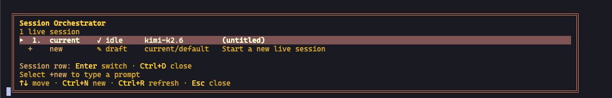
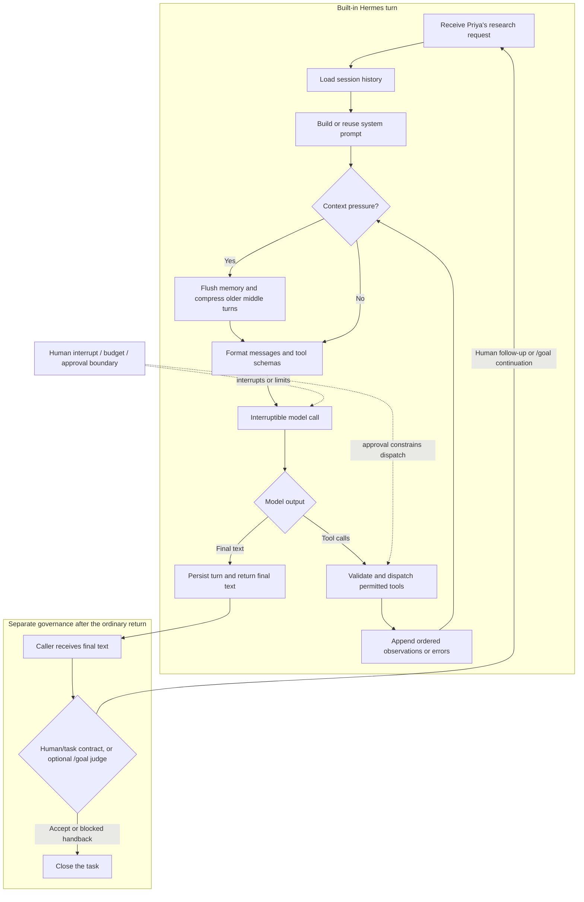

# 3. The Hermes Loop

**Verified against Hermes Agent v0.20.5 (2026-08-19).**

## Opening scenario

At 9:15 Tuesday morning, Priya gives Hermes one job: research a customer-success manager posting at a Toronto software company and prepare a decision brief. The brief must answer whether the role deserves two hours of application work. Hermes may use the saved posting, the employer's official website, and Priya's approved career evidence. It may not submit, message, or invent experience.

The first company page fails to load. A search result describes a remote role, while the saved posting says hybrid. Priya's evidence bank shows team leadership but not the industry credential listed as preferred. After several tool calls, Hermes returns a brief with a “verify before applying” flag.

The useful question is not “what did Hermes think?” It is “what entered each iteration, which action occurred, what came back, what persisted, and why did the loop stop?” This chapter follows that one trajectory end to end. Once the loop is visible, vague confidence becomes inspectable mechanism.

## Definitions

**Turn.** One user-to-assistant exchange. A turn may contain many internal model calls and tool calls before a final response appears.

**Iteration.** One pass through the runtime loop: prepare messages, ask the model, then either execute requested tools and continue or accept a final response and return.

**System prompt.** The instruction and context block that establishes identity, available behaviour, project rules, memory snapshots, and runtime metadata for the model. It is assembled by Hermes from several sources.

**Tool schema.** A structured description of a tool's name, purpose, and arguments. The model sees schemas for enabled, available tools; it does not receive unrestricted access to every function on the machine.

**Session.** A persisted conversation identity with messages and metadata. A session supports continuity and later resumption, but it is not the same as the agent process or the current model context.

**Persistence.** Writing relevant state beyond the current model call. Hermes persists session messages and metadata in SQLite, while memory files and workspace artifacts have their own storage paths.

**Compression.** Replacing part of a long conversation with a shorter summary so the remaining context fits within limits. Compression is lossy by design.

**Stop condition.** A rule or runtime event that ends or pauses work: verified completion, an unresolved question, an iteration budget, an interrupt, an approval boundary, a failed dependency, or a persistent-goal control.

**Uncertain outcome.** A state in which Hermes cannot prove whether an attempted external effect occurred. “No response received” is not the same as “nothing happened.”

**Handback.** The structured return to the operator: outcome, evidence, changes, uncertainties, pending approvals, and recommended next step.

The distinction between turn and iteration matters. Priya sends one message. Hermes may perform ten model iterations and sixteen tool calls before it sends one final response. Cost, latency, error exposure, and context growth occur inside the turn even when the interface looks quiet.

## Hermes in practice

Hermes's `AIAgent` is the orchestration engine behind CLI, gateway, and other supported entry points. Internally, messages use a role-based format: system instructions, user input, assistant responses or tool requests, and tool results. Different providers require different wire formats, but Hermes converts them into a common internal representation before and after calls.

<figure markdown>
  
  <figcaption>Official Hermes session-orchestrator view at pinned tag v2026.8.19.</figcaption>
</figure>

The high-level loop is simple enough to hold in memory:



This diagram separates runtime from governance. In the ordinary built-in loop, final text is persisted and returned. A human can compare that return with the task contract, or an active persistent goal can have its judge enqueue a continuation turn. Neither gate is an automatic verification branch inside every ordinary Hermes turn. During tool use, the model never leaps directly from intention to effect: it proposes a call; the harness dispatches it; a tool produces an observation; and the model receives that observation on the next iteration.

### Stage 1: intake becomes a task contract

Priya's request is deliberately specific:

```text
Outcome: a one-page decision brief on whether to invest in this application.
Sources: saved posting, official employer pages, approved evidence bank.
Required fields: role status, location expectation, mandatory requirements,
preferred requirements, evidence matches, evidence gaps, source links, confidence.
Boundaries: no application, account login, message, résumé edit, or invented evidence.
Stop when: a mandatory fact conflicts, a source is inaccessible after two safe attempts,
or the role's status cannot be verified.
Done when: every factual field has a source or is explicitly marked unverified.
```

Hermes records the user message in conversation history. If Priya uses a persistent goal, Hermes can also maintain a completion contract across continuation turns, but the ordinary agent loop still does the actual research. The goal mechanism does not bypass permissions or replace tool observations.

The contract prevents three common stopping errors. First, “I found information” is not the outcome; a decision brief is. Second, a missing field cannot disappear into prose; it must be marked. Third, the loop has a reason to stop when the source problem cannot be resolved safely.

### Stage 2: prompt assembly creates the model's working frame

If no custom system message is supplied, Hermes builds one. The documented prompt assembly uses ordered tiers:

1. **Stable tier:** identity from `SOUL.md` or the default, tool-aware guidance, skills guidance, and environment or platform hints.
2. **Context tier:** an optional caller-supplied system message plus one selected project-context source, such as `.hermes.md` or `AGENTS.md` according to discovery priority.
3. **Volatile tier:** memory and user-profile snapshots, an external memory-provider block when active, and timestamp, session, model, and provider details.

The phrase “volatile tier” does not mean it changes on every internal iteration. These inputs are part of the built system prompt. Mid-session memory writes update persistent storage but do not silently mutate the already-cached prompt. A new session or a rebuild path, including compression-triggered rebuilding, can capture newer snapshots.

For Priya's task, a career-specific project context might contain evidence rules, output conventions, and the authority boundary. Her identity and communication preferences are stable. The job posting and evidence excerpts are task inputs. A timestamp matters because “open” and “closing soon” decay quickly.

Project context files are scanned and truncated before inclusion. Discovery is selective, not additive: Hermes chooses the first applicable project-context type according to its documented priority. An operator should therefore know which file actually won, instead of assuming all nearby instruction files were merged.

Prompt assembly also includes tool guidance and schemas. If web research or file reading is unavailable, the model cannot make those calls merely because the request mentions them. It may ask for access, use another enabled route, or stop. A well-written request does not create capabilities.

### Stage 3: the first model proposal

The model receives the assembled system prompt, conversation, and tool schemas. It might propose two read-only calls: open the saved posting and inspect the evidence bank. Hermes can execute multiple non-interactive calls concurrently. The observations are appended in the original request order even if one finishes first.

This detail preserves a coherent history, but it does not make parallel reads semantically independent. If both documents repeat an old location, two agreeing observations may still be wrong. Source authority must come from the job contract: the official live posting outranks a saved copy for current status; Priya's approved evidence bank outranks inferred experience.

Tool dispatch has its own lifecycle. Hermes resolves the handler, fires applicable pre-tool hooks, runs dangerous-command checks where relevant, executes the handler, fires post-tool hooks, and appends the result. Some stateful tools—such as task, memory, session search, and delegation surfaces—are handled specially by the agent runtime. The beginner's principle is simpler: the closing answer is downstream of many components, and each result or error should remain visible.

### Stage 4: observations reshape the path

The saved posting says “hybrid, Toronto.” The evidence bank confirms Priya led a six-person cross-functional rollout. The model next requests the official job page and employer careers page. One returns a timeout; the other lists the role but omits location.

At this point the trajectory diverges from any fixed checklist. The model might use a web-search tool for the exact role title, then follow an official-domain result. The observation contains a cached snippet saying “remote within Canada,” but the linked official page returns a 404.

A weak loop treats the snippet as current truth. A disciplined loop uses the contract:

- current role status remains unverified because the official role page is gone;
- location is conflicting because the saved posting and search snippet differ;
- the employer's general careers page proves only that the company has a careers site;
- two safe attempts have failed, so the task has reached a stop condition.

An observation can reduce confidence without suggesting another action. “404,” “permission denied,” “truncated after 20,000 characters,” and “no matching row” all deserve literal treatment. The model should not transform absence of evidence into evidence of absence.

### Stage 5: history, sessions, and persistence

After each turn, Hermes stores messages in a profile-local SQLite session database. Session records include source, model information, timing, token and tool-use metadata, and lineage fields. Messages include roles, content, tool-call data, timestamps, and other provider-specific metadata. Full-text indexes support session search.

Persistence creates useful continuity:

- Priya can resume a research session rather than restating every tool observation;
- Hermes can search prior conversation content when a relevant earlier decision is suspected;
- metadata can show which model and source surface participated;
- compression-related child sessions can preserve lineage.

Persistence does not create correctness. If an earlier turn saved the wrong location, resumption faithfully restores the error. If a session belongs to the wrong profile, persistence extends the privacy mistake. If a memory item lacks a review date, it may look durable after it becomes false.

The family therefore distinguishes four records in this trajectory:

1. **Session history:** operational conversation and tool observations.
2. **Career evidence bank:** human-approved facts about Priya's experience.
3. **Opportunity ledger:** current status and decision fields for each role.
4. **Persistent memory:** a small set of stable preferences or conventions.

The decision brief may update the ledger only within Green draft authority. It may not silently rewrite the evidence bank or promote a guessed location to memory.

Technical trajectory export is separate. Hermes can optionally save ShareGPT-compatible JSONL trajectories for debugging, training, or batch work. That export is not the normal session store and is not automatically enabled by an ordinary CLI configuration switch. Readers should not assume “session persisted” means “training trajectory exported.”

### Stage 6: compression protects capacity by losing detail

Every model has a finite context window. Hermes can run preflight compression when a conversation grows beyond a documented proportion of that window; the gateway also has a more aggressive between-turn threshold. Before compression, Hermes flushes memory. The default compressor summarizes middle turns, preserves a configurable number of recent messages, and keeps tool call/result pairs together. Compression creates session lineage.

The mechanism solves a capacity problem, not an epistemic one. A summary may omit a qualifier such as “preferred, not mandatory,” collapse two conflicting dates, or retain a conclusion without its source. Recent messages remain exact, but old details can become lossy.

Priya's job trajectory is short, so compression should not normally occur. Imagine, however, that she continues in the same session through thirty roles. The accumulated history becomes a liability: employer facts cross-contaminate, old status dates linger, and a compressed summary may blur role-specific evidence. The recovery is not “turn off compression and keep everything forever.” It is to use one bounded session or artifact per coherent task, move confirmed facts to the opportunity ledger, and start clean when the decision boundary changes.

When a critical fact survives only in old conversation, retrieve the original source or exact session fragment before acting. A summary is a navigation aid, not evidence for an employment claim.

### Stage 7: stopping is a control decision

Hermes can stop because the model produces a text response, the user interrupts, an iteration budget is exhausted, a goal pauses, a tool or approval boundary blocks progress, or the task contract says further action requires the operator.

The runtime's ordinary “final text” is necessary but not sufficient for operational completion. Priya's contract adds a second gate: does the handback contain every required field, with a source or an explicit unverified label? In this case, the answer is yes even though the role status is not verified. The task outcome is a **decision brief**, not a successful application. A correct blocked result can satisfy the contract.

Persistent goals add a lightweight judge after a turn. The judge sees the goal and recent final response, then can mark done, continue, or wait. Goal turn budgets pause rather than loop forever. Quality gates can require a deterministic command to pass for tasks where such commands are appropriate. A judge remains an LLM; its verdict is not stronger than direct evidence. For research, source coverage and human review are more meaningful than a shell gate.

A good stop report has one of four states:

- **Complete:** required artifact and proof exist.
- **Complete with uncertainty:** artifact exists and specified unknowns are clearly bounded.
- **Blocked:** a named dependency or authority boundary prevents completion.
- **Interrupted/unknown:** work stopped in a way that leaves an attempted effect uncertain.

“Mostly done” is not a state. It is an invitation to list what remains.

### Stage 8: uncertain outcomes require reconciliation

Priya's research task uses reads, so a timeout usually means no useful observation rather than an external mutation. Uncertainty becomes more dangerous when a tool attempts to send, submit, purchase, or write to a remote system and the response is lost.

Suppose Hermes had been authorized to upload an approved résumé, and the connection dropped after the upload request. Retrying could create a duplicate application or overwrite a newer file. The correct loop is:

1. stop new effects;
2. record the attempted target, time, and request identifier if available;
3. inspect the external system using a read-only method;
4. classify the result as committed, not committed, or still unknown;
5. ask the human before any non-idempotent retry;
6. reconcile the internal ledger with confirmed external state.

A process restart creates the same discipline for background delegation. Hermes documentation distinguishes a completed-but-undelivered child result, which can be restored, from a child that was still running when the process disappeared, whose attempt becomes unknown. “Background” is not the same as durable execution.

### Stage 9: the handback closes the loop with the human

Hermes returns Priya's brief:

- **Recommendation:** defer application work until role status is confirmed.
- **Verified:** company careers page exists; saved posting lists a preferred credential; evidence bank supports team leadership.
- **Conflicting:** saved posting says hybrid; search snippet says remote.
- **Unverified:** live role status and current location policy.
- **Attempts:** official role URL twice, then official careers index and exact-title search.
- **No effects:** no application, login, résumé change, or message.
- **Next action:** Priya may decide to spend five minutes checking the employer portal manually or archive the lead.

The handback is useful because it preserves agency where it belongs. Hermes performed the bounded investigation. Priya decides whether uncertainty is worth more time.

### Interruption is part of the normal loop

An agent that can continue must also be interruptible. Hermes wraps model calls so a user message, stop command, or signal can cause the pending response to be discarded rather than appended as if it completed normally. Tool execution and platform behaviour have their own boundaries, so an interrupt does not prove that every external operation stopped at the same instant.

Use interruption for three different purposes. **Correction** redirects a mistaken assumption before more work accumulates. **Containment** stops new actions after a suspicious observation or authority breach. **Cost control** ends a trajectory whose marginal value has fallen below its time or token use. These are operating actions, not admissions that the agent “failed.”

After interruption, do not immediately say “continue.” First inspect the last completed observation and any in-flight effect. If the interrupted work was read-only, a new contract can often resume safely. If it involved a remote write or message, reconcile external state first. The session history may contain the requested call but not a conclusive result; the remote service remains the source of truth.

### Read the observation before reading the explanation

Tool output can be verbose, technical, or inconvenient, which encourages reviewers to rely on Hermes's interpretation. Reverse that order for consequential transitions. Inspect the raw date, status, recipient, path, error code, or confirmation identifier first. Then judge whether the explanation follows.

This does not mean a person reads every byte from every tool. The task contract should name the fields worth preserving. For job research, retain official URL, page status, title, location text, requirements, and verification time. For a draft file, retain the exact path and a content summary. For an external effect, retain the target, proposed payload, approval, attempt time, and confirmation.

A compact evidence table in the handback is often more useful than a long narrative. It also survives model changes. Future Hermes versions or providers may phrase conclusions differently; a source URL and observed status remain independently checkable.

### Separate “could not know” from “did not check”

Both can produce an unverified field, but they imply different recovery. “Could not know” means the permitted sources did not establish the fact after bounded attempts. “Did not check” means the trajectory stopped early, skipped a required source, or lacked a tool. The first may be a correct blocked outcome. The second is incomplete work.

Require source coverage in the definition of done so the difference is visible. A handback should say “official posting attempted twice; 404 both times” rather than “status unclear.” It should say “calendar source unavailable due to authorization error” rather than “no conflicts.” Negative conclusions need especially strong coverage: zero matching messages is meaningful only after the correct inbox, time window, and filter were actually checked.

This distinction helps calibrate recovery. Missing authority requires a human decision. A transient safe-read failure may justify a retry. A skipped required source justifies another iteration. A fact that no authorized source can establish belongs in the uncertainty section, not in persistent memory.

The loop is therefore best understood as evidence accumulation under constraints, not as unrestricted persistence.

## Professional example

The same loop supports Harbourlight's weekly market scan. The objective is a brief on three competing digital-planner offers. Prompt context includes the business's comparison dimensions and a prohibition on reusing customer data. Tools inspect public pages. Observations record price, licensing language, update date, and failed fetches. State is stored in a dated internal brief, not automatically in long-term memory.

Hermes may dynamically choose which public pages to inspect and may compare terms. It must label prices and terms with verification dates because they change. It may prepare a recommendation. Contacting a competitor, creating an account, accepting terms, or purchasing access is Amber or Red depending on the effect and must stop at a human boundary.

If a page returns regional pricing inconsistent with another observation, the handback preserves both and states the unresolved locale. If the task crosses a compression boundary, the final comparison is rebuilt from cited source observations rather than the compressed conversation summary.

## Personal example

For the family, Hermes uses the loop to research three day-camp options. The objective is a comparison brief, not registration. Context contains age ranges, general schedule constraints, and a rule not to expose children's details to untrusted pages. Tools read public camp information. Observations include dates, published costs, accessibility statements, and missing information.

Hermes may calculate schedule fit and prepare questions. Registration, payment, acceptance of waivers, disclosure of a child's health information, and legal consent remain outside its authority. If a camp page fails after a form submission was never authorized, there is no uncertain external effect. If a human later authorizes a registration step and the confirmation is lost, the family must reconcile directly with the provider before retrying.

This is preparation, not childcare, legal, medical, or financial advice. Parents make the decisions and verify current provider terms.

## Authority boundaries

- **Green — may act:** assemble prompt inputs from assigned profiles, call read-only research tools, read approved files, search sessions, calculate comparisons, draft internal artifacts, and report tool errors.
- **Amber — may prepare:** an application package, recruiter message, customer response, registration form, calendar change, purchase, booking, or account update. Hermes returns an exact preview and waits.
- **Red — may not act:** submit employment applications autonomously, falsify evidence, accept terms, move money, file taxes, make treatment decisions, share credentials, impersonate a family member, surveil others, or repeat a destructive/unknown effect without a human-controlled procedure.

Authority applies at every iteration. A trajectory that begins with Green research does not “earn” permission to send because the draft looks complete. Tool availability also does not imply authorization. The host account should lack credentials for Red actions wherever practical.

## Failure modes and recovery

**Malformed tool call.** The model proposes invalid arguments. Hermes or the tool returns an error. Recovery: let the model correct the call within a small retry budget; stop if required information is unknown rather than inventing an argument.

**Observation truncation.** A long source is clipped. Recovery: request the relevant section by heading or range, record that the full source was not inspected, and avoid global claims.

**Source conflict.** Two observations disagree. Recovery: rank sources by authority and recency, preserve both, seek a primary source, and escalate if the decision depends on the conflict.

**Prompt contamination.** A context file contains suspicious instructions or wrong project rules. Hermes scans context files, but scanning is not a proof of safety. Recovery: stop, inspect the file outside the agent loop, remove or correct it, and begin a clean session.

**Compression loss.** A key qualifier disappears from a summary. Recovery: retrieve the original session message or source, correct the durable artifact, and split future work into smaller sessions.

**Duplicate effect after retry.** A timeout leads to a second submission. Recovery: freeze further effects, inspect the external record, preserve identifiers, notify the human, and use the service's recovery process. Never “clean up” by deleting evidence automatically.

**Wrong stopping decision.** A goal judge ends early or continues after completion. Recovery: compare the state with the written completion contract, pause or clear the goal, and tighten verification. The judge's rationale is diagnostic, not authoritative.

**Lost process.** A running background child disappears on restart. Recovery: classify its attempted effects as unknown, inspect actual external and workspace state, and reissue only work proven incomplete.

## Field kit

### Copy-ready trajectory handback contract

```text
For this task, return a handback with these exact sections:

1. Status: Complete / Complete with uncertainty / Blocked / Interrupted-unknown
2. Outcome: the artifact or state produced
3. Sources checked: source, timestamp, and what it established
4. Tool failures: attempted action, error, retry count, and impact
5. State changed: files, records, sessions, or external systems
6. Verification: direct observations that prove the outcome
7. Uncertainty: conflicting, missing, truncated, or stale information
8. Authority: Green actions completed; Amber items awaiting approval; Red items refused
9. Next decision: the smallest specific choice required from the human

Rules:
- Do not infer success from a missing response.
- Do not retry a potentially non-idempotent effect.
- Treat compressed summaries and search snippets as leads, not primary proof.
- If a required fact lacks evidence, label it unverified.
- If the task stops because of a boundary, a clear blocked handback counts as correct.
```

### Loop inspection worksheet

| Iteration | Model proposed | Tool/response | Observation | State changed | Continue because |
| --------: | -------------- | ------------- | ----------- | ------------- | ---------------- |
|         1 |                |               |             |               |                  |
|         2 |                |               |             |               |                  |
|         3 |                |               |             |               |                  |
|         4 |                |               |             |               |                  |

Use the worksheet for a failed or high-value run. It forces analysis of the actual path instead of the final prose alone.

## Exercise

Trace a hypothetical Hermes trajectory for “compare two internet plans for the Chen–Patel household.” Include at least four iterations, one failed observation, one source conflict, one compression risk, and one stop condition. State what belongs in session history, a durable household artifact, and persistent memory. Finish with a handback status.

## Answer or rubric

A strong trace begins with the two official provider pages and a household requirements file. One acceptable four-iteration answer is:

| Iteration | Model proposed | Tool/response | Observation | State changed | Continue because |
| ---: | --- | --- | --- | --- | --- |
| 1 | Read the household requirements and both official plan pages. | File read succeeds; Provider A succeeds; Provider B times out. | Requirements and Provider A terms are available; Provider B is unknown, not unavailable. | Session history gains all three results; no external state changes. | One bounded retry of the failed read is safe. |
| 2 | Retry Provider B and open each provider's official promotion page. | Retry succeeds; both promotion pages load. | Both plans can be compared, but Provider B's promotion conflicts with its official terms on the monthly price. | Session history records both sources; the draft artifact records a conflict rather than choosing a price. | The conflict needs a more authoritative current source. |
| 3 | Read Provider B's official fee schedule or non-submitting checkout preview. | Current terms load, but an activation fee remains unstated. | The recurring price is resolved; the one-time fee remains unverified. Long unrelated history would risk losing this qualifier during lossy compression. | The bounded task session and draft preserve the qualifier; nothing is promoted to persistent memory. | One final official-source check is allowed by the contract. |
| 4 | Search the provider's official support pages for the activation fee. | No authoritative fee is found. | Required sources were checked; the remaining unknown cannot be resolved inside scope. | The durable comparison records dated terms, URLs, the unknown fee, and no external effect. | Stop with **Complete with uncertainty**; purchase remains prohibited. |

A failed page fetch is preserved as an error; it is not converted to “plan unavailable.” A promotional page and terms page may conflict on price, so the current terms or non-submitting checkout preview is treated as more authoritative while purchase remains prohibited. The durable artifact records dated prices, contract length, data limits, source URLs, and unknowns. Session history keeps the tool path. Persistent memory may keep a stable preference such as “no multi-year contract,” after family confirmation, but not a temporary promotion.

Compression risk appears if unrelated household research shares the session; recovery is a fresh session and reconstruction from sources. The loop stops with “Complete with uncertainty” if a current fee cannot be verified, or “Blocked” if both official sources are unavailable. Award two points each for correct loop mechanics, observation handling, state placement, authority separation, and evidence-based stopping. Eight of ten indicates mastery.

## Mastery checklist

- [ ] I distinguish a user turn from internal loop iterations.
- [ ] I can describe Hermes's prompt tiers without treating them as live mutable memory.
- [ ] I know that enabled tool schemas bound what the model can request.
- [ ] I treat tool errors as observations.
- [ ] I can explain what session persistence does and does not guarantee.
- [ ] I understand why compression is useful and lossy.
- [ ] I can name several stopping paths beyond a final model response.
- [ ] I classify interrupted external effects as uncertain until reconciled.
- [ ] I can produce a handback with evidence, state changes, and pending authority.
- [ ] I can reconstruct a failed trajectory iteration by iteration.

## References

- Nous Research, [Agent loop internals](https://github.com/NousResearch/hermes-agent/blob/v2026.8.19/website/docs/developer-guide/agent-loop.md).
- Nous Research, [Prompt assembly](https://github.com/NousResearch/hermes-agent/blob/v2026.8.19/website/docs/developer-guide/prompt-assembly.md).
- Nous Research, [Session storage](https://github.com/NousResearch/hermes-agent/blob/v2026.8.19/website/docs/developer-guide/session-storage.md).
- Nous Research, [Trajectory format](https://github.com/NousResearch/hermes-agent/blob/v2026.8.19/website/docs/developer-guide/trajectory-format.md).
- Nous Research, [Architecture](https://github.com/NousResearch/hermes-agent/blob/v2026.8.19/website/docs/developer-guide/architecture.md).
- Nous Research, [Persistent goals](https://github.com/NousResearch/hermes-agent/blob/v2026.8.19/website/docs/user-guide/features/goals.md).
- Nous Research, [Security](https://github.com/NousResearch/hermes-agent/blob/v2026.8.19/website/docs/user-guide/security.md).
