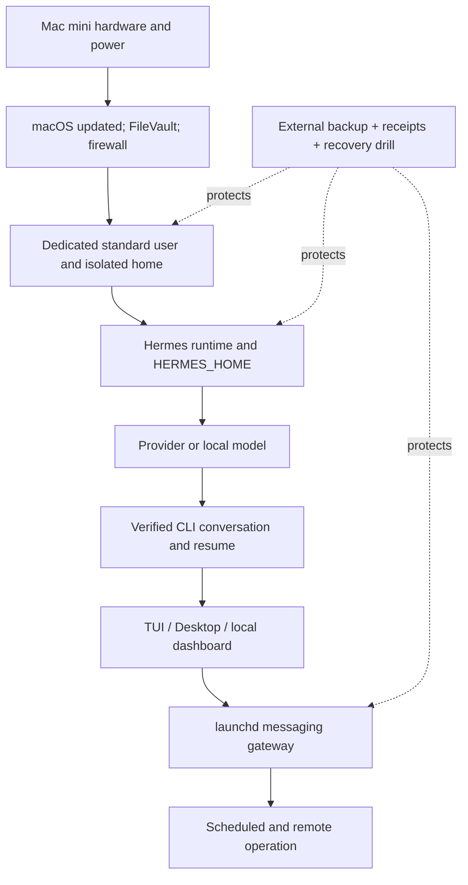

# 5. Install Hermes CLI, Desktop, and Web Dashboard

**Verified against Hermes Agent v0.20.5 (2026-08-19).**

## Opening scenario

The Chen–Patels have bought a Mac mini to become the quiet, always-available home for Hermes. Alex is tempted to sign in with the family Apple Account, copy a browser profile from the household laptop, paste several API keys into a note, and click through the installer. Priya stops the setup before convenience becomes architecture.

The Mac mini will be a work host, not another shared family computer. It will have one administrator account used only for maintenance and a separate standard macOS account named for the Hermes service. That account will receive only secondary identities and a dedicated workspace. FileVault, the macOS firewall, automatic security updates, and an external backup will be working before Hermes receives real data.

They also agree on an acceptance test. Installation is not complete when an icon appears. It is complete when the selected model answers a harmless prompt, Hermes can resume the resulting session, the local dashboard opens only on the Mac, the gateway survives a controlled restart, and a backup and update receipt can be located. If any step fails, they return to the last known-good layer instead of adding another interface.

That measured sequence matters. Hermes Desktop, the terminal interfaces, the web dashboard, and the messaging gateway are different doors into the same agent state. Adding all four at once turns one setup error into four symptoms. This chapter builds the host from the operating-system boundary upward, proving each layer before the next.

## Definitions

**Host.** The Mac mini and its operating system. The host account's permissions ultimately determine which files, devices, credentials, and processes Hermes can reach.

**Dedicated macOS user.** A separate login used for Hermes rather than a person's everyday account. A standard account reduces the damage available without administrator approval. It is a boundary between operating-system homes; it is stronger than a profile or prompt.

**Hermes home (`HERMES_HOME`).** The root of one Hermes instance's state. For the normal per-user installation it is `~/.hermes/`. It contains configuration, secrets, sessions, memory, skills, logs, and other state. Named Hermes profiles create additional homes beneath `~/.hermes/profiles/`.

**Install root.** The program checkout created by the per-user installer at `~/.hermes/hermes-agent/`. The launcher is normally a symlink at `~/.local/bin/hermes`. Program files and operational state are related but should not be confused.

**CLI.** The classic terminal chat launched with `hermes`. It accepts typed prompts and slash commands.

**TUI.** The newer terminal user interface launched with `hermes --tui`. It adds richer panels and non-blocking interaction while using the same configuration and sessions as the CLI.

**Hermes Desktop.** The native graphical application. It runs the same Hermes Agent core and reuses the same local configuration, sessions, skills, memory, and credentials. It is not the web dashboard in an application wrapper.

**Web dashboard.** A browser-based administration surface launched with `hermes dashboard`. By default it binds to `127.0.0.1:9119`, making it reachable only from the local host. It can manage configuration, keys, models, profiles, sessions, logs, backups, and gateway state.

**Messaging gateway.** The long-running Hermes process that connects configured messaging platforms. On macOS, `hermes gateway install` creates a user `launchd` agent so the service can be managed consistently.

**Update receipt.** A machine-readable record written for each `hermes update` run under `~/.hermes/logs/update_receipts/`. It records the pre-update service plan, steps, skipped work, restart results, and final version matrix.

**Backup.** A recoverable copy outside the live state. `hermes backup` is intended for a full Hermes move or restore. Time Machine protects broader Mac files. A pre-update quick snapshot is narrower and may skip individual files over 1 GiB.

**Rollback.** Returning software or state to a known earlier version. Code rollback, state-snapshot restore, and Time Machine recovery solve different failures and should not be treated as interchangeable.

The installation stack has ordered dependencies:



Troubleshoot upward. If the model cannot answer in the CLI, the gateway is not the right place to debug. If the dedicated user cannot unlock FileVault after a restart, no Hermes command repairs the host boundary.

## Hermes in practice

### Size the Mac mini for the lane, not the fantasy

Hermes can use hosted models while the Mac mini supplies orchestration, storage, browser work, and gateways. That setup has modest local inference demands. Running a model on Apple silicon is different: model weights and the key-value cache share unified memory with macOS and every other process.

The pinned Hermes local-Mac guide recommends a quantized 9-billion-parameter model as a practical starting point and estimates roughly 10–12 GB of memory at a 128K context, depending on backend. It says larger 27B or 35B models need 32 GB or more. Those are guide measurements, not guaranteed performance on every Mac, model, or prompt.

Use this purchasing and reassignment rubric:

| Intended host role | Editorial starting point | Why |
| --- | --- | --- |
| Hosted models; light browser and gateway use | 16 GB unified memory, 512 GB storage | Leaves headroom for macOS, Hermes, browser processes, logs, and ordinary artifacts. |
| Hosted default plus one quantized local 9B lane | 24 GB unified memory, 512 GB or more | Reduces memory pressure while a local server and Hermes run together. |
| Serious local experiments with larger models | 32 GB unified memory or more, 1 TB or external model storage | Model weights, long-context cache, and multiple processes compete for unified memory and disk. |
| Existing 8 GB Mac mini | Treat as a supervised pilot | Use hosted models or a small local model; monitor pressure and avoid presenting it as a dependable larger-model host. |

These are book recommendations, not Apple configurations or performance promises. Check the current Apple specifications before purchase and leave capacity for the jobs that run beside inference. Local models can consume tens of gigabytes of storage; session databases, screenshots, browser caches, and backups grow too. Prefer wired Ethernet for a stationary host, a surge protector or UPS where outages are common, and enough free disk that updates and backups can stage safely.

Do not buy memory merely to avoid a provider. Local inference changes privacy routing and marginal API cost, but it adds model downloads, energy use, patching, process supervision, and quality limits. Chapter 6 will keep local work in a defined lane rather than forcing every task onto the Mac.

### Prepare the operating-system boundary

Perform these steps while Hermes has no real credentials or family data.

1. **Create an owner administrator account.** Keep its password in the family's password manager. Do not use it for ordinary Hermes work.
2. **Create a standard Hermes account.** In macOS, open **System Settings → Users & Groups → Add User**, choose **Standard**, and give it a unique strong password. Apple advises limiting administrators and using standard accounts when administrative privilege is unnecessary.
3. **Log in as the Hermes user.** Complete only the integrations this agent truly needs. Do not sign the account into a primary family Messages, Mail, Photos, or browser identity. A separate Apple Account is optional; account separation and minimal synchronization are the goal.
4. **Turn on FileVault and record recovery custody.** Apple silicon Macs already encrypt data automatically, and FileVault adds login-password protection for data access. Store the personal recovery key outside the Mac; never paste it into Hermes memory, a prompt, or the Hermes home.
5. **Turn on the firewall.** In current macOS, use **System Settings → Network → Firewall**. Review allowed incoming apps instead of reflexively accepting every prompt. Disable unneeded services in **General → Sharing**.
6. **Enable updates.** Under **System Settings → General → Software Update → Automatic Updates**, enable downloads, macOS updates, and Security Responses/system files. For an always-on host, choose a maintenance window because restarts temporarily remove the agent.
7. **Set screen lock and physical access rules.** Require a password after sleep. A headless machine is still a computer containing credentials.
8. **Attach an external backup target.** Configure Time Machine under **System Settings → General → Time Machine**. Apple recommends a backup outside the internal disk. Complete one backup, then restore a harmless test file before trusting it.

The standard Hermes user may need an administrator to approve software installation or a specific macOS privacy permission. That is an Amber setup action: inspect the exact request, approve only what the intended feature requires, then return to the standard account. Do not convert the service account into an administrator merely to make prompts disappear.

Create three folders inside the Hermes user's home: one for `family`, one for `career`, and one for `harbourlight`. They are organizational boundaries, not sandboxes. The stronger separation comes later from Hermes profiles, scoped credentials, and—where needed—isolated tool backends. Still, beginning with explicit destinations prevents every artifact from landing in Downloads.

### Choose one install path

For a first Mac installation, the official Hermes documentation recommends downloading the Hermes Desktop installer from `hermes-agent.nousresearch.com` and running it. That path installs the graphical app and can install the command-line runtime into the same `HERMES_HOME` layout.

For a command-line-only installation, the documented macOS command is:

```bash
curl -fsSL https://hermes-agent.nousresearch.com/install.sh | bash
```

Piping a network script into a shell is powerful. A non-coder should delegate inspection, not blind execution. Before running it, open the official installation page, confirm the domain, and ask a technical reviewer or Codex to download and inspect the script without changing the machine. Then run the documented command from the dedicated Hermes account only if the inspection and source agree.

Do not use `sudo` for the normal per-user Mac installation. Root mode changes paths and concentrates state under a root-owned home; it is not the family-host design in this book. The per-user installer places code at `~/.hermes/hermes-agent/`, state at `~/.hermes/`, and the launcher at `~/.local/bin/hermes`.

After a CLI installation, reload the zsh configuration and confirm the launcher:

```bash
source ~/.zshrc
command -v hermes
hermes --version
```

If `command -v hermes` returns nothing, do not reinstall immediately. Open a new Terminal window, inspect whether `~/.local/bin` is on `PATH`, and run `hermes doctor` by its full launcher path only if it exists. Repeated installers make provenance harder to understand.

### Configure one model before adding tools

Run the setup wizard:

```bash
hermes setup
```

The pinned quickstart offers Quick Setup with Nous Portal, Full Setup, and Blank Slate. Blank Slate is the best audit-friendly starting point for this household: it keeps the provider/model plus File Operations and Terminal, while leaving web, browser, memory, delegation, cron, plugins, MCP, and other capabilities off until deliberately enabled. A reader who chooses the Portal path can run `hermes setup --portal`; Chapter 6 explains the provider implications.

Alternatively, configure only the model:

```bash
hermes model
```

Secrets belong in `~/.hermes/.env`; ordinary settings belong in `~/.hermes/config.yaml`. Prefer the setup interface over hand-editing either file. Never paste a real key into a book exercise, chat transcript, shell history example, or Codex prompt. Use the provider's secure input flow and verify only that authentication succeeds.

### Prove the base conversation

Run diagnostics before a chat:

```bash
hermes doctor
hermes --version
hermes config get model --json
```

Then start the TUI:

```bash
hermes --tui
```

Use a low-risk acceptance prompt:

```text
State the current working directory. List only the names of its immediate files.
Do not modify anything. Then explain which tool result supports your answer.
```

The test passes only if the banner names the expected provider/model, the answer returns without an authentication error, any tool call is read-only, and the evidence matches the actual directory. Exit, list sessions, and resume:

```bash
hermes sessions list
hermes --continue
```

Ask, “What was the read-only rule in my previous request?” A correct answer shows that the same profile persisted and resumed the session. It does not prove memory, gateway delivery, or host security.

Now test the classic CLI with `hermes` if desired. The CLI and TUI share state; choose by ergonomics, not by assuming one is a different agent.

### Add Desktop without inventing a second system

If the Desktop installer was used, open the application while logged in as the dedicated Hermes user. If Hermes was installed from the command line, the official command is:

```bash
hermes desktop
```

Desktop should show the existing model and session. Start one harmless conversation in Desktop, then verify it appears in `hermes sessions list`. The native app launches its own local `hermes serve` backend; it does not require the web dashboard.

Check the current profile before changing settings. Desktop can manage multiple profiles, and an attractive interface does not remove the possibility of editing the wrong one. Keep per-session YOLO off. YOLO bypasses dangerous-command approval prompts and is not appropriate for the probation phase.

If Desktop cannot find its backend, run `hermes doctor` and a CLI chat first. A healthy Desktop icon with a broken provider is not a healthy agent. Conversely, if the CLI works but Desktop does not, inspect Desktop's gateway/backend logs from its settings instead of rebuilding the runtime.

### Add the local web dashboard

Launch the dashboard with its safe default:

```bash
hermes dashboard
```

At the pinned release it opens `http://127.0.0.1:9119`. Confirm the browser address uses `127.0.0.1` or `localhost`. The dashboard reads and writes secrets and configuration, so the default loopback boundary is valuable.

Do not use `--host 0.0.0.0` merely so another household device can reach it. A non-loopback bind engages Hermes's authentication gate and expands the network threat surface. The deprecated `--insecure` flag does not bypass that gate. Remote access belongs behind an authenticated, deliberately designed network path and will be treated as an architecture change later in the book.

Use the dashboard to inspect **Status**, **Models**, **Sessions**, and **System**. Do not add keys or integrations yet. Verify that its version, selected profile, and recent session match the CLI evidence. Close the dashboard process after the test if it is not part of the chosen operating surface.

### Install the gateway only after local chat passes

The messaging gateway connects Hermes to external channels. Configuration and delivery identity belong to Chapter 9; this chapter proves only service lifecycle.

Run the interactive setup after selecting a secondary channel identity:

```bash
hermes gateway setup
```

Then install and start the macOS `launchd` agent:

```bash
hermes gateway install
hermes gateway start
hermes gateway status
```

The default generated plist is `~/Library/LaunchAgents/ai.hermes.gateway.plist`. It captures `PATH`, `VIRTUAL_ENV`, and `HERMES_HOME`. If tools such as Node.js or `ffmpeg` are installed later, rerun `hermes gateway install` so the static plist captures the updated path.

View logs without modifying state:

```bash
tail -f ~/.hermes/logs/gateway.log
```

Stop the tail with `Ctrl+C`. Test a controlled restart:

```bash
hermes gateway restart
hermes gateway status
```

The service test passes when the status returns running under the expected profile and the log shows a clean restart. It does not authorize messages from real users. Keep channel allowlists and credentials narrow.

### Create a known-good receipt before updates

Record the baseline without copying secrets:

```bash
hermes --version
hermes doctor
hermes gateway status
hermes update --check
hermes update --plan
```

`hermes update --check` fetches and compares the install with `origin/main` without modifying files or restarting the gateway. `hermes update --plan` prints the install type, running services, versions, and restart method without changing anything.

For a high-value always-on host, take a full Hermes backup and confirm that the archive exists in the location printed by the command:

```bash
hermes backup
```

Keep the archive on an encrypted external destination, not beside the live `~/.hermes` directory. A full backup may contain credentials. Treat it as Red data: do not upload it to a general file-sharing service or attach it to a support request.

Run a planned update during a quiet window:

```bash
hermes update --backup
```

At the pinned release, `--backup` requests a full pre-pull backup in addition to the normal update flow. Hermes writes a receipt under `~/.hermes/logs/update_receipts/`, attempts to restart running gateways, and compares their served code with the updated checkout. Validate:

```bash
hermes doctor
hermes --version
hermes gateway status
```

Then inspect `~/.hermes/logs/update_receipts/latest.json` without publishing it. A non-zero update result or mixed-version warning is a failed maintenance event even if a chat still works.

### Roll back the right layer

When an update fails, stop new gateway effects first. Preserve `update.log`, the receipt, current version, and the last known-good backup. Do not immediately rerun the update or delete the working tree.

Use this decision order:

1. **Syntax failure immediately after pull:** the updater's documented critical-file validation may auto-return code to the pre-pull commit. Confirm the actual version and receipt.
2. **Code regression with intact state:** use the official manual rollback procedure from the installer checkout, choosing a previously recorded commit or release tag, reinstalling dependencies, checking config, and restarting the gateway. This is technical work worth delegating.
3. **Damaged Hermes state:** restore the relevant pre-update snapshot or full backup using Hermes's documented restore flow; confirm what will be overwritten before proceeding.
4. **Host or disk loss:** reinstall macOS/Hermes as needed, then restore from Time Machine and/or `hermes import` according to the backup type.

Code rollback can encounter config incompatibility. After returning to an older release, run `hermes config check` and inspect unknown settings rather than deleting them blindly. Restore into a test profile or spare account first when the live state matters.

For an approved code-only rollback, the pinned update guide gives this sequence (substitute the exact commit recorded in the last good receipt):

```bash
hermes gateway stop
cd ~/.hermes/hermes-agent
git log --oneline -10
git checkout <commit-hash>
uv pip install -e ".[all]"
hermes config check
hermes gateway start
hermes doctor
hermes --version
hermes gateway status
```

A release tag can replace the commit after checking `git tag --sort=-version:refname`. Do not guess the tag. This leaves the checkout detached, which is acceptable for a temporary incident rollback but must be recorded; the next planned update should deliberately return the install to its supported update branch.

For an approved full-state restore, stop the gateway and use the archive created by `hermes backup`:

```bash
hermes gateway stop
hermes import ~/hermes-backup-<recorded-timestamp>.zip
hermes doctor
hermes gateway start
hermes gateway status
```

`hermes import` overwrites matching files in the target Hermes home and prompts when an installation already exists. Never add `--force` to the first recovery attempt. Verify the archive path, profile target, free disk, and custody before approval. A quick pre-update snapshot is not the same artifact as this full zip; follow the receipt's documented state-snapshot restore path for that narrower case.

### Copy-ready Codex delegation prompt for terminal work

Use Codex as a supervised operator when terminal work is unavoidable. Do not include passwords, recovery keys, or provider secrets.

```text
You are working on a dedicated macOS Hermes host. Perform a read-only installation
audit first. Do not install, update, restore, delete, edit config, start external
messaging, or use sudo without stopping and asking me.

Expected Hermes baseline: v0.20.5 / release date 2026-08-19.
Expected per-user paths:
- code: ~/.hermes/hermes-agent/
- launcher: ~/.local/bin/hermes
- state: ~/.hermes/

Collect and return:
1. active macOS username and whether it is admin or standard;
2. command -v hermes and hermes --version;
3. hermes doctor output, with any secrets redacted;
4. hermes config get model --json, redacting credential-like values;
5. hermes sessions list and hermes gateway status;
6. hermes update --check and hermes update --plan;
7. whether ~/.hermes/logs/update_receipts/latest.json exists;
8. exact failures and the smallest safe remediation.

Classify every proposed remediation Green, Amber, or Red. Green may run only
read-only checks. Amber includes installation, config changes, service lifecycle,
backup, and update; present exact commands and wait for approval. Red includes
credential disclosure, destructive deletion, broad permission changes, disabling
FileVault/firewall, and unverified restore or rollback; refuse or propose a
human-controlled recovery procedure.
```

## Professional example

Harbourlight Learning uses the Mac mini for a weekday customer-support preparation queue. Alex creates a `harbourlight` Hermes profile only after the default installation passes. That profile receives a dedicated support inbox identity and an explicit business workspace. It does not receive the family's browser profile, Messages history, tax folder, or banking session.

The initial acceptance task uses five synthetic customer messages. Hermes may categorize them and draft internal replies. It may not send, issue a credit, promise a delivery date, or modify customer records. Alex verifies the selected profile in Desktop and the dashboard before changing the business model or keys.

The gateway lifecycle is tested with the real business token but only Alex's account on the allowlist. After `hermes gateway restart`, Alex sends a harmless status request and confirms the response appears in the expected profile's session list. The credential remains in the profile's secret store; it is not copied into the test report.

For maintenance, Harbourlight records version, backup location, update receipt timestamp, gateway restart result, and post-update smoke test. If a customer queue is due during maintenance, the owners announce that the queue may be delayed. They do not let Hermes silently replay external messages after downtime.

## Personal example

The family profile begins with no messaging gateway and no memory capture. Priya places three fictional school notices in the family workspace and asks Hermes to prepare a seven-day schedule. The task proves local file access and date handling without exposing children's real records.

Priya opens the result in Desktop, resumes the same session in the TUI, and confirms the dashboard lists it under the family profile. That continuity demonstrates shared Hermes state across interfaces. It does not mean the business profile can see the family session, nor does it turn a profile into an operating-system sandbox.

When the family later adds a secondary school inbox, the permission is Amber: the owners inspect exactly which folders and identity the integration exposes. Real school forms, health information, signatures, and consent remain outside the setup test. No child receives a direct channel to the agent during probation.

## Authority boundaries

- **Green — may act:** inspect versions and health; list sessions; run `hermes update --check` and `hermes update --plan`; open a local CLI/TUI/Desktop session; read non-sensitive logs; perform harmless read-only acceptance prompts; create internal test artifacts in the assigned workspace.
- **Amber — may prepare or perform after explicit owner approval:** install Hermes from the verified official source; change provider/model configuration; add macOS privacy permissions; start or restart the gateway; create a full backup; run an update; enable remote access; restore a snapshot; or roll back code. State the exact command, expected effect, downtime, backup, and proof before proceeding.
- **Red — may not act:** reveal passwords, API keys, FileVault recovery keys, or backup archives; disable host security to solve convenience problems; bind the dashboard publicly without an approved design; grant broad administrator or Full Disk Access without a feature-specific need; erase profiles or state; retry an uncertain external effect; or restore/rollback over live data without a human-controlled procedure.

Setup authority belongs to Priya or Alex, not to a successful diagnostic. A Green finding may justify an Amber proposal; it never self-approves the change.

## Failure modes and recovery

**`hermes` not found.** The shell has not loaded `~/.local/bin`, or the launcher is absent. Recovery: open a new shell, inspect `PATH` and the launcher path, then repair one path. Do not stack another installation over an unexplained layout.

**Provider authentication fails.** The runtime works but the selected provider cannot serve a model. Recovery: run `hermes model`, verify the provider and model, and use its secure authentication flow. Retest a plain chat before enabling tools.

**Local model endpoint answers but Hermes rejects it.** The base URL, model name, tool-call support, or context length is wrong. Recovery: query the endpoint independently, list its models, ensure at least the Hermes-documented 64K context for agentic use, and choose a tool-capable model. Keep a chat-only local model out of tool workflows.

**Desktop works differently from CLI.** The surfaces may be using different profiles or an old backend. Recovery: compare active profile, model, `HERMES_HOME`, version, and session ID; run `hermes doctor`; inspect Desktop logs. Do not assume separate data stores.

**Dashboard is reachable from another device unexpectedly.** A non-loopback bind expanded exposure. Recovery: stop the dashboard, restart it without `--host 0.0.0.0`, inspect authentication and logs, rotate any secret believed exposed, and review firewall/sharing settings.

**Gateway stops after logout or tool installation.** The `launchd` agent or captured `PATH` is stale. Recovery: run `hermes gateway status`, inspect `gateway.log`, rerun `hermes gateway install` after approved path changes, then restart and verify.

**Update says complete but a gateway serves old code.** Recovery: treat the maintenance as failed, preserve the receipt, run `hermes gateway status`, use the exact restart instruction printed by the updater, and recheck version. Do not run mixed versions as if healthy.

**Restore archive is missing or unusable.** A backup was created but never copied or tested. Recovery: do not overwrite the live home. Create a fresh test account/profile, verify archive integrity and documented import behavior, and restore there first. Fall back to the last tested Time Machine or Hermes backup.

**Mac will not boot after maintenance.** This is a host incident, not a Hermes issue. Recovery: use Apple's recovery and Time Machine procedures, preserve the internal disk if data recovery is needed, and reinstall Hermes only after the host is stable.

The common sequence is: **stop gateways, preserve evidence, identify the failed layer, restore the narrowest known-good layer, verify locally, then reopen external channels.**

## Field kit

### Mac mini installation and maintenance ledger

```text
HOST
Owner(s):
Mac model / unified memory / storage:
Dedicated standard username:
Administrator custodian:
Ethernet / power protection:

APPLE CONTROLS
FileVault enabled and recovery key stored outside host: yes / no
Firewall enabled; allowed services reviewed: yes / no
Automatic macOS + security updates enabled: yes / no
Screen lock tested: yes / no
Time Machine destination and last successful test restore:

HERMES BASELINE
Install method: Desktop installer / official per-user shell installer
HERMES_HOME:
Install root:
hermes --version:
Active profile:
Provider/model (no secret):
hermes doctor result:
Read-only chat passed:
Session resume passed:
Desktop session parity passed:
Dashboard URL confirmed loopback:

GATEWAY
Dedicated channel identity:
Allowlisted tester:
launchd install/status result:
Controlled restart result:
Gateway log reviewed:

RECOVERY
Full Hermes backup path and custody:
Time Machine last success:
hermes update --check result:
hermes update --plan reviewed:
Latest update receipt path/timestamp:
Post-update version/doctor/gateway/chat test:
Last rollback rehearsal and result:

AUTHORITY
Green checks allowed:
Amber operator and approval channel:
Red prohibitions:
Stop conditions:
```

Keep the ledger outside prompts and omit secrets. It is evidence that the host can be operated and recovered, not a credential inventory.

## Exercise

Design a supervised installation day for a 24 GB Mac mini that will use a hosted everyday model and a local 9B model later. Sequence at least twelve checks from macOS preparation through gateway restart. For each step, name the evidence, authority colour, and rollback point. Include one simulated provider failure and one failed update drill. Finish with a go/no-go decision for Harbourlight's real support inbox.

## Answer or rubric

A strong answer begins with the administrator/standard-account split, FileVault recovery custody, firewall and sharing review, automatic updates, screen lock, and an external Time Machine backup with a test restore. It installs from the official Desktop installer or verified per-user script without `sudo`, confirms the documented paths, runs `hermes doctor`, configures one provider, completes a harmless CLI/TUI conversation, lists and resumes the session, then checks Desktop and the loopback dashboard.

Only after those pass does it configure a secondary gateway identity, install the `launchd` agent, restart it, and inspect status/logs. The update drill runs `--check` and `--plan`, creates a full backup, records version, performs the update in a maintenance window, and inspects `latest.json`. A simulated failure stops the gateway and chooses code rollback or state restore based on the failed layer; it never retries external effects.

Award two points each for host isolation, security prerequisites, layered verification, gateway discipline, backup/update evidence, and recovery accuracy. Ten of twelve points permits a synthetic Harbourlight trial. A real support inbox remains no-go until profile, identity, allowlist, retention, and Amber message approval are separately tested.

## Mastery checklist

- [ ] I can distinguish the macOS user boundary, Hermes home, profile, workspace, and sandbox.
- [ ] I can size a Mac mini according to hosted versus local-model workload.
- [ ] I can prepare FileVault, firewall, updates, screen lock, and external backup before installation.
- [ ] I know the official Desktop and per-user CLI installation paths.
- [ ] I can prove a provider, chat, session resume, and interface parity in order.
- [ ] I keep the web dashboard on loopback unless remote access is deliberately designed.
- [ ] I can install, restart, inspect, and re-capture PATH for the macOS gateway service.
- [ ] I can distinguish a full backup, update snapshot, receipt, code rollback, and host restore.
- [ ] I require fresh evidence after an update rather than trusting a success message.
- [ ] I can give Codex a read-only audit contract without exposing secrets.

## References

- Nous Research, [Installation](https://github.com/NousResearch/hermes-agent/blob/v2026.8.19/website/docs/getting-started/installation.md).
- Nous Research, [Quickstart](https://github.com/NousResearch/hermes-agent/blob/v2026.8.19/website/docs/getting-started/quickstart.md).
- Nous Research, [Updating and uninstalling](https://github.com/NousResearch/hermes-agent/blob/v2026.8.19/website/docs/getting-started/updating.md).
- Nous Research, [Desktop app](https://github.com/NousResearch/hermes-agent/blob/v2026.8.19/website/docs/user-guide/desktop.md).
- Nous Research, [CLI](https://github.com/NousResearch/hermes-agent/blob/v2026.8.19/website/docs/user-guide/cli.md).
- Nous Research, [Web dashboard](https://github.com/NousResearch/hermes-agent/blob/v2026.8.19/website/docs/user-guide/features/web-dashboard.md).
- Nous Research, [Messaging gateway service management](https://github.com/NousResearch/hermes-agent/blob/v2026.8.19/website/docs/user-guide/messaging/index.md).
- Nous Research, [Profiles](https://github.com/NousResearch/hermes-agent/blob/v2026.8.19/website/docs/user-guide/profiles.md).
- Nous Research, [Run local LLMs on Mac](https://github.com/NousResearch/hermes-agent/blob/v2026.8.19/website/docs/guides/local-llm-on-mac.md).
- Apple, [Set up your Mac to be secure](https://support.apple.com/en-ca/guide/mac-help/flvlt003/mac) (accessed 2026-08-21).
- Apple, [Change Firewall settings on Mac](https://support.apple.com/en-ca/guide/mac-help/mh11783/mac) (accessed 2026-08-21).
- Apple, [Software Update settings on Mac](https://support.apple.com/guide/mac-help/software-update-settings-on-mac-mchla7037245/mac) (accessed 2026-08-21).
- Apple, [Back up your files with Time Machine](https://support.apple.com/guide/mac-help/back-up-files-mh35860/mac) (accessed 2026-08-21).
