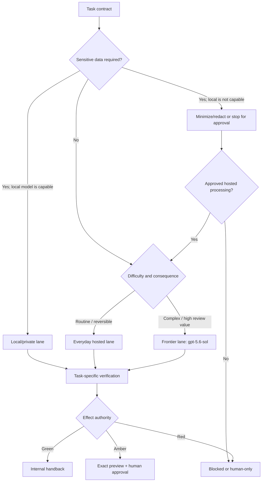

# 6. Choose Models and Route Work

**Verified against Hermes Agent v0.20.5 (2026-08-19).**

## Opening scenario

On the first Friday after installation, the Chen–Patels ask one model to do everything. It labels twelve synthetic support messages, summarizes a public school bulletin, compares two software contracts, and revises Priya's interview story. The results are usable, but the invoice is not: simple classification travelled through the most expensive route. Worse, a private family draft left the Mac when a local model could have handled it.

Alex proposes the opposite extreme—run every job locally. The small model quickly sorts the support messages, then misses a subtle limitation-of-liability clause and loses track of sources during a long comparison. Free marginal inference did not make the decision safe.

Priya reframes the problem. Models are workers in lanes, not ranks on a permanent leaderboard. The local lane handles narrow, private, reversible work. An everyday hosted lane carries ordinary research and drafting at controlled cost. A frontier lane uses OpenAI `gpt-5.6-sol` only when the task demands stronger judgment and the data may leave the host. Each lane has an entrance test, a spending limit, a fallback rule, and an exit to human review.

The important policy is not “always use the smartest model.” It is “spend capability and disclosure where they reduce expected harm.” Hermes supplies model slots, provider configuration, routing preferences, fallbacks, and session-level switches. The family supplies the meaning of appropriate.

## Definitions

**Model.** The named inference system that produces text and tool-call proposals. A model does not inherit authority merely because it is capable.

**Provider.** The service or local server that accepts a model request. OpenAI direct API, OpenRouter, Nous Portal, and a local Ollama endpoint are different provider paths even if a similar model name appears behind more than one.

**Direct provider.** The model developer's own API path, such as the OpenAI API. Authentication, billing, data handling, availability, and model IDs come from that provider.

**Aggregator.** A service such as OpenRouter or Nous Portal that can route among models or underlying sub-providers through one account. Aggregation simplifies access but adds another decision and data path to inspect.

**Custom endpoint.** An OpenAI-compatible server configured with a base URL and model name. It may run on `localhost`, elsewhere on a private network, or in a third-party cloud. “Custom” describes the interface, not its privacy.

**Lane.** A policy bundle: acceptable data, task difficulty, model/provider, budget, verification, fallback, and authority. A model may qualify for more than one lane; the lane defines its permitted use.

**Main model.** The model used for the agent loop: user turns, reasoning, tool selection, and responses.

**Auxiliary model.** A model assigned to a side task such as compression, vision, web extraction, approval scoring, title generation, MCP routing, or background review. Auxiliary calls can disclose content and incur cost even when the main model is local.

**Provider routing.** Preferences passed to an aggregator about which underlying providers may serve a request, which to ignore, what order or sort to use, whether parameters must be supported, and whether data collection is allowed.

**Fallback.** A different provider/model tried when the primary route fails for specified errors. In Hermes, primary fallback is turn-scoped; the next user message normally starts with the primary again unless reset-aware rate-limit state says it remains unavailable.

**Reasoning effort.** A model parameter that trades latency and token use for more internal computation where supported. It is a tuning control, not a guarantee of correctness.

**Context window.** The maximum tokens a model can receive in one request. Hermes requires at least a documented 64K context for agentic work with tools. A model's advertised maximum still depends on the serving endpoint and configuration.

**Prompt cache.** A provider feature that can discount or accelerate repeated prompt prefixes. Changing model or provider mid-session can force the conversation to be read again at full input cost.

The routing decision sits before tool authority and human approval:



A stronger lane changes the model route, not the authority colour. `gpt-5.6-sol` may prepare a contract comparison; it may not accept the contract.

## Hermes in practice

### Understand the two routing planes

Hermes has a main model and multiple auxiliary slots. The dashboard's **Models** page changes the main default for new sessions; an already-open session keeps the model it started with unless `/model` changes it. The auxiliary slots default to `auto`, which normally begins with the main route and may follow configured fallback policy.

This creates two planes to govern:

| Plane | Typical work | Hidden surprise |
| --- | --- | --- |
| Main agent | Reasoning, tool calls, user-visible response | A mid-session switch re-reads a long history and can trigger compression. |
| Auxiliary | Compression, vision, extraction, titles, approval, background review | A “fully local” main chat may still call a hosted auxiliary provider unless configured and tested. |

Before declaring a workflow local or private, inspect the main model, every enabled auxiliary slot, tools that call external services, external memory providers, and the sources themselves. A local model using cloud web search is not an offline system. A screenshot sent to a hosted vision slot left the Mac even if the response text came from Ollama.

Use `hermes model` outside a chat to add providers, authenticate, and select a default. Use `/model` inside a session only to switch among already-configured routes. The dashboard **Change** control also writes the default for new sessions. Verify the effective configuration with:

```bash
hermes config get model --json
hermes status
```

Start a fresh session after a persistent route change. That makes the provider/model and prompt snapshot easy to audit, avoids carrying unrelated sensitive history, and prevents a one-turn escalation from paying to reread a long conversation twice.

### Lane 1: local and private by design

The local lane is for tasks whose inputs should remain on the Mac and whose required capability has passed a representative test. Good first uses include categorizing already-local notes, extracting fields from a clean document, reformatting text, drafting from supplied facts, and summarizing a bounded internal file.

The pinned Hermes Mac guide documents two OpenAI-compatible paths: `llama.cpp` on port 8080 and MLX through omlx on port 8000. Hermes also documents local Ollama through its custom-endpoint flow at `http://localhost:11434/v1`. This chapter uses Ollama because its service and model management are approachable, not because it is the only supported choice.

Install Ollama from its official source, pull a tool-capable model that fits the Mac, and configure its context server-side. The pinned Hermes provider guide warns that Ollama's defaults may be below Hermes's 64K minimum and that context cannot be increased through `/v1/chat/completions`. Confirm the actual loaded context rather than trusting the model card.

The minimum verification is:

```bash
ollama --version
ollama list
ollama ps
curl -s http://localhost:11434/v1/models
```

Then run:

```bash
hermes model
```

Choose **Custom endpoint**, enter `http://localhost:11434/v1`, leave the key empty or use the wizard's documented no-key option, and select the exact model ID returned by the endpoint. Bind local servers to `127.0.0.1` unless an approved network design requires otherwise.

A model answering “hello” is not agent-ready. Give it a synthetic tool test: read two small files, extract three fields, and write a draft only inside a disposable workspace. Confirm that tool calls execute rather than appearing as raw JSON, that the model obeys stop conditions, and that context remains at least 64K. If tool calling is unreliable, keep the model in a chat/extraction lane without tools.

Local inference has costs: hardware, electricity, downloads, storage, slower prefill, and operator time. The pinned Mac guide's 2026-08-19 example puts a quantized 9B model around 10–12 GB of unified memory at 128K context depending on backend; larger models need more. Treat those figures as a sizing experiment, not a performance promise.

Most importantly, local is not automatically safe. The Hermes process still has the host user's file access; tools may use the network; sessions and memory persist; and model output can be wrong. The local lane narrows data routing, not effect authority.

### Lane 2: everyday hosted work

The everyday lane serves routine research, drafting, extraction, and tool use that can leave the host under the applicable provider terms. It should be materially cheaper or faster than the frontier lane and strong enough to pass the same task-family tests.

Hermes supports several paths. This book focuses on two:

**Nous Portal.** `hermes setup --portal` uses OAuth, sets `model.provider: nous`, chooses a model, and can enable the Nous Tool Gateway. `hermes portal info` reports login, inference provider, and per-tool routing. A subscription simplifies accounts, but the operator must still inspect which model and tools are active and review current Portal terms and pricing.

**OpenRouter.** A single API key can reach many models and underlying providers. Hermes can pass provider-routing preferences including `only`, `ignore`, `order`, `sort`, `require_parameters`, and `data_collection`. These preferences apply to aggregator routing; they are not the same as Hermes's cross-provider fallback chain.

For privacy-conscious everyday routing through an aggregator, a starting configuration is:

```yaml
provider_routing:
  sort: "price"
  require_parameters: true
  data_collection: "deny"
```

This is a request to the aggregator, not proof of a legal or technical outcome. Verify the provider's current policy, the model route actually selected, and whether a region or sub-provider matters for the data. When a workflow has contractual or residency requirements, a generic “deny training” switch is not enough.

Choose the everyday model from current authenticated choices in `hermes model` or the dashboard rather than copying a model name from this book. Hermes's remote catalog for OpenRouter and Nous can change independently of the installed release, and pricing/context metadata come from live provider sources. Date the decision in the route card and re-evaluate monthly.

### Lane 3: frontier work with `gpt-5.6-sol`

Use the frontier lane for tasks where stronger reasoning and tool use justify higher cost and approved external processing: a difficult architecture review, a nuanced contract issue inventory for professional handoff, an evidence-sensitive career narrative, or diagnosis of a complex business process. The model still produces proposals; consequential conclusions receive source and human review.

OpenAI's official API model page, accessed **2026-08-21**, identifies the exact model ID as `gpt-5.6-sol` and describes it as the frontier GPT-5.6 model for complex professional work. It lists a 1,050,000-token context window, 128,000 maximum output tokens, function calling and structured outputs, and reasoning effort values `none`, `low`, `medium` (default), `high`, `xhigh`, and `max`.

Current direct API pricing must be read with a date and mode. On **2026-08-21**, OpenAI's model page lists standard short-context text pricing per one million tokens as **US$5 input, US$0.50 cached input, and US$30 output**, and notes that requests above 272K input tokens are charged at higher long-context multipliers. Tool calls and alternate service tiers may add different charges. Do not turn those numbers into a permanent budget assumption; check the official pricing page before each budget cycle.

The direct Hermes path uses provider `openai-api` and an `OPENAI_API_KEY` stored through the secure setup flow. **A ChatGPT subscription does not pay direct OpenAI API charges.** API use is billed to the API organization/account associated with the key. Hermes separately documents an `openai-codex` OAuth path labelled **ChatGPT or Codex Subscription**, but its pinned provider guide says plan eligibility and quota semantics are not documented there. Do not confuse that subscription provider with the direct `openai-api` lane, and do not promise that either path includes `gpt-5.6-sol` without verifying the picker and provider terms at run time.

Configure the direct API through `hermes model`; select OpenAI API and enter the key through the prompt, then choose or enter `gpt-5.6-sol`. Verify the effective route in a new session and in the provider's usage dashboard. If the pinned Hermes picker does not expose the current model, stop and reconcile the installed Hermes version, authenticated provider, and official model availability rather than inventing a config slug.

Start `gpt-5.6-sol` at `medium` reasoning for representative complex tasks because OpenAI documents it as the default. Test `low` against the same rubric for latency/cost-sensitive work; raise to `high`, `xhigh`, or `max` only when measured quality improves enough to justify latency and spend. “Max” is not a safety setting.

### The Chen–Patel routing table

| Task family | Data allowed | Default lane | Escalate when | Verification | Authority |
| --- | --- | --- | --- | --- | --- |
| Reformat supplied text | Assigned local file only | Local | Formatting errors exceed rubric | Diff against source | Green |
| Categorize synthetic or low-sensitivity tickets | Minimal ticket text | Local | Tool use or category accuracy fails | Sample 20; human review | Green draft |
| Public-source market scan | Public pages; no customer data | Everyday hosted | Sources conflict or synthesis is complex | URLs, dates, missing fields | Green research |
| Customer reply draft | Minimum necessary customer facts | Everyday hosted only if approved; otherwise local | Policy ambiguity or promise requested | Policy citation and owner review | Amber |
| Job-posting comparison | Public posting + approved evidence excerpts | Everyday hosted | Mandatory requirements conflict; narrative needs nuance | Primary URL and evidence bank | Green comparison; Amber application |
| Contract issue inventory | Redacted text where possible | Frontier | Local/everyday misses material clauses | Clause references + legal handoff | Amber preparation |
| Health, tax, legal, or financial decision | Minimize; human/professional controls | No autonomous route | Always | Qualified professional or owner | Red execution |
| Passwords, recovery keys, payment card data | Never in model prompts | None | Never | Secret store/account workflow | Red |

The table is a policy, not a benchmark claim. The family validates each task family with counterexamples before moving it from supervised use. A local model that passes ticket classification does not thereby qualify for contract analysis.

### Configure fallbacks for availability, not quality laundering

Run the interactive manager:

```bash
hermes fallback
```

The current configuration lives under `fallback_providers:` in `~/.hermes/config.yaml`. Hermes may activate fallback after exhausted retries for rate limits or server errors, immediately for authentication/not-found failures, or after repeated invalid responses. It swaps provider/model for that turn and preserves the conversation.

That continuity has two costs. First, the fallback provider receives the conversation context, so it must be allowed for the same data. Second, changing provider/model resets the prompt cache; a long history may be billed again. The next turn normally returns to the primary, which can trigger another re-read.

Use this rule: a fallback may be **equally or more restrictive about data**, and it may not silently widen authority. A local primary must not fall back to a hosted model for private family work. For public web research, an everyday hosted primary may fall back to another approved hosted route. The frontier lane can fall back to “blocked” when a weaker model would create a false sense of review.

Fallback handles availability failures, not weak answers. If a model returns a fluent but unsupported contract interpretation, the request succeeded technically and automatic fallback may never run. Quality routing requires an explicit task rubric or human escalation.

### Control cost at six seams

1. **Task seam:** use a fixed workflow or local parser for deterministic work before invoking a model.
2. **Context seam:** begin a fresh bounded session, reference files rather than pasting them, and keep tool output focused.
3. **Model seam:** default to the least expensive lane that passes representative tests.
4. **Reasoning seam:** start with a measured baseline; do not use frontier/max for every turn.
5. **Auxiliary seam:** assign compression, titles, extraction, approval, and background review intentionally; a side task can dominate repeated use.
6. **Fallback seam:** avoid provider bouncing in long sessions and require a cost ceiling.

Track input, cached input, output, reasoning where reported, tool calls, route, and review minutes by task family. Cost per accepted work product is more useful than cost per token. A cheap model that doubles human correction or triggers unnecessary tool loops is not cheap operationally.

Set a weekly lane budget in money and in task count. When the frontier budget is exhausted, work does not automatically spill into another owner's account. It queues, narrows, or returns for a decision. Price changes, free tiers, and subscription quotas are versioned facts; check dashboards and date every update.

### Promote a route with a task-family trial

A model demonstration is not an operating evaluation. Before adding a route to the table, assemble ten to twenty examples that resemble the real task and include failures the model should recognize. For support triage, include a routine how-to question, an angry message with no requested remedy, a refund demand, a duplicated order, a privacy request, an empty message, and a policy exception. For career research, include a closed role, a preferred credential, a mandatory credential, conflicting location claims, and an inaccessible primary page.

Write the expected safe result before running the trial. Score fields separately:

| Dimension | Passing evidence |
| --- | --- |
| Coverage | Every required source and output field is accounted for. |
| Grounding | Material claims point to supplied or retrieved evidence. |
| Boundary behaviour | Amber and Red cases stop in the correct place. |
| Tool execution | Calls use valid arguments and observations are interpreted literally. |
| Uncertainty | Missing or conflicting facts are labelled rather than filled in. |
| Review burden | A human can accept or correct the result within the stated time budget. |
| Cost and latency | The complete trajectory fits the task ceiling, including auxiliary calls. |

Run the same set through candidate routes under the same task contract. Do not let one model receive clearer instructions or better sources and then attribute the difference to intelligence. Record the exact model ID, provider, reasoning effort, date, and Hermes version. A live model alias can change behind the name; reproducibility depends on identifying what actually served the request where the provider exposes it.

Promotion is task-specific. A route can pass extraction and fail synthesis. It can write excellent prose while mishandling tools. It can succeed interactively and fail under an unattended job because a data-training acknowledgement or credential prompt cannot be answered. Keep each approved scope narrow.

Re-run the small counterexample set after a material model, provider, prompt, tool, or Hermes update. Do not require a huge benchmark every week. The purpose is to catch regression at the seams where the family relies on the route.

### Make routing visible in every consequential handback

For routine internal drafts, a footer with provider, model, and verification time is enough. For hosted sensitive work, the handback should also state what data class was sent, whether identifiers were removed, which external tools ran, what fallback activated, and what spend was observed or estimated. This makes route choice reviewable without exposing secrets.

Use a concise form:

```text
Route: [local / everyday hosted / frontier]
Provider:model: [exact effective pair]
Reasoning effort: [value or not supported]
Data sent: [class and minimization; no raw sensitive values]
Auxiliary/external tools: [none or list]
Fallback: [none or effective provider:model]
Usage: [reported tokens/cost, with currency and date]
Verification: [sources, checks, and human review still required]
```

Do not ask the model to infer its own provider from personality or writing style. Use Hermes metadata, configuration, session records, and provider usage evidence. If the effective route cannot be established, the result is “route unverified,” and consequential work stays pending.

### Copy-ready Codex delegation prompt for route audit

```text
Audit this Hermes model configuration without changing it. Do not print secret
values. Do not call any model or external API unless I separately approve the
exact test, estimated disclosure, and budget.

Read-only evidence to collect:
- hermes --version
- hermes config get model --json
- configured main and auxiliary model slots
- configured fallback_providers in order
- provider_routing only/ignore/order/sort/require_parameters/data_collection
- custom endpoint hostnames, but no keys or authorization headers
- active profile and whether a fresh test session is needed

Build a table with: task lane, provider, exact model ID, endpoint class
(localhost/private network/hosted), data allowed, reasoning effort, fallback,
budget ceiling, and verification rule.

Flag these as blockers:
- local/private work can fall back to a hosted provider;
- auxiliary slots can send local-only data to a hosted route;
- direct OpenAI API is described as paid by a ChatGPT subscription;
- the frontier identifier is anything other than gpt-5.6-sol;
- a local model has under 64K configured context or unverified tool calling;
- credentials appear in config output or the report.

Return proposed changes as exact, minimal commands or YAML patches, classified
Green/Amber/Red. Wait for approval before writing config, switching a model,
running a paid test, restarting a gateway, or contacting a provider.
```

## Professional example

Priya's career pipeline uses all three lanes without mixing them. A local model extracts company, title, location, and closing date from saved postings. The everyday hosted model reads public official pages and produces a source-linked comparison. `gpt-5.6-sol` is reserved for the two finalists when Priya needs a nuanced evidence-gap analysis or interview-story critique.

Only approved résumé evidence enters the hosted prompts. Identifiers not needed for the judgment are removed. No lane may invent experience, submit an application, contact a recruiter, or accept terms. Frontier output is compared against the same evidence bank and primary postings; capability does not replace provenance.

Harbourlight uses the local lane for synthetic-ticket regression tests and low-sensitivity categorization. The everyday lane drafts from approved policies when customer data handling permits. A redacted contract issue inventory may enter the frontier lane after owner approval, but the output is a question list for counsel, not legal advice or acceptance authority.

The owners review monthly results by task family: correction rate, unsupported claims, elapsed time, provider spend, and review minutes. If the everyday model matches frontier quality on routine scans, the policy keeps the cheaper route. If the local model repeatedly omits policy exceptions, it loses that task rather than receiving broader prompts.

## Personal example

The family profile keeps school and schedule summaries local when inputs are already on the Mac. A hosted model can research public program pages without family identifiers. If Priya wants help comparing a complicated insurance explanation, she first removes policy numbers and personal identifiers, then decides whether hosted processing is appropriate. The result remains an issue list for a licensed professional or insurer representative.

A local lane can still leak through tools. The family therefore disables hosted vision and external memory for local-only sessions and avoids web search when the task does not need it. The handback states the provider/model used and whether any external tool received content.

Children's medical, emotional, behavioural, school-record, and precise-location details are never promoted into a broad model-routing experiment. If a task cannot be performed without disclosing such data, the agent stops and a parent chooses a human process.

## Authority boundaries

- **Green — may act:** classify a task against the approved routing table; run read-only local endpoint checks; use the assigned lane for approved data; create internal drafts; record model/provider and cost evidence; stop when a route is unavailable.
- **Amber — may prepare or perform after approval:** add a provider or key; send minimized sensitive content to a hosted route; use `gpt-5.6-sol`; change reasoning effort; enable an auxiliary provider; configure fallback; change aggregator routing; run a paid benchmark; restart gateways after model changes.
- **Red — may not act:** expose secrets or prohibited family/customer data; imply a ChatGPT subscription pays OpenAI API charges; silently route local-only work to cloud fallback; let a model accept legal/employment terms, make health or tax decisions, move money, or self-authorize more spend; weaken privacy rules because a preferred model is unavailable.

When the route is uncertain, Hermes returns the proposed provider, data payload class, estimated budget, and safer alternative. Silence is not consent to send data or incur cost.

## Failure modes and recovery

**Wrong provider behind the right-looking model.** An aggregator or alias routes differently than expected. Recovery: inspect the active provider/model and provider usage record, freeze sensitive work, correct the route, and begin a fresh session.

**Local endpoint is not actually local.** A custom hostname points to a hosted server or LAN service managed by someone else. Recovery: resolve the endpoint ownership, stop sending private inputs, review logs and provider retention, and rotate any exposed key.

**Ollama context is too small.** Chat works but agent startup rejects the model or loses tool context. Recovery: configure at least 64K server-side, verify `ollama ps`, restart the endpoint, and rerun a synthetic tool test.

**Tool calls appear as prose or JSON.** The model/server lacks compatible tool-call support. Recovery: stop action workflows, verify the server's tool parser and a tool-capable model, or restrict the lane to chat/extraction.

**Auxiliary leakage.** A local main session invokes hosted vision, compression, extraction, or background review. Recovery: stop the session, document what was sent, disable or localize the auxiliary slot, start a clean session, and handle any privacy incident according to policy.

**Fallback violates the data rule.** A local route fails and a hosted fallback receives the conversation. Recovery: disable the chain, preserve logs, assess disclosure, notify the owners, and make private lanes fail closed.

**Frontier spend spikes.** A long session, high reasoning, cache reset, or tool loop consumes the budget. Recovery: interrupt, export usage evidence, start a smaller session, lower effort only after testing, and require an explicit ceiling.

**Model catalog or price drifts.** A copied model disappears or costs change. Recovery: check the official provider page and authenticated Hermes picker, date the new decision, rerun task-family tests, and update the route card. Do not substitute a similarly named model silently.

**Fluent quality failure.** The model completes successfully but misses a clause or invents evidence. Recovery: treat it as a rubric failure, correct the artifact, preserve the counterexample, and demote that task/model pair. Fallback is not a correctness detector.

## Field kit

### Three-lane route card

```text
TASK FAMILY:
Owner / reviewer:
Version and review date:

DATA
Allowed inputs:
Fields to remove or redact:
Data that must remain local:
Data that must never enter any model prompt:

LOCAL LANE
Endpoint / exact model:
Context and tool-call test:
Task acceptance threshold:
Auxiliary routes permitted:
Fail-closed rule:

EVERYDAY HOSTED LANE
Provider / exact model:
Current pricing/terms checked on:
Aggregator sub-provider policy:
Data-collection / residency constraints:
Monthly or weekly ceiling:

FRONTIER LANE
Provider: OpenAI API direct (unless another approved path is named)
Model: gpt-5.6-sol
Reasoning baseline:
Escalation trigger:
Per-task ceiling:
Human verification:

FALLBACK
Allowed provider:model pairs in order:
Data equivalence checked:
Maximum switches/retries:
When fallback must be Blocked:

HANDOFF
Evidence required:
Green internal result:
Amber preview and approver:
Red prohibition:
```

## Exercise

Route these six Chen–Patel tasks: (1) format a private household checklist, (2) classify twenty synthetic support messages, (3) research public competitor pages, (4) draft a customer response containing an order problem, (5) compare a redacted vendor contract, and (6) choose medical treatment for a child. Assign data minimization, lane, reasoning effort, fallback, verification, cost ceiling, and authority. Identify at least two tasks that should fail closed.

## Answer or rubric

An acceptable policy keeps the household checklist local with no hosted auxiliary route. Synthetic-ticket classification begins local and is sampled against expected labels. Public competitor research uses the everyday hosted lane with official URLs and a dated budget. The customer reply uses only minimum necessary details under an approved provider policy, remains Amber, and fails closed if private data cannot be minimized.

The redacted contract may use `gpt-5.6-sol` at medium reasoning after approval and a per-task ceiling, but the output is a clause-linked issue list for owner/counsel review. It should fail closed rather than fall back to an unapproved weaker or less private route. Choosing treatment is Red: no model lane receives decision authority; Hermes may only prepare questions from parent-approved information for a clinician.

Award two points each for data minimization, correct lane selection, exact frontier identity/billing distinction, fallback privacy, evidence/cost controls, and authority. Ten of twelve indicates a usable supervised policy. Any answer that sends secrets, silently cloud-falls back local work, or lets the model make treatment or contract commitments fails regardless of score.

## Mastery checklist

- [ ] I distinguish models, providers, aggregators, custom endpoints, and lanes.
- [ ] I can audit both main and auxiliary model routes.
- [ ] I can verify local endpoint ownership, context length, and tool calling.
- [ ] I route private work locally only when the local model passes the task test.
- [ ] I understand the separate roles of provider routing and fallback providers.
- [ ] I use the exact frontier identifier `gpt-5.6-sol`.
- [ ] I know direct OpenAI API billing is separate from a ChatGPT subscription.
- [ ] I tune reasoning effort from representative evidence, not prestige.
- [ ] I account for prompt-cache resets and long-session cost.
- [ ] I can make a privacy-sensitive or consequential task fail closed.

## References

- Nous Research, [Configuring models](https://github.com/NousResearch/hermes-agent/blob/v2026.8.19/website/docs/user-guide/configuring-models.md).
- Nous Research, [AI providers](https://github.com/NousResearch/hermes-agent/blob/v2026.8.19/website/docs/integrations/providers.md).
- Nous Research, [Provider routing](https://github.com/NousResearch/hermes-agent/blob/v2026.8.19/website/docs/user-guide/features/provider-routing.md).
- Nous Research, [Fallback providers](https://github.com/NousResearch/hermes-agent/blob/v2026.8.19/website/docs/user-guide/features/fallback-providers.md).
- Nous Research, [Model catalog](https://github.com/NousResearch/hermes-agent/blob/v2026.8.19/website/docs/reference/model-catalog.md).
- Nous Research, [Run local LLMs on Mac](https://github.com/NousResearch/hermes-agent/blob/v2026.8.19/website/docs/guides/local-llm-on-mac.md).
- Nous Research, [Run Hermes locally with Ollama](https://github.com/NousResearch/hermes-agent/blob/v2026.8.19/website/docs/guides/local-ollama-setup.md).
- Nous Research, [Run Hermes with Nous Portal](https://github.com/NousResearch/hermes-agent/blob/v2026.8.19/website/docs/guides/run-hermes-with-nous-portal.md).
- OpenAI, [`gpt-5.6-sol` model](https://developers.openai.com/api/docs/models/gpt-5.6-sol) (accessed 2026-08-21).
- OpenAI, [Model guidance for GPT-5.6](https://developers.openai.com/api/docs/guides/latest-model) (accessed 2026-08-21).
- OpenAI, [API pricing](https://platform.openai.com/pricing) (accessed 2026-08-21).
