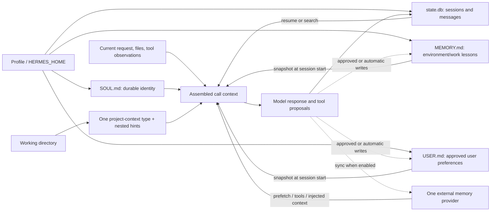
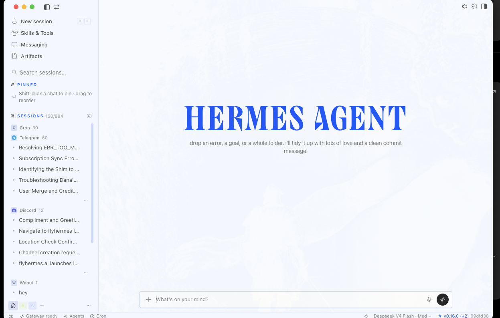

# 7. Personality, Context, Sessions, and Memory

**Verified against Hermes Agent v0.20.5 (2026-08-19).**

## Opening scenario

Priya corrects Hermes during a career session: she now prefers hybrid roles, not fully remote ones. Hermes says it will remember. Two days later, the Harbourlight profile recommends describing Priya as a customer-success director and refers to a school pickup constraint in a vendor note. Neither claim belongs there. One is an overstatement from an old conversation; the other crossed a family boundary.

Alex opens `SOUL.md` and starts adding facts: Priya's preferences, the children's schedules, Harbourlight's refund policy, and instructions to never mix them. That would make the problem worse. `SOUL.md` is a durable identity file, not a family database or an access-control list. A prose prohibition cannot compensate for several domains sharing the same state and credentials.

They rebuild continuity by asking where each fact belongs. Hermes's direct communication style belongs in `SOUL.md`. Repository or workspace rules belong in a project context file. One investigation belongs in a session. A stable, approved user preference may belong in `USER.md`. An environment lesson may belong in `MEMORY.md`. Family, career, and business each receive their own profile. Sensitive or transient facts are not remembered at all.

The result feels less magical and works better. Continuity becomes a set of inspectable stores with owners, review dates, and deletion procedures. This chapter makes those stores distinct enough that “Hermes remembers” is never the end of the explanation.

## Definitions

**Personality.** Guidance about voice, tone, directness, disagreement, and interaction style. Personality shapes how Hermes communicates; it does not grant knowledge, permissions, or professional judgment.

**`SOUL.md`.** The primary durable identity file loaded from the active `HERMES_HOME`. The default profile normally uses `~/.hermes/SOUL.md`; named profiles have their own file. It is loaded into the first identity slot of the system prompt after scanning and truncation.

**Personality overlay.** A session-level preset selected with `/personality`, such as `concise`, `technical`, or `teacher`. It supplements or changes the current conversational mode without replacing the durable storage role of `SOUL.md`.

**Project context file.** Instructions discovered from the working directory, such as `.hermes.md`, `AGENTS.override.md`, `AGENTS.md`, `CLAUDE.md`, or `.cursorrules`. Context files describe project architecture, conventions, paths, commands, and prohibitions.

**Context.** The finite information visible to the model for one call: system instructions, current conversation window, tool schemas, memory snapshots, selected project context, temporary inputs, and observations. Stored information that is not selected or retrieved is not current context.

**Session.** A persisted conversation identity in the active profile's SQLite database. It stores messages, tool calls/results, model metadata, token use, timestamps, system-prompt snapshot, and lineage. A session is a record and resumption unit, not long-term curated memory.

**Compression.** A lossy reduction of older conversation content so work can continue within a context window. Compression reduces active context; it does not delete the stored session for privacy.

**Built-in memory.** Two small curated files under `~/.hermes/memories/`: `MEMORY.md` for agent/environment/workflow notes and `USER.md` for user preferences and communication expectations. Each profile has its own equivalents.

**User profile (`USER.md`).** The small built-in memory target for approved facts about the person interacting with Hermes: name, time zone, communication preference, workflow habit, and skill level. It is not the same thing as a named Hermes profile.

**Frozen snapshot.** Built-in memory is loaded into the system prompt at session start. Writes persist immediately to disk but do not update that already-built prompt until a new session or prompt rebuild path captures a fresh snapshot.

**Profile.** A separate `HERMES_HOME` with its own config, `.env`, `SOUL.md`, built-in memory, sessions, skills, cron jobs, logs, and gateway state. A profile separates Hermes state; it does not, by itself, sandbox files available to the macOS user.

**Project profile.** An operating pattern in which a named Hermes profile is dedicated to one project or domain, such as `harbourlight`. Hermes does not use a different storage primitive for this label; it is an ordinary profile with project-specific configuration and state. It remains distinct from a project context file in the working directory.

**Bot Mode.** A Desktop interface over profiles. A Bot is a profile with a roster entry, role, model, memory, skills, avatar, and canonical Bot Chat. Bot Mode does not introduce a stronger security primitive.

**External memory provider.** One selected plugin that can add deeper retrieval, semantic search, graphs, fact extraction, or user modelling. External provider context and synchronization can run alongside built-in memory and may store data locally, in a self-hosted service, or in a provider cloud.

<figure markdown>
  
  <figcaption>Official Hermes memory feature art from pinned tag v2026.8.19.</figcaption>
</figure>

**Memory poisoning.** Incorrect, malicious, overbroad, or mis-scoped information entering a durable store and influencing future work.

The stores meet in the prompt but have different lifecycles:



The diagram is deliberately many-to-one. A fact appearing in an answer does not reveal which store supplied it; the operator must inspect provenance.

## Hermes in practice

### Put identity in `SOUL.md`, not operating data

Hermes seeds a starter `SOUL.md` in the current `HERMES_HOME` if one does not exist. It never loads `SOUL.md` from the working directory. If the file is empty or unreadable, Hermes falls back to its built-in identity. Existing user files are not overwritten.

A useful family-safe `SOUL.md` is short:

```markdown
# Identity

You are a clear, calm operating assistant. Prefer truth and evidence over
reassurance. Be concise by default and explain uncertainty plainly.

## Interaction

- Ask when identity, authority, or consequential facts are unclear.
- Distinguish observed facts, inferences, and recommendations.
- Push back respectfully on unsafe or overbroad requests.
- End multi-step work with evidence, uncertainty, and the next human decision.

## Style limits

- Do not imitate a family member or claim emotions, loyalty, or consciousness.
- Do not use urgency or praise to pressure approval.
```

Do not put API keys, personal histories, customer records, temporary deadlines, project paths, or policy clauses in this file. Do not ask `SOUL.md` to enforce “stay in this folder.” The model can follow the instruction, but the process still has the macOS user's capabilities.

Changes take effect cleanly in a new session. Test with a harmless prompt, then inspect whether the style changed without assuming every old session rebuilt its prompt. Use `/personality teacher` or another documented overlay for a temporary teaching conversation, and `/personality none` to return to the base. A playful overlay should never be active in a serious health, employment, or customer incident review.

### Treat continuity as a context system, not a model property

The attractive phrase “an employee that stays with you” is a useful product image, but operationally it is a simplification. Hermes's durable continuity is distributed: `SOUL.md` supplies identity and communication limits; `USER.md` and `MEMORY.md` hold small, reviewed facts; project instructions supply local rules; skills supply reusable procedures; and sessions retain case history. The selected model reads some of that material and produces the next response. It is an important component, but it is not the single place where the employee-like continuity lives.

That distinction helps during a model change. Moving from one provider or model to another does not automatically discard the files, skills, or sessions in a profile, but neither is it operationally free. Different models can follow `SOUL.md` differently, choose different tools, interpret a skill's procedure differently, expose different privacy routes through their providers, consume a different amount of context, and produce different cost, latency, and output quality. A model with a larger context window may still retrieve or prioritize the wrong evidence; a cheaper model may need more retries; a tool-capable route may send prompts to a different service. Treat a switch as a controlled configuration change, not as swapping an interchangeable brain.

For a consequential workflow, keep the continuity stores stable while evaluating the candidate model on a small, representative suite: a style and refusal case, a project-instruction conflict, an allowed tool task, a forbidden-action test, a memory provenance check in a fresh session, and a citation or artifact-quality review. Record provider, model name, toolsets, routes, prompt/context use, latency, token cost, and human corrections. Compare the candidate with the existing model against the same fixtures, then approve a limited-profile rollout with an easy reversal. Re-run the suite after a provider update or a material change to tools, skills, memory, or privacy configuration.

This is deliberately non-anthropomorphic. Good continuity comes from maintained instructions, bounded retention, evidence, and evaluation—not from a claim that a model is loyal, remembers everything, or becomes capable merely by forming a relationship. The owner remains responsible for the operating contract and for deciding when observed performance is sufficient.

### Put project truth in the project

The pinned context-file guide documents a first-match priority among project context types: `.hermes.md`/`HERMES.md`, `AGENTS.override.md`, `AGENTS.md`, `CLAUDE.md`, then `.cursorrules`. `SOUL.md` loads independently. Do not create three project files and assume they merge.

Inside a git repository, Hermes can merge an `AGENTS.md` chain from the repository root down to the startup directory, with deeper instructions later. During work, it can discover nested context files as tools enter subdirectories. Context is scanned and truncated; an overgrown file can lose decisive middle details.

For Harbourlight, project context may contain:

- the business workspace's purpose and authoritative policy paths;
- a rule that refunds, discounts, and promises are Amber;
- output naming and source-citation conventions;
- test commands for an artifact project;
- stop conditions for conflicting customer identity or policy.

It should not contain customer message archives or credentials. A context file is injected repeatedly and influences many tasks. Keep it stable, reviewable, and close to the project it governs.

Hermes scans context files for common injection patterns, but the official documentation warns that scanning does not replace review. Treat context from an unfamiliar repository as untrusted. If Hermes reports a file blocked, stop and inspect it outside the agent loop; do not weaken scanning to make the warning vanish.

### Treat a session as a case file

Hermes stores sessions in the profile's `state.db`, with full-text search. Resume the latest CLI session with `hermes --continue`, a named one with `hermes -c "name"`, or a specific ID with `hermes --resume <id>`. `hermes sessions list` shows what exists.

One session should cover one coherent case or workstream. A single forever-session for family, career, and business lets irrelevant history crowd current context and makes deletion or sharing difficult. Name sessions by purpose and date, such as `career-role-acme-2026-08-21` or `harbourlight-support-policy-test`.

The session database stores more than the model sees on every call. Large binary attachments are not repeatedly copied into context, but extracted text, descriptions, paths, logs, diffs, and tool output can grow the conversation. Use focused excerpts and file-backed artifacts. `/compress` helps capacity by summarizing; it is lossy and is not a privacy deletion. `/new` begins a fresh conversational context; it does not erase the old session.

Session search is different from memory. It retrieves actual stored messages on demand through full-text search. Use it to find “the vendor discussion from May,” then verify the original source. Do not promote every past statement into `MEMORY.md` merely to avoid searching.

Before retention cleanup, inspect and export. The documented commands include:

```bash
hermes sessions list
hermes sessions export archive.jsonl --redact
hermes sessions prune --older-than 90 --dry-run
```

Only after reviewing the dry run should an owner approve deletion. Auto-pruning is off by default; if enabled, it applies to ended sessions according to configured retention. An exported transcript can contain personal data and tool results even with secret redaction, so protect it as carefully as the source.

### Use built-in memory as a tiny index of stable truth

At the pinned release, `MEMORY.md` has a default 2,200-character limit and `USER.md` 1,375 characters. The strict limits are a feature. Memory should contain a few durable facts worth paying attention to in every new session, not an autobiography or task log.

Use `USER.md` for approved, stable interaction preferences:

- “Priya prefers role comparisons in a table with evidence gaps.”
- “Use America/Toronto for household planning unless a source specifies another zone.”
- “Alex wants customer drafts to cite the current policy section.”

Use `MEMORY.md` for compact environment or workflow lessons:

- “Harbourlight's approved policy index is in the business workspace; customer promises require owner approval.”
- “The local model endpoint is loopback-only; tool-capable context was last tested on 2026-08-21.”

Changing preferences need a review date or authoritative source. “Priya seeks hybrid roles as of 2026-08-21; reconfirm monthly” is safer than “Priya only wants hybrid work.” Facts used for a specific application still belong in the career evidence bank, not memory.

Hermes's memory tool can add, replace, and remove entries. By default, built-in memory writes may occur automatically, including from background review. Set `memory.write_approval: true` when the owners want foreground writes approved inline and non-interactive or background writes staged. Review with:

```text
/memory pending
/memory approve <id>
/memory reject <id>
/memory approval on
```

A write is persisted immediately but the active session's frozen memory snapshot does not change. Start a new session to test the revised memory. If Hermes says it remembers a correction in the same old session, distinguish live conversational context from the durable store.

The background review notification controls whether chat reports a change; turning the notification off does not stop the review or write. To disable automatic post-turn review, set `auxiliary.background_review.enabled: false`. To disable both built-in stores, set `memory.memory_enabled: false` and `memory.user_profile_enabled: false`; verify external-provider behavior separately.

### Define what never gets remembered

The Chen–Patel policy prohibits durable memory for:

- passwords, API keys, refresh tokens, recovery codes, encryption keys, private keys, or answers to security questions;
- payment-card or banking credentials and full government identifiers;
- children's precise locations, school routines, transient emotions, behaviour, medical details, or private communications;
- diagnoses, treatment choices, therapy notes, legal strategy, tax positions, or unreviewed financial instructions;
- raw customer messages, order/payment details, complaint histories, or identities not required for a retained business purpose;
- allegations, rumours, inferences about character, inferred protected traits, or surveillance-derived information;
- temporary access URLs, one-time file paths, debug dumps, copied logs, and short-lived promotions;
- a model's guess, a search snippet, or an unverified statement merely because it was repeated;
- facts about one family member stored in another person's profile without a defined shared purpose and consent;
- anything whose source, owner, purpose, and deletion path cannot be named.

“Never remember” means do not write it to built-in or external memory, `SOUL.md`, context files, profile metadata, or a Bot description. It may still exist in a necessary session or source system; minimize that presence and apply the session retention policy. If the task does not need the fact, do not collect it.

For Harbourlight, the Office of the Privacy Commissioner of Canada's fair information principles are useful operational guidance: identify purpose, limit collection, use/disclosure, and retention, keep information accurate, apply safeguards, and permit access/correction where applicable. This chapter is not legal advice; the business must determine which law and contractual duties apply with qualified help.

### Separate people and domains with profiles

Create distinct profiles for `family`, `career`, and `harbourlight` rather than overloading the default profile. A blank profile starts with fresh memory and sessions. Ordinary CLI `--clone` copies config, `.env`, `SOUL.md`, and skills but creates fresh memory and sessions; it can still copy credentials and identity assumptions across domains. CLI `--clone-all` also copies memory. Prefer fresh profiles for privacy boundaries and add only the needed pieces.

Keep the three overloaded uses of “profile” explicit: `USER.md` is the active agent's compact user profile; `harbourlight` is a project profile implemented as a separate `HERMES_HOME`; and a browser or macOS user profile is an operating-system/application identity outside Hermes. They solve different problems and should not be treated as interchangeable controls.

```bash
hermes profile create family
hermes profile create career
hermes profile create harbourlight
hermes profile list
```

Each profile needs an explicit absolute `terminal.cwd` for predictable startup. Remember what a profile does not do: on the default local terminal backend it still runs under the same macOS user and can potentially reach that user's files. External CLIs also use the real operating-system `HOME` by default, so their credentials may be shared. `terminal.home_mode: profile` can separate subprocess home state, but it requires initializing profile-specific CLI configuration and is still not an OS sandbox.

Family member separation needs more than three labels. Priya's career profile may contain her evidence and preferences. Alex's business profile may contain Harbourlight material. A shared family profile should keep only the information both owners deliberately share for household coordination. Neither child receives a profile that silently accumulates behavioural dossiers.

Run `hermes -p career chat` or use the profile alias and verify the banner before every consequential task. If an artifact appears under the wrong profile, stop both sessions, preserve evidence, and investigate before copying anything.

### Understand Bot Mode as profile ergonomics

Bot Mode is built into Desktop and on by default at the pinned release. The **Bots** tab shows profiles as named agents. **New Agent** can create a fresh profile or clone another, choose a model, edit `SOUL.md`, and enable skills, toolsets, or MCP servers. Every Bot has a canonical persistent Bot Chat.

<figure markdown>
  
  <figcaption>Official Hermes Desktop session-source view at pinned tag v2026.8.19.</figcaption>
</figure>

This is convenient for a roster such as “Career Researcher,” “Family Planner,” and “Harbourlight Support.” The names do not create access control. A Bot is the underlying profile, and its files live under `~/.hermes/profiles/<name>/`. Desktop **Duplicate** is a full clone and copies `SOUL.md` and memory; CLI `--clone-all` does too, while ordinary CLI `--clone` keeps memory fresh. Review every copy before use. Delete Profile is destructive and the default profile cannot be deleted.

Bot Mode's canonical chat is designed as a continuing relationship: `/new` or `/reset` there is redirected to `/compact`. That preserves the conversation identity while refreshing working context, but it does not make the room an appropriate archive for every subject. Use ordinary bounded sessions for cases that require independent retention and deletion.

Do not put Bots into group chats merely because collaboration looks useful. Group messages create additional sessions and context copies. Cross-profile or cross-machine coordination needs a task contract, allowed data, and retention rule before the first message.

### Add an external provider only for a defined retrieval problem

Hermes can select one external memory provider at a time through:

```bash
hermes memory setup
hermes memory status
hermes memory off
```

The pinned documentation lists providers with local, cloud, and self-hosted designs, including Honcho, OpenViking, Mem0, Hindsight, Holographic, RetainDB, ByteRover, Supermemory, and a comparison entry for Memori. Because the documented roster is evolving, use `hermes memory setup` and the pinned/current provider guide as the authoritative choices for the installed build rather than relying on a memorized count.

An active provider may inject context, prefetch relevant memories, synchronize conversation turns, extract memories at session end, mirror built-in writes, and expose provider tools. That is a significant data-flow change. Before enabling one, document storage location, subprocess/cloud endpoints, credentials, retention/deletion, profile scoping, cost, provider terms, export, and incident response.

External memory is not required for a well-run family assistant. Start with bounded sessions, small approved built-in memory, and source artifacts. Add semantic retrieval only when a measured problem cannot be solved by better session naming, a structured ledger, or on-demand search.

### Recover from stale or poisoned memory

When Hermes uses a wrong durable fact, do not correct only the answer. Use this recovery sequence:

1. Stop consequential work and record the exact bad claim and affected profile/session.
2. Identify the source: current user message, session history, compressed summary, project context, `SOUL.md`, `USER.md`, `MEMORY.md`, Bot metadata, source artifact, or external provider.
3. Inspect live durable stores outside the contaminated model explanation. Preserve evidence if malicious injection or privacy leakage is possible.
4. Remove or replace the bad built-in entry; correct the authoritative artifact or context file; use the external provider's delete/correction procedure if active.
5. Review adjacent entries for the same scope or source. One wrong fact may have been consolidated into another.
6. Start a fresh session so frozen snapshots and conversation history do not keep replaying the poison.
7. Test with a neutral question that requires provenance. Do not tell Hermes the desired answer in the test prompt.
8. Search sessions and artifacts for downstream use. Correct affected drafts and notify owners if data crossed a boundary.
9. Tighten write approval, profile separation, retention, or source rules before resuming.

Deleting a session does not delete an external provider's copy. Removing built-in memory does not remove the same fact from a project file. Recovery must follow every place the fact travelled.

### Copy-ready Codex delegation prompt for a continuity audit

```text
Audit Hermes continuity state on this Mac without revealing content unnecessarily.
Do not delete, edit, export, approve memory, disable providers, or start a model
session. Do not print .env, auth tokens, message bodies, or memory text in full.

For profiles default, family, career, and harbourlight, report:
1. HERMES_HOME path and active profile marker;
2. whether SOUL.md, memories/MEMORY.md, and memories/USER.md exist, plus sizes only;
3. configured terminal.cwd and terminal.home_mode;
4. session counts and oldest/newest timestamps using Hermes commands;
5. memory.write_approval and background-review enabled state;
6. external memory provider name/status, storage class, and profile scope;
7. gateway and Bot/profile names, without transcript content;
8. any shared path, credential surface, clone ancestry, or retention gap.

Check for policy violations by metadata and targeted owner-approved searches only.
Never search for or display secret values. Return a remediation plan with exact
scope, backup/export requirement, proof, and Green/Amber/Red classification.
Wait for approval before every write, prune, delete, export, provider call, or
service restart. If cross-profile leakage or poisoning is suspected, recommend
containment and evidence preservation before cleanup.
```

## Professional example

Priya's career profile uses a concise, evidence-first `SOUL.md`; an `AGENTS.md` in the career workspace defines the evidence bank and application boundaries. Each employer gets a named session. Confirmed application status lives in an opportunity ledger, not memory. `USER.md` may hold Priya's approved output preference and dated work-mode preference.

If a recruiter says a particular role is closed, that fact stays in the role session and ledger. It is not a stable trait about Priya. If Priya later changes her location preference, the owner replaces the dated user entry and starts a fresh session.

Harbourlight has its own profile and Bot. Business context points to approved policy; built-in memory stores only compact workflow lessons. Raw tickets stay in the source system or bounded sessions according to retention. An external provider is disabled until the owners have a documented customer-data purpose and contractual/privacy review.

## Personal example

The shared family profile remembers America/Toronto and the owners' briefing format. It does not remember a child's school route, emotional state, medical history, or exact recurring location. Those facts may be temporarily necessary for a parent-led task, but they are not durable personalization.

Priya and Alex hold a monthly ten-minute memory review. They inspect pending writes, `USER.md`, `MEMORY.md`, profile list, external provider status, and old sessions selected by a dry run. Each retained personal fact needs a purpose, source, owner, review date, and deletion route. Stale preferences are replaced; unnecessary facts are removed; ambiguous items are rejected.

The review also checks separation. A search for family-only synthetic markers in Harbourlight sessions should return nothing. The test uses invented canaries rather than real child or customer data. A hit triggers containment and recovery, not automatic deletion.

Record the review result even when nothing changes: profiles inspected, pending writes resolved, external-provider status, session dry-run filters, and next review date. A silent month otherwise provides no evidence that retention was examined. The record contains counts and decisions, not copies of the sensitive material it governs.

## Authority boundaries

- **Green — may act:** read the active profile name and non-sensitive state metadata; use approved `SOUL.md` and context; create bounded sessions; search authorized session history; draft a memory proposal; list pending writes; run a session prune dry run; report provenance and staleness.
- **Amber — may prepare or perform after owner approval:** edit `SOUL.md` or project context; add, replace, approve, reject, or remove memory; export or prune sessions; clone/import/export a profile; create or configure a Bot; enable an external memory provider; synchronize or delete provider data; change retention or background review.
- **Red — may not act:** remember secrets or prohibited child/customer data; build behavioural profiles or surveillance records; mix family, career, and business state; treat a profile as a sandbox; hide memory writes; delete evidence during an incident; retain data without purpose; or make legal, medical, tax, employment, or financial decisions from remembered claims.

Memory write approval is not authority for the underlying fact. The human reviewer must still know the source, scope, and purpose.

## Failure modes and recovery

**Everything goes into `SOUL.md`.** Identity becomes a stale policy database. Recovery: reduce it to durable communication posture, move project rules to context, facts to authoritative artifacts, and start new sessions.

**Wrong context file wins.** A higher-priority `.hermes.md` masks the expected `AGENTS.md`. Recovery: identify the discovered type and directory chain, consolidate intentional guidance, remove ambiguity, and verify with a clean session.

**Old session contaminates a new case.** Employer or customer facts bleed across tasks. Recovery: save necessary evidence to its ledger, end the session, create a named clean session, and retrieve sources rather than relying on compression.

**Memory write is correct but invisible.** The active session still uses its frozen snapshot. Recovery: inspect the live tool result/disk state, then start a new session. Do not repeat the entry and create duplicates.

**Memory is full.** The tool rejects a write beyond the limit. Recovery: remove stale entries or consolidate related approved facts, then retry. Do not raise limits merely to keep a diary.

**Wrong profile.** A family fact or session lands in Harbourlight. Recovery: stop affected gateways/Bots, preserve session and path evidence, assess disclosure, remove/correct every copy through approved procedures, and reopen only after separation tests pass.

**A copy carries too much.** Ordinary CLI `--clone` can carry `.env`, SOUL, and skills; Desktop Duplicate or CLI `--clone-all` can also carry memory. Recovery: quarantine the profile, revoke copied credentials if exposed, recreate fresh where safer, and avoid copying as a privacy shortcut.

**External provider becomes a shadow archive.** Deleting local state leaves synchronized records elsewhere. Recovery: disable new synchronization, consult the provider's export/delete controls and terms, reconcile identifiers, document completion evidence, and notify affected owners if required.

**Injection enters durable memory.** A source instructs Hermes to retain an unsafe rule. Recovery: stop, preserve the source and tool trace, remove poisoned entries from every store, inspect related writes, rotate secrets if exposure is plausible, and enable write approval before a clean-session retest.

## Field kit

### Retention and memory review sheet

```text
PROFILE:
Owner(s):
Purpose:
Review date / next review:

IDENTITY
SOUL.md contains only durable voice/interaction guidance: yes / no
Temporary / personal / project data found:
Active personality overlay:

PROJECT CONTEXT
Expected winning context type:
Root-to-working-directory chain reviewed:
Authoritative paths and commands current:
Prompt-injection/source review complete:

SESSIONS
Named active workstreams:
Oldest ended sessions:
Export/redaction requirement:
Prune dry-run result:
Retention decision and approver:

BUILT-IN MEMORY
USER.md entries: purpose / source / owner / review date
MEMORY.md entries: purpose / source / owner / review date
Pending writes approved/rejected:
Prohibited information found:
Fresh-session verification:

EXTERNAL PROVIDER
Provider/status:
Storage and endpoints:
Turn sync / extraction / mirroring enabled:
Retention, export, correction, deletion evidence:

SEPARATION
terminal.cwd / home_mode:
Shared OS-user credentials understood:
Synthetic cross-profile canary search:
Bot clone/group/canonical-chat risks reviewed:

INCIDENT
Bad claim or leak:
Stores searched:
Containment:
Correction/deletion evidence:
Downstream artifacts repaired:
Control tightened:
```

## Exercise

Place each item in `SOUL.md`, project context, current session, `USER.md`, `MEMORY.md`, an authoritative artifact, or “never remember”: an instance-wide durable briefing tone; Harbourlight's refund approval rule; a customer's card number; Priya's dated preference for hybrid work; a one-day school pickup change; a verified local endpoint quirk; a child's anxiety before a test; and a role's closing date. Then design recovery after the closing date is wrongly saved to the family profile and synchronized to an external provider.

## Answer or rubric

An instance-wide durable briefing tone belongs in `SOUL.md`; a preference belonging to one user instead goes in that profile's `USER.md`. The refund approval rule belongs in Harbourlight project context and its authoritative policy; a compact pointer may enter business `MEMORY.md` after approval. The card number and child's anxiety are never remembered. Priya's dated work preference may enter career `USER.md`. The one-day pickup change remains in the bounded family session/source, not durable memory. A verified endpoint quirk may enter the relevant profile's `MEMORY.md`. The role closing date belongs in the role session and opportunity ledger, not family memory.

Recovery stops family and affected provider synchronization, preserves evidence, identifies every local and external copy, removes the wrong entry under owner approval, corrects downstream artifacts, starts a fresh session, and tests provenance. The owners review adjacent entries and enable write approval. Award two points each for correct placement, prohibited-data judgment, profile separation, frozen-snapshot awareness, external deletion, and evidence-preserving recovery. Ten of twelve indicates mastery.

## Mastery checklist

- [ ] I can distinguish identity, project context, current context, sessions, and durable memory.
- [ ] I know `SOUL.md` comes from `HERMES_HOME`, not the working directory.
- [ ] I can identify which project context type wins and why nested guidance appears.
- [ ] I treat compression as lossy context management, not privacy deletion.
- [ ] I distinguish `USER.md`, `MEMORY.md`, and on-demand session search.
- [ ] I understand frozen memory snapshots and write approval.
- [ ] I can state what the family and business will never remember.
- [ ] I know a profile separates Hermes state but is not an OS sandbox.
- [ ] I understand that a Bot is a profile and cloning can copy sensitive state.
- [ ] I can contain and repair stale, leaked, or poisoned memory across local and external stores.

## References

- Nous Research, [Personality and `SOUL.md`](https://github.com/NousResearch/hermes-agent/blob/v2026.8.19/website/docs/user-guide/features/personality.md).
- Nous Research, [Context files](https://github.com/NousResearch/hermes-agent/blob/v2026.8.19/website/docs/user-guide/features/context-files.md).
- Nous Research, [Sessions](https://github.com/NousResearch/hermes-agent/blob/v2026.8.19/website/docs/user-guide/sessions.md).
- Nous Research, [Persistent memory](https://github.com/NousResearch/hermes-agent/blob/v2026.8.19/website/docs/user-guide/features/memory.md).
- Nous Research, [Memory providers](https://github.com/NousResearch/hermes-agent/blob/v2026.8.19/website/docs/user-guide/features/memory-providers.md).
- Nous Research, [Profiles](https://github.com/NousResearch/hermes-agent/blob/v2026.8.19/website/docs/user-guide/profiles.md).
- Nous Research, [Bot Mode](https://github.com/NousResearch/hermes-agent/blob/v2026.8.19/website/docs/user-guide/bot-mode.md).
- Office of the Privacy Commissioner of Canada, [PIPEDA fair information principles](https://www.priv.gc.ca/en/privacy-topics/privacy-laws-in-canada/the-personal-information-protection-and-electronic-documents-act-pipeda/p_principle/) (accessed 2026-08-21).
- Office of the Privacy Commissioner of Canada, [Limiting use, disclosure, and retention](https://www.priv.gc.ca/en/privacy-topics/privacy-laws-in-canada/the-personal-information-protection-and-electronic-documents-act-pipeda/p_principle/principles/p_use/) (accessed 2026-08-21).
