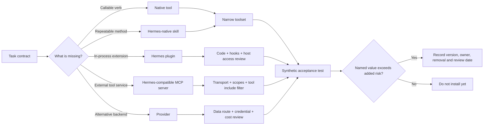

# 8. Tools, Skills, Plugins, and MCP

**Verified against Hermes Agent v0.20.5 (2026-08-19).**

## Opening scenario

Alex asks Hermes to become “better at research and business.” A search turns up a web tool, a research skill, a browser plugin, three Google integrations, an MCP server, and a provider promising managed search. Their descriptions all sound like capabilities. Alex starts installing them.

Priya stops at the third credential request. One package only teaches a citation procedure. Another can run Python inside Hermes. A third starts a local subprocess downloaded through a package manager. The Google option requests access to mail, files, and calendars even though the first job only needs a public-page summary. None of those differences appears in the original sentence, “make Hermes better at research.”

The Chen–Patels replace the shopping list with a capability map. They enable the built-in `web` toolset for a synthetic task, load the bundled `grounded-citations` skill to improve the method, and defer every external account connection. Harbourlight adds document skills only after a test proves the output format. The optional health skill stays in a family profile; the Codex skill stays in a development profile. A Google Workspace connection and all MCP servers remain off until there is a named workflow, a least-privilege account, and a removal test.

The lesson is not that extensions are dangerous. It is that “extension” is too broad to authorize. A procedure, an executable module, a remote server, and a credentialed provider create different powers and failure paths. This chapter gives each one a precise name and installs only the smallest useful stack.

## Definitions

**Tool.** A callable function exposed to the model, such as `web_search`, `read_file`, `terminal`, or `cronjob`. A tool has a schema the model sees and a handler that performs work. The tool is the verb that can create an observation or an effect.

**Toolset.** A named bundle controlling which tools are available. A core toolset groups related functions; a composite toolset includes several groups; a platform toolset defines the surface for CLI, cron, Telegram, and other contexts. Toolsets reduce exposure, but they are not operating-system isolation.

**Skill.** A procedure, usually rooted in `SKILL.md`, that tells Hermes when and how to perform a workflow. Skills can carry references, templates, scripts, and setup requirements. Loading a skill changes guidance in context; it does not itself grant a credential or override the tool boundary.

**Skill bundle.** A YAML alias that loads several already-installed skills through one slash command. A bundle does not install its members or merge their permissions.

**Skills Hub.** Hermes's discovery and installation interface for official optional skills and external sources. “Hub” describes distribution, not a uniform trust grade. Official optional skills live in the Hermes repository; community, GitHub, direct-URL, and well-known sources require separate review.

**Plugin.** Python code loaded into the Hermes process. A general plugin can register tools, hooks, slash commands, CLI commands, skills, approval transports, or gateway platforms. Specialized provider plugins can add model, memory, context, image, or other backends. Plugins may execute with the Hermes macOS user's access, so their trust boundary is materially wider than a procedure document.

**Provider.** The selected implementation behind a stable capability: a model endpoint, memory backend, speech service, image generator, or other service. A provider may be built in or contributed by a provider plugin. It is not synonymous with a tool or connector.

**Connector.** An architectural description for code that connects Hermes to another system. In this book, use the concrete mechanism—native tool, plugin, gateway adapter, or MCP server—when granting authority. “Connector” alone says too little about where code runs or which account it can reach.

**MCP.** Model Context Protocol, a protocol for exchanging tools, resources, and prompts between a client and a server. Hermes is normally the MCP client. It discovers server capabilities and registers MCP tools with names such as `mcp_<server>_<tool>`.

**MCP server.** A separate local subprocess reached over standard input/output or a remote HTTP service. It owns its implementation and may call still other APIs. A remote MCP server is not made safe merely because the transport is standardized.

**Permission or scope.** Authority granted by an operating system, OAuth consent, API token, filesystem path, tool filter, or service role. The model's instructions are not the permission boundary.

**Supply chain.** Every source and transformation between the author and the executing system: repository owner, commit, package registry, bootstrap command, transitive dependency, update channel, build output, and credential flow.

These types compose, which is why their boundaries matter:



The diagram is a selection path, not a maturity ladder. MCP is not “more advanced” than a skill; it solves a different missing layer.

## Hermes in practice

### Start with tools, then narrow the toolset

Hermes ships a broad registry covering files, terminal work, web retrieval, browser automation, memory, scheduling, delegation, media, and integrations. The default CLI platform is intentionally capable. Messaging and cron platform toolsets can also be broad. A phone number therefore does not imply a read-only assistant: the `hermes-telegram`, `hermes-whatsapp`, `hermes-email`, and `hermes-sms` platform presets inherit full tools, including terminal, unless the operator configures them differently.

Inspect and configure before adding anything:

```bash
hermes tools
hermes chat --toolsets web,file -q "Summarize the supplied public sources and save a draft."
```

Inside a session, `/tools list`, `/tools enable <name>`, and `/tools disable <name>` manage exposure. Prefer the smallest task set. Public research may need `web`; a document transformation may need `file`; a scheduled monitor may need `web` plus `cronjob` in the creating session, while its run receives the cron platform configuration. The `safe` composite is read-only research plus media generation, not a promise that every returned page is trustworthy.

Every toolset addition has three costs. Its schema consumes prompt space, its handler expands the possible trajectory, and its credentials or backend expand the effect boundary. “The model probably will not call it” is not a control. Remove the toolset when the task does not need the verb.

### Use a skill for method, not access

Bundled skills are copied into the profile's skill directory and progressively disclosed: Hermes first sees an index, then loads the full procedure when invoked or judged relevant. A skill can make citation gathering, workbook creation, or weekly review much more reliable without inventing a new runtime integration.

Useful inspection commands are:

```bash
hermes skills list
hermes chat --toolsets skills -q "Show me the grounded-citations skill"
hermes skills browse --source official
hermes skills inspect official/health/fitness-nutrition
```

The first two inspect what is already present. `browse --source official` limits discovery to optional skills shipped in the pinned Hermes repository. `inspect` is the pause before installation. If installation is justified, the official form is `hermes skills install official/<category>/<skill>`; remove with `hermes skills uninstall <skill-name>`.

Skills can contain scripts and setup instructions, so “text file” does not mean harmless. Read the complete directory, required commands, environment variables, credential files, network destinations, and output paths. The Hub scanner and quarantine are useful advisory controls, not a substitute for review. Project-local skills only load after `hermes skills trust`; later content changes are rescanned. Trust the repository and commit, not the friendly slash-command name.

Turn on `skills.write_approval` when Hermes may create or revise procedures. Then skill mutations are staged for `/skills diff` and `/skills approve` rather than written immediately. A learned workflow can encode a mistake for every later session; procedural memory deserves change control.

### Treat Skills Hub sources as different shelves

The Hub can search official optional skills, `skills.sh`, well-known web endpoints, direct URLs, GitHub repositories, and other community indexes. That convenience collapses discovery, not provenance. For the Chen–Patels' production profiles, this edition curates only skills bundled with Hermes or official optional skills in the pinned Hermes repository.

That restriction deliberately excludes Codex marketplace plugins. The book may use Hermes's bundled `codex` skill, which teaches Hermes to delegate through the installed Codex CLI. It does not recommend or install a Codex marketplace plugin as a Hermes extension. A plugin designed for another harness does not become Hermes-native because the names are similar.

The do-not-install threshold is simple: if a workflow can be completed with an existing tool and a short task contract, do that first. Do not install a skill merely for a category label, a clever prompt, or hypothetical future reuse. Require three successful manual repetitions or a demonstrable reduction in errors before making a workflow durable.

### Treat plugins as code execution

Hermes plugins live under `~/.hermes/plugins/`, project `.hermes/plugins/`, bundled plugin directories, or Python entry points. A plugin can register a tool and hook, intercept a call, inject context, transform results, or add a gateway platform. General and third-party plugins are normally opt-in through `plugins.enabled`; discovery alone does not authorize execution. Bundled infrastructure categories have different selection mechanisms, so inspect the plugin type rather than assuming the allowlist gates everything.

The safe review sequence is:

1. Identify the exact source, owner, licence, version, and expected files.
2. Read `plugin.yaml`, the registration entry point, handlers, hook callbacks, install code, and dependencies.
3. List every host path, environment variable, network destination, model call, MCP call, and lifecycle event it can touch.
4. Prefer an immutable full commit when installing from GitHub.
5. Enable only in a synthetic profile, restart, list the registered surface, and exercise one success plus one denial.
6. Disable it, restart, and prove the surface and background behaviour disappear.

Hermes supports an immutable revision form:

```bash
hermes plugins install owner/repository --ref 0123456789abcdef0123456789abcdef01234567
hermes plugins list
hermes plugins disable <plugin-name>
```

The sample SHA is illustrative; replace the entire source and full commit only after review. Pinned plugins do not move during `hermes plugins update`. Record the new reviewed commit when deliberately upgrading.

For a conservative Mac mini, two bundled plugins are plausible later: `security-guidance` can add pattern-based warnings or blocking around file writes, and `disk-cleanup` can track limited ephemeral paths. Neither is a first-day requirement. The former is not a complete security review; the latter deletes by policy. Enable either only after reading its current rules, running synthetic positive and negative tests, and confirming its kill switch. Observability plugins can export sensitive prompts and tool results; do not enable one until retention, redaction, access, and hosting are approved.

### Use MCP when the capability already lives outside Hermes

MCP is appropriate when a maintained server already exposes a service Hermes needs. A standard transport makes integration cleaner, but the server still receives inputs and returns potentially hostile content. Stdio servers execute local commands. HTTP servers disclose data to a remote endpoint. OAuth scopes can expose an entire account. Each is an extension of the trusted computing base.

Start from the Hermes catalog when possible:

```bash
hermes mcp catalog
hermes mcp install <catalog-name>
hermes mcp configure <server-name>
```

Catalog entries are Nous-reviewed and disabled until installed, but installation may clone code and run bootstrap commands. Read the manifest's source, revision, commands, transport, environment variables, and default tools before confirming. MCP servers are not auto-updated.

For a direct compatible server, configuration lives under `mcp_servers` in `~/.hermes/config.yaml`. A local filesystem server should receive one project root, not the home directory. A remote server should use provider-supported OAuth or a narrowly scoped secret. Filter its surface with `tools.include`; excluding a few scary names is weaker because new tools may appear later. Hermes gives each server a dynamic `mcp-<server>` toolset and prefixes tools to prevent name collisions.

A safe conceptual configuration looks like this:

```yaml
mcp_servers:
  records_read:
    url: "https://mcp.example.invalid/mcp"
    enabled: false
    tools:
      include: [search_records, read_record]
      prompts: false
      resources: false
```

The reserved `.invalid` host ensures this example cannot connect. Installation is incomplete by design: the operator must replace it with a reviewed service, authentication method, and scopes, then enable it. Start read-only. A server that mixes `read_record` with `delete_record` should expose only the former until a later authority review.

MCP result sanitization removes one invisible-Unicode smuggling class, and server tools can be filtered. Those are defence layers, not proof that returned instructions are safe. Treat remote content as data. Never let a document retrieved through MCP redefine the operating contract.

### Curate by workflow, not by aspiration

The following first-edition stack contains only bundled Hermes skills, official optional Hermes skills, bundled Hermes plugins, native toolsets, and Hermes-compatible MCP patterns. “Do not install yet” is an operating answer, not indecision.

| Area | Start with | Value and permissions | Maintenance and do-not-install threshold |
| --- | --- | --- | --- |
| Research | Native `web` plus bundled `grounded-citations` | Public retrieval and a source-led citation procedure; no private account required | Verify source dates and links monthly. Do not add browser automation or community scrapers until ordinary retrieval fails on a named source and the site's terms permit the method. |
| Productivity | Bundled `weekly-review-planning`, `meeting-action-items`, or `document-to-action-items`, one at a time | Turns supplied notes into internal queues; needs only the bounded input/output paths | Run three synthetic weeks. Do not connect a task service until duplicate, deletion, and owner rules are defined. |
| Google Workspace | Bundled `google-workspace` skill first; a compatible Google MCP only after scope review | The skill teaches use of the supported Google CLI and credentials; MCP may expose remote Drive tools | Use a secondary Workspace identity and minimum OAuth scopes. Do not connect the primary family mailbox/Drive or accept mail-wide plus drive-wide scope for a calendar-only job. |
| Documents | Bundled `docx`, `pdf`, `powerpoint`, and `xlsx` skills only as needed | Local artifact creation and verification; filesystem writes and local libraries | Keep template and output roots explicit. Do not install all formats when the workflow produces one, or accept a document conversion service for sensitive files without data review. |
| Career work | `grounded-citations`, `docx`, and `xlsx` in Priya's career profile | Research evidence, résumé drafts, and an opportunity ledger; access limited to career artifacts and public sources | Review skills at each Hermes update. Do not connect job sites or send applications; discovery and drafts must prove value first. |
| Finance preparation | Bundled `xlsx`; optional official `excel-author` only for a defined auditable workbook | Organizes statements, assumptions, and questions for owner/accountant review; never banking credentials | Test formulas against known examples. Do not install trading, payment, wallet, valuation, or checkout skills for household bookkeeping preparation. |
| Health routines | Optional official `fitness-nutrition` in the family profile | Can help structure a routine using its documented data sources; may handle sensitive measurements | Minimize retained health data and verify sources. Do not install for diagnosis, treatment choice, children's sensitive tracking, or automatic device ingestion. |
| Smart home | Bundled `openhue` for a limited lighting test; consider native `homeassistant` only after reviewing the token's full reach | Inventory state first. If the credential reaches more devices than the task needs, do not enable state-changing Home Assistant tools. | Inventory entities and revoke the credential in a drill. Do not expose locks, alarms, cameras, ovens, garage doors, or broad admin tokens. |
| Codex delegation | Bundled Hermes `codex` skill and installed Codex CLI | Delegates bounded coding/artifact work with paths, acceptance checks, and handback; terminal and repository access | Pin the worktree and verify diffs/tests. Do not add Codex marketplace plugins, share unrelated workspaces, or let delegation become unreviewed business execution. |

The Google row intentionally names a pattern rather than endorsing a permanent server. At the pinned release, Hermes supports stdio and HTTP MCP, OAuth, per-server filtering, and a Google Drive OAuth caveat requiring a pre-registered client for the official endpoint. Provider availability and scopes can change. Inspect the current server and its official provider documentation at installation time.

### Read permissions as a stack

An extension's effective authority is the intersection—and sometimes the accidental union—of several layers. Begin with the macOS user: anything readable or writable there may be reachable by in-process plugin code even if the model lacks a file tool. Next inspect the terminal backend and mounts. A Docker backend can reduce host exposure, but Hermes uses one persistent container for the process lifetime; files, packages, and environment changes can survive across turns and delegated work. A narrow task should not inherit yesterday's contaminated sandbox by assumption.

Then inspect the model-visible layer. Toolsets determine which registered calls the model can propose. MCP `tools.include` narrows one server. Skill requirements and scripts may still invoke enabled terminal capabilities. Plugin hooks can see or change arguments and results at lifecycle seams. Finally inspect the external account: OAuth scopes, service roles, shared drives, mailbox folders, Home Assistant entities, and provider-side restrictions determine what a successful call can affect.

Write the stack from outside inward:

```text
macOS user → terminal backend/mounts → profile → platform toolsets
→ skill/plugin/MCP surface → credential scopes → service-side object policy
```

No inner control repairs an overbroad outer one. An MCP include list cannot stop a malicious in-process plugin from reading a token file available to its OS user. A read-only service token can, however, limit the damage of a mistaken write tool. The goal is layered agreement: every layer should describe the same bounded job.

Use a permission-delta review for changes. Compare before and after lists of tools, commands, environment names, writable roots, network hosts, OAuth scopes, and provider objects. A version upgrade that adds no visible feature can still expand one of those lists. If the delta cannot be explained by the task contract, keep the old version or disable the extension.

This also clarifies maintenance ownership. The profile owner reviews guidance and tool exposure; the Mac mini owner reviews code execution and filesystem access; the external-account owner reviews scopes, provider logs, billing, and revocation. In a two-person business one person may wear all three hats, but the ledger should still record each decision separately.

Measure prompt exposure as well as effect exposure. A skill can load long instructions, an MCP server can contribute many schemas, and a plugin can register tools whose descriptions enter the model's decision surface. Too many overlapping options make selection less predictable and increase input cost. Record the tool count before and after installation, inspect which names are actually available on the target platform, and remove redundant mechanisms. If the native `web_search` tool already satisfies a task, adding two search MCP servers and a scraping skill makes provenance harder, not stronger. One authoritative path plus one tested fallback is usually enough.

Finally, distinguish disable, uninstall, and revoke. Disabling prevents ordinary loading; uninstalling removes local code or configuration; revoking invalidates provider-side authority. A complete offboarding may require all three, followed by a restart and an access-log check. The field kit treats removal as a test because an extension whose authority cannot be withdrawn predictably is not production-ready.

### Make installation an evidence-producing change

Create an extension ledger before the install, not afterward. Record the task, extension type, source, exact revision, permission paths, OAuth scopes, secrets location, network destinations, tools exposed, profile, test fixtures, owner, review date, removal steps, and rollback point. Capture names and hashes, never secret values.

Acceptance has four stages. **Presence:** the extension appears only in the intended profile and platform. **Capability:** the synthetic success case works. **Confinement:** a disallowed path, user, account, or action is refused. **Removal:** disabling/uninstalling plus restart removes tools, hooks, sessions, tokens, and background processes as documented. OAuth grants often require revocation at the provider as well as local token deletion.

Maintenance is also type-specific. Bundled skills may sync on Hermes update while respecting local modifications. Hub skills have `check`, `update`, and `audit`; never update blindly across a critical deadline. Pinned plugins stay pinned until an explicit new commit. MCP catalog manifests and server packages need separate review; they do not auto-update as one unit. Re-run the synthetic and confinement suite after any change.

## Professional example

Harbourlight needs a weekly competitor brief and a monthly support-theme workbook. Alex enables `web` and `file` for the business profile, loads `grounded-citations`, and uses `xlsx` for the workbook. Public sources and synthetic tickets prove both workflows. Customer tickets remain outside the research session; the workbook uses redacted categories.

The team rejects three tempting additions. A community “growth” skill contains shell bootstrap steps unrelated to research. A CRM MCP requests write scopes even though the brief only reads public pages. An observability plugin would export tool arguments and results to a new cloud account. None crosses the do-not-install threshold.

Later, a read-only records server may justify MCP. Harbourlight would create a service identity, include only search and read tools, exclude resources/prompts, and test a forbidden customer deletion. Draft support replies remain Amber and are not sent by the extension. A plugin is considered only if a required capability cannot be expressed through existing tools, skills, or a reviewed external server.

## Personal example

Priya's career profile uses the citation, DOCX, and XLSX skills to research employers, tailor truthful drafts, and maintain a ledger. The profile has no Harbourlight mailbox and no family calendar. The bundled Codex skill is absent because career drafting does not need a coding harness.

The family profile tests the optional fitness skill with invented adult data and a walking-plan request. It may propose a routine and logging template, but it does not diagnose symptoms, set treatment, or build a child health dossier. A smart-home pilot uses `openhue` for approved lamps and begins with state inspection. If the deployment cannot bound control to the intended lights, control stays disabled. Door locks and cameras are never in scope.

This is less convenient than one universal profile. It is also inspectable: each extension answers which profile, which paths, which account, which tools, which owner, and which off-switch.

## Authority boundaries

| Boundary | Hermes authority with extensions |
| --- | --- |
| **Green — may act** | Inspect installed extensions; list tools and scopes; use approved read-only sources; draft internal documents; create synthetic tests; report versions, permissions, hashes, and failures inside the assigned profile. |
| **Amber — may prepare** | Draft an install plan, OAuth scope request, plugin upgrade, MCP filter, outbound message, workbook, health routine, device-control change, or Codex delegation contract. A human reviews before installation, account consent, external send, or consequential act. |
| **Red — may not act** | Install unreviewed executable code; authorize its own new accounts or scopes; expose the home directory; disable security to make an extension work; move money; trade; diagnose or prescribe; control safety-critical home devices; submit applications; share credentials; or treat a scanner verdict as authorization. |

No extension changes the professional-advice boundary. Finance skills prepare records and questions, health skills support routines, and career skills prepare truthful materials. Owners and qualified professionals make consequential decisions.

## Failure modes and recovery

**Name confusion.** A skill is described as a plugin, or a provider as a tool, so reviewers assess the wrong risk. Recovery: disable the capability, trace where code runs and credentials flow, relabel the ledger, and repeat acceptance.

**Toolset sprawl.** A messaging or cron surface inherits terminal, browser, and file tools it does not need. Recovery: stop the surface, inspect `hermes tools`, reduce to the named task set, restart, and run both success and denial probes.

**Malicious or overbroad skill.** A procedure requests secrets, unrelated downloads, or policy changes. Recovery: do not invoke it; quarantine/uninstall it, preserve source and scan evidence, rotate any exposed secret, inspect sessions and files, and search for copied instructions.

**Plugin side effects.** Disabling a visible tool leaves a hook, process, file, or remote token active. Recovery: stop Hermes, disable the plugin, review its uninstall and lifecycle code, restart, list surfaces, terminate documented child processes, revoke provider grants, and verify logs.

**MCP tool expansion.** A server update exposes new mutating tools or changes descriptions. Recovery: set `enabled: false`, preserve config and server version, compare capabilities, switch from exclusions to an explicit include list, re-authenticate only if scopes remain appropriate, and reload after approval.

**Credential crossing.** A family profile reaches a Harbourlight account through a shared environment or token file. Recovery: stop both profiles, revoke the token at its issuer, identify every local copy and log, create separate service identities, repair filesystem permissions, and run synthetic cross-profile canaries.

**Broken update.** A skill, plugin, server, or dependency changes output or stops loading. Recovery: pause affected workflows, restore the recorded version or disable the extension, run the base Hermes smoke test, then update one layer at a time. Never loosen permissions merely to recover availability.

**False confidence from “official.”** A bundled or reviewed item is used outside its intended scope. Recovery: return to the task contract. Provenance lowers one supply-chain uncertainty; it does not approve data, authority, cost, or every configuration.

## Field kit

### Extension decision and maintenance card

```text
CAPABILITY REQUEST
Task / output:
Current manual method:
Observed failure or cost:
Missing layer: tool / skill / plugin / provider / MCP:
Why the simpler layer is insufficient:

PROVENANCE
Name and type:
Hermes-native status:
Source owner / URL:
Exact version or commit:
Licence:
Manifest / bootstrap / dependencies reviewed:
Codex marketplace plugin excluded: yes / no

AUTHORITY
Profile and macOS user:
Enabled toolsets:
Paths and commands:
OAuth scopes / service role:
Network destinations:
Model or data provider:
Read effects:
Write / send / delete effects:
Green / Amber / Red classification:

TEST
Synthetic success:
Forbidden-path or forbidden-action test:
Wrong-profile test:
Offline / expired-token test:
Disable, restart, uninstall, and remote-revoke test:
Evidence path:

OPERATIONS
Owner:
Installed date:
Review date:
Update policy:
Known cost:
Kill switch:
Rollback version:
Do-not-install threshold cleared by:
```

## Exercise

Design the smallest extension stack for four Chen–Patel requests: a public employer-research brief with citations; a monthly Harbourlight workbook from redacted categories; a walking routine for an adult; and switching two living-room lamps. For each, choose toolsets, skills, plugin or MCP status, profile, credentials, Green/Amber/Red boundary, synthetic test, denial test, maintenance owner, and do-not-install threshold. Then assess a community “all-in-one productivity” skill that requests terminal access, Google mail/Drive OAuth, and an unpinned installer.

## Answer or rubric

The employer brief needs `web` and `grounded-citations` in the career profile; document output may add `docx`. It needs no Google account, plugin, or MCP. The workbook needs bounded `file` access and `xlsx` in Harbourlight, using synthetic/redacted inputs; sending or financial interpretation remains Amber. The adult walking routine may justify the official optional `fitness-nutrition` skill in the family profile after source and retention review; diagnosis remains Red. The lamp pilot uses `openhue`, begins with state inspection, and adds control only when the deployment can keep authority within the approved non-safety-critical lights.

Each answer should include an explicit forbidden case: no Harbourlight data in career, no raw customer data in the workbook test, no child diagnosis, and no locks/cameras in smart-home scope. The all-in-one community skill fails the threshold: its permissions cross unrelated domains, installer is unpinned, and one narrow workflow has not justified mail and Drive access. Award two points each for correct type distinctions, minimum tools, profile separation, permission analysis, supply-chain evidence, negative testing, authority boundaries, and removal/maintenance. Thirteen of sixteen indicates mastery.

## Mastery checklist

- [ ] I can distinguish a tool, toolset, skill, bundle, plugin, provider, connector, and MCP server.
- [ ] I understand that a skill changes procedure while a plugin executes code in Hermes.
- [ ] I can identify where stdio and HTTP MCP servers run and where data travels.
- [ ] I start with a named workflow and the smallest toolset.
- [ ] I inspect a complete skill or plugin, not only its description.
- [ ] I use explicit MCP tool inclusion and narrow OAuth scopes.
- [ ] I treat official provenance as evidence, not blanket authorization.
- [ ] I exclude Codex marketplace plugins while using the bundled Hermes Codex skill where justified.
- [ ] I can test presence, capability, confinement, and removal.
- [ ] I maintain a versioned extension ledger with an owner and kill switch.

## References

- Nous Research, [Tools and toolsets](https://github.com/NousResearch/hermes-agent/blob/v2026.8.19/website/docs/user-guide/features/tools.md).
- Nous Research, [Toolsets reference](https://github.com/NousResearch/hermes-agent/blob/v2026.8.19/website/docs/reference/toolsets-reference.md).
- Nous Research, [Skills system and Skills Hub](https://github.com/NousResearch/hermes-agent/blob/v2026.8.19/website/docs/user-guide/features/skills.md).
- Nous Research, [Bundled skills catalog](https://github.com/NousResearch/hermes-agent/blob/v2026.8.19/website/docs/reference/skills-catalog.md).
- Nous Research, [Official optional skills catalog](https://github.com/NousResearch/hermes-agent/blob/v2026.8.19/website/docs/reference/optional-skills-catalog.md).
- Nous Research, [Plugins](https://github.com/NousResearch/hermes-agent/blob/v2026.8.19/website/docs/user-guide/features/plugins.md).
- Nous Research, [Built-in plugins](https://github.com/NousResearch/hermes-agent/blob/v2026.8.19/website/docs/user-guide/features/built-in-plugins.md).
- Nous Research, [MCP client and server support](https://github.com/NousResearch/hermes-agent/blob/v2026.8.19/website/docs/user-guide/features/mcp.md).
- Nous Research, [Security](https://github.com/NousResearch/hermes-agent/blob/v2026.8.19/website/docs/user-guide/security.md).
- Model Context Protocol, [Specification](https://modelcontextprotocol.io/specification/2025-06-18) (accessed 2026-08-21).
