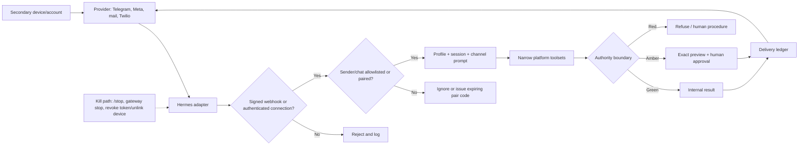

# 9. Message Hermes Everywhere

**Verified against Hermes Agent v0.20.5 (2026-08-19).**

## Opening scenario

At 7:20 on a school morning, Priya wants the family briefing on her phone. Alex wants Harbourlight alerts in a business channel. Ben should be able to ask for the shared packing list, but not inspect career files or run terminal commands. The first design is seductively simple: connect Hermes to the family's primary WhatsApp account and let everyone message it.

Then Priya loses her phone on the train. The phone has the family WhatsApp session, an email app, and the authenticator used to recover both. Hermes's gateway is still running on the Mac mini. If the lost device can talk to a full-tool messaging profile, possession of one screen may become terminal access to the host. If they unlink the phone hastily, a cron briefing may route sensitive content to another still-active channel. The incident exposes the real design problem: messaging is remote access, identity, session routing, and delivery—not merely chat.

The Chen–Patels choose secondary identities. A dedicated Telegram bot serves supervised family operations. Harbourlight pilots a dedicated WhatsApp Business Cloud number, not either adult's primary WhatsApp account. A separate support mailbox provides slow, threaded intake. SMS is an urgent fallback with explicit message and number charges. Voice remains an input/output mode on supported channels, never proof of identity. Every route has an allowlist, an owner, a home destination, an authority ceiling, and a lost-device procedure.

This chapter makes that choice decision-ready. It compares the channels, explains Hermes's pairing and group behaviour, and designs recovery before a phone disappears.

## Definitions

**Gateway.** The long-running Hermes process that connects configured messaging platforms, maps inbound events to sessions, runs the agent, and sends responses. On macOS it can run as a `launchd` user service.

**Adapter or platform plugin.** The Hermes component translating a provider's messages, attachments, threads, and interaction controls into the common gateway flow. A channel adapter does not reduce the tools available to that platform by itself.

**Channel identity.** The bot, phone number, or mailbox visible to users: a Telegram bot token, WhatsApp Business number, Twilio number, or email address. It should be separate from an adult's primary identity.

**Sender identity.** The provider identifier used for authorization, such as a numeric Telegram user ID, an E.164 phone number, or an email address. Display names and usernames are not stable authorization evidence.

**Allowlist.** An explicit set of sender or chat identifiers permitted to reach Hermes. An allow-all flag is a deliberate removal of that gate, not a setup shortcut.

**DM pairing.** Hermes's alternative enrollment flow for an unknown direct-message sender. Hermes issues a short-lived one-time code; an operator approves the code from a trusted control surface. Pairing proves control of that provider identity at that time; it does not prove a legal name or grant unlimited authority.

**Home channel.** The configured default target for cron results and proactive notifications on a platform. A home channel is a route, not a data-classification rule.

**Origin delivery.** Returning scheduled output to the chat where the job was created. It is convenient but dangerous when jobs are created in mixed-purpose rooms.

**Group trigger.** The rule that decides whether group content dispatches Hermes: mention, reply, command, configured pattern, sender allowlist, or chat allowlist. Receiving group chatter and responding to it are separate choices on Telegram.

**Customer service window.** On WhatsApp Business Platform, a 24-hour period opened or refreshed by a user's message during which service replies may be sent. Hermes's pinned Cloud adapter supports free-form responses in that window but does not yet implement template delivery after it closes.

**At-least-once delivery.** A response may be resent after an ambiguous crash to avoid losing it. Hermes visibly labels a recovered reply that may be a duplicate. Receivers and workflows must tolerate duplicates.

**Urgent escalation.** A bounded rule that promotes an event from a quiet digest to a high-attention channel. “Urgent” should be derived from verified conditions and never mean “let the agent take more authority.”

The gateway path has controls on both sides of the model:



A valid provider signature authenticates the provider request, not the instruction's safety. An allowlisted sender still receives only the profile's bounded authority.

## Hermes in practice

### Choose the channel from the operating requirement

The matrix below describes Hermes v0.20.5 plus provider facts checked on 2026-08-21. Provider pricing and account rules change; verify the linked primary pages before purchase or launch.

| Channel | Identity and transport | Hermes media / room behaviour | Cost reality as of 2026-08-21 | Best fit | Main reason to defer |
| --- | --- | --- | --- | --- | --- |
| WhatsApp Business Cloud | Dedicated business number, Meta Business/WhatsApp Platform account, HTTPS webhook, access token, app secret | Text, images, files, voice notes and interactive controls; Hermes adapter handles DMs only; free-form outbound constrained by 24-hour window | Meta charges delivered messages by market and category; service messages and utility replies to users are not charged, but other categories can be. A free test number/sandbox is not a promise of free production operation. | Stable, customer-facing Harbourlight intake on a dedicated number | Public webhook, Meta setup, token lifecycle, no Hermes group support, and no template sending after the window |
| WhatsApp bridge (Baileys) | WhatsApp account linked by QR; unofficial Web protocol; local Node subprocess | DMs and groups, polling bridge, voice input and audio output; full group support | Hermes itself adds no provider message fee, but a dedicated SIM/number and connectivity can cost money. Unofficial use carries restriction/ban risk. | Short private experiment where groups are essential and risk is accepted | Protocol breakage, account restrictions, session credentials, and temptation to link a primary account |
| Telegram | Dedicated bot from BotFather; outbound polling by default or signed-secret HTTPS webhook | Strongest general feature set here: text, voice, images, files, DMs, groups, forum topics, streaming | Standard bot messages are available at no per-message cost within limits. Paid Broadcasts can exceed roughly 30 messages/second at 0.1 Telegram Stars per successful over-limit message; ordinary family use should not enable it. | Family operations, interactive approvals, topics, and scheduled briefs | Bot token compromise, broad group visibility, and default full platform tools if not narrowed |
| Email | Dedicated mailbox through IMAP polling and SMTP sending | Threaded, long-form messages and attachments; slower, no typing/voice | Mailbox/domain/service price depends on the provider and plan. Do not assume a free production mailbox. Google app passwords require 2-Step Verification and may be unavailable for some managed, security-key-only, or Advanced Protection accounts. | Audit-friendly intake, long briefs, and asynchronous handoff | Sender spoofing/phishing content, broad mailbox exposure, duplicate gateways, and app-password lifecycle |
| SMS through Twilio | Dedicated Twilio number, signed inbound webhook, E.164 sender allowlist | Plain text only; no threads, files, images, typing, or voice in Hermes's SMS adapter | Not free. For Canada on 2026-08-21, Twilio listed per-segment inbound and outbound charges, additional carrier fees, and monthly number charges; prices vary and may change. | Short urgent fallback when data coverage or app use is unreliable | Ongoing number/message/carrier cost, limited context, public webhook, consent/compliance burden |
| Voice | Input/output mode layered on CLI or supported messaging adapters, not a standalone identity | CLI recording; Telegram/Discord voice replies; WhatsApp voice notes; provider and adapter details vary | Local STT/TTS can avoid API charges but uses host resources; hosted speech providers may charge. Verify the selected provider. | Hands-busy capture, accessibility, and optional spoken reply | Transcription errors, ambient disclosure, voice-cloning risk, and false belief that a voice proves identity |

<figure markdown>
  
  <figcaption>Official Hermes connection feature art from pinned tag v2026.8.19.</figcaption>
</figure>

For the Chen–Patels, Telegram is the best first family channel because it supports a dedicated bot, numeric allowlists, topics, attachments, and interactive control without linking a personal account. Harbourlight's customer-facing pilot belongs on a dedicated WhatsApp Business Cloud number because the path is officially supported. Email is the deliberate slow lane. SMS is a paid break-glass delivery path, not the default. The Baileys bridge is an Amber experiment only, never a primary personal-account integration.

### Build one gateway only after local operation passes

Chapter 5 established the local smoke test. Configure messaging after the profile, model route, memory boundary, and platform toolset are known. The core commands are:

```bash
hermes gateway setup
hermes gateway
hermes gateway install
hermes gateway status
```

Run in the foreground for the synthetic acceptance test. Install the macOS service only after successful authorization, confinement, delivery, and stop tests. A regular CLI chat does not keep messaging or cron alive. The installed user service is the intended always-on Mac mini route.

The platform presets for Telegram, WhatsApp, email, and SMS normally include the same broad capabilities as `hermes-cli`, including terminal. Use `hermes tools`, select each platform, and remove toolsets not required by its job. A family-reminder bot rarely needs terminal, browser automation, MCP account writes, delegation, or filesystem access beyond a controlled output area.

Configure exactly one active gateway instance per profile. Two email pollers can produce duplicate replies; two gateway processes can contend for state and schedule work. `hermes gateway status` is part of every deployment and incident check.

### Prefer allowlists; use pairing as controlled enrollment

Allowlists are easiest to audit. Store provider-stable identifiers, not friendly labels. Telegram uses numeric user IDs; phone channels use normalized numbers; email uses exact allowed sender addresses. Keep allow-all disabled for any bot with meaningful tools.

Pairing is useful when an operator cannot conveniently pre-enter an identifier. The unknown sender receives a code, and a trusted operator approves it:

```bash
hermes pairing list
hermes pairing approve telegram ABC12DEF
hermes pairing revoke telegram 123456789
hermes pairing clear-pending
```

The example code and user ID are synthetic. Pairing codes expire, are single-use, and are rate-limited in Hermes. Approval should occur on the Mac mini console or another already trusted admin surface after the requester confirms through an independent path. Never approve a code merely because it arrived in the same untrusted DM.

Pairing does not assign a role. After approval, decide which profile, commands, groups, and authority that identity receives. Hermes supports admin versus regular-user slash-command controls; ordinary family users should not inherit model changes, MCP reloads, updates, destructive session operations, or extension management.

### Give WhatsApp Business Cloud its own number

Use a dedicated WhatsApp Business Cloud number for Harbourlight rather than Priya's or Alex's primary WhatsApp account. This separates customer data, recovery, billing, profile presentation, and offboarding. It also prevents a ban, token incident, or employee handoff from disrupting family communications.

Start the Hermes wizard with:

```bash
hermes whatsapp-cloud
```

The Meta setup requires a business/platform account, an app, a WhatsApp Business account, a phone-number ID, an access token, an app secret, a verify token, and a publicly reachable webhook. The phone-number ID is Meta's internal numeric identifier, not the visible phone number. Temporary dashboard tokens are unsuitable for production. Inbound messages are refused when the app secret needed for signature verification is absent.

Set a narrow `WHATSAPP_CLOUD_ALLOWED_USERS` list for a private pilot and a dedicated home channel only after delivery classification is approved. Do not use `WHATSAPP_CLOUD_ALLOW_ALL_USERS` to fix a failed test. Keep Meta's recipient/test-number restrictions and Hermes's allowlist as separate layers.

Hermes's pinned Cloud adapter is direct-message-only and cannot send message templates. If more than 24 hours has elapsed since a user message, a cron result or long asynchronous handback may fail. Route scheduled Harbourlight operations briefs to Telegram or email instead of assuming WhatsApp will deliver. Current Meta pricing, checked 2026-08-21, is per delivered message by category and recipient market; service replies in the 24-hour customer-service window are not charged, while marketing, authentication, and some utility messages may be. Check the current rate card before launch.

The public webhook is an ingress boundary. Terminate TLS through a reviewed tunnel or reverse proxy, keep the app secret and access token in the Hermes secret path, restrict the `/health` endpoint at the proxy if desired, and rotate tokens after any host or repository exposure. An HTTP 200 health response is not a successful send/receive test.

### Understand the unofficial WhatsApp bridge before saying yes

`hermes whatsapp` runs the setup wizard for the Baileys bridge. It links a WhatsApp account as a Web device by displaying a QR code. Session credentials persist under `~/.hermes/platforms/whatsapp/session`; possession can grant account access and must be treated like a password.

The bridge needs no public webhook and supports group chats, but it emulates an unofficial protocol. WhatsApp changes can break it, and account restrictions are possible. Use a separate bot number if the experiment is approved. Do not use a primary family or Harbourlight account, do not automate unsolicited outbound messaging, and do not treat “no API invoice” as “free”: maintaining a second number or SIM can cost money.

If pairing breaks, update Hermes through the normal maintenance procedure, restart the gateway, and re-run `hermes whatsapp` only after verifying the correct dedicated account. Unlink the Hermes device from WhatsApp's Linked Devices screen during containment. Deleting the local session without unlinking the server-side device is incomplete revocation.

### Configure Telegram as a bounded operations console

Create the bot through the official `@BotFather`, record its bot token as a secret, and place operator IDs in `TELEGRAM_ALLOWED_USERS`. Revoke a leaked token through BotFather and issue a new one. Hermes's interactive route is:

```bash
hermes gateway setup
hermes gateway
```

Long polling is appropriate for an always-on local Mac mini because it needs no public endpoint. Webhook mode is for a suitable hosted/public ingress and requires `TELEGRAM_WEBHOOK_SECRET`; do not switch merely because webhooks sound more advanced.

Telegram group privacy is enabled by default. A bot normally sees commands, replies to itself, service messages, and admin-channel messages—not all group chatter. Disabling privacy or promoting the bot to admin expands observation. After changing BotFather privacy, remove and re-add the bot for the setting to take effect.

Use two orthogonal group gates. `TELEGRAM_GROUP_ALLOWED_USERS` authorizes specified senders in groups without giving them DM access. `TELEGRAM_GROUP_ALLOWED_CHATS` authorizes an entire chat, so any member can interact. For a family room, prefer named senders plus `require_mention`; do not authorize every member merely because the chat itself is private. If Hermes observes unmentioned messages for context, those messages become session content even when no reply occurs. Obtain meaningful consent and define retention before enabling observation.

Telegram forum topics can isolate sessions and bind skills, but topics do not isolate OS access. Use separate profiles for family, career, and business; use topics only for conversational organization inside one approved domain. Set `/sethome` in a dedicated private topic for cron deliveries and test replies. A root DM used as a topic-mode lobby is a poor cron destination.

### Use email as an intake queue, not a command shell

Hermes's email gateway polls IMAP for messages and replies through SMTP. The gateway adapter is different from the bundled Himalaya skill: the adapter lets people converse with Hermes by email; the skill lets Hermes manage mailbox content through a terminal CLI. Install only the mechanism required.

Create a secondary mailbox such as an operations inbox, enable the provider's supported authentication, and use exact `EMAIL_ALLOWED_USERS`. `EMAIL_ALLOW_ALL_USERS` would turn unsolicited mail into agent input. A From address is not sufficient for high-consequence identity; email accounts can be compromised and forwarded content can contain prompt injection.

For Gmail, Google's current help page checked 2026-08-21 says app passwords require 2-Step Verification, are intended when Sign in with Google is unavailable, and may not be offered on some managed, security-key-only, or Advanced Protection accounts. Hermes's pinned adapter uses IMAP/SMTP credentials, so verify that the chosen provider and account policy support them. Do not weaken the primary account. Use a dedicated mailbox or select another supported provider.

Email polling is not instant, and threads can be mis-grouped by clients. Use it for weekly reports, draft review, and non-urgent intake. One gateway instance, one mailbox identity, an explicit attachment policy, and a quarantine path reduce duplicate replies and risky file ingestion.

### Make SMS a paid, low-context fallback

Hermes's SMS adapter uses Twilio. It requires a Twilio account and number, credentials, a public webhook URL, signature validation, and an E.164 sender allowlist. Configure with `hermes gateway setup`, then set the Twilio webhook to the Hermes SMS path described by the pinned guide.

Do not describe SMS as free. Twilio's Canadian pricing page, checked 2026-08-21, listed charges for inbound and outbound SMS segments, monthly long-code/toll-free numbers, and destination-carrier surcharges; failed-message and other fees can also apply. Long messages split into billable segments. Consult the live destination page and account invoice rather than copying a rate into a permanent budget.

Use SMS only for a compact event: “School closure notice detected; check the family Telegram room” or “Harbourlight checkout is unavailable; owner review needed.” Do not place private briefing detail, medical content, customer records, or approval secrets in SMS. Never disable Twilio signature validation in production. A telephone number can be ported or SIM-swapped; it is a route, not sufficient proof for money movement or account recovery.

### Treat voice as untrusted text with audio attached

Voice improves accessibility and capture speed. It does not authenticate the speaker. Hermes may transcribe Telegram and WhatsApp voice messages using a local or hosted STT provider, and can generate speech through configured TTS. The channel's sender authorization occurs before the transcription, while the transcript itself can be wrong.

For sensitive family use, prefer local transcription when capability is adequate, disclose recording/transcription to participants, avoid ambient rooms, and retain audio only as long as needed. Show the transcript before any Amber action. Names, dates, amounts, medication names, and negation require confirmation. A synthetic or cloned voice must never bypass the approval ladder.

### Design urgent escalation without authority escalation

Define urgency with observable predicates and a route ladder. A family school-closure notice may be urgent when an official source posts for the children's school and the date matches today. A Harbourlight alert may be urgent when the monitored checkout fails twice from independent probes. Model anxiety, capital letters, or a customer saying “urgent” is not enough.

Use this ladder:

1. Record the source, timestamp, rule, and deduplication key.
2. Deliver the concise alert to the primary private channel.
3. If unacknowledged after a fixed interval, send a minimal SMS fallback.
4. Never include an approval code or broaden tools in the fallback.
5. A human decides the consequential response.

The alert should say what was observed, what was not verified, and where to inspect. Repeated delivery uses one incident ID so humans recognize duplicates.

### Rehearse lost-device and account recovery

Write the plan before launch. If Priya's phone is lost, she uses a separate trusted device to lock or erase it through the device platform, revokes its active provider sessions, and contacts the carrier if the SIM is at risk. Alex stops the affected Hermes gateway/profile from the Mac mini, pauses proactive deliveries, and revokes the Hermes pairing record for the lost channel identity. They rotate any bot token or mailbox app password that the phone could reveal.

For WhatsApp Cloud, the business number remains separate from the phone; rotate Meta tokens and review business-account users and webhook configuration. For Baileys, unlink the Hermes linked device and the lost phone sessions. For Telegram, terminate the lost Telegram session; if the bot token may have leaked, revoke it in BotFather. For email, revoke the app password/session and inspect forwarding rules. For Twilio, rotate the auth token, inspect webhook URLs and usage, and suspend the number if necessary.

Recovery ends only after the allowlist, pairing store, home routes, scheduled deliveries, active sessions, provider audit logs, and a synthetic send/receive test are clean. Do not re-enable “all” delivery while channel status is uncertain.

## Professional example

Harbourlight assigns its WhatsApp Business Cloud number to inbound customer questions. The adapter uses a dedicated business profile with approved policy context and no family files. It may classify and draft a response. Refunds, discounts, delivery promises, personal-data changes, and every send remain Amber during the pilot. The Cloud 24-hour limit is logged; scheduled operations briefs go to a private Telegram topic instead.

Email receives vendor documents at a separate operations mailbox. Hermes extracts only allowed attachments into a quarantine folder and drafts an internal summary. It never accepts terms or forwards files automatically. An SMS escalation contains only an incident ID and private-channel pointer when checkout health fails. The current Twilio cost is budgeted as number fee plus segments and carrier fees, not “free alerting.”

## Personal example

The family Telegram bot allows Priya and Alex by numeric ID. Ben can use a dedicated family room only when mentioning the bot; his role can read the shared packing-list artifact but cannot run administrative slash commands or access career/business profiles. Group observation is off. A private topic receives scheduled household reminders.

A spoken request—“move the dentist appointment to Thursday”—is transcribed and shown back. Hermes may prepare calendar options but cannot alter the booking or send a message until an adult approves the exact date, recipient, and wording. If the phone is lost, the rehearsed plan revokes the provider session and Hermes pairing before convenience is restored.

## Authority boundaries

| Boundary | Messaging authority |
| --- | --- |
| **Green — may act** | Receive from allowlisted identities; summarize and draft inside the correct profile; deliver low-sensitivity internal reminders to an approved home channel; report channel health, costs, and failed delivery; revoke a Hermes pairing when an operator explicitly identifies the target. |
| **Amber — may prepare** | Draft external replies, pairing approvals, new group access, home-route changes, provider-account setup, message templates, appointment changes, urgent escalations, token rotations, or new paid SMS use. A human confirms identity, target, content, cost, and effect. |
| **Red — may not act** | Link a primary personal account; allow all senders to solve setup; trust voice or phone number for consequential identity; share credentials or approval codes; send spam; move money; accept terms; diagnose; expose sensitive content to groups/SMS; disable webhook signatures; or continue after a lost-device boundary is uncertain. |

Messaging does not turn professional preparation into professional advice. Customer, employment, financial, medical, legal, and privacy effects retain their original human approval and qualified-review requirements.

## Failure modes and recovery

**No response.** Check one gateway instance, `hermes gateway status`, provider credentials, allowlist identifiers, platform logs, and toolset. Test inbound authentication before changing access control. Never enable allow-all as a diagnostic shortcut.

**Wrong recipient or room.** Stop proactive delivery, preserve the delivery ledger and provider message ID, assess exposure, notify the owner, delete only through an approved process, rotate the home route, and send a correction if appropriate. Test with synthetic labels before reopening.

**Duplicate reply.** Hermes may recover an ambiguous in-flight response with a visible duplicate warning; email can also duplicate when two gateways poll. Reconcile provider IDs and the execution/delivery ledger, keep one gateway, and make downstream actions idempotent. Never repeat a refund or booking merely because the text arrived twice.

**WhatsApp Cloud re-engagement failure.** A free-form cron or delayed result is outside the 24-hour window. Do not retry in a loop. Ask the user to message first or deliver the internal result to an approved alternate channel. Hermes v0.20.5 does not implement the required template workaround.

**Baileys logout or protocol break.** Stop the gateway, preserve diagnostic logs without copying session secrets, update through the pinned maintenance process, confirm the dedicated account, and re-pair. If restrictions occur, retire the bridge rather than moving it to a primary account.

**Telegram group overreach.** The bot receives unmentioned chatter or any member can invoke it. Remove/admin-demote the bot if needed, restore privacy/mention gates, correct chat and sender allowlists, rotate the token if exposed, purge inappropriate retained content under policy, and re-add only after a synthetic group test.

**Email compromise or loop.** Stop the email adapter, revoke the app password, inspect sessions, forwarding, filters, Sent mail, and auto-replies, then correct the allowlist. Use a new dedicated credential. Avoid replying automatically to delivery failures or automated senders.

**SMS cost spike.** Pause SMS delivery, inspect Twilio usage by destination and segment, rotate credentials if abuse is suspected, cap routing to named incidents, and reconcile the invoice. A successful HTTP request is not cost approval.

**Bad transcription.** Preserve the original only as retention permits, show the uncertain transcript, ask the sender to type or confirm critical fields, and cancel the pending Amber action. Do not “correct” high-stakes content by guessing.

## Field kit

### Channel deployment and lost-device card

```text
CHANNEL
Platform / adapter:
Dedicated bot, number, or mailbox:
Owner and backup owner:
Profile / macOS user:
Provider account and current pricing checked:
Connection: polling / signed webhook / linked device:
Platform toolsets:

AUTHORIZATION
Allowed DM sender IDs:
Allowed group sender IDs:
Allowed chat/topic IDs:
Mention/reply requirement:
Pairing enabled or silent-ignore:
Admin commands and regular-user commands:
Voice treated as untrusted transcription: yes / no

DELIVERY
Home target and data class:
Cron topic / origin rules:
24-hour or platform limitation:
Urgent predicate:
Fallback route and dedupe incident ID:
Expected fixed, message, segment, carrier, or provider cost:

TESTS
Allowed sender success:
Unknown sender denial/pairing:
Wrong group / unmentioned denial:
Wrong profile canary:
Attachment / voice handling:
Duplicate delivery reconciliation:
Gateway stop and credential-revoke test:

LOST DEVICE
Lock/erase owner:
Carrier/SIM action:
Provider sessions to terminate:
Bot tokens / app passwords / API tokens to rotate:
Hermes pairings to revoke:
Cron jobs and home routes to pause:
Provider and Hermes logs to inspect:
Synthetic re-entry test and approver:
```

## Exercise

Choose channels for four events: a weekday family briefing, a Harbourlight customer question, a confidential vendor-document review, and a verified checkout outage requiring attention within ten minutes. Specify identity, profile, group behaviour, toolsets, allowlist or pairing, delivery target, cost class, Green/Amber/Red boundary, and fallback. Then write the first thirty minutes of response after Priya's phone—with Telegram, email, and carrier access—is lost while a daily briefing is due.

## Answer or rubric

The family briefing fits a private Telegram DM/topic with adult numeric allowlists and a narrow family profile. The customer question fits a dedicated WhatsApp Business Cloud number, but only a draft during the pilot and only within current adapter/window limits. The vendor document fits a dedicated operations email queue and quarantine path, with no automatic acceptance or forwarding. The outage starts in private Telegram and escalates to a minimal paid SMS only if an evidence rule and acknowledgment timeout fire; the SMS contains an incident pointer, not customer data or authority.

The lost-device response should first use a separate trusted device and Mac mini console: lock the device, contact the carrier as appropriate, stop/pause affected gateway delivery, revoke Telegram and email sessions/credentials, revoke Hermes pairing, pause home-channel cron, inspect provider and Hermes logs, and communicate through an unaffected channel. It should not rotate everything blindly before preserving evidence, nor resume until synthetic allow/deny tests pass. Award two points each for channel fit, secondary identity, authorization, group containment, cost accuracy, urgent escalation, lost-device containment, and clean re-entry. Thirteen of sixteen indicates mastery.

## Mastery checklist

- [ ] I can choose among WhatsApp Cloud, the unofficial bridge, Telegram, email, SMS, and voice.
- [ ] I use secondary identities and a dedicated WhatsApp Business Cloud number, never a primary WhatsApp account.
- [ ] I know WhatsApp Cloud's Hermes adapter is DM-only and limited by the 24-hour free-form window.
- [ ] I do not claim SMS is free and I budget number, segment, carrier, and provider charges.
- [ ] I can distinguish sender allowlists, chat allowlists, mentions, admin roles, and pairing.
- [ ] I understand that messaging platform presets can expose full tools unless narrowed.
- [ ] I treat voice as transcription, not identity.
- [ ] I design urgent escalation without expanding authority.
- [ ] I can reconcile at-least-once or duplicate delivery safely.
- [ ] I have rehearsed a provider-specific lost-device and token-revocation plan.

## References

- Nous Research, [Messaging gateway](https://github.com/NousResearch/hermes-agent/blob/v2026.8.19/website/docs/user-guide/messaging/index.md).
- Nous Research, [WhatsApp Business Cloud API setup](https://github.com/NousResearch/hermes-agent/blob/v2026.8.19/website/docs/user-guide/messaging/whatsapp-cloud.md).
- Nous Research, [WhatsApp Baileys bridge](https://github.com/NousResearch/hermes-agent/blob/v2026.8.19/website/docs/user-guide/messaging/whatsapp.md).
- Nous Research, [Telegram setup](https://github.com/NousResearch/hermes-agent/blob/v2026.8.19/website/docs/user-guide/messaging/telegram.md).
- Nous Research, [Email setup](https://github.com/NousResearch/hermes-agent/blob/v2026.8.19/website/docs/user-guide/messaging/email.md).
- Nous Research, [SMS through Twilio](https://github.com/NousResearch/hermes-agent/blob/v2026.8.19/website/docs/user-guide/messaging/sms.md).
- Nous Research, [Voice mode](https://github.com/NousResearch/hermes-agent/blob/v2026.8.19/website/docs/user-guide/features/voice-mode.md).
- Nous Research, [Gateway security and pairing](https://github.com/NousResearch/hermes-agent/blob/v2026.8.19/website/docs/user-guide/security.md).
- WhatsApp Business, [Business Platform pricing](https://whatsappbusiness.com/products/platform-pricing/) (accessed 2026-08-21).
- WhatsApp Business, [Developer Hub](https://whatsappbusiness.com/developers/developer-hub/) (accessed 2026-08-21).
- Telegram, [Bots FAQ and broadcast limits](https://core.telegram.org/bots/faq) (accessed 2026-08-21).
- Telegram, [Bot API](https://core.telegram.org/bots/api) (accessed 2026-08-21).
- Twilio, [SMS pricing in Canada](https://www.twilio.com/en-us/sms/pricing/ca) (accessed 2026-08-21).
- Twilio, [SMS, carrier, and phone-number fees](https://help.twilio.com/articles/46871410243099-Understanding-SMS-Message-Fees-Carrier-Fees-and-Phone-Number-Fees) (accessed 2026-08-21).
- Google, [Sign in with app passwords](https://support.google.com/accounts/answer/185833) (accessed 2026-08-21).
