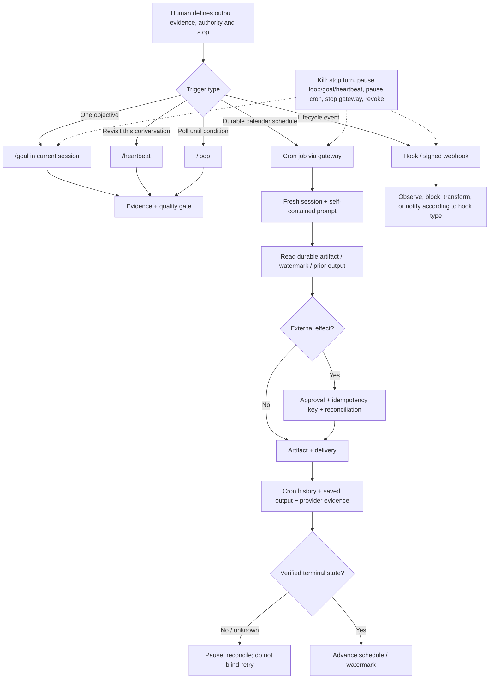

# 10. Goals and Background Operations

**Verified against Hermes Agent v0.20.5 (2026-08-19).**

## Opening scenario

On Sunday evening, the Chen–Patels ask Hermes to automate four routines: a weekday briefing, a weekly review, a deadline watch for Priya's opportunities, and a household reminder. Alex creates several schedules from the same chat and adds “keep trying until it works.” Monday brings two briefings, one reminder three hours late, and a customer-facing draft delivered to the family room. A retry after a network error creates a second calendar hold.

Nothing failed in the dramatic sense. The Mac mini restarted overnight, its time zone had been changed during travel, two similar jobs existed, and a send succeeded before the process crashed without recording completion. Checkpoints protected a local Markdown file, but they could not unsend the duplicate message or remove the remote calendar event. “Automate it” had hidden trigger, state, effect, delivery, and recovery decisions.

Priya rebuilds the system as operations, not magic. A goal drives one bounded session toward evidence. A heartbeat revisits context while that session is alive. A loop polls with explicit stop conditions. Cron owns durable schedules and fresh runs. Hooks observe or guard lifecycle events. Persistent state uses named artifacts and watermarks, not hope that a fresh cron session remembers. Every external effect has a stable key and reconciliation query. Every job has a pause command, a gateway stop, a credential revocation path, and an owner.

The four routines become quieter and more dependable. They produce drafts, reminders, and exceptions; they do not acquire new authority merely because nobody is watching.

## Definitions

**Background operation.** Work that may continue, recur, or fire without a new human message. Background status changes supervision and recovery; it does not raise authority.

**Goal.** A persistent objective attached to one Hermes session. After each turn, an auxiliary judge decides whether work is done, should continue, or should wait. Goals are progress-driven, not clock-driven.

**Completion contract.** Structured goal fields naming outcome, verification, constraints, boundaries, and stop conditions. It makes “done” inspectable.

**Quality gate.** A deterministic shell command that must exit successfully before a goal can complete. A judge still evaluates completion after all gates pass.

**Heartbeat.** One recurring prompt attached to the current session. It fires only when the session is idle and retains that conversation's context. Missed intervals coalesce into one later heartbeat.

**Loop.** A timer-driven or self-paced recurring prompt inside the current session. It can stop on an explicit completion marker, tick count, judge-evaluated condition, operator command, or global backstop.

**Cron job.** A durable, profile-local schedule run by the gateway scheduler in a fresh isolated agent session for each fire. A job definition survives gateway and host restarts.

**No-agent job.** A cron entry that runs an approved script and delivers its standard output without invoking an LLM. Empty output is a silent tick; non-zero exit or timeout raises an error.

**Hook.** Custom code or an HTTP notification attached to a lifecycle event. Gateway hooks observe gateway events; plugin and shell hooks can intercept or transform agent events; outbound webhooks notify external systems.

**Checkpoint.** An opt-in snapshot of working-directory files made before supported mutations. Hermes stores checkpoints in a shadow Git store outside the real repository. Checkpoints do not cover remote services, sent messages, databases, credentials, or every large file.

**Delivery route.** The platform and target receiving a cron result: local output, origin chat, a home channel, an explicit chat/topic, or several targets. Delivery is separate from agent execution.

**Misfire.** A scheduled fire that did not reach execution, commonly because a managed scheduler could not hand off to the gateway. It differs from a run that started and failed.

**Watermark.** Durable evidence of the newest source item already processed, such as an event ID, timestamp plus tie-breaker, or content hash. A watermark supports deduplication but must update only after the intended state transition is known.

**Idempotency key.** A stable identifier for one intended external effect. Retrying the same intent reuses the key; a genuinely new intent uses a new key.

**Reconciliation.** Querying the authoritative external system after an uncertain outcome before deciding whether to retry. “No success response” does not prove “no effect.”

**Kill procedure.** Ordered controls that stop current work, future triggers, outbound delivery, and credentialed access, then preserve evidence and reconcile uncertain effects.

The mechanisms occupy different clocks and state boundaries:



The control plane is layered because one stop command does not cover every mechanism.

## Hermes in practice

### Select the mechanism before writing the prompt

| Need | Use | State and persistence | Missed-time behaviour | Primary stop |
| --- | --- | --- | --- | --- |
| Finish one objective and prove it | `/goal` | Current session; goal/contract survives `/resume` | Resumes when the session is driven; not a calendar scheduler | `/goal pause` or `/goal clear` |
| Recheck something in this conversation | `/heartbeat` | One heartbeat in SessionDB | Busy/offline intervals coalesce; no backlog | `/heartbeat pause` or `/heartbeat clear` |
| Poll until evidence or a cap | `/loop` | Current session, fixed or self-paced cadence | Session mechanism; not a durable standalone schedule | `/loop pause` or `/loop stop` |
| Run unattended on a clock | cron | Job in `~/.hermes/cron/jobs.json`; fresh session per fire | Local ticker picks past-due work on the next tick; managed provider can catch up after grace | `hermes cron pause <job>` |
| React at a lifecycle seam | hook | Configuration plus hook code | Depends on event source; outbound delivery is best-effort | disable config/plugin and restart |
| Undo Hermes file changes | checkpoint | Shadow Git snapshots; opt-in | Not a scheduler | `/rollback` after preview |

Do not use cron when conversational context is essential and cannot be expressed in a self-contained artifact. Do not use a heartbeat for a briefing that must run when no interactive session is open. Do not use a loop as an unlimited substitute for a clear goal. Do not use a hook as a hidden workflow engine.

### Drive bounded work with goals

Set a goal when one task needs several turns:

```text
/goal Draft the Harbourlight weekly operations brief
verify: the brief exists and every total is checked against the supplied synthetic ledger
constraints: no external sends and no customer identifiers
boundaries: only the harbourlight-review workspace
stop when: a source total cannot be reconciled
```

`/goal <text>` begins immediately. `/goal draft <text>` asks the auxiliary judge to propose a contract; review it before relying on it. `/subgoal <text>` adds criteria without replacing the goal. Deterministic checks can be attached with `/goal gate add <command>`. Inspect with `/goal show`, `/goal status`, and `/goal gate`.

The judge runs after each turn. A network or parsing error is fail-open toward continued work, so the turn budget—20 by default—is the real backstop. A false positive can still mark an incomplete goal done; a quality gate constrains only what its command actually tests. Never use the judge as approval for an external effect.

When a background process blocks progress, the judge can park rather than spend turns polling. Manual controls include `/goal wait <pid>` and `/goal unwait`. Pause before changing scope. `/goal resume` resets the turn counter, so it is a deliberate new budget, not a free continuation.

### Use heartbeat for contextual vigilance

A heartbeat is one idle-time recurring instruction in the current session:

```text
/heartbeat every 15m Check the current synthetic import and report only a meaningful state change
```

Intervals have a 60-second minimum. Heartbeats never interrupt a running turn; real user input wins. If the process or session is unavailable for five intervals, Hermes produces one later heartbeat, not five catch-up turns. `/heartbeat resume` re-anchors the timer so it does not fire an immediate stale tick.

This makes heartbeat appropriate while Priya and Hermes are actively reviewing an application export. It is not appropriate for next Monday's deadline notice. Firing requires the session-owning process to run and the session to be driven; cron is the durable schedule.

### Use loops for polling with an exit

A fixed loop checks on an external clock:

```text
/loop 5m Check the synthetic queue depth; stop when it reaches zero --times 12 --until queue depth reaches zero
```

A self-paced loop omits the interval and backs off when replies do not change. Every loop needs a cap, an evidence condition, or both. Hermes also has a default `loops.max_ticks` backstop of 100; reaching it pauses the loop. The agent may end with `LOOP_COMPLETE` on its own line, but do not make a consequential workflow depend only on model-generated termination text.

An active goal owns the session; loop wakeups defer until the goal finishes, pauses, or waits. This prevents two synthetic-turn mechanisms from racing, but it does not make their tools idempotent. Use `/loop status` during operation and `/loop stop` after the observed condition resolves.

### Build cron jobs as fresh, durable workers

Cron is handled by the gateway, which normally ticks every 60 seconds. Each due job receives a fresh agent session, optional skills, the configured cron platform tools, and a self-contained prompt. By default it is detached from any repository and its file/terminal tools inherit whatever directory started the gateway. Set an absolute `--workdir` for artifact-based work; Hermes validates that the directory exists and then loads that directory's project instructions and uses it as the working directory. The run saves output, delivers as configured, and updates run metadata and the next time.

Create and manage jobs through supported interfaces:

```bash
hermes cron create --help
hermes cron list
hermes cron pause <job-id-or-name>
hermes cron resume <job-id-or-name>
hermes cron run <job-id-or-name>
hermes cron edit <job-id-or-name> --schedule "every 4h"
hermes cron remove <job-id-or-name>
hermes cron status
```

`run` from an interactive agent is asynchronous unless the caller cannot receive a detached result; an already-running job is refused rather than double-fired. Names are not unique, so Hermes refuses ambiguous name-based mutation and asks for an ID.

The scheduler's file lock prevents overlapping ticks from claiming the same due batch. Each attempt is written to `~/.hermes/cron/executions.db` as claimed, running, and then completed, failed, or unknown. If the owner process dies, an abandoned attempt becomes `unknown` only after process identity proves the owner is gone. Hermes does not automatically rerun unknown work. Inspect with `hermes cron runs <job-id> --limit 20` before deciding.

Job prompts are scanned at creation/update, and pre-dispatch checks can block a missing provider credential, unready skill, or unknown delivery target without spending model tokens. Keep this fail-closed preflight enabled. Pin model/provider for recurring work so a global model change does not silently change cost or data routing; Hermes's default drift guard blocks affected unpinned jobs and alerts once.

Before copying any agent-backed cron example below, qualify one economical local or everyday-hosted pair with Chapter 6's synthetic tool test, data-route check, cost check, and provider dashboard/endpoint evidence. Record the exact provider and model identifiers in the route card. Then edit this setup block and change `hermes_routine_route_reviewed` to `YES`. The sentinels deliberately fail before any `cron create` command:

```bash
hermes_routine_provider="REPLACE_WITH_QUALIFIED_LOCAL_OR_EVERYDAY_PROVIDER"
hermes_routine_model="REPLACE_WITH_EXACT_QUALIFIED_MODEL_ID"
hermes_routine_route_reviewed="NO"

hermes_require_qualified_cron_route() {
  if [[ -z "${hermes_routine_provider:-}" ||
        "$hermes_routine_provider" == REPLACE_* ||
        -z "${hermes_routine_model:-}" ||
        "$hermes_routine_model" == REPLACE_* ||
        "${hermes_routine_route_reviewed:-NO}" != "YES" ]]; then
    printf '%s\n' "STOP: qualify and record an economical cron provider/model first." >&2
    return 64
  fi
}

hermes_require_qualified_cron_route
```

The guard is repeated with `&&` before every creation command. If a reader skips this block, the missing function stops the command chain; if the block is unchanged, the function returns non-zero. A complex review may receive its own separately benchmarked everyday pair, but only through the same sentinel-and-review pattern. The frontier lane remains an exceptional, owner-approved escalation for complex work under Chapter 6's evidence, data, and budget rules—not a routine briefing, reminder, watch, or weekly-review default.

Not every schedule needs a model. A no-agent job is preferable for a deterministic threshold whose script already produces the exact alert. Hermes runs scripts from its bounded scripts directory, sanitizes inherited environment, delivers non-empty standard output, stays silent on empty output, and alerts on non-zero exit or timeout. A pre-check script on an agent job can instead print `{"wakeAgent": false}` to avoid an unnecessary model call when nothing changed. Keep the mechanical predicate in code and reserve the model for interpretation; this lowers cost and removes a source of invented “changes.”

### Make time explicit

At the pinned release, cron expressions use the Mac mini's local time zone. A five-field expression such as `0 7 * * 1-5` means 7:00 on weekdays according to that host clock. An ISO timestamp without an offset is interpreted by Hermes's documented scheduler behaviour and is easy to misunderstand; for one-time work, confirm `next_run` after creation.

Before travel, daylight-saving transitions, or host replacement, run:

```bash
date
hermes cron list
```

Record the intended IANA zone, such as `America/Toronto`, in the operations card even though the job relies on host local time. After a time-zone change, pause time-sensitive jobs, correct the host, inspect every `next_run`, and resume. Calendar-time jobs and intervals differ: `every 24h` advances from an anchor, while `0 7 * * *` targets local wall-clock time. Use the form matching the promise.

Do not promise exact-to-the-second execution. The local scheduler ticks at roughly minute granularity, jobs take startup time, and concurrent work can delay completion. Schedule data collection before the human deadline and express a delivery service level separately.

### Give cron explicit continuity

Fresh cron sessions have no prior conversation history. Durable `MEMORY.md` and `USER.md` can load like other runs, but job-critical state must not depend on an informal memory entry. Cron execution skips treating previous runs as a conversation.

Use four explicit continuity forms:

1. Put stable instructions, sources, format, authority, and stop conditions in the prompt or attached reviewed skill.
2. Store business state in a named authoritative artifact with schema and owner.
3. Use `context_from` to inject another job's most recent completed output.
4. Use `--continuity` when a job should receive its own previous output for comparison and deduplication.

For example:

```bash
hermes_require_qualified_cron_route &&
  hermes -p career cron create "every 6h" \
  "Check only the public opportunity URLs in /Users/hermes/Workspaces/career/deadline-ledger.md. Report deadlines not present in the prior output, with source URL and observed time." \
  --name "career-deadline-watch" \
  --workdir /Users/hermes/Workspaces/career \
  --provider "$hermes_routine_provider" \
  --model "$hermes_routine_model" \
  --deliver telegram \
  --continuity
```

Continuity supplies the last output, not a transactional database. For a critical deadline ledger, use a durable record keyed by source ID/URL and closing timestamp. Read the ledger, calculate changes, write an atomic proposed update, deliver, and mark the notification state only when delivery outcome is known. If outcome is unknown, reconcile before advancing the watermark.

### Separate execution from delivery

CLI-created jobs default to local output under `~/.hermes/cron/output/`; messaging-created jobs normally default to origin. Explicit targets include `local`, `telegram`, `email`, `sms`, a platform-specific chat, and comma-separated fan-out. `all` resolves configured home channels at fire time and can unexpectedly expand when a new channel is added. Avoid it for classified workflows.

The final response is delivered by cron; the prompt should not ask the agent to call a send tool as well. Doing both creates duplicate effects. For a family briefing, choose one private Telegram topic. For Harbourlight, deliver an internal queue to its private business room. Use `local` during probation.

Cron delivery does not use the ordinary gateway final-response recovery ledger. The cron scheduler sends its result directly through the resolved adapter or standalone platform path, while cron execution history and saved output remain local evidence. If a crash occurs after a provider accepts a message but before Hermes records a terminal run state, the run can become `unknown`; cron supplies neither a replay guarantee nor a duplicate marker. Reconcile `hermes cron runs`, the saved cron output or `last_output`, scheduler logs, and the provider's message ID/history before deciding whether to rerun. Design recipients to recognize job ID, scheduled period, and content/incident key.

Delivery success does not mean factual correctness, and execution success does not mean delivery success. Record both. A media upload can partially fail while text arrives. A WhatsApp Cloud delivery can fail outside its 24-hour free-form window. The job should surface the mismatch on a channel whose availability does not depend on the failed route.

### Handle missed runs without manufacturing history

For the local built-in ticker, a past-due job is seen on the next gateway tick. On managed hosted scheduling, `last_fire_error` records a handoff that never began execution. An optional `misfire_grace_minutes` lets the gateway catch up locally after external retry grace and deduplicates against a late scheduler claim.

Define a policy per workflow:

- **Coalesce:** a missed daily briefing becomes one current briefing, never a backlog of old news.
- **Catch up once:** a weekly review may run late if source windows are recomputed from the ledger.
- **Skip stale:** a reminder for an already-passed departure should not arrive hours later.
- **Escalate:** a deadline watch whose source coverage gap exceeds its service level asks a human to inspect.

Never backdate a report as if it ran on time. Label actual observation time, intended period, gap, and recovery decision.

### Design duplicate-effect safety

Scheduler locks and claims reduce duplicate execution, but they cannot atomically couple Hermes's local ledger with every remote service. A process can create an event, send an email, or update a record and die before saving completion. The next operator sees uncertainty.

Classify effects:

- **Naturally idempotent:** replace a file with identical content, set a status to a specific value.
- **Keyed idempotent:** create through an API that accepts an idempotency key.
- **Reconciliable:** query remote records for a unique intent marker before retry.
- **Non-repeatable:** send a message or trigger a device action with no reliable dedupe. Keep these Amber and human-confirmed.

Use a key such as `family-briefing:2026-08-24:America/Toronto`, never a random key on each retry. Persist intent, parameters, key, attempt, and remote ID. After timeout, query by the same key/marker. Reuse the key only for the same intent. Checkpoints cannot roll back an email, calendar event, SMS charge, light command, refund, or cloud write.

### Use hooks as narrow seams

Hermes has four hook systems. Gateway hooks observe gateway lifecycle events and run in the gateway. Plugin hooks run in-process and may block or transform calls. Shell hooks run subprocesses for agent events and can fail closed on `pre_tool_call`. Outbound webhooks send signed lifecycle payloads to external endpoints on a best-effort queue.

For a first automation, use hooks for audit and guardrails, not hidden business logic. A shell `pre_tool_call` hook that protects an output root can be appropriate if it is reviewed, tested with `hermes hooks test`, and configured `fail_closed: true`. Shell hooks require first-use consent; a non-interactive gateway will not register a new hook without explicit approval/allowlisting. Run:

```bash
hermes hooks list
hermes hooks doctor
hermes hooks test pre_tool_call --for-tool terminal
```

Gateway-hook errors are isolated; outbound webhook delivery retries once for suitable failures and then drops. Receivers must verify HMAC signatures, reject stale timestamps, and deduplicate `delivery_id`. A notification hook is not a durable queue.

### Enable checkpoints before local mutation, and know the limit

Checkpoints are off by default. Enable them for a file-mutating session with:

```bash
hermes chat --checkpoints
```

or `checkpoints.enabled: true` in the profile config. Hermes snapshots supported file-tool and destructive-terminal mutations at most once per directory per turn into a shared shadow store. Preview and restore with:

```text
/rollback
/rollback diff 1
/rollback 1
```

The ordinary restore preserves later human edits when the agent-write ledger can identify them; `--all` can overwrite them and requires exceptional care. A restore also undoes the last chat turn so conversation and filesystem align.

Checkpoint errors are non-fatal and tools continue. Large files, enormous or overly broad directories, missing Git, and remote effects may be excluded. Therefore a checkpoint is a useful local safety net, not a transaction or backup. Use Git branches/worktrees, application backups, remote audit trails, and effect reconciliation as separate controls.

Inspect checkpoint storage as an operational resource. `hermes checkpoints status` shows total size and per-project history; `hermes checkpoints prune` performs an explicit sweep. Automatic retention can remove old history, and the shared store has configured snapshot and size caps. Before relying on rollback during a high-risk change, create a synthetic mutation, list the snapshot, preview its diff, restore it, and verify a later human edit remains intact. A feature that is enabled but never rehearsed is not a recovery plan.

### Install four quiet automation blueprints

Run each blueprint manually with synthetic sources, then create it with `--deliver local`. After seven correct runs and a delivery drill, change only the route. Keep the qualified variables and guard from the setup block in the same shell. Each command selects its Hermes profile with the documented global `-p` flag. The example directories below belong to the dedicated `hermes` macOS account; create and inspect each absolute directory before running a command. `--workdir` makes file tools deterministic and loads only that workspace's project instructions. If profiles use separate OS accounts, execute each command as that account and use its own inaccessible workspace.

**Weekday daily briefing.** Coalesce after downtime and produce only internal summaries:

```bash
hermes_require_qualified_cron_route &&
  hermes -p family cron create "0 7 * * 1-5" \
  "Prepare today's family briefing only from /Users/hermes/Workspaces/family-ops/briefing-input.md and /Users/hermes/Workspaces/family-ops/school-bulletins/. State source timestamps and missing inputs. Do not read career or Harbourlight paths; do not send, book, purchase, or alter source records." \
  --name "family-weekday-briefing" \
  --workdir /Users/hermes/Workspaces/family-ops \
  --provider "$hermes_routine_provider" \
  --model "$hermes_routine_model" \
  --deliver local
```

**Weekly review.** Run three separate reviews so no job crosses family, career, and business profiles. Staggering them also makes failures attributable:

```bash
hermes_require_qualified_cron_route &&
  hermes -p family cron create "0 18 * * 0" \
  "Review only /Users/hermes/Workspaces/family-ops/weekly-input.md for the seven-day period ending today. Separate completed, carried, blocked, and adult decisions; do not contact anyone." \
  --name "family-weekly-review" \
  --workdir /Users/hermes/Workspaces/family-ops \
  --provider "$hermes_routine_provider" \
  --model "$hermes_routine_model" \
  --deliver local

hermes_require_qualified_cron_route &&
  hermes -p career cron create "15 18 * * 0" \
  "Review only /Users/hermes/Workspaces/career/weekly-input.md. Separate evidence gathered, drafts, deadlines, blockers, and Priya's decisions; never submit or contact an employer." \
  --name "career-weekly-review" \
  --workdir /Users/hermes/Workspaces/career \
  --provider "$hermes_routine_provider" \
  --model "$hermes_routine_model" \
  --deliver local

hermes_require_qualified_cron_route &&
  hermes -p harbourlight cron create "30 18 * * 0" \
  "Review only /Users/hermes/Workspaces/harbourlight/weekly-input-redacted.md. Separate completed, carried, blocked, and owner decisions; never contact customers, change accounts, or commit funds." \
  --name "harbourlight-weekly-review" \
  --workdir /Users/hermes/Workspaces/harbourlight \
  --provider "$hermes_routine_provider" \
  --model "$hermes_routine_model" \
  --deliver local
```

A combined owner view is optional and is not created by these jobs. A human-approved handoff may copy only explicitly redacted/declassified outputs into `/Users/hermes/Workspaces/owner-handoff/`; a separate owner-profile job may summarize only that directory. Do not point one profile at another profile's workspace or use cross-domain `context_from` as a shortcut around declassification approval.

**Deadline watch.** Use continuity plus an authoritative ledger; alert only on new or changed verified deadlines:

```bash
hermes_require_qualified_cron_route &&
  hermes -p career cron create "every 6h" \
  "Check only the public opportunity URLs in /Users/hermes/Workspaces/career/deadline-ledger.md. Verify each closing date at its source. Report new, changed, or unreachable entries with observed time; otherwise return [SILENT]. Never submit or contact an employer." \
  --name "career-deadline-watch" \
  --workdir /Users/hermes/Workspaces/career \
  --provider "$hermes_routine_provider" \
  --model "$hermes_routine_model" \
  --deliver local \
  --continuity
```

**Household reminder.** Use a wall-clock expression for a recurring weekly preparation reminder; the result is a reminder, not an action:

```bash
hermes_require_qualified_cron_route &&
  hermes -p family cron create "0 19 * * 4" \
  "Remind the family to review Friday school bags and forms. List only items in /Users/hermes/Workspaces/family-ops/school-checklist.md and state its update time. If missing or stale, ask an adult to inspect it; do not infer children's requirements." \
  --name "thursday-school-check" \
  --workdir /Users/hermes/Workspaces/family-ops \
  --provider "$hermes_routine_provider" \
  --model "$hermes_routine_model" \
  --deliver local
```

After creation, inspect `next_run`, `workdir`, provider, and model in `hermes cron list`; confirm the cron platform toolsets in `hermes tools`; run each job manually; and inspect execution plus output. Promotion changes delivery to a private explicit route; it does not add effect authority.

## Professional example

Harbourlight's weekly review reads a redacted support-theme artifact, public service health, and an owner-maintained decision log. It writes a local draft. A source watermark records the newest ticket export included. The job never replies to customers, issues refunds, changes subscriptions, or updates accounting records.

A deadline-like vendor renewal alert uses a stable vendor/date key. If the source is unreachable, Hermes reports a coverage gap rather than assuming no deadline. If delivery is ambiguous, the owner checks the private room and local output before rerunning. Any external vendor message remains Amber; contract acceptance and money movement remain Red.

## Personal example

Priya's opportunity watch uses public URLs and the career profile. It may update an internal proposed ledger and alert her to a verified closing-date change. It cannot submit, fabricate qualifications, or contact a recruiter. The weekly family review contains no raw Harbourlight customer content.

The Thursday household reminder reads a shared checklist and sends one concise message after probation. It does not monitor family members, infer compliance, or repeatedly nag. If the checklist is stale, it requests an adult review. A missed 7 p.m. reminder after midnight is skipped as stale and recorded, not replayed during sleep.

## Authority boundaries

| Boundary | Background-operation authority |
| --- | --- |
| **Green — may act** | Run approved read-only checks; produce internal drafts; update bounded local artifacts atomically; record watermarks and execution evidence; deliver low-sensitivity reminders to one approved private target; pause work when policy says to fail closed. |
| **Amber — may prepare** | Draft cron definitions, hook changes, new delivery routes, external messages, calendar edits, purchases, bookings, customer replies, device actions, or retries after uncertainty. A human approves the exact effect, target, cost, key, and recovery path. |
| **Red — may not act** | Move money; file taxes; accept legal terms; diagnose or choose treatment; submit applications; create surveillance; unlock/secure physical access; blindly replay unknown work; disable signature/approval controls; or expand tools/identities because a job is unattended. |

A background job receives no broader authority than the same request in foreground. In fact, missing a supervising human normally justifies a narrower toolset and fail-closed behaviour.

## Failure modes and recovery

**Job does not fire.** Check `hermes cron list`, schedule, `next_run`, host `date`, `hermes gateway status`, and logs. Inspect `last_fire_error` for managed handoff failure. Fix the gateway through its supervisor; do not create a duplicate job.

**Wrong time.** Pause the job, capture host zone and expected zone, correct the host, inspect next runs and daylight-saving boundaries, run a synthetic test, then resume. Label any late report with actual observation time.

**Repeated failure.** Hermes tracks an agent failure streak and can nudge after the configured threshold. Pause, inspect recent runs, validate model/skill/delivery configuration, reduce the workflow, and manually prove it. Do not let automated retries consume unlimited tokens.

**Unknown run.** A process died after claim. Preserve the execution ledger and local output, query every remote system by intent key/marker, classify each effect as present/absent/uncertain, and only then retry. Never convert “unknown” to “failed” by assumption.

**Duplicate effect.** Stop the job and downstream automation, identify the two remote IDs and one intended key, keep the authoritative result, reverse only through the service's approved human procedure, and repair the watermark. Add an idempotency or reconciliation test before reopening.

**Wrong delivery.** Pause the job and proactive routes, preserve cron execution history, saved output, scheduler logs, and provider message evidence, assess disclosure, correct or delete through policy, choose an explicit target, and test with synthetic content. Avoid `all` and ambiguous origin routes.

**Runaway goal or loop.** Send `/stop` for the active turn, then `/goal pause` or `/loop stop`. Inspect background processes and external effects. Tighten the completion contract, tick budget, quality gate, or wait condition before resuming.

**Hook failure.** For an observer, record the monitoring gap. For a fail-closed security hook, keep protected work blocked, run `hermes hooks doctor` and a synthetic test, repair or disable only with owner approval, and restart. Never switch a security gate to fail-open solely to meet a deadline.

**Checkpoint disappointment.** A remote action or excluded file cannot be rolled back. Stop further effects, reconcile/restore through the authoritative system, and use `/rollback diff` only for covered local files. Take a pre-restore snapshot and preserve human edits.

### Kill procedure

Use the narrowest control that works, escalating when state is uncertain:

1. Stop the active turn with `/stop`; capture the last tool/effect and timestamp.
2. Pause `/goal`, `/heartbeat`, or `/loop` state; do not merely close the client.
3. Pause the named cron job, then list jobs to catch duplicates.
4. Stop the gateway with `hermes gateway stop` when inbound or delivery must cease.
5. Terminate documented background processes and disable implicated hooks/plugins.
6. Revoke the specific provider credential or channel session if the boundary may be compromised.
7. Preserve cron execution history, saved output, scheduler, hook, and provider logs; mark unknown effects.
8. Reconcile external systems, restore covered local files, repair watermarks, and run synthetic allow/deny tests.
9. Resume one layer at a time under owner approval.

Pulling power on the Mac mini is a last resort: it may increase ambiguity for an in-flight remote effect. Use the control plane first when available.

## Field kit

### Background-operation contract

```text
IDENTITY
Job name / ID / owner:
Profile and macOS user:
Purpose / recipient / data class:

TRIGGER
Mechanism: goal / heartbeat / loop / cron / hook
Schedule / interval / event:
Host IANA time zone:
Expected next fire and service-level deadline:
Missed-run policy: coalesce / catch up once / skip / escalate

STATE
Self-contained prompt or reviewed skill:
Authoritative input artifacts:
Watermark schema and update rule:
context_from / continuity use:
Retention and backup:

EFFECT
Green outputs:
Amber preview/approver:
Red prohibitions:
Idempotency key format:
Remote reconciliation query:
Commit point:

DELIVERY
Explicit target:
Fallback and acknowledgement:
Deduplication key/marker:
Cost ceiling:

RECOVERY
Execution history command:
Delivery/provider evidence:
Active-turn stop:
Mechanism pause:
Gateway stop:
Credential revocation:
Checkpoint scope and non-covered effects:
Re-entry tests and approver:
```

## Exercise

Design the four Chen–Patel workflow families from this chapter for `America/Toronto`. Split any family, career, and Harbourlight work into separate jobs with absolute workspaces. For each, specify mechanism, schedule, self-contained inputs, toolsets, a guarded exact local/everyday provider-model pair, state/watermark, delivery, missed-run rule, idempotency key, Green/Amber/Red boundary, kill procedure, and proof of success. Then analyze this incident: the gateway restarts while the deadline watch is sending an alert; the run becomes `unknown`, the alert appears once, and the job's watermark did not advance. Decide whether to run it again.

## Answer or rubric

The daily briefing, weekly review, deadline watch, and household reminder are cron workflow families because they need durable schedules. Family, career, and Harbourlight reviews become separate jobs with separate absolute workdirs, credentials, and output paths. A combined owner summary can read only human-approved redacted/declassified exports in a narrow handoff workspace. Use explicit private delivery only after local probation. The briefing coalesces, each weekly review catches up once with a labeled period, the deadline watch escalates a coverage gap and uses source IDs plus continuity, and a stale household reminder skips. Every job names sources, time zone, observation timestamp, authority, and missing-input behaviour; its qualified economical provider/model variables pass the sentinel guard before creation. Frontier routing remains a separately approved exception, not a default.

For the incident, `unknown` plus one visible alert is evidence that delivery may have succeeded. Do not blind-run or infer that cron will replay the result. Inspect `hermes cron runs`, saved output or `last_output`, scheduler logs, the provider's message ID/history, and the source ledger. The ordinary gateway final-response ledger is outside the cron delivery path. If the intended alert with the same period/key exists, repair the watermark through the approved state procedure without sending again. If provider evidence proves absence, rerun with the same intent key. If uncertainty remains, ask the owner and label it. Award two points each for mechanism choice, time semantics, explicit state, missed-run policy, duplicate safety, authority, layered kill procedure, and evidence-based incident handling. Thirteen of sixteen indicates mastery.

## Mastery checklist

- [ ] I can choose among goals, heartbeats, loops, cron, and hooks.
- [ ] I know cron runs fresh sessions and job-critical context must be explicit.
- [ ] I can explain continuity, `context_from`, artifacts, and watermarks.
- [ ] I verify the host time zone and `next_run` rather than assuming wall-clock behaviour.
- [ ] I distinguish a missed fire, failed run, unknown run, and failed delivery.
- [ ] I treat cron delivery as potentially ambiguous and use provider evidence, deduplication, and reconciliation.
- [ ] I know checkpoints cover selected local file mutations, not remote effects.
- [ ] I can stop the active turn, recurring mechanism, gateway, and credential route separately.
- [ ] I can deploy the briefing, review, deadline-watch, and household-reminder blueprints through local probation.
- [ ] I never let unattended execution expand Green/Amber/Red authority.

## References

- Nous Research, [Persistent goals](https://github.com/NousResearch/hermes-agent/blob/v2026.8.19/website/docs/user-guide/features/goals.md).
- Nous Research, [Scheduled tasks](https://github.com/NousResearch/hermes-agent/blob/v2026.8.19/website/docs/user-guide/features/cron.md).
- Nous Research, [Cron internals](https://github.com/NousResearch/hermes-agent/blob/v2026.8.19/website/docs/developer-guide/cron-internals.md).
- Nous Research, [Cron troubleshooting](https://github.com/NousResearch/hermes-agent/blob/v2026.8.19/website/docs/guides/cron-troubleshooting.md).
- Nous Research, [Session heartbeats](https://github.com/NousResearch/hermes-agent/blob/v2026.8.19/website/docs/user-guide/features/heartbeat.md).
- Nous Research, [Recurring loops](https://github.com/NousResearch/hermes-agent/blob/v2026.8.19/website/docs/user-guide/features/loops.md).
- Nous Research, [Event hooks](https://github.com/NousResearch/hermes-agent/blob/v2026.8.19/website/docs/user-guide/features/hooks.md).
- Nous Research, [Checkpoints and rollback](https://github.com/NousResearch/hermes-agent/blob/v2026.8.19/website/docs/user-guide/checkpoints-and-rollback.md).
- Nous Research, [Automation blueprints](https://github.com/NousResearch/hermes-agent/blob/v2026.8.19/website/docs/guides/automation-blueprints.md).
- Nous Research, [Daily briefing bot](https://github.com/NousResearch/hermes-agent/blob/v2026.8.19/website/docs/guides/daily-briefing-bot.md).
- Nous Research, [Profiles and the global `-p` selector](https://github.com/NousResearch/hermes-agent/blob/v2026.8.19/website/docs/user-guide/profiles.md).
- Nous Research, [Provider reference](https://github.com/NousResearch/hermes-agent/blob/v2026.8.19/website/docs/integrations/providers.md).
- Nous Research, [Messaging delivery reliability](https://github.com/NousResearch/hermes-agent/blob/v2026.8.19/website/docs/user-guide/messaging/index.md).
- OpenAI, [`gpt-5.6-sol` model reference](https://developers.openai.com/api/docs/models/gpt-5.6-sol) (accessed 2026-08-21).
