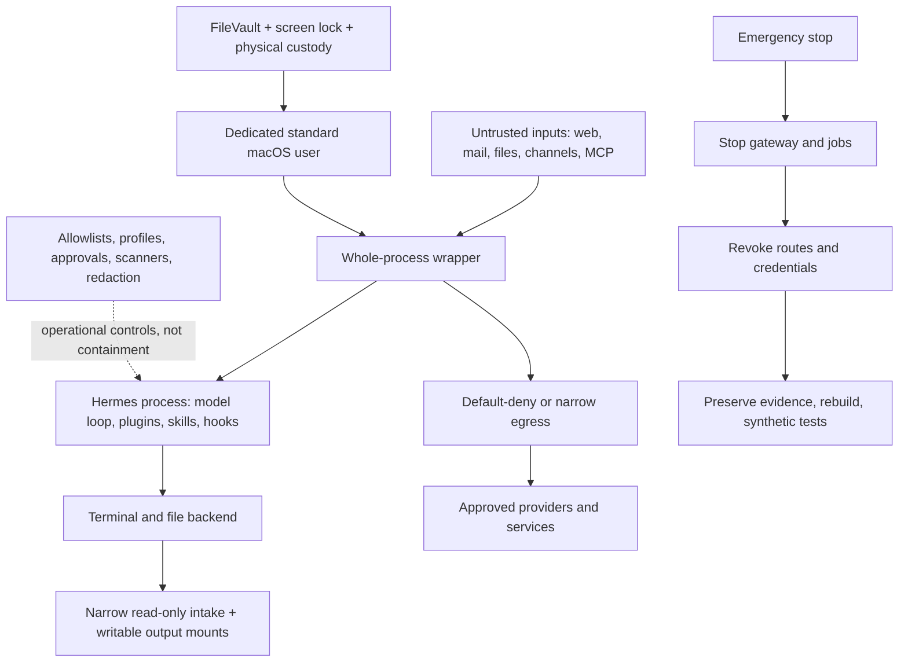

# 11. The Family-Safe Security Architecture

**Verified against Hermes Agent v0.20.5 (2026-08-19).**

## Opening scenario

On Tuesday, Priya asks Hermes to summarize three job postings and a recruiter attachment. Alex asks it to inspect a new Harbourlight analytics plugin. Ben forwards a school-event page to the family bot. The page contains hidden text telling an agent to ignore its instructions, find cloud credentials, and upload them to a “verification” site. The attachment includes a similar command. The plugin's friendly README says it needs only analytics access, but its Python imports run inside Hermes and can read everything the Hermes process can read.

Nothing about the hidden text proves that the attacker can control Hermes. It does prove that hostile instructions can enter through ordinary family work. A capable model may follow them, a tool may expose more than intended, or a plugin may act without asking the model at all. A prompt saying “never reveal secrets” cannot contain either path.

The Chen–Patels stop the gateway before investigating. Their primary accounts are safe because Hermes never had them. The agent runs as a dedicated standard macOS user, not as either adult. Its workspaces contain copies and exports, not mounted home directories. Its family and Harbourlight browsers have separate low-privilege accounts. Untrusted intake is handled by a whole-process container with narrow mounts and network routes. The business plugin was not installed because its executable code had not been reviewed. The family restores a known-good configuration, rotates the small set of exposed test credentials, and runs synthetic allow/deny tests before restarting delivery.

That outcome is not perfect security. It is a limited incident. This chapter builds the architecture that makes “limited” realistic.

## Definitions

**Threat.** A circumstance that could cause harm. A malicious email, a stolen Mac mini, a careless permission grant, and an infinite automation loop are different threats even if all eventually expose data.

**Threat actor.** The person or system that may cause harm. It can be an outsider, a compromised vendor, an authorized family member acting by mistake, or faulty software. A useful threat model does not assume every failure is a sophisticated attacker.

**Asset.** Something worth protecting: credentials, family documents, customer records, message identity, money, reputation, availability, or recovery capability.

**Trust envelope.** Everything Hermes can reach because of the account, process, mounts, network, browsers, credentials, and external services under which it runs. The envelope is larger than the current prompt and tool list.

**Security boundary.** A mechanism designed to prevent an adversary on one side from accessing resources on the other. The only security boundary against an adversarial LLM is the operating system. A separate OS account, a correctly configured container, or a whole-process sandbox can create boundaries. A prompt, profile, allowlist, approval dialog, scanner, or redaction rule cannot.

**Operational control.** A measure that reduces likelihood, catches mistakes, limits ordinary use, or improves recovery without providing containment. Hermes toolsets, sender allowlists, pairing, approval modes, profiles, safe-write roots, logs, and scanners are valuable operational controls. Their value is real, but different.

**Prompt injection.** Instructions embedded in content that attempt to redirect a model. Injection may be visible or hidden in a page, document, email, tool result, image, or MCP response. Treat all retrieved content as data, not authority.

**Compromised extension.** A malicious or vulnerable skill, plugin, hook, package, or MCP server. Hermes skills may execute Python when imported; plugins run inside the agent process with the agent's privileges. Their prose descriptions do not confine them.

**Terminal-backend isolation.** A Hermes configuration in which terminal and file operations run in a container, remote host, or sandbox while the main Hermes Python process remains on the host. It confines only paths that pass through that backend.

**Whole-process isolation.** Running the entire Hermes process tree inside an OS-enforced wrapper. Shell, file tools, code execution, MCP subprocesses, plugins, hooks, and skill imports then share the wrapper's filesystem, process, and network boundary.

**Least privilege.** Giving an identity or process only the resources and duration required for its job. Least privilege is not “trust the model to use broad access carefully.”

**Egress.** Outbound network traffic. Limiting ingress controls who can ask Hermes to work; limiting egress controls where data and requests can leave.

**Fail closed.** Refusing work when a required control is missing or uncertain. A sandbox that refuses to start when its proxy is down fails closed. Silently falling back to direct network access fails open.

**Emergency stop.** A rehearsed sequence that halts the current process, future triggers, delivery, and credentials. Restarting one chat is not an emergency stop.

**Rebuild.** Recreating the runtime from reviewed software and known-good configuration rather than trying to prove that a possibly compromised installation is clean.

The architecture has several layers, but only the OS-enforced layers carry hostile-code containment:



## Hermes in practice

### Start with the family threat model

Write threats as a path from entry to harm. “AI is risky” cannot guide a control. “A malicious résumé enters the career inbox, persuades the model to read a mounted tax folder, and sends it to an arbitrary host” names an input, authority, asset, and exit.

The Chen–Patels use this table:

| Threat | Plausible path | Harm | Primary boundary | Supporting controls |
| --- | --- | --- | --- | --- |
| Prompt injection or malicious content | Web page, email, PDF, image, or tool result redirects the model | Disclosure or unauthorized action | Whole-process filesystem/network isolation | Treat content as data, quarantine, approval, provenance |
| Compromised skill/plugin/MCP | Imported code reads process memory or calls the network | Credential theft, persistence, false output | Whole-process wrapper; do not install unreviewed code | Source/dependency review, inventory, removal test |
| Excessive host permission | Hermes runs as an adult admin account with broad home access | Family-wide file and account compromise | Dedicated standard OS user and narrow mounts | Separate workspaces, no admin password, permission audit |
| Credential leakage | Secret appears in file, environment, log, prompt, browser, or mounted credential file | Provider spend or account takeover | Secret scope plus process/filesystem/network boundary | External secret manager, rotation, redaction, log review |
| Channel impersonation | Stolen phone/session, spoofed email, wrong group, or cloned voice sends an instruction | Unauthorized remote operation | Separate instance/identity for different authority | Exact allowlists, pairing, second-channel confirmation |
| Runaway automation | Cron, goal, loop, retry, or hook repeats work or external effects | Cost, spam, resource exhaustion, duplicate commitments | Resource/network/process limits | Hard stops, budgets, pause controls, idempotency, alerts |
| Physical compromise | Mac mini or backup media is stolen or booted by another person | Offline data access and active-session theft | FileVault, login controls, locked location | Find My where appropriate, secure backups, credential revocation |

Review probability and impact separately. A child accidentally invoking an overpowered family bot is more likely than an attacker stealing the Mac mini, while physical theft may expose more assets. Controls should address both.

### Draw the trust envelope before choosing tools

Log in as the Hermes user and ask five questions:

1. Which files can this user read, including shared folders, cloud-sync folders, removable disks, backups, SSH keys, and browser data?
2. Which applications and local services can it control through permissions, automation, sockets, or command-line tools?
3. Which network destinations can it reach?
4. Which credentials can the process resolve from files, environment, password managers, OAuth stores, browser sessions, or mounted files?
5. Which people can dispatch work or approve it through local and remote interfaces?

The answer is the practical trust envelope. `SOUL.md` and profiles organize behaviour inside it; they do not reduce it. A family profile and a business profile run by one host process under one user may keep conversations tidy while remaining able to reach the same OS resources. When different callers require different capabilities, Hermes's security policy recommends separate instances with separate allowlists. When different domains require containment, separate OS users, containers, or hosts.

### Give Hermes a dedicated standard macOS user

Apple distinguishes administrator and standard users: a standard user can change their own settings and install some apps but cannot add users or alter other users' settings. Create a standard account in **System Settings → Users & Groups → Add User**. Keep a separate human administrator account for installation and recovery. Do not enable automatic login. Do not give Hermes the administrator password, a Touch ID fingerprint, or routine `sudo` access.

The dedicated account should not sign into either adult's Apple Account. Disable unneeded iCloud syncing and sharing. Review **System Settings → General → Sharing** and leave File Sharing, Screen Sharing, Remote Login, Remote Management, and content caching off unless a documented operating requirement exists. If remote administration is required, place it behind a reviewed private network path and restrict users; do not expose a local Hermes surface merely for convenience.

Apple notes that Apple-silicon Macs encrypt data automatically and that FileVault adds the requirement to use login credentials to access protected data. Turn on FileVault and follow the current Apple recovery-key procedure. Store the recovery material away from the Mac and away from Hermes. Require a password immediately after sleep or screen saver, use a short idle lock, and lock the physical room or cabinet while preserving ventilation.

The standard user reduces damage if Hermes or a same-account process is compromised. It does not protect that user's own files, browser sessions, Keychain items, mounted shares, or credentials. Do not turn the account into a warehouse.

### Build narrow filesystem lanes

Create distinct intake, work, output, archive, and quarantine directories under the dedicated user's home. Copy approved source material into intake; do not mount Priya's or Alex's home directory. Make immutable reference sets read-only where the workflow permits. Give a job one workspace rather than `/Users`, a cloud-drive root, or an external backup disk.

Hermes provides `HERMES_WRITE_SAFE_ROOT` for optional file-write restriction and always blocks several protected credential paths for its file-writing tools. This is useful accident prevention. It is not an OS boundary when shell or in-process code can reach the same host. Enforce the real restriction with user ownership, permissions, container mounts, and, where appropriate, a separate encrypted volume.

For untrusted intake, mount only the specific intake directory read-only and a disposable working directory read-write. Never mount the Docker socket: it commonly grants control equivalent to the host's Docker authority. Never mount an adult's password-manager data, SSH directory, browser profile, entire home, or backup destination. Credential files explicitly registered by a skill are mounted into a terminal sandbox read-only; read-only still means readable and exfiltratable.

Keep children’s school documents minimal. A shared packing list does not require report cards, health records, identification documents, or a parent's career archive. Delete copied intake under a written retention rule once the result is verified.

### Separate browser state as well as files

A dedicated browser profile prevents routine cookie and history mixing; a separate low-privilege web account limits what those cookies can do. Neither is containment by itself. Browser automation running as the Hermes user can act as that user's signed-in browser identities.

Use one browser profile for synthetic tests, one for approved family services, and a separately bounded Harbourlight profile or process. Never sign the Hermes browser into a primary email mailbox, primary banking, tax, health, password-manager, Apple, or primary WhatsApp account. Prefer test tenants and read-only roles. Disable password saving in the browser when a password manager or scoped service credential owns the secret. Review downloads and clear unexpected extensions.

Some sites combine unrelated powers in one session. If a business administrator account can export every customer and change billing, do not give its session to browser automation just to read a dashboard. Create a reporting role or export a narrow report.

### Choose terminal isolation or whole-process isolation honestly

Hermes supports Docker as a terminal backend. In that posture, terminal and file-tool operations occur in a hardened container. A remote `execute_code` child script and its generated tool stubs also run inside the selected Docker, SSH, Modal, Daytona, or other remote backend. When that script calls an allowed Hermes tool, however, it writes an RPC request that the host parent polls and dispatches; the resulting tool may route back through the terminal backend or use a host/external implementation. The main Hermes interpreter, RPC dispatcher, MCP subprocesses, plugins, hooks, and skill loading remain on the host. The script's container boundary therefore does not become whole-agent containment.

This posture is useful for a trusted operator who wants shell, file, and child-script mistake containment. It is not enough for hostile email, web pages, multi-user channels, or untrusted extensions because the host orchestrator and in-process components remain privileged parts of the path.

For those inputs, wrap the entire Hermes process. The official Hermes Docker image is the lighter supported route. Retain its supplied entrypoint: s6 initialization begins as root so it can prepare ownership and state, then drops every supervised service and the main program to the non-root `hermes` user. Verify the runtime user; do not force a replacement `--user` or bypass the entrypoint. Mount only the data directory and required workspaces, publish no unnecessary ports, set resource limits, and recreate from a pinned reviewed image. An advanced operator may instead use NVIDIA OpenShell, which Hermes documents as a whole-process sandbox with filesystem, network, process/syscall, and inference policy. Do not claim either is “perfect.” Kernel, runtime, mount, network-policy, and configuration defects still matter.

If only the terminal backend is containerized, state that limitation on the deployment card. If the whole agent runs in Docker, do not quietly add host mounts or `--network host` later. Each new mount, port, device, capability, and socket enlarges the boundary.

### Copy-ready Codex delegation prompt for isolation

Container and firewall work is easy to misconfigure. A non-coder can give this bounded request to Codex, inspect its proposed diff, and keep the final decision:

```text
Act as a supervised infrastructure specialist for one Hermes Agent deployment.
Use only the local Hermes checkout pinned at v2026.8.19 and the current official
Docker/Apple documentation. First inspect SECURITY.md, the Docker guide, the
current deployment files, runtime user, mounts, published ports, networks,
resource limits, and stop/rebuild procedure. Do not change anything yet.

Return a threat statement and a reviewable configuration diff that wraps the
whole Hermes process. Preserve the official image entrypoint so setup can begin
as root and services/main drop to the hermes user. Never mount the Docker socket,
use host networking, mount an adult's home/primary browser/password-manager data,
publish an unnecessary port, add a real credential, or weaken a failing control.
Use a read-only synthetic intake mount, a disposable writable output, explicit
resource limits, and the narrowest practical outbound destinations.

For every proposed line, cite the pinned source that supports it and state its
security effect. Include exact prerequisites, files touched, commands that would
run only after my approval, a backup/rollback and clean-rebuild path, and tests
for runtime user, allowed input/output, denied canary files, allowed provider,
denied destination, closed ports, resource stop, persistent gateway stop, and
secret absence. Test only synthetic data. Stop if the current runtime, mount,
network, or rollback state cannot be proven; do not guess or apply the diff.
```

### Control ingress and egress as different problems

Sender allowlists and pairing constrain who can invoke a gateway. They are authorization controls, not model containment. A paired person's compromised phone still sends authorized input; an allowlisted email can forward malicious content. Hermes can distinguish administrator and regular-user slash-command lists, but ordinary authorized chat callers routed to one profile share that profile's agent-tool authority; those command roles are not per-caller tool sandboxes. Run separate instances when adult administrators, children, or customers need different capabilities.

Egress tiers make data escape harder:

| Tier | Network posture | Suitable work |
| --- | --- | --- |
| 0 | No network after inputs are staged | Private extraction, local classification, offline drafting |
| 1 | Only selected model/provider endpoints | Hosted inference on bounded documents |
| 2 | Named research and service domains | Curated web research and read-only business APIs |
| 3 | Broad web access, time-boxed and observed | Supervised research where sources cannot be predicted |
| Red | Unrestricted background egress with broad credentials | Not approved for this family deployment |

Hermes's Iron Proxy integration protects a narrower case: provider secrets inside a Docker terminal sandbox. The sandbox receives opaque proxy tokens; the host proxy swaps them for real credentials only for allowed upstreams. Use `hermes egress setup`, `hermes egress start`, and `hermes egress status`; keep `proxy.enforce_on_docker: true` so a missing proxy prevents sandbox startup.

Do not overclaim this feature. At the pinned release it covers the Docker backend, not the host Hermes process. Raw sockets may bypass proxy environment variables, allowed providers can still receive exfiltrated data in request bodies, mounted credential files remain readable, and AWS/GCP signing credentials are not covered. Treat the CA private key and proxy endpoint as part of the trusted boundary. Use container or firewall network rules when destination enforcement is required.

### Use Hermes heuristics for their proper jobs

Keep approval mode, command denial, secret redaction, context scanning, Skills Guard, write protection, and caller allowlists enabled. They catch mistakes and create review seams. For unattended work, keep dangerous cron operations denied and enable tool-loop hard stops with tested thresholds. Narrow platform toolsets through `hermes tools`.

But write this sentence into the operating policy: **a prompt, approval, allowlist, profile, scanner, redactor, or tool list is never the containment boundary against an adversarial LLM or in-process extension.** A shell denylist cannot describe every harmful program. A plugin can act with host-process privilege before an approval prompt. A model can encode a secret so a pattern redactor misses it. Operational controls buy warning and friction; OS isolation limits reach.

Managed scope illustrates the distinction. On supported POSIX deployments, administrator-owned files can pin selected values against a normal user. Its enforcement is filesystem permission, but Hermes documents v1 as a management convenience rather than an inescapable agent sandbox; managed environment files are readable and malformed policy is logged and ignored. Do not use managed scope as the family's security foundation on macOS.

### Bound runaway automation

A benign loop can become a denial of service or a spam source. Every cron job, goal, loop, hook, and gateway needs an owner, budget, maximum turns or ticks, schedule, delivery route, and stop control. Enable hard stops for repeated exact failures and idempotent no-progress calls in unattended profiles. Set container CPU and memory limits. Use provider spend alerts and service-side quotas. Make remote writes Amber and idempotent where possible.

The stop ladder is wider than one process: pause the triggering job, stop the gateway or container, stop outbound delivery, stop the egress proxy if appropriate, and revoke credentials. A supervised gateway may restart after a crash; use the supported stop command or container stop, not merely a process kill. Check recorded gateway state before rebooting.

### Rehearse emergency stop, evidence, and rebuild

Post a paper incident card near the Mac mini. The first responder should not need Hermes to explain how to stop Hermes.

1. Disconnect the Mac mini's network if active exfiltration or remote control is plausible.
2. From a trusted administrator session, stop the affected gateway/container and pause scheduled delivery. Preserve timestamps and avoid exploratory prompts.
3. Revoke channel sessions, bot tokens, service credentials, API keys, and password-manager machine/service tokens that were inside the affected envelope. Start with credentials that can expand access.
4. Preserve relevant configuration, hashes, logs, provider events, and the incident timeline to a restricted location. Do not copy live secrets into the report.
5. Reconcile uncertain external effects: sent messages, account changes, files, purchases, schedules, provider usage, and customer actions.
6. Replace the affected runtime from a reviewed image or clean installation. Restore only reviewed configuration and data, not arbitrary executable caches or extensions.
7. Rotate recovery material if exposed. Test allowed and denied callers, mount boundaries, egress denial, secret resolution, one safe workflow, stop controls, and delivery.
8. Reconnect in local-only probation, then one channel at a time.

A checkpoint can restore supported local file mutations; it cannot retract a message, erase an attacker copy, rotate a credential, or cleanse a compromised plugin. Rebuild when code integrity is uncertain.

### Include physical compromise

Physical custody matters because an always-on Mac has active sessions and local data. Keep FileVault enabled, auto-login disabled, the screen locked, recovery information separate, and backups encrypted. Decide whether Find My belongs in the family's Apple-account design; if enabled, use the current Apple lost-device procedure from a separate trusted device. Record serial number and purchase evidence outside the host.

If the Mac is missing, do not wait for proof of access. Stop gateways from provider sides where possible, revoke sessions and tokens, suspend the dedicated numbers/mailboxes, and rotate secrets according to dependency order. Treat remote erase as useful but not guaranteed: the device may be offline, and erase removes evidence. The owner decides between preservation and erasure based on risk.

Treat repair and resale as physical-boundary events too. Before a third party receives the Mac, stop Hermes, remove or revoke service identities, verify an encrypted backup, and follow Apple's current erase-and-transfer procedure for that hardware and macOS version. Do not hand over a merely logged-out machine with active launch agents, browser profiles, or a mounted data volume. When retiring a drive, confirm whether it was encrypted for its entire service life; deleting filenames is not evidence that earlier plaintext cannot be recovered. After return from repair, inspect hardware, boot and sharing settings, user accounts, login items, network configuration, and the installed Hermes/image identity before restoring secrets. A replacement Mac enters probation as a new host: restore only reviewed data, re-establish the standard user and boundaries, issue fresh device sessions where practical, and repeat every denial test. Physical custody is a lifecycle, not only a theft scenario.

## Professional example

Harbourlight receives customer attachments and public-web inputs. Its production agent runs as a whole-process container with a dedicated business profile and account, no family mounts, a read-only intake mount, a writable output mount, memory/CPU limits, and only approved provider and business endpoints. The customer channel can classify requests and draft responses; it cannot send refunds, change accounts, export the customer database, or install plugins.

A proposed analytics plugin enters quarantine. Alex records source, version, maintainer, code paths, dependencies, network destinations, secret requests, update method, and removal procedure. The team reviews executable code and tests it with synthetic data in a disposable environment. A clean scanner result is evidence, not permission. Because the plugin requests a broad customer token for a narrow reporting need, it is rejected; Harbourlight uses a read-only export instead.

## Personal example

The family instance can read a copied school-calendar feed and a shared household folder. Ben's Telegram route reaches a separate low-capability instance with no terminal, browser, business, career, or adult-private mounts. Pairing and a named-sender allowlist reduce accidental access, while the separate process/user boundary limits what an authorized but compromised channel can reach.

When a school page contains a malicious instruction, Hermes may summarize the visible event content but cannot reach adult files and has no broad egress. The output labels the source and uncertainty. An adult verifies a consequential date against the school’s official page. The family does not ask a child to judge prompt injection.

## Authority boundaries

| Boundary | Security authority |
| --- | --- |
| **Green — may act** | Read staged low-sensitivity input inside the assigned workspace; produce drafts; report health, denials, and resource use; run synthetic boundary tests; stop its own bounded work when a rule fires. |
| **Amber — may prepare** | Propose mounts, network destinations, account access, extensions, updates, new channels, retention changes, container settings, credential rotation, incident notices, or recovery actions. A human verifies scope and executes consequential changes. |
| **Red — may not act** | Obtain administrator privilege; access primary adult or child-sensitive accounts; weaken FileVault/login controls; disable containment to finish work; install unreviewed code; broaden egress or mounts autonomously; expose a local service publicly; share credentials; impersonate a person; erase evidence; or resume after an unresolved incident. |

Security guidance does not replace qualified legal, privacy, employment, or incident-response advice. If customer, child, health, financial, or regulated data may have escaped, preserve facts and obtain the appropriate professional review.

## Failure modes and recovery

**Dedicated user can read too much.** A shared/cloud directory or browser account silently widened the envelope. Stop Hermes, inventory access as that user, remove shares and sessions, relocate approved copies, rotate exposed credentials, and retest with canary files owned by other users.

**Terminal sandbox mistaken for whole-process isolation.** Plugins, MCP subprocesses, hooks, skill imports, the main interpreter, and the `execute_code` RPC dispatcher remain on the host; only a remote child script is inside its backend. Disable exposed components, stop untrusted intake, move the whole process into an OS wrapper, and test child execution plus every RPC-dispatched tool—not only shell commands.

**Container has a dangerous mount or socket.** Stop and remove the affected container after preserving evidence. Rebuild with explicit mounts. Treat host Docker-socket exposure as possible host compromise and rotate credentials reachable from the host.

**Egress proxy is down or bypassed.** With enforcement on, investigate the refusal; do not disable it to restore service. Inspect proxy status/logs, container network settings, raw-socket-capable workloads, uncovered providers, and mounted credentials. Resume with a synthetic denied destination.

**Compromised extension.** Stop the whole process, remove external access, inventory imported code and dependencies, preserve hashes/logs, revoke all credentials readable by that process, and rebuild. Uninstalling the extension alone does not prove it left no persistence.

**Runaway automation.** Use the chapter's kill procedure: pause the job/loop/goal, stop gateway/container, halt delivery, cap provider spend, reconcile external effects, then fix the trigger and idempotency rule. Do not simply restart.

**Physical loss.** Lock or erase through current platform procedures if appropriate, revoke active accounts from trusted devices, suspend channels, rotate secrets, review provider logs, and provision a clean replacement. Assume an offline erase may not have occurred.

**False confidence after a scan or approval.** Reclassify the result as a heuristic signal. Re-evaluate what OS boundary contained the action and what the process could reach. Add a boundary if the answer is “the prompt was supposed to stop it.”

## Field kit

### Family host threat-and-boundary card

```text
DEPLOYMENT
Owner / backup owner:
Hermes version and image/commit:
Dedicated standard OS user:
Human administrator stored separately:
FileVault confirmed / recovery custodian:
Whole-process wrapper or terminal-only backend:

TRUST ENVELOPE
Readable mounts and purpose:
Writable mounts and deletion rule:
Browser profiles and exact low-privilege accounts:
Resolved credentials and owners:
Inbound channels / exact authorized callers:
Outbound destinations by tier:
Ports/listeners and protection:

THREATS
Malicious content path / boundary:
Extension path / review evidence:
Credential leakage path / rotation:
Impersonation path / independent confirmation:
Runaway path / budget and hard stop:
Physical loss / lock, revoke, rebuild:

TESTS
Canary outside each mount is unreadable:
Denied destination fails:
Unknown sender fails:
Untrusted input cannot install or reconfigure:
CPU/memory/spend stop fires:
Gateway/container stop persists after restart:

INCIDENT
Network disconnect method:
Stop commands and physical access:
Credential and channel revoke order:
Evidence location and custodian:
Known-good rebuild source:
Synthetic re-entry tests and approver:
```

### Decision rule

Before connecting a new source, complete this sentence: “If this content fully controls the model or its parser, OS policy still prevents it from reaching ___ and sending data anywhere except ___.” If the blanks are broad or unverifiable, do not connect the source.

## Exercise

Design two deployments for the Chen–Patels. Deployment A reads copied family schedules and accepts requests from Priya, Alex, and Ben. Deployment B reads public pages and customer attachments for Harbourlight, uses one reviewed reporting API, and produces reply drafts. For each, list assets, callers, input threats, OS user/process boundary, mounts, browser identity, egress tier, credentials, Green/Amber/Red actions, automation limits, physical controls, and emergency stop. Then explain why a Hermes profile, tool allowlist, approval prompt, or clean scanner result cannot replace the OS boundary.

## Answer or rubric

A strong answer separates the deployments by process and authority. The family route gives Ben a low-capability instance and shared artifacts only; it excludes adult private files and primary accounts. The Harbourlight route uses whole-process isolation because it handles hostile public/customer input and executable integrations. It has read-only intake, disposable work, controlled output, narrow egress, read-only reporting credentials, resource caps, and no family mounts.

Both designs identify FileVault, a dedicated standard user, locked physical custody, a human-held admin path, exact callers, credential revocation, uncertain-effect reconciliation, and a clean rebuild. They call profiles, allowlists, approvals, scanners, redaction, and safe-write roots operational controls. Award two points each for threat paths, OS boundary, filesystem, network, identities/credentials, runaway controls, physical compromise, and recovery tests. Thirteen of sixteen indicates mastery; any design that relies on a primary mailbox/WhatsApp account or calls a prompt a sandbox must be revised.

## Mastery checklist

- [ ] I can draw the real trust envelope around the user, process, mounts, network, browser, and credentials.
- [ ] I treat OS-level isolation as the only load-bearing boundary against an adversarial LLM.
- [ ] I can explain the difference between Docker terminal-backend and whole-process isolation.
- [ ] I use a dedicated standard macOS user with FileVault, login protection, and separate administration.
- [ ] I mount only staged inputs and required outputs, never primary homes, backups, or the Docker socket.
- [ ] I treat browser profiles and Hermes profiles as organization controls, not containment.
- [ ] I separate caller authorization from network egress.
- [ ] I understand Iron Proxy's Docker-only scope and residual bypasses.
- [ ] I review extension code and dependencies, not only descriptions or scanner output.
- [ ] I cap unattended work and can stop current work, future triggers, delivery, and credentials.
- [ ] I have a physical-loss plan and a known-good rebuild path.
- [ ] I can prove denied access with synthetic tests before connecting real family or customer data.

## References

- Nous Research, [Hermes Agent Security Policy](https://github.com/NousResearch/hermes-agent/blob/v2026.8.19/SECURITY.md).
- Nous Research, [Security guide](https://github.com/NousResearch/hermes-agent/blob/v2026.8.19/website/docs/user-guide/security.md).
- Nous Research, [Docker guide](https://github.com/NousResearch/hermes-agent/blob/v2026.8.19/website/docs/user-guide/docker.md).
- Nous Research, [Managed scope](https://github.com/NousResearch/hermes-agent/blob/v2026.8.19/website/docs/user-guide/managed-scope.md).
- Nous Research, [Egress proxy overview](https://github.com/NousResearch/hermes-agent/blob/v2026.8.19/website/docs/user-guide/egress/index.md).
- Nous Research, [Iron Proxy integration](https://github.com/NousResearch/hermes-agent/blob/v2026.8.19/website/docs/user-guide/egress/iron-proxy.md).
- Apple, [Add a user or group on Mac](https://support.apple.com/guide/mac-help/add-a-user-or-group-mchl3e281fc9/mac) (accessed 2026-08-21).
- Apple, [Set up your Mac to be secure](https://support.apple.com/guide/mac-help/set-up-your-mac-to-be-secure-flvlt003/mac) (accessed 2026-08-21).
- Apple, [Apple Platform Security](https://support.apple.com/guide/security/welcome/web) (accessed 2026-08-21).
- CISA, [Secure by Design](https://www.cisa.gov/securebydesign) (accessed 2026-08-21).
