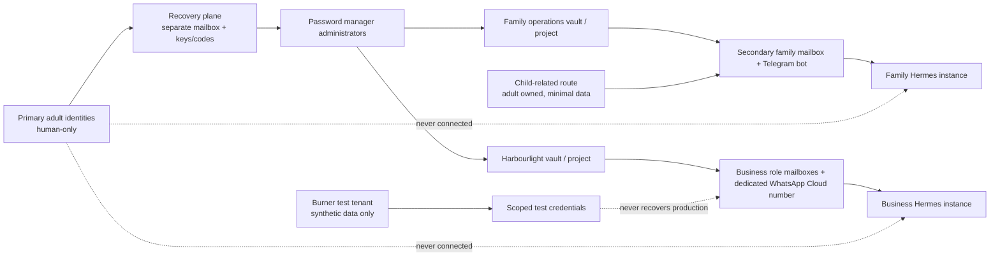

# 12. Identities, Burner Accounts, and Secrets

**Verified against Hermes Agent v0.20.5 (2026-08-19).**

## Opening scenario

After the host review, Alex opens a spreadsheet called “Hermes accounts.” It contains one row: Priya's main email address. That address recovers the family password manager, receives school messages, administers Harbourlight, and owns the phone number they nearly connected to WhatsApp automation. Several services share Alex's mobile number for recovery. A test storefront uses a real customer-facing alias. Ben's school portal is open in the Hermes browser. Nobody can say which API token belongs to which profile or what would break if Priya lost her phone.

The list is convenient because every road leads home. It is dangerous for the same reason. Compromise of the primary mailbox or phone can become compromise of password resets, recovery, messaging identity, business administration, and Hermes. Deleting one bot could disrupt ordinary family communication. Offboarding a contractor could require changing an adult's personal account.

The Chen–Patels redesign identities as compartments. Their primary personal mailboxes, phone identities, password-manager administrator accounts, banking, government, health, and school-parent accounts remain human-only. Hermes receives secondary mailboxes and dedicated messaging identities. Harbourlight owns business accounts independent of either adult. Test workflows use disposable, clearly labelled low-trust accounts that obey provider terms. Recovery is held by humans on separate paths. Children interact through a narrow family route; Hermes does not become them or hold their core credentials.

They also stop calling an API-key pool “backup.” Extra keys increase continuity but also increase attack surface. A real recovery plan says who owns each identity, where its recovery evidence lives, how to rotate it, and how to prove revocation.

## Definitions

**Identity.** The account, address, number, key pair, or provider principal recognized as an actor. An identity is not the same as a person: one person may operate several identities, while a service identity should not pretend to be a person.

**Primary identity.** An adult's long-lived personal mailbox, phone number, Apple Account, or other account that anchors daily life and account recovery. It has a large blast radius and must not be connected to Hermes.

**Secondary identity.** A durable, limited-purpose account created to receive or send within one domain, such as a household-operations inbox. It has its own credentials and recovery path and is safe to retire without losing the adult's ordinary communications.

**Alias.** An additional address that routes to an existing mailbox. An alias separates public addresses and supports filtering, but may share login, storage, recovery, and compromise with the underlying mailbox. It is not automatically a separate security boundary.

**Dedicated mailbox.** A separately authenticated mailbox with its own sessions, access policy, and lifecycle. It offers stronger isolation than an alias on a primary mailbox.

**Burner identity.** In this book, a disposable, low-trust test account, address, number, tenant, or credential used with synthetic data and minimal privileges. “Burner” never means evading law, identity checks, payment obligations, abuse controls, platform policy, bans, consent, or records requirements.

**Recovery identity.** A human-controlled mailbox, device, security key, code, or administrator that can restore another account. It should be independent of the account and device it recovers.

**Business identity.** An account owned by Harbourlight rather than Priya or Alex personally: a role mailbox, Meta business portfolio, service principal, domain, vendor login, or support number. Ownership must survive an operator's departure.

**Child-related identity.** An account or route connected to a child, school, activity, or guardian responsibility. It deserves extra minimization. Hermes should use adult-controlled exports or a narrow family interface, not impersonate a child or hold broad school/health credentials.

**Messaging identity.** The platform-recognized bot, number, mailbox, or account through which Hermes communicates. A sender ID or familiar voice is routing evidence, not sufficient proof for a consequential action.

**Secret.** A value whose possession grants power: password, API key, OAuth token, bot token, webhook secret, recovery code, session cookie, private key, or password-manager machine token.

**Bootstrap secret.** The credential Hermes needs to reach a secret manager. Replacing many provider keys with one machine/service token improves central rotation but does not eliminate secrets; the bootstrap token can unlock every secret within its granted scope.

**Secret reference.** A pointer such as an `op://` item path that identifies a secret without embedding its value in configuration.

**Credential pool.** Several credentials for the same model provider that Hermes can rotate for rate-limit, billing, or authentication recovery. It improves availability. It is not identity separation, credential rotation policy, or a security backup.

**Rotation.** Replacing a credential, deploying the replacement, verifying it, and revoking the old value. Editing a vault entry without restarting consumers may leave the old secret active.

**Offboarding.** Removing a person, device, bot, integration, or vendor from every account, secret, session, route, group, recovery role, and stored artifact it could access.

The identity system should prevent any one low-trust route from reaching the family’s roots:



## Hermes in practice

### Build an identity inventory before creating accounts

For every identity, record owner, purpose, authentication, recovery, data class, Hermes profile/instance, authorized humans, provider terms, billing, dependencies, creation date, review date, and retirement procedure. Record identifiers, not secret values. Unknown ownership is a Red state.

Use six classes:

| Class | Chen–Patel example | Hermes access | Recovery rule |
| --- | --- | --- | --- |
| Primary personal | Adult's main mailbox, mobile number, Apple Account | None | Human-only, independent offline evidence |
| Secondary family | Household operations mailbox, family Telegram bot | Narrow family instance | Adult-owned recovery path not in that mailbox |
| Burner test | Labelled sandbox shop/customer, test number where permitted | Disposable profile with synthetic data | Delete after test; never a production recovery factor |
| Recovery | Separate recovery mailbox, hardware key, printed code | None | Two human custodians where supported; stored separately |
| Business | `support@`, `ops@`, Meta business portfolio, dedicated number | Business instance, scoped role | Business-owned admin pair and documented transfer |
| Child-related | Parent view/export, family-room participant | Minimal family interface | Adult guardian owns; no child impersonation or broad portal credential |

An identity may belong in more than one administrative register, but do not let it silently play conflicting roles. A Harbourlight support mailbox should not recover the password manager that stores its password. A burner account should not become production because “it already works.” A child's phone number should not become the family bot's identity.

### Protect the primary roots by exclusion

Write a short negative inventory titled **Never connected to Hermes**. Include primary adult email, primary personal WhatsApp accounts and numbers, Apple Accounts, banking, tax, government, health, password-manager admin login, recovery mailbox, recovery codes, and any child's core school or health account.

This is stricter than “Hermes may not use them.” Do not sign those accounts into the Hermes macOS user, browser, mail client, plugins, MCP servers, or command-line tools. Do not use them as the sender for gateway email. Do not place their recovery codes in a Hermes-readable vault project. Exclusion is easier to verify than behavioral restraint.

The primary phone remains a human communication and recovery device. Even when a platform permits linking, never connect a primary WhatsApp identity to Hermes. The unofficial Baileys bridge persists session credentials that function like a password and may expose a personal account to protocol breakage or restrictions. The official WhatsApp Business Cloud path is the production choice for Harbourlight and requires a dedicated business number.

### Decide between aliases and mailboxes

An alias is useful for public sorting: `receipts@`, `school-notices@`, or a plus-address can reveal who received the address and make filtering easy. But if it lands in Priya's primary inbox, Hermes would still need primary-mailbox access to read it. Forwarding into a Hermes mailbox may also leak the primary address, threading, hidden recipients, or more message history than intended.

Use a dedicated, separately authenticated secondary mailbox for agent intake. Give it exact sender allowlists, a narrow retention rule, no access to the adult's contacts/calendar/drive unless separately approved, and no authority to reset primary accounts. Email `From` fields can be spoofed and legitimate accounts can be compromised, so high-consequence instructions require an independent human confirmation.

Harbourlight uses role mailboxes owned by its domain: support intake, operations intake, and a human-only administrator/recovery mailbox. Hermes may read the first two through the correct business profile and draft replies; it never reads the administrator mailbox. Do not let a role alias hide single-person ownership: at least two business owners should be able to transfer access without sharing a password.

### Give messaging its own identity

Chapter 9 established that messaging is remote access. Identity isolation finishes the job. Use separate bot tokens/numbers per environment and authority domain. The family Telegram bot is not Harbourlight's customer bot. Production is not test. A lost-device event in one route should not require changing an adult's primary number.

For Harbourlight, use a dedicated WhatsApp Business Cloud number under a Meta Business account, never Priya's or Alex's primary WhatsApp identity. Hermes provides `hermes whatsapp-cloud` for setup. The Cloud adapter uses Meta credentials, a signed webhook secret, exact allowed-user numbers for a private pilot, and a business-owned home route. At the pinned release it handles direct messages only, cannot send templates, and free-form replies outside Meta's 24-hour window fail. Those constraints should influence workflow design, not tempt the family to link a primary account.

The display name must identify the bot/business honestly. Do not impersonate Priya, Alex, a child, a teacher, a recruiter, or a customer. For external messages, disclose automation as appropriate and keep sends Amber until policy and quality evidence justify a narrower class. Voice is content, not proof of personhood.

Telegram bots, email gateways, SMS numbers, and webhook routes each need their own inventory row, owner, allowlist, token, provider console, spend/usage signal, home route, and revocation test. Pairing authorizes a platform user; it does not assign differentiated capability inside one adapter. Separate instances when callers need different powers.

### Isolate child-related identities

Children should not bear the security burden for a family agent. An adult owns the bot, consent decisions, retention policy, and recovery. Give a child access to a specific family room or workflow, not an adult profile. Keep group observation off unless there is a clear, disclosed purpose. A school calendar export or parent-visible notice is safer than storing a child's portal password.

Hermes must never present itself as the child, submit schoolwork as the child, send messages in the child's voice, monitor private communications, or make health/disciplinary decisions. It may organize an adult-supplied packing list, draft questions for a parent, or summarize a public school notice. Identity, consent, school policy, and age-related terms still apply.

When a child outgrows access, offboarding includes the Telegram/chat allowlist, shared groups, browser sessions, retained transcripts, notification routes, device access, and any school-year exports. Family membership does not justify indefinite retention.

### Choose a secret storage path deliberately

Hermes can load plain environment values from the profile's `~/.hermes/.env`, or resolve keys at startup from Bitwarden Secrets Manager, 1Password, and a command helper. Configuration belongs in `config.yaml`; secret values do not. Tight file permissions help, but a secret readable by the Hermes process remains inside its trust envelope.

Use one of these patterns:

| Pattern | Best fit | Important limit |
| --- | --- | --- |
| Profile `.env` with mode `0600` | One low-complexity Mac mini and a few scoped keys | Plaintext on disk; process and same-user compromise expose it |
| 1Password secret references | Existing 1Password operation needing mapped items and central rotation | Service-account token or desktop session is a powerful bootstrap secret; successful values may be cached |
| Bitwarden Secrets Manager project | Machine-oriented project with central rotation and revocation | Machine token reads every granted project secret; default resolved-value disk cache is plaintext |
| Command helper | Existing trusted local vault CLI or tmpfs injection | Runs configured shell command; output shape and helper security are operator responsibility |

For 1Password, install and trust the official `op` CLI separately, then use `hermes secrets onepassword setup`, `set`, `sync`, and `status`. Map environment names to `op://` references. A server/gateway normally needs a service-account token available to every non-interactive process; grant that service account only the family or business vault items it needs. Pin an absolute CLI path if PATH substitution is a concern. Set cache lifetime according to the exposure and availability trade-off; a zero cache disables resolved-value disk writes.

For Bitwarden, use a read-only machine account scoped to one Secrets Manager project. At the pinned defaults, `cache_ttl_seconds` is 300 and encrypted caching is off. A successful fetch writes resolved values to mode-`0600` plaintext `~/.hermes/cache/bws_cache.json`. Fresh entries can be reused for 300 seconds; after a live network or timeout failure, that plaintext cache can be reused without an age limit. Rejected or expired authentication and malformed/internal responses never use stale values. With encryption off, `cache_ttl_seconds: 0` disables cache reads and writes.

The beginner-safe policy is no cache when live retrieval is required. If brief offline startup is necessary, use an encrypted last-good cache with a finite window:

```yaml
secrets:
  bitwarden:
    cache_ttl_seconds: 0
    encrypted_cache:
      enabled: true
      max_stale_seconds: 3600
```

This keeps no fresh-cache reuse while allowing the encrypted entry after network/timeouts for at most one hour; authentication failures still fail. Encryption protects cache data at rest, not secrets in Hermes memory or a compromised host.

After vault rotation, a cache may still supply the previous provider value. Verify the cache policy, restore live Bitwarden access, restart every consumer, confirm which source resolved, perform a synthetic least-privilege call, revoke the old provider credential, and prove it fails. A successful call alone does not prove that Hermes fetched the new vault value.

The command source runs a configured non-interactive helper once through `/bin/sh -c` and accepts `KEY=VALUE` lines. It discards helper standard error and enforces timeout/output limits, but the command itself is trusted configuration. Prefer a short, audited helper; a long shell pipeline is executable policy that deserves code review.

Secret-source startup favors availability: Bitwarden may supply a permitted cache, and unresolved sources otherwise leave existing environment credentials available. This can surprise an operator expecting fail-closed rotation. Remove stale fallback values when central storage becomes authoritative, keep `override_existing` explicit, inspect startup warnings and provenance, and run a synthetic provider call after restart.

### Partition secrets by profile, domain, and purpose

Do not create one vault project called “Hermes all.” Use separate family, career, Harbourlight production, and test scopes. Create separate machine/service identities when compromise and offboarding must be independent. `secrets.preserve_existing` can keep profile-specific platform credentials from being overwritten by a shared source. Profile aliases can map profile-suffixed secret names to a canonical environment name, but this is secret-routing convenience, not OS isolation.

Hermes multi-profile gateway multiplexing preserves per-profile `.env`, config, skill, memory, and provider-key resolution; credentials are not unioned. That is a useful correctness property. Still, all multiplexed profiles run in one process, so a compromised in-process plugin can reach process privileges. Use separate processes/OS boundaries for family/business or child/admin separation.

Give every token one task. A reporting token is read-only; a webhook secret validates inbound requests; a bot token operates one bot; a model key has a budget and environment label. Never reuse a test credential in production. Avoid credentials that can create other credentials unless administration is the actual job—and administration stays human-only.

### Understand credential pools without expanding trust

Hermes credential pools can rotate among multiple keys for one model provider when a key reaches a rate limit, quota, or authentication failure. `hermes auth` and `hermes auth list` manage and inspect pools; manual keys stored in Hermes can persist their token, while credentials borrowed from environment or external secret sources persist only source metadata and a fingerprint in `auth.json`.

A pool does not rotate a leaked key; it selects another one for availability. A compromised process may reach every credential in its pool. Multiple paid keys may multiply possible spend. Use a pool only when continuity requires it, label keys by owner/environment, keep budgets aligned, and test removal. When one key is suspected, revoke it at the provider, remove its pool entry, restart affected processes, and verify the provider audit trail.

Pool movement can also reset provider-side prompt caches and increase cost. Record that operational consequence; do not disguise extra credentials as free resilience. Subagents can share the parent's pool, which makes parent scope the correct place to minimize it.

### Design rotation as a dependency graph

Rotation is complete only when the old value no longer works. Use this sequence:

1. Identify consumers, owner, provider, scope, expiry, logs, and dependent recovery paths.
2. Create a replacement with equal or smaller privilege.
3. Update the authoritative secret source without pasting values into chat, shell history, tickets, or documents.
4. Restart every Hermes gateway, cron worker, proxy, or container that resolves secrets at startup. For Iron Proxy with Bitwarden as its credential source, restart the proxy after vault rotation.
5. Run a synthetic least-privilege operation and inspect provider evidence.
6. Revoke the old value at the provider.
7. Prove the old value fails and the new one succeeds.
8. Update inventory date, fingerprint/suffix, custodian, and incident link—never the value.

Rotate immediately after suspected exposure, operator/vendor departure, wrong-recipient disclosure, repository or backup exposure, lost device, or unexplained provider use. Scheduled rotation supports hygiene but cannot substitute for event-driven revocation.

Bootstrap tokens come first in incident reasoning because they may reveal many downstream secrets. Rotate downstream credentials that the old bootstrap token could read; replacing only the bootstrap does not revoke provider keys an attacker already copied.

### Build recovery that does not collapse into one device

Map recovery as carefully as login. A good plan survives loss of one phone, one laptop, one mailbox, or one adult's availability. Keep primary mailbox recovery human-only and separate from the Hermes mailbox. Register more than one strong human-held authenticator where the provider supports it. Store recovery codes offline or in a separately controlled emergency kit, not in the same browser, mailbox, or Hermes-readable vault as the account.

Provider procedures differ and change. 1Password documents recovery codes for individual/family accounts and organizer/admin-assisted recovery for eligible family/team accounts; it recommends more than one person able to recover others. Its Secret Key is not the same as a recovery code. Bitwarden supports two-step login recovery codes for individual access and separate organization recovery features depending on plan/policy. Follow the current official page when generating or using these artifacts.

Test recovery without destroying the live path: confirm custodians can locate sealed instructions, verify a secondary device/security key on a low-risk test account, and walk through provider screens up to the irreversible step. Do not type a production recovery code merely to see whether it works; some systems consume or invalidate codes. Record the test method and date.

### Use test accounts without confusing production

A burner test tenant contains synthetic names, addresses, messages, orders, and files. Prefix visible names with `TEST`, use provider-supported sandbox/test numbers and payment modes, block external sending where possible, and cap spend. Never copy real customer or child data into it. Never use it to bypass a ban, age rule, phone-verification policy, rate limit, geographical restriction, app review, or consent requirement.

Keep test and production distinct in domain/subdomain, number, mailbox, bot name, token project, browser profile, Hermes profile/process, webhook URL, and message banner. Test credentials cannot recover production. When the experiment ends, export only non-secret learning, revoke tokens and sessions, delete retained data through the provider's process, remove routes, and record closure.

### Offboard people and integrations completely

Start from the identity inventory, not memory. For a departing contractor or retired integration:

1. Suspend interactive access and remove group, channel, role, and allowlist membership.
2. Transfer business-owned files, mailboxes, domains, numbers, apps, vault items, and billing to named owners.
3. Revoke sessions, OAuth grants, app passwords, API/bot/webhook tokens, machine/service tokens, security keys, and recovery roles the subject possessed.
4. Rotate shared secrets; a removed user may still know them.
5. Remove Hermes pairings, profile routes, MCP/plugin configuration, cron deliveries, browser profiles, cached credentials, and local copies.
6. Preserve required business records under policy, then delete unnecessary personal data and test artifacts.
7. Verify from provider logs and a denied sign-in/call; document who approved completion.

Deleting a Hermes profile does not revoke provider access. Deleting a provider account does not remove retained Hermes sessions. Offboarding must close both sides.

### Run a quarterly access review

Once per quarter, Priya and Alex review all identities without asking Hermes to approve itself. Hermes may prepare the inventory and highlight changes; humans inspect provider consoles and the Mac mini.

For each identity, answer: Does the purpose still exist? Is the owner current? Is the account business- or person-owned correctly? Are privileges minimal? Are recovery paths independent? Are all sessions/devices known? Are mailbox forwarding rules and aliases expected? Are messaging allowlists and pairings exact? Are bot numbers active and paid intentionally? Are secret scopes and caches appropriate? Are old keys revoked? Are test accounts labelled and expiring? Are children’s data and access still necessary? Do provider logs match expected use?

Sample at least one recovery path, one token rotation, one unknown-sender denial, one old-credential denial, and one offboarding record. Review primary exclusions by proving they are absent from the Hermes user/browser/vault scope. Sign the review and open dated actions with owners; “reviewed” is not a substitute for remediation.

## Professional example

Harbourlight owns `support@` and `ops@` as separately authenticated role mailboxes, a human-only admin/recovery mailbox, a dedicated WhatsApp Business Cloud number, and separate production/test Meta apps. Priya and Alex are business administrators through individual human accounts; neither shares a password. Hermes reads support and operations intake in a bounded business process and drafts responses. It cannot access domain registration, billing, password-manager administration, or the recovery mailbox.

Provider credentials live in a Harbourlight secret project readable by a dedicated machine identity. Reporting and model keys have distinct scope and budget. Test credentials live in another project and use synthetic records. A contractor receives an individual role, never the machine token. On departure, Harbourlight revokes that role, sessions, devices, OAuth grants, channel memberships, recovery status, and known shared secrets, then verifies denial.

## Personal example

The family keeps adult primary email, phone, WhatsApp, Apple, financial, health, government, and password-manager identities outside Hermes. A secondary household mailbox receives allowlisted school and service notices. A dedicated Telegram bot serves Priya and Alex; Ben reaches a separate narrow family route. Recovery uses adult-controlled paths and an offline kit unavailable to Hermes.

For a calendar-import experiment, they create a clearly labelled test account with fictional events and no school connection. When the test ends, they revoke the token, delete the test data and browser profile, remove the Hermes route, and record closure. They do not reuse the account as the family's production calendar.

## Authority boundaries

| Boundary | Identity and secret authority |
| --- | --- |
| **Green — may act** | Use already-approved scoped service credentials; read secondary intake; inventory non-secret identifiers, owners, dates, and fingerprints; report failed authentication or unexpected use; prepare synthetic tests; stop when identity is uncertain. |
| **Amber — may prepare** | Draft account creation, access grants, sends, rotations, vault mappings, recovery tests, number/mailbox changes, role transfers, offboarding, and quarterly-review actions. A human verifies provider, identity, scope, cost, policy, and recipient before execution. |
| **Red — may not act** | Access or connect primary mail/WhatsApp/phone identities; retrieve recovery codes; administer the password manager; impersonate a person or child; bypass platform rules; share or print secrets in chat/logs; create broad credentials; move money; autonomously recover, delete, or transfer accounts; or mark its own access review complete. |

Account, child, customer, employment, privacy, and record-retention decisions may require provider, school, contractual, legal, or privacy review. Hermes prepares evidence; accountable humans decide.

## Failure modes and recovery

**Primary account was connected.** Stop the integration, revoke its app password/OAuth grant/session, inspect forwarding and sent activity, rotate exposed credentials and recovery links, remove browser data from the Hermes user, and replace it with a secondary identity. Verify the primary exclusion list.

**Alias mistaken for isolation.** The agent still reaches the underlying primary mailbox. Move intake to a separately authenticated mailbox, remove forwarding that leaks excess history, revoke the old integration, and test that the agent cannot search the primary store.

**Secret-manager source fails open to stale `.env`.** Stop consequential work, inspect startup warnings and source status, remove or update stale fallback values, restore the authoritative source, restart consumers, test the intended value by provider evidence, and revoke stale credentials.

**Bootstrap token leaked.** Revoke it at 1Password/Bitwarden, inventory every vault/project item it could read, rotate those downstream credentials, clear affected caches/sessions, issue a narrower bootstrap identity, and review provider logs. Merely replacing the bootstrap token is incomplete.

**Credential pool hides a revoked or costly key.** Inspect `hermes auth list`, provider events, labels, source references, cooldowns, and spend. Revoke and remove unwanted entries, restart, then force a synthetic request and confirm the selected credential. Do not reset cooldowns to hide a billing incident.

**Wrong production/test identity.** Halt sends and webhooks, label the environment, reconcile external effects and any real data copied into test, notify the owner, revoke mixed credentials, and recreate the test environment. Never “promote” it without a formal migration.

**Lost recovery device.** Use a separate trusted device and provider's current recovery flow, revoke the lost device/session, replace authenticators, inspect account changes, and regenerate affected recovery artifacts. Keep Hermes stopped if it depended on the lost route.

**Incomplete offboarding.** Reopen the checklist from the inventory, search provider consoles for sessions, OAuth grants, machine accounts, groups, recovery roles, aliases, routes, and tokens, rotate shared values, and prove denied access. A disabled mailbox alone is not completion.

## Field kit

### Identity, secret, and quarterly-review register

```text
IDENTITY
Identifier / provider (never secret value):
Class: primary / secondary / burner-test / recovery / business / child-related
Human or service identity:
Owner / backup owner:
Purpose and data class:
Hermes instance/profile/browser:
Production or TEST banner:
Terms, age, consent, and billing owner:

AUTHENTICATION
Password-manager vault/project:
MFA methods and human custodians:
Recovery mailbox/device/code custodian:
Independent of account/device being recovered: yes / no
Known sessions/devices:
Roles/groups/allowlists/pairings:

SECRETS
Secret type, provider, scope, expiry:
Source: profile env / 1Password / Bitwarden / command / provider OAuth
Bootstrap identity and readable scope:
Consumer processes and restart requirement:
Fingerprint or suffix (never value):
Last rotation / old-value denial evidence:

LIFECYCLE
Created and approved by:
Last provider-log review:
Last recovery drill:
Offboarding/deletion procedure:
Retention or transfer requirement:
Next quarterly review:

QUARTERLY RESULT
Purpose still valid:
Primary identities absent from Hermes:
Privilege reduced or justified:
Forwarding, sessions, devices, routes verified:
Child/test data minimized:
Actions, owners, due dates:
Human reviewers and date:
```

### Copy-ready rotation receipt

```text
Credential label and environment:
Reason for rotation:
Old scope / new scope:
Authoritative source updated at:
Consumers restarted:
Synthetic least-privilege test evidence:
Old credential revoked at provider:
Old credential denial evidence:
Logs reviewed through:
Inventory updated by / approved by:
```

## Exercise

Classify these proposed connections and redesign unsafe ones: Priya's main Gmail for school notices; Alex's primary WhatsApp for Harbourlight customers; `school+hermes` as an alias on Priya's inbox; a separate household mailbox; a Meta test number; a contractor's personal API key; a read-only Harbourlight machine account; Ben's school password; and an offline recovery code. Then design the identity and secret map for family, career, Harbourlight production, and Harbourlight test. Include recovery dependencies, secret sources, rotation receipts, offboarding, and five quarterly tests.

## Answer or rubric

The primary Gmail, primary WhatsApp, contractor personal key, child school password, and recovery code are Red for Hermes. An alias on the primary mailbox is useful routing but not isolation; replace it with a dedicated secondary mailbox. The Meta test number is a burner test identity only when used within Meta policy and with synthetic data. The read-only business machine identity is appropriate if narrowly scoped and recoverable by human business owners. Recovery codes stay outside Hermes.

A strong map separates primary, secondary, recovery, business, child-related, production, and disposable test identities. It separates family and business vault projects and process boundaries, names independent recovery custodians, documents restart-aware rotation and old-value denial, and offboards both Hermes and provider sides. Quarterly tests should include absence of primary accounts, unknown-sender denial, old-token denial, a non-destructive recovery drill, and complete removal of one retired test identity. Award two points each for classification, primary exclusion, messaging identity, child minimization, secret-source scope, recovery, rotation/offboarding, and quarterly evidence. Thirteen of sixteen indicates mastery.

## Mastery checklist

- [ ] I keep primary adult mailbox, phone, WhatsApp, Apple, recovery, and password-manager identities outside Hermes.
- [ ] I can distinguish an alias from a separately authenticated mailbox.
- [ ] I use dedicated family and business messaging identities, including a dedicated WhatsApp Business Cloud number.
- [ ] I define burner as a compliant disposable low-trust test identity with synthetic data.
- [ ] I minimize child-related identity and never let Hermes impersonate a child.
- [ ] I know what remains exposed when using `.env`, 1Password, Bitwarden, or a command helper.
- [ ] I scope bootstrap service/machine tokens as high-value credentials.
- [ ] I partition secrets by family, career, business production, and test.
- [ ] I understand that credential pools improve availability, not revocation or security isolation.
- [ ] I rotate through deploy, test, revoke, and old-value denial.
- [ ] I keep recovery independent of the account/device it restores and outside Hermes.
- [ ] I can offboard across provider roles, sessions, secrets, channels, Hermes state, and retained data.
- [ ] I conduct a human-owned quarterly access review with provider evidence.

## References

- Nous Research, [Secrets overview](https://github.com/NousResearch/hermes-agent/blob/v2026.8.19/website/docs/user-guide/secrets/index.md).
- Nous Research, [1Password secret provider](https://github.com/NousResearch/hermes-agent/blob/v2026.8.19/website/docs/user-guide/secrets/onepassword.md).
- Nous Research, [Bitwarden Secrets Manager provider](https://github.com/NousResearch/hermes-agent/blob/v2026.8.19/website/docs/user-guide/secrets/bitwarden.md).
- Nous Research, [Command-helper secret provider](https://github.com/NousResearch/hermes-agent/blob/v2026.8.19/website/docs/user-guide/secrets/command.md).
- Nous Research, [Credential pools](https://github.com/NousResearch/hermes-agent/blob/v2026.8.19/website/docs/user-guide/features/credential-pools.md).
- Nous Research, [Multi-profile gateways](https://github.com/NousResearch/hermes-agent/blob/v2026.8.19/website/docs/user-guide/multi-profile-gateways.md).
- Nous Research, [WhatsApp Business Cloud API setup](https://github.com/NousResearch/hermes-agent/blob/v2026.8.19/website/docs/user-guide/messaging/whatsapp-cloud.md).
- Nous Research, [Gateway security and pairing](https://github.com/NousResearch/hermes-agent/blob/v2026.8.19/website/docs/user-guide/security.md).
- 1Password, [Use service accounts](https://developer.1password.com/docs/service-accounts/) (accessed 2026-08-21).
- 1Password, [Generate and use recovery codes](https://support.1password.com/recovery-codes/) (accessed 2026-08-21).
- 1Password, [Recover accounts for family or team members](https://support.1password.com/recovery/) (accessed 2026-08-21).
- 1Password, [Find your Secret Key or Setup Code](https://support.1password.com/secret-key/) (accessed 2026-08-21).
- Bitwarden, [Machine accounts](https://bitwarden.com/help/machine-accounts/) (accessed 2026-08-21).
- Bitwarden, [Two-step login methods](https://bitwarden.com/help/setup-two-step-login/) (accessed 2026-08-21).
- Bitwarden, [Two-step login recovery code](https://bitwarden.com/help/two-step-recovery-code/) (accessed 2026-08-21).
- Meta, [WhatsApp Cloud API](https://developers.facebook.com/docs/whatsapp/cloud-api/) (accessed 2026-08-21).
- NIST, [Digital Identity Guidelines](https://pages.nist.gov/800-63-4/) (accessed 2026-08-21).
