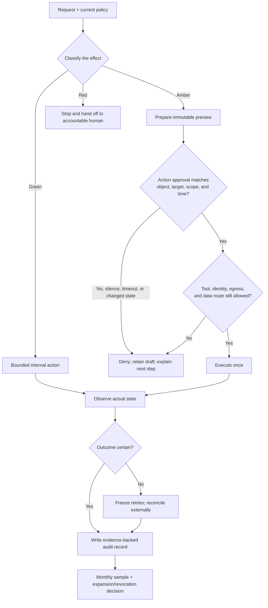

# 13. Approvals, Autonomy, Egress, and Audit

**Verified against Hermes Agent v0.20.5 (2026-08-19).**

## Opening scenario

At 4:40 on a Friday, Hermes presents Priya with a plan for Harbourlight's overdue-customer follow-up. It will identify invoices more than fourteen days late, draft a courteous reminder, and place each draft in a review folder. Priya approves the plan from her phone. Ten minutes later Hermes asks whether it may run a shell command that exports customer rows. She approves that command once. The final message says, “Follow-ups complete.”

Three different decisions have been collapsed into one word: *approve*. Priya approved an approach, permitted one local command, and never approved sending customer messages. Yet the polished completion sentence makes it sound as though one approval covered the whole trajectory. Alex checks the mail provider and finds no sends. That is fortunate, but it exposes a policy gap: if send access had existed, the same ambiguity could have produced an external effect.

The Chen–Patels pause the job. They rewrite the approval request so it names the action, customer set, channel, exact draft version, deadline, and expiry. Silence means no. Any change in recipient, content, price, source data, or route voids the approval. The business profile can read the approved export and write drafts, but it has no sending tool in its ordinary toolset. A human sends from the business mailbox after checking the recipient preview. Every request, decision, execution result, and provider receipt goes into a small action ledger.

The lesson is not “ask more often.” Approval fatigue can be as dangerous as no approval. The lesson is to put one deliberate human decision at the seam where preparation becomes consequence, then make that decision narrow, expiring, attributable, and verifiable.

## Definitions

**Authority.** Permission to create a particular effect under stated conditions. Authority belongs to a person or policy; Hermes does not acquire it from confidence, capability, or repeated success.

**Approval.** A recorded human decision allowing one proposed action or a tightly defined class of actions. An approval is not a compliment, a vague “go ahead,” or permission to improvise beyond its scope.

**Plan approval.** Agreement that a proposed method is reasonable enough to continue preparing work. It authorizes the listed preparation steps only. It does not authorize an external effect later mentioned in the plan.

**Action approval.** Permission to execute a specific effect against a specific target using reviewed inputs. “Draft the reminder” and “send revision 3 to customer C-104” require different decisions.

**Approval object.** The immutable item being reviewed: a file hash, message revision, recipient list, transaction preview, command, configuration diff, or other exact representation. If the object changes, the approval no longer matches.

**Scope.** The boundaries of permission: task, target, tool, data set, channel, quantity, cost, environment, and permitted effect. “Email access” is not a useful scope; “read new mail in the Harbourlight support inbox and save local drafts” is.

**Time-bounded authority.** Permission that expires at a stated time or earlier when its assumptions change. Time is only one boundary. A five-minute approval for the wrong recipient is still wrong.

**External effect.** A change beyond the disposable working area: a sent message, submitted form, booking, purchase, account change, shared file, production write, public post, or instruction another person may rely on.

**Fail closed.** Decline or stop when required approval, identity, policy, evidence, or control is absent or uncertain. Waiting, timeouts, and delivery failure never become permission.

**Egress.** Outbound network traffic from a process or sandbox. Destination control limits where requests may go; it does not prove that allowed requests contain appropriate data.

**Tool restriction.** Removing or narrowing a capability so an action cannot occur through the ordinary agent path. Toolsets are operational controls inside Hermes, not OS security boundaries.

**Audit record.** A factual, time-ordered record of request, policy, proposed effect, approval, execution, observation, and recovery. It supports reconstruction; it is not proof that every relevant event was captured.

**False-confidence signal.** Evidence that looks reassuring but does not establish the claimed safety or outcome—for example, a fluent “done,” a clean scanner result, an empty log, a checkpoint badge, or a month with no recorded denials.

**Authority expansion.** A deliberate increase in one autonomy dimension after representative evidence and a rollback path exist. **Revocation** removes that permission and the capability or credential that made it possible.

The operating policy routes every consequential proposal through the same gates:



## Hermes in practice

### Turn Green, Amber, and Red into rows

A colour without scope is decoration. Build a policy row for each repeated task family. Name the trigger, inputs, allowed tools, destination, maximum quantity, approval object, evidence, stop rule, and owner. Classify the effect, not the verb.

| Task | Green — may act | Amber — may prepare | Red — may not act | Evidence and stop |
| --- | --- | --- | --- | --- |
| Customer support | Read assigned inbox; classify; draft locally | Prepare exact recipient-and-body preview | Send promises, refunds, credits, legal positions, or account changes | Source thread, policy citation, draft hash; stop on identity or policy conflict |
| Career search | Read saved postings; compare to evidence bank | Draft application and networking message | Submit, invent evidence, accept terms, or impersonate Priya | Official URL, capture time, evidence links; stop on missing mandatory fact |
| Family calendar | Read delegated feed; draft a weekly view | Prepare invitation or booking | Consent for a child, disclose private schedule broadly, or make health decisions | Source event IDs; stop on conflicting guardian instruction |
| System care | Inspect status, disk use, logs, and configuration | Propose a reviewed configuration diff and maintenance window | Disable safeguards, erase evidence, expose services, or elevate privilege | Before/after output and denied canary; stop if backup or rollback cannot be proved |

“May act” remains conditional on the Chapter 11 trust envelope and Chapter 12 identity map. Reading is not Green if the source is outside the assigned account. Drafting is not Green if the draft is written into a public shared folder. A low-risk tool can create a high-risk effect through the wrong target.

Add negative authority in plain language. Harbourlight's policy says: no payment-card entry, no primary credentials, no child dossier, no production deletion, no autonomous external message, and no retry while a prior effect is uncertain. Negative rows make improvisation visible when a tool fails.

### Separate plan approval from action approval

A plan is provisional reasoning. Approving it means “continue within these preparation boundaries,” not “execute every step if later possible.” Use two gates:

1. **Plan gate:** Is the approach, source set, toolset, budget, and stopping rule acceptable? Hermes may gather, compare, and draft within Green scope.
2. **Action gate:** Does the human approve this exact effect now? The preview must show target, content or diff, channel, identity, timing, cost or quantity, and verification method.

The action gate belongs as late as practical, after the artifact is stable but before the effect. Asking “May I email these customers?” before drafts and recipients exist forces the approver to authorize an abstraction. Asking after Hermes has already sent is merely notification.

Use an immutable identifier when feasible: message revision, file checksum, provider draft ID, or configuration diff. A hash does not make content safe; it proves which content was reviewed. If Hermes changes punctuation after approval, the object changed. For a trivial internal artifact that may be harmless. For an external message, contract, application, or production change, request approval again.

Never bundle unrelated effects. Approval to send one recruiter reply does not cover calendar acceptance. Approval to apply a configuration diff does not cover restarting a customer gateway. Each effect needs its own row unless the policy explicitly defines a homogeneous batch with one owner, one object set, one ceiling, and one verification plan.

### Make approval narrow and expiring

The Chen–Patel approval tuple is:

`who + action + object + target + tool/identity + quantity/value + earliest/latest time + evidence`

The permission expires at the earliest of its timestamp, task completion, session boundary, policy change, data change, recipient change, credential change, material source update, or incident stop. This is an operating rule, not a Hermes-native time-to-live feature.

Examples:

- “Priya approves sending draft `HL-REM-03` to customer record C-104 from the Harbourlight support mailbox once, before 17:15 America/Toronto, with the provider sent-item ID returned.”
- “Alex approves applying configuration diff `proxy-2026-08-21-r2` to the test profile during the 19:00–19:20 window; no production profile, secret, or network policy may change.”
- “Both adults approve sharing the one-page activity schedule with the named grandparents' group until Sunday; health notes and addresses are excluded.”

Vague approval—“yes,” “do it,” or “same as usual”—may be accepted only when the approval surface displays one unambiguous pending object in the same authorized session. For higher consequence, restate the tuple and require a fresh answer. A message forwarded from another chat, a voice that sounds familiar, or a session ID is not sufficient identity evidence.

No response is denial. A late response does not revive an expired request. An approver may narrow a proposal but may not silently broaden it: “send only the first two” is valid; “and anything similar” must become a new policy row.

### Understand what Hermes approval actually covers

Hermes's documented approval system examines terminal commands for dangerous patterns. In `smart` mode, an auxiliary model may auto-approve a low-risk command, auto-deny one it judges dangerous, or escalate uncertainty. `manual` prompts on dangerous commands; `off` disables those prompts, like `--yolo`, except for the always-on hardline blocklist. This is not a general transaction-approval engine and does not enforce the household's Green/Amber/Red policy across email, browser, provider, plugin, or MCP actions.

The safe baseline keeps `approvals.mode: smart`, a finite timeout, and headless denial:

```yaml
approvals:
  mode: smart
  timeout: 300
  cron_mode: deny
  single_query_mode: deny
  mcp_reload_confirm: true
  destructive_slash_confirm: true
```

At the pinned release, a manual approval prompt that times out is denied. Headless cron and one-shot `-q` sessions cannot wait for a person; their `deny` modes block dangerous commands and let the agent seek another path. Do not switch either to `approve` merely to make an unattended job complete. A safe recurring job should not depend on live dangerous-command approval.

In the interactive CLI, the choices are once, session, always, or deny. Prefer **once**. **Session** is broader and ends with that session, not a clock time. **Always** writes a command pattern into `command_allowlist` in `config.yaml`; it has no business-purpose, recipient, or data boundary. Review and remove permanent patterns with `hermes config edit`. `hermes approvals suggest` is read-only unless explicitly applied and excludes several destructive classes, but frequency still does not turn a historically approved pattern into safe authority.

On messaging platforms, an authorized user can answer the pending dangerous-command prompt with documented yes/no words. Hermes rechecks external-surface authorization; a session identifier is only a routing handle. Within one adapter, however, authorized callers share the adapter's capability model. Use separate instances when a child, customer, contractor, and administrator require different powers.

`--yolo`, `/yolo`, `HERMES_YOLO_MODE=1`, `approvals.mode: off`, `cron_mode: approve`, and `single_query_mode: approve` are escalation states. The family policy prohibits them on profiles with real personal or business data. The hardline blocklist remains useful, but it is intentionally incomplete and cannot authorize what policy forbids.

### Restrict tools before relying on prompts

If a workflow only reads two sources and writes a draft, do not provide messaging, browser control, terminal, or administration merely because they may be useful later. Configure platform toolsets with `hermes tools`; use per-job `enabled_toolsets` for cron. Tool removal reduces ordinary mistakes and prompt cost. It does not contain an in-process plugin or hostile model—Chapter 11's OS boundary still carries that load.

Use different profiles or processes for family, career, Harbourlight production, and test. A profile organizes state and tool configuration; separate OS users or whole-process wrappers enforce hostile-code separation. Avoid a “manager” profile that holds every identity and tool. Human operators can cross domains; one agent process should not.

For MCP servers not fully controlled, the pinned configuration supports `trust: untrusted`. Write-capable tools then require approval unless the server claims a read-only hint. That hint is server-supplied and can be false, so it is a review seam rather than containment. Limit server tools and credentials at the MCP configuration and provider as well.

The website blocklist can prevent Hermes URL-capable tools from reaching named internal or administrative domains, and SSRF protection rejects private and special-purpose addresses by default. A blocklist is not a positive egress allowlist. Do not enable `security.allow_private_urls` on an exposed workflow merely to bypass a refusal.

### Bind egress to the job

Write a destination set for every workflow:

- **Tier 0:** no network after staged input; local extraction, classification, or drafting.
- **Tier 1:** selected inference/provider endpoints only.
- **Tier 2:** named research or service domains plus the provider.
- **Tier 3:** supervised broad research for a fixed window, with no high-value credentials or sensitive input.
- **Red:** unrestricted background network access combined with broad data or credentials.

Hermes's Iron Proxy is an optional credential-injection and allowlisting layer for the Docker terminal backend. The documented commands are `hermes egress setup`, `hermes egress start`, and `hermes egress status`. With `proxy.enforce_on_docker: true`, a missing proxy or conflicting proxy-control environment causes sandbox creation to refuse rather than fall back to direct access. Keep that fail-closed setting.

Do not extend the claim. Iron Proxy does not cover the host agent process at this release. Raw sockets may bypass proxy variables; allowed hosts can receive inappropriate data in request bodies; mounted credential files remain readable; some signed provider credentials are uncovered. Its v0.39 per-request and daemon events share `~/.hermes/proxy/iron-proxy.log`; the documented `audit.log` is only a reserved placeholder until a later supported proxy version. A zero-byte placeholder is not evidence of zero egress.

Use firewall or whole-process network policy when the whole agent needs destination enforcement. Keep provider-side scopes and budgets because “allowed destination” does not mean “allowed operation.” Rehearse one allowed provider request and one denied synthetic destination after every network-policy change.

### Build an audit record from several sources

Hermes sessions persist full message history, tool calls, results, model metadata, timestamps, and source information in profile-local `state.db`. `hermes logs` exposes agent, error, gateway, GUI, and desktop logs. Cron maintains an execution ledger in `~/.hermes/cron/executions.db`. Iron Proxy logs covered sandbox requests. These sources answer different questions and may contain sensitive data.

Technical trajectories are optional JSONL artifacts intended for debugging or training; the normal CLI does not expose a trajectory-saving configuration flag. Do not promise one complete trajectory file for every run. Session records are closer to the conversational path, but a provider-side action may require a provider receipt to prove the effect.

Hooks can add structured records. Gateway events include session start/end/reset/compress, agent start/step/end, and commands. Hook callback errors are caught and logged rather than crashing the agent, so an audit hook can miss an event while work continues. Plugin and shell hooks may alter flow and carry process privilege. Review them as code, minimize recorded content, test hook failure alerts, and never let the agent be the sole custodian of its own audit trail.

For each consequential attempt, record:

| Field | Minimum content |
| --- | --- |
| Correlation | Unique action ID; session ID; cron attempt/job ID if relevant |
| Request | Requester, source channel, received time, task version |
| Policy | Green/Amber/Red row, policy version, owner |
| Inputs | Source identifiers, data classes, freshness; no raw secrets |
| Proposal | Exact effect, immutable object/revision, targets, quantity/value |
| Approval | Approver identity, decision, time, expiry, scope, channel |
| Execution | Tool/service identity, start/end, destination, retries |
| Observation | Tool result, provider receipt, before/after state |
| Outcome | Completed, failed, denied, expired, revoked, or uncertain |
| Recovery | Stop, reconciliation, correction, notification, evidence owner |

“Completed” means the defined observation exists. It does not mean the final response sounded certain. Redact or tokenize personal data in the ledger; point to a restricted source rather than duplicating content. The audit system itself needs access control, retention, backup, and deletion.

### Review monthly without trusting the dashboard

Once a month, Priya and Alex review authority together. They examine every Red refusal or override attempt, every uncertain external effect, every incident, every permanent allowlist change, and every authority expansion. They also sample all Amber executions if the volume is small; otherwise they take a risk-weighted sample plus a simple random sample. For Green work, they sample at least one case from each active task family and one denial test per boundary.

The review compares request, source, approval object, decision, actual tool path, destination, receipt, and final claim. It counts missed approvals, unnecessary approvals, expired approvals accepted, target changes, retries, uncertain outcomes, false completion claims, hook/log gaps, blocked egress, and human correction time. It also asks whether an absent event means nothing happened or logging failed.

Warning signs include:

- no denials or escalations despite varied work;
- every task marked complete, with no blocked or uncertain outcomes;
- repeated “once” approvals for the same poorly designed command;
- permanent patterns growing faster than task policies;
- audit records created only from Hermes's final prose;
- provider receipts that do not match local records;
- broad Tier 3 egress becoming routine;
- approvals from one hurried person at unusual times;
- a scanner, encryption setting, or checkpoint being cited as permission;
- logs suddenly becoming quieter after a configuration change.

A monthly sample is operational quality control, not a compliance certification or assurance engagement. Harbourlight's owners must determine applicable contractual, privacy, employment, payment, and recordkeeping obligations with qualified help.

### Expand one dimension; revoke across all layers

Authority is earned per task family. Start with offline test data, then read-only real sources, then internal drafts, then supervised external execution if the effect is suitable. Expand one dial—source set, tool, initiation, quantity, duration, or effect—while holding the others constant.

An expansion proposal names representative trials, error and escalation results, unresolved failures, new harm, paired control, expiry, reviewer, and revocation test. A clean five-run trial is evidence, not certainty. Never promote medical, tax, legal, employment, family-consent, credential-administration, or money-movement decisions into autonomous execution. Hermes may prepare and organize; accountable people and professionals decide.

Revocation is more than editing a prompt. Pause cron jobs and goals, disable the toolset, remove allowlist entries and pairings, stop affected gateways or containers, revoke provider credentials and browser sessions, narrow egress, preserve evidence, and confirm denied synthetic use. Managed scope can pin selected values against a normal user on supported POSIX deployments, but its v1 files are readable, malformed policy is logged and ignored, and native macOS management is out of scope. It is not the Mac mini's security boundary.

Trigger immediate revocation after a wrong recipient, leaked credential, unexplained provider event, repeated approval bypass, changed operator, failed audit capture, boundary change, lost device, uncertain duplicate effect, or evidence that the task no longer matches its policy. Re-entry begins at a lower stage with synthetic tests.

## Professional example

Harbourlight's support agent has read access to a secondary support mailbox and a read-only customer export. It can classify requests and save response drafts under action IDs. Its normal toolset has no send, payment, account-administration, or production-write capability. Egress allows the selected model provider and the read-only reporting endpoint; customer attachments are handled inside the whole-process boundary from Chapter 11.

A reply request displays the source thread, customer record identifier, exact recipient, draft revision, policy citation, attachments, and expiry. Priya can approve one send, reject it, or request edits. Editing invalidates the action approval. After a human sends, the ledger stores the provider message ID and sent timestamp, not another copy of the body. Discounts, refunds, contractual statements, privacy responses, and legal threats remain a professional handoff or owner decision.

The monthly review selects every high-impact case, five random ordinary replies, all denials, and one no-network canary. The owners compare the support ledger to provider sent items. They discover that two drafts required repeated command approvals merely to format files, so they replace the shell step with a narrow workflow. They do not add the shell command permanently just because it was common.

## Personal example

The family agent reads a delegated calendar and school-notice mailbox. It may prepare a weekend schedule and a message to grandparents. The action preview excludes school IDs, addresses not needed by the recipients, health notes, and the children's private messages. Both adults can approve ordinary schedule sharing; only the relevant guardian can approve a school response. Hermes cannot consent, sign, book, or speak as a child.

Alex approves schedule revision `FAM-WK-08-r4` for one named group until 20:00. A new school cancellation arrives before sending. The source state changed, so the approval expires even though the clock has not. Hermes produces revision 5 and requests a new decision. That extra prompt is useful: it is caused by changed meaning, not arbitrary caution.

## Authority boundaries

| Boundary | Approval, autonomy, egress, and audit authority |
| --- | --- |
| **Green — may act** | Read assigned sources; classify effects; prepare internal artifacts; run approved synthetic allow/deny tests; record factual attempts and evidence; stop or downgrade when scope, identity, data, route, or outcome is uncertain. |
| **Amber — may prepare** | Draft exact external effects, configuration diffs, tool/egress changes, temporary authority grants, audit hooks, retention changes, and incident communications. A named human reviews the immutable object, target, scope, time, and recovery plan before execution. |
| **Red — may not act** | Treat plan approval as action approval; infer consent from silence; accept expired or forwarded approval; self-expand authority; enable YOLO/headless auto-approval on real-data profiles; grant itself tools, credentials, destinations, or permanent allowlist entries; move money; file taxes; make medical, legal, employment, school-consent, or family-value decisions; erase evidence; or resume after unresolved external effects. |

The policy prepares decisions and evidence. It does not replace legal, privacy, employment, financial, tax, health, payment-card, or incident-response advice.

## Failure modes and recovery

**Plan approval was treated as execution permission.** Stop before the next effect, label completed preparation separately from unapproved action, reconcile provider state, and issue a new action-specific preview. If an effect occurred, open an incident record and notify the owner.

**Approval timed out or arrived late.** Keep the action denied. Generate a fresh preview with current state and a new expiry. Do not replay the old yes response or widen the timeout until it succeeds.

**Approved object changed.** Compare revision, recipients, attachments, amount, and source state. Void the approval, preserve both versions, and request a new decision. Never call a material edit “formatting only” without evidence.

**Headless job hit an approval.** With `cron_mode: deny`, the command is blocked. Pause the job if it keeps trying, remove the dangerous step, or redesign it as a supervised action. Do not switch cron to blanket approval.

**Tool restriction was bypassed by another path.** Stop the process, preserve session and provider evidence, revoke reachable credentials, inspect plugins/hooks/MCP/browser and shell paths, and move the workload behind the correct OS boundary. A smaller Hermes tool list was never containment.

**Egress proxy is unavailable.** Keep enforcement on and accept the refusal. Check `hermes egress status` and the v0.39 source-of-truth log, repair the proxy or policy, then prove an allowed request and a denied destination with synthetic data.

**Audit hook failed silently.** Stop consequential work when the audit record is mandatory. Compare agent/error logs, sessions, cron ledger, proxy log, and provider events; reconstruct gaps explicitly. Fix and test the hook, but do not backfill invented certainty.

**External result is uncertain.** Freeze retries. Query the provider read-only by action ID, recipient, time, and idempotency key where available. Classify as committed, not committed, or still unknown. A timeout is not proof of failure.

**Authority grew through convenience.** Pause the affected jobs, remove session/permanent approvals, tools, routes, credentials, and destinations, then run the revocation denial test. Reintroduce the old narrower policy only after the review.

## Field kit

### Authority policy, approval, and audit card

```text
POLICY ROW
Task family / version / owner:
Trigger and authorized requesters:
Green actions and exact resources:
Amber preparations and action gate:
Red prohibitions:
Enabled tools / identities / egress tier and destinations:
Quantity, cost, duration, and retry ceilings:
Required evidence / stop conditions / recovery owner:

ACTION APPROVAL
Action ID / session or cron attempt:
Exact effect and immutable object/revision:
Targets / channel / sending identity:
Data classes / exclusions / attachments:
Quantity or value ceiling:
Valid from / expires at / earlier invalidation events:
Verification observation and uncertain-outcome rule:
Decision: approve once / reject / revise
Human approver / channel / timestamp:

EXECUTION RECEIPT
Started / ended / tool or provider:
Observed result / provider receipt:
Retries (normally zero for external effect):
Outcome: completed / failed / denied / expired / revoked / uncertain
Reconciliation / correction / incident link:

MONTHLY REVIEW
Month / reviewers / policy versions:
All Red, incidents, uncertain effects, expansions, permanent changes:
Amber population and sampling method:
Green task-family sample and denial tests:
False completion / missed or stale approval / target drift:
Log and provider-record gaps:
Actions, owners, due dates:
Expansion held / trialled / granted until / revoked:
```

## Exercise

Classify and redesign this request: “Every weekday, check Harbourlight's overdue invoices, write friendly reminders, and send whatever looks routine. Priya approved the workflow last month. If the mail service times out, retry; Alex can review the log later.” Build one policy row, one action-approval tuple, a tool and egress plan, an audit record, a timeout rule, an uncertain-send procedure, and a monthly sample. Then state what evidence—if any—could justify expanding authority after a 30-day trial.

## Answer or rubric

Reading the assigned invoice report and drafting reminders are Green when data and destination are bounded. Sending is Amber; last month's plan approval is not current action approval. Autonomous credits, payment instructions, legal threats, or disclosure of account data are Red. The cron job should use read/file tools only and produce immutable previews. A human approves named recipients and revisions for a short window; changed balances or drafts invalidate the decision. The sending identity should not be available to the unattended preparation job.

A timeout denies. A mail timeout after an approved send creates an uncertain outcome, not a retry signal. Reconcile sent items or provider events by action ID before any second attempt. The audit record links source rows, policy, draft revisions, approver, expiry, provider receipt, and reconciliation. The monthly review covers every uncertain/high-impact case plus random ordinary cases, a Green sample, and allow/deny tests.

Expansion might reduce repeated formatting approvals or allow a narrowly tested internal write. It should not promote autonomous customer sends merely because no complaint occurred. Award two points each for effect classification, plan/action separation, bounded approval, capability/egress design, fail-closed timeout, uncertain-effect handling, audit completeness, sampling, revocation, and professional boundaries. Sixteen of twenty indicates mastery; any blind retry or silence-as-consent must be revised.

## Mastery checklist

- [ ] I classify authority by effect, target, and data—not by tool name.
- [ ] I separate approval of a plan from approval of an exact action.
- [ ] Every Amber approval names an object, target, identity, scope, expiry, and evidence.
- [ ] Silence, timeout, changed state, and changed object all deny or invalidate approval.
- [ ] I understand Hermes approvals as dangerous-command heuristics, not a universal business-policy engine.
- [ ] I keep cron and one-shot dangerous-command behaviour fail closed.
- [ ] I prefer one-time approval and review permanent command allowlists.
- [ ] I restrict tools, credentials, profiles, and processes before relying on prose.
- [ ] I distinguish a website blocklist, Iron Proxy's Docker scope, and whole-process egress enforcement.
- [ ] I correlate sessions, logs, cron attempts, proxy events, provider receipts, and human decisions.
- [ ] I recognize empty logs, clean scans, checkpoints, encryption, and fluent completion as possible false-confidence signals.
- [ ] I run a risk-weighted and random monthly sample with synthetic denial tests.
- [ ] I expand one autonomy dimension at a time and can revoke across jobs, tools, routes, identities, and credentials.

## References

- Nous Research, [Hermes Agent Security Policy](https://github.com/NousResearch/hermes-agent/blob/v2026.8.19/SECURITY.md).
- Nous Research, [Security and dangerous-command approvals](https://github.com/NousResearch/hermes-agent/blob/v2026.8.19/website/docs/user-guide/security.md).
- Nous Research, [Managed scope](https://github.com/NousResearch/hermes-agent/blob/v2026.8.19/website/docs/user-guide/managed-scope.md).
- Nous Research, [Egress proxy overview](https://github.com/NousResearch/hermes-agent/blob/v2026.8.19/website/docs/user-guide/egress/index.md).
- Nous Research, [Iron Proxy integration and limitations](https://github.com/NousResearch/hermes-agent/blob/v2026.8.19/website/docs/user-guide/egress/iron-proxy.md).
- Nous Research, [Checkpoints and rollback](https://github.com/NousResearch/hermes-agent/blob/v2026.8.19/website/docs/user-guide/checkpoints-and-rollback.md).
- Nous Research, [Event hooks](https://github.com/NousResearch/hermes-agent/blob/v2026.8.19/website/docs/user-guide/features/hooks.md).
- Nous Research, [Session persistence and management](https://github.com/NousResearch/hermes-agent/blob/v2026.8.19/website/docs/user-guide/sessions.md).
- Nous Research, [Cron execution history](https://github.com/NousResearch/hermes-agent/blob/v2026.8.19/website/docs/user-guide/features/cron.md).
- Nous Research, [Trajectory format](https://github.com/NousResearch/hermes-agent/blob/v2026.8.19/website/docs/developer-guide/trajectory-format.md).
- National Institute of Standards and Technology, [AI Risk Management Framework](https://www.nist.gov/itl/ai-risk-management-framework) (accessed 2026-08-21).
