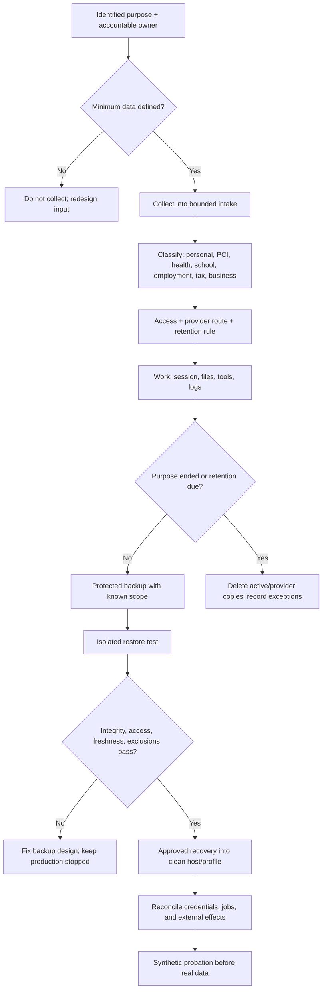

# 14. Sensitive Data, Backups, and Recovery

**Verified against Hermes Agent v0.20.5 (2026-08-19).**

## Opening scenario

On Saturday morning, the Mac mini's external drive reports an error. Alex finds a folder named `important-backup` containing tax documents, school forms, a customer export, session transcripts, a payment-card photo, and a primary mailbox password. It syncs to a personal cloud account. Nobody knows whether Time Machine includes it or where deletion would propagate.

The drive has not failed completely. That is not the good news it first appears to be. The family has copies, but no tested recovery system. Duplication enlarged exposure without proving restoration. Encryption may protect a powered-off disk from a thief, but it does not stop Hermes, malware, or a signed-in person from reading files they can already access. A checkpoint might restore a draft, but not a sent school message or a copied card image. Sync may reproduce accidental deletion instead of preserving a recoverable version.

The Chen–Patels stop Hermes, isolate the drive, remove the card image, revoke the credential, and trace propagation. Harbourlight moves payment collection entirely to its provider's hosted interface. Priya and Alex map purpose, person, location, access, provider route, retention, deletion proof, and backup treatment. They create encrypted backups, then restore in isolation and prove that required state—not prohibited data—returns.

Recovery begins before a failure. It begins by deciding what should never be collected, what must remain accessible, which copies are authoritative, and which external effects no local restore can reverse.

## Definitions

**Personal information (PII in common technical shorthand).** Information about an identifiable individual. Canadian privacy law uses *personal information*; this chapter sometimes uses PII as an operational label, not a legal determination.

**Sensitive data.** Information whose unauthorized access, change, loss, or disclosure could materially harm a person or business. Context, combinations, volume, and use matter.

**Payment-card data.** Account data connected to payment cards. The primary account number (PAN) is cardholder data. Sensitive authentication data includes full track data, card-verification codes or values, and PIN/PIN-block data. PCI SSC prohibits retaining sensitive authentication data after authorization even when encrypted.

**Health data.** Symptoms, diagnoses, prescriptions, appointments, disability information, insurance details, test results, or other information about physical or mental health. Hermes may organize adult-supplied logistics and questions; it does not diagnose, choose treatment, or replace a clinician.

**School data.** Student identifiers, grades, plans, attendance, discipline, guardian messages, location, consent forms, and related health information.

**Employment data.** Résumé evidence, applications, references, evaluations, compensation, accommodations, identity documents, background checks, and employee records. Career preparation does not authorize employer decisions or false representation.

**Tax data.** Slips, receipts, account identifiers, returns, assessments, and working papers used for tax preparation. Hermes can inventory and organize; a person or qualified professional determines filing position and submits.

**Business-confidential data.** Customer records, contracts, prices, credentials, finances, plans, analytics, support history, and intellectual property.

**Data minimization.** Collecting, exposing, copying, and retaining only the fields and time needed for an identified purpose. Redaction after broad collection is useful cleanup, not equivalent to never collecting.

**Retention.** Keeping information for an approved period tied to purpose, legal or contractual requirements, and operational need. **Deletion** is a controlled process that removes required copies and verifies the result; hiding, archiving, compressing, or losing a link is not deletion.

**Access control.** A rule and enforcement mechanism deciding who or what may read, change, or use data. Separate OS users, file permissions, provider roles, and scoped identities are access controls.

**Encryption.** Cryptographic protection that makes data unreadable without the required key or credential. Encryption at rest can reduce loss from stolen media. Once an authorized process decrypts data, encryption does not restrict what that process may do.

**Backup.** A separate recoverable copy made to restore required data after loss or corruption. A backup is useful only when its scope, integrity, credentials, and restore procedure are known.

**Sync.** Replication intended to keep locations current. Sync may copy corruption, deletion, or disclosure. Version history can help, but sync is not automatically a backup.

**Checkpoint.** Hermes's opt-in snapshot of supported local project files before certain mutations. It supports limited local rollback; it is not a complete Hermes-home backup or an external-effect undo system.

**Recovery point objective (RPO).** The amount of recent data the operator is prepared to lose, expressed as time or transactions. **Recovery time objective (RTO)** is the target time to restore an acceptable service. They are planning targets, not guarantees.

**Restore test.** A controlled recovery into a safe destination followed by evidence that selected files, state, permissions, and workflows work and prohibited material did not reappear.

**Uncertain external effect.** An operation whose final state cannot be established from the local result—for example, a send timed out after the provider may have accepted it. Restore does not resolve this; external reconciliation does.

The data lifecycle and recovery path must meet before real work resumes:



## Hermes in practice

### Build the data map before importing a file

Start from purpose, not folders. “Tax,” “school,” and “customers” are topics; they do not say what fields Hermes needs or where copies will appear. For each data set, record:

- accountable human and person or organization represented;
- specific purpose and expected output;
- minimum fields and explicitly prohibited fields;
- source, authoritative location, and approved staging location;
- Hermes profile/process, tools, model route, and provider destinations;
- human and service identities with access;
- session, memory, logs, hook output, caches, exports, checkpoints, and backups that may copy it;
- retention trigger, review date, deletion owner, and evidence;
- recovery priority, RPO, RTO, and restore-test result.

Unknown purpose, owner, location, or legal basis is a stop state. Do not import a whole mailbox or drive “so Hermes can decide what matters.” Extracted text and tool output may enter the session record.

Use an intake copy only when necessary. Strip metadata, unrelated pages, hidden worksheets, comments, prior threads, and other people's data. Replace names with IDs where possible and prefer a current statement to years of history.

Include providers: “stored on the Mac” does not mean “processed only on the Mac.” Put Chapter 6's route and Chapter 11's egress tier on every high-sensitivity row.

### Classify the seven operating data families

Classification should change the workflow:

| Data family | Minimum useful form | Exclude from ordinary Hermes scope | Safe operating posture |
| --- | --- | --- | --- |
| Personal/contact | Name or record ID plus task-specific contact field | Government IDs, recovery answers, unrelated household members | Secondary identity, narrow purpose, recipient preview |
| Payment-card | Provider transaction ID, amount, currency, status, last four digits if needed | Full PAN, verification code, PIN/PIN block, track data, card image | Hosted compliant payment interface; scoped reporting export |
| Health | Appointment time, adult-approved question list, logistics | Raw chart, diagnosis inference, treatment choice, unrelated family history | Minimal adult-controlled copy; clinician handoff |
| School/child | Public notice, event date, packing item, parent-visible form status | Portal password, full student file, health/discipline dossier, private messages | Guardian-controlled export; child-minimized profile |
| Employment | Approved résumé evidence, posting, interview notes | Government ID, background report, accommodation or reference detail unless specifically needed | Career workspace; evidence gate; human submission |
| Tax/financial | Document checklist, issuer, tax year, receipt category, totals for review | Online-banking or tax-portal credentials, full account data, filing authority | Offline or tightly routed preparation; accountant/human handoff |
| Business | Customer record ID, support issue, approved policy, invoice status | Whole customer database, admin credentials, card data, unrelated correspondence | Separate process, read-only export, role-based access |

Categories overlap. Apply the strictest relevant handling until a human separates the fields.

Do not use the labels as a compliance verdict. PIPEDA, substantially similar provincial laws, cross-border rules, and sector laws can apply differently. Harbourlight names a privacy owner and seeks qualified review for its facts.

### Keep payment-card data out of Hermes

The best card-data control for this deployment is non-collection. Customers enter payment information only in the payment provider's hosted, approved interface. Harbourlight receives transaction status, provider identifier, amount, currency, and a display-safe reference. Hermes may reconcile those fields and draft questions for the provider or accountant.

Hermes must not solicit card numbers or verification codes through chat, email, voice, documents, or tickets; take card screenshots; transcribe card details; retain track or PIN data; or put payment credentials in memory, logs, tests, backups, or templates. If data arrives unexpectedly, stop propagation and follow provider/acquirer and qualified PCI guidance.

PCI DSS does not specify one universal maximum retention period for cardholder data; the organization needs a retention and disposal policy based on necessary legal, regulatory, and business purposes. Sensitive authentication data is different: it may not be stored after authorization even if encrypted. Therefore “we encrypted the CVV” is not a solution.

Outsourcing can reduce scope, but does not create compliance or remove provider oversight. This book certifies neither Harbourlight nor Hermes; owners confirm obligations with their acquirer, payment brand, provider, and qualified adviser.

### Minimize health, school, employment, and tax work

For health logistics, store the appointment, clinic contact, approved questions, and transport need—not a symptom narrative. Hermes may organize adult-supplied measurements, but cannot diagnose, replace triage, choose treatment, or decide disclosure. Emergencies use human procedures.

For school work, prefer public calendars and guardian-controlled exports. Keep one event row, not the portal or a raw dossier. Hermes may flag a form and draft a parent's question; it cannot consent, submit work, monitor private messages, or impersonate anyone.

For career work, use the approved evidence bank. Comparisons do not need government IDs, tax/bank data, private reference details, background checks, or accommodation records. Applications remain Amber and truthful.

For tax preparation, index issuer, year, category, status, and restricted location. Avoid copying slips into general sessions or memory. Hermes may find gaps, group receipts, calculate transparent working totals, and prepare questions. A human or qualified professional verifies and files; Hermes gets no primary government, banking, or filing credentials.

### Account for every copy Hermes can create

Hermes stores messages, tool calls, and results in profile-local `~/.hermes/state.db`; pasted text can outlive the working file. Attachments may leave paths or extracted text. Memory, context, exports, job output, logs, and downloads create other copies.

Compression reduces what the model receives in active context; it is not privacy deletion. Archiving hides sessions from ordinary listings but leaves messages and search intact. `hermes sessions optimize` compacts database storage without deleting session data. Session auto-pruning is opt-in and applies to ended sessions; active sessions are not automatically pruned. Use `hermes sessions prune --dry-run` to preview a targeted cleanup and `hermes sessions delete <session_id>` for a named record after required export and review.

Session exports can contain full messages and tool output. `--redact` cannot guarantee removal of every personal fact. Inspect before sharing. `--delete-after-verified --yes` verifies a named single-session export, but that file becomes another governed copy.

Technical trajectories, when explicitly enabled at the library/batch level, record conversations in JSONL and may include reasoning, tool requests, and results. They are not enabled by a normal CLI configuration flag. If an evaluation requires them, use synthetic or minimized data and delete the artifacts under policy.

### Create a retention schedule that can be executed

A retention period needs a trigger and covered locations. Tax, corporate, employment, contractual, dispute, payment, and privacy duties vary; record the source and obtain professional review.

The Chen–Patels use operational defaults for copies created only for Hermes; these are not legal retention periods:

| Copy type | Default operating trigger | Action at trigger | Human exception |
| --- | --- | --- | --- |
| Staged one-time intake | Output verified and appeal/correction window passed | Delete intake and extracted temporary files | Preserve restricted source if a documented duty requires it |
| Draft without external effect | Final artifact accepted or abandoned | Delete superseded drafts; retain decision record without excess content | Hold only if active dispute or business record policy requires |
| Routine ended sessions | Monthly review confirms no open action | Export only required evidence, then prune/delete by approved filter | Pin or retain named incident/decision session |
| Audit ledger | End of defined review/contract period | Delete or anonymize content; retain minimal statistics if useful | Privacy/legal owner documents hold |
| Incident evidence | Incident closure plus approved hold period | Authorized destruction with evidence | Legal/privacy/insurer direction controls |
| Test data | Test ends | Revoke identities, delete tenant/files/sessions/backups where supported | No real data should require preservation |

Every exception names record, reason, authority, owner, and review date. A hold suspends deletion for a defined set; it does not justify more copies. A human approves consequential deletion.

Deletion proceeds from live service to shadows: stop workflows; address files, sessions/memory, exports, downloads, caches, permitted logs, providers, sync, recipients, checkpoints, and expiring backups. Record delayed locations and prevent restoration. A recipient's deletion promise is mitigation, not proof.

### Distinguish encryption, access control, and backup

These controls answer different questions:

| Control | Primary question | Does not answer |
| --- | --- | --- |
| Access control | Who/process can use this data now? | Can it be restored after loss? Is stolen offline media readable? |
| Encryption | Can someone without the key read captured data? | Was access authorized after unlock? Is there a recoverable copy? |
| Backup | Can required state be restored after loss/corruption? | Should the data have been collected? Who can read the backup? |
| Retention/deletion | Should a copy continue to exist? | Was it once disclosed externally? Can another party's copy be erased? |

On Apple-silicon Macs, data is encrypted by hardware-backed mechanisms, and enabling FileVault ties protection to user credentials during boot. FileVault helps protect data at rest when a device is lost; it does not stop the signed-in Hermes process from reading files its OS account can access. Keep the dedicated standard user, narrow permissions, login protection, and whole-process boundary.

Time Machine can encrypt its destination with **Encrypt Backup**. Restoration requires the backup password, so humans keep it separate from the Mac and disk. Lost key custody causes loss; a password beside the drive weakens theft protection.

Do not attach the backup volume to the Hermes runtime during ordinary work. A mounted writable backup can be corrupted, encrypted by malware, or searched by an agent. Connect it for the supported backup process, restrict access, eject it afterward, and maintain another recovery path for high-value state. Cloud sync may complement the design only after provider access, encryption, deletion, residency, versioning, and recovery are reviewed.

### Back up Hermes with known scope

`hermes backup` creates a zip of Hermes configuration, skills, sessions, and data while excluding the codebase and checkpoint store. It uses SQLite's backup API for a consistent database copy while Hermes is running and excludes live WAL/journal sidecars. A full backup includes `.env` and `auth.json`; treat the archive as a concentrated credential set.

`hermes backup --quick` captures critical configuration, database, auth, and cron state, but is not a complete archive. Update-time `updates.pre_update_backup: quick` is also a local state snapshot; `full` adds a Hermes-home zip and `off` disables it.

`hermes profile export` is a portable single-profile archive with credentials excluded. It is not the only recovery copy of secrets/global state. Checkpoints are excluded from Hermes backups and are not portable history.

Use a protected destination outside the live Hermes user. Record checksum, time, source version/profile, scope, exclusions, key custodian, retention, and restore test. Never email a credential-bearing backup. Backing up prohibited data creates durable exposure.

### Test restore, not just backup creation

A green “backup complete” proves archive creation, not recovery. At least quarterly, and after material version, profile, or storage changes, perform an isolated restore drill:

1. Choose a recent backup and record its checksum, source version, profile set, and expected contents.
2. Use a separate test Mac, isolated macOS account, or disposable whole-process environment. Keep production gateways, channels, and egress off.
3. Install the pinned or deliberately compatible Hermes version from a reviewed source. Do not import into the live home just to test.
4. Scan the archive inventory for prohibited data and secrets that should have been revoked. Stop if scope is unexpected.
5. Run `hermes import <zipfile>` only in the isolated target. The command overwrites files in the target Hermes home; stop any gateway first.
6. Verify profiles, sessions, required memories/skills, cron definitions, and checksums. Treat jobs as disabled until a human reviews schedule, delivery, credentials, and prior outcomes.
7. Reissue or reauthenticate machine-bound and high-value credentials rather than assuming restored tokens remain appropriate. Confirm primary credentials and recovery codes are absent.
8. Run synthetic read, write, denied-file, denied-destination, unknown-sender, approval-timeout, and stop tests.
9. Restore one non-sensitive file from Time Machine and use Apple's verification for a supported network destination. Verification does not replace application-level restore testing.
10. Record actual recovery time, maximum data gap, deviations, and remediation. Destroy the test environment and its secrets after evidence is retained minimally.

Recovery is complete only when safe. Start local-only, then one read-only source and one delivery route. Watch for duplicate cron, stale sessions, conflicting profiles, old routes, and queued messages.

### Use checkpoints for local edits, not disaster recovery

Hermes checkpoints are off by default and can be enabled per session with `hermes chat --checkpoints` or globally under `checkpoints.enabled`. They snapshot before `write_file`, `patch`, and documented destructive terminal patterns, at most once per directory per turn, into a shared shadow Git store under `~/.hermes/checkpoints/store/`.

`/rollback diff <N>` previews changes. `/rollback <N>` restores files Hermes changed while preserving detected human edits and also undoes the last conversation turn; `--all` can overwrite human edits. A single-file restore is available. Use the preview before restoring.

The limits matter more than the convenience:

- Missing Git, broad/large directories, or oversized files can cause snapshots to be skipped.
- checkpoint-manager errors are logged at debug level and tools continue, so absence of a checkpoint does not necessarily block a destructive local operation;
- the store is pruned by age, count, and total size and is excluded from `hermes backup`;
- checkpoints cover local project files, not `state.db`, provider state, sent messages, account changes, leaked data, credentials, purchases, or a compromised runtime;
- rollback cannot retract something another person already received.

For high-consequence mutation, require an independent verified backup or version-control branch before action. A checkpoint can shorten recovery from a mistaken local edit. It cannot justify granting the edit.

### Reconcile uncertain external effects before restoring or retrying

A local error may mean the provider rejected, accepted, or accepted without returning a response. Local restore does not change provider state; blind retry can duplicate an effect.

Use the Chapter 13 action ID and inspect the external service read-only by recipient, time, amount, and provider receipt or idempotency key. Freeze downstream actions until the state is classified. If still unknown, escalate to the provider or human recipient and preserve the uncertainty; do not manufacture certainty to close a dashboard item.

Cron makes this rule explicit. Hermes records attempts as `claimed`, `running`, then `completed`, `failed`, or `unknown`. After a restart, an abandoned attempt can become `unknown`; it is kept as an audit record and is not automatically rerun. Inspect with `hermes cron runs [job-id] --limit 20`. The next scheduled tick may still occur normally, so pause the job when a duplicate effect would be harmful and reconcile the previous attempt first.

### Rehearse four incident drills

**Lost device.** From a trusted device, stop gateways/delivery, revoke sessions and tokens, suspend secondary identities, and preserve provider events. Use Apple's current procedure if configured; offline erase may not occur and can destroy evidence. Inventory exposed data, obtain help where needed, rebuild cleanly, restore reviewed data, issue fresh credentials, and run denial tests. FileVault does not close active sessions.

**Leaked token.** Stop consumers; revoke at the provider; identify and rotate reachable secrets; clear caches/sessions; restart narrower; inspect events/spend; and prove old-value denial plus new-value success. Rotating only a leaked bootstrap token is incomplete.

**Wrong recipient.** Stop further sends, record exactly what data and attachment left, contact the recipient through an approved channel to request secure return/deletion, and remove sharing links or access where possible. Preserve evidence, assess sensitivity, volume, safeguards, and harm, and hand the facts to Harbourlight's privacy owner or qualified counsel. The Office of the Privacy Commissioner of Canada advises containment, documentation, investigation, risk assessment, and notification/reporting where applicable. Hermes prepares the incident packet; it does not decide legal notification duties.

**Duplicate action.** Pause the workflow and downstream jobs. Reconcile provider records by action ID. Preserve records until customer, accounting, contractual, and evidence needs are understood; correct, notify as appropriate, add idempotency or a human gate, and test a timeout. Rollback removes neither effect.

## Professional example

Harbourlight's customer system gives Hermes a daily export containing customer record ID, support category, invoice status, currency, amount, and provider transaction reference. It excludes full card data, credentials, mailing history unrelated to the task, and raw customer database access. The payment provider handles card entry; Hermes cannot open the checkout administration or initiate refunds.

Priya owns the data map; Alex is backup owner. Support drafts are retained until approved or abandoned, then superseded copies are removed. Required business records stay in their authoritative system under a professionally reviewed schedule, not in agent memory. Audit records use IDs and hashes rather than message bodies. A quarterly restore drill recovers a minimized test profile with synthetic customer rows and checks cron definitions without activating delivery.

When a support attachment contains a card image, the agent stops processing and quarantines the incident path without redistributing the image. The owners follow their payment provider/acquirer's procedures and qualified advice. They do not save the image “for evidence” in the ordinary audit ledger or claim that encryption makes retention acceptable.

## Personal example

The family profile receives a copied school calendar and a folder of current household forms selected by an adult. It has no child portal, health account, tax account, primary mailbox, or recovery credentials. An activity plan uses initials and event times; a grandparent-facing version omits school identifiers, addresses not needed for transport, and health notes.

Priya's tax checklist contains issuer, year, type, status, and restricted path. Hermes finds gaps and prepares questions. Files remain outside ordinary mounts; adults and their professional own filing and tax choices. Staged copies and sessions are deleted when due; authoritative records follow the reviewed schedule.

## Authority boundaries

| Boundary | Sensitive-data and recovery authority |
| --- | --- |
| **Green — may act** | Inventory metadata without secret values; process minimized staged data in the assigned boundary; create internal checklists and drafts; report backup age and failures; run synthetic restore/denial tests; stop on prohibited or unexpected data; reconcile read-only provider evidence. |
| **Amber — may prepare** | Propose retention/deletion batches, encrypted backup design, restore plan, account or credential recovery, incident notices, provider contact, session export/prune, and re-entry steps. A human verifies scope, duties, people affected, archive contents, target, and evidence before execution. |
| **Red — may not act** | Store card verification/PIN/track data or solicit raw card details; hold primary credentials or recovery codes; maintain raw child, health, employment, tax, or customer dossiers for convenience; decide diagnosis, treatment, tax position, filing, legal notice, employment outcome, or school consent; delete legal/incident evidence autonomously; import over a live Hermes home; retry uncertain external effects; or call encryption, backup, sync, redaction, or checkpoints access control or compliance certification. |

This chapter supports preparation and handoff. Canadian privacy, health, education, employment, tax, payment, and records obligations depend on the organization, province, sector, contracts, and facts; use the appropriate regulator, provider, accountant, lawyer, clinician, or qualified security professional.

## Failure modes and recovery

**Whole archive collected “just in case.”** Stop processing, identify the exact purpose and minimum fields, quarantine the broad copy, recreate a narrow intake from the authoritative source, then delete unnecessary copies under approved procedure. Inspect sessions and providers for propagated content.

**Card or primary credential entered Hermes.** Stop the affected session and routes, restrict access, revoke credentials or follow the payment provider/acquirer's incident path, inventory transcripts/logs/backups, and obtain qualified guidance. Do not paste the value into the incident record.

**Encryption mistaken for access control.** Remove the Hermes account/process from the readable path, reduce mounts and provider roles, lock or stop active sessions, and test access as the Hermes user. Encryption does not help while an authorized process has the key.

**Sync mistaken for backup.** Pause sync if deletion or corruption is propagating. Inspect version history and independent copies, restore into a separate location, verify content, then repair the authoritative set. Add an independent protected backup and a restore schedule.

**Backup contains secrets or prohibited data.** Restrict and isolate the archive, revoke included live credentials, map every duplicate, create a clean minimized replacement, test it, and retire the contaminated copy through the approved destruction process. Encryption does not legalize prohibited retention.

**Backup succeeds but restore fails.** Keep production stopped, preserve the failing archive and logs, check checksum, password/key custody, version compatibility, scope, permissions, and database integrity. Repair the procedure and produce a new tested backup; never mark success from archive creation alone.

**Checkpoint was skipped.** Do not proceed with a high-consequence mutation. Inspect debug logs and checkpoint status, use independent version control or backup, reduce directory/file scope, and repeat the precondition test. Remember that ordinary tools may continue after checkpoint errors.

**Deleted data reappears after restore.** Stop re-entry. Locate the stale backup, sync client, session export, memory, job output, or provider copy; correct the restore manifest and deletion ledger; rotate affected credentials; produce a clean backup and retest exclusions.

**Cron attempt is `unknown`.** Pause the job if it can create effects, query the provider or destination read-only, reconcile by action ID, and document committed/not committed/unknown. Never convert `unknown` to failed merely to permit retry.

## Field kit

### Data map, retention, backup, and drill card

```text
DATA SET
Name / accountable owner / backup owner:
People or organization represented:
Purpose / authority / applicable-review owner:
Classes: personal / PCI / health / school / employment / tax / business
Minimum fields / explicitly prohibited fields:
Authoritative source / staged location / recipients:
Hermes profile, process, tools, model route, provider destinations:
Sessions, memory, logs, hooks, cache, exports, checkpoints, sync, backups:
Human/service access and last review:

RETENTION AND DELETION
Trigger / period / source of requirement:
Active-copy deletion steps:
Provider/recipient/sync/checkpoint treatment:
Backup expiry or restore-exclusion rule:
Hold or exception / owner / review date:
Deletion evidence / verifier:

BACKUP AND RESTORE
Backup type: Time Machine / Hermes full / Hermes quick / other
Scope and exclusions / includes credentials:
Encrypted / key and recovery custodians:
Destination separation / access / retention:
Last successful backup / checksum:
RPO / RTO:
Isolated restore target and Hermes version:
Files/state/workflows tested:
Prohibited-data and primary-credential absence test:
Synthetic allow/deny and delivery-disabled tests:
Actual recovery time / data gap / remediation:

INCIDENT DRILL
Scenario: lost device / leaked token / wrong recipient / duplicate action
Stop and containment owner:
Credentials, channels, and jobs paused/revoked:
Data/effect reconciliation evidence:
Privacy/provider/professional handoff:
Clean rebuild/restore source:
Probation and denial tests:
Lessons / policy change / next drill:
```

## Exercise

The family discovers that a shared Hermes folder contains Priya's tax slips, a school accommodation letter, a Harbourlight customer export with card numbers and verification codes, a résumé, and a primary mailbox password. It is synchronized to the cloud and included in an unencrypted Time Machine disk. A reminder cron job was running when the Mac rebooted; its attempt is now `unknown`. Design the first 24 hours, the corrected data map, the retention/deletion path, the backup architecture, and a restore test. Explain what can and cannot be recovered by checkpoint, Hermes backup, Time Machine, provider logs, and credential rotation.

## Answer or rubric

First contain: stop Hermes, gateways, cron, sync, and access to the folder; do not repeatedly open or redistribute it. Revoke the primary credential and any tokens reachable through it, preserve minimal incident evidence, inspect provider and cron ledgers, and involve the payment provider/acquirer plus qualified privacy/security help. The card verification codes are prohibited post-authorization even if encrypted; move all payment entry to a hosted provider and keep only safe transaction references. The child, tax, employment, and customer files require separate purposes, locations, identities, routes, owners, and professional retention review.

The corrected design excludes primary credentials and raw card data, minimizes the school letter and tax working set, restricts the authoritative sources, and accounts for sessions, cloud copies, recipients, logs, checkpoints, and backups. Time Machine should use encrypted backup with independent human-held recovery material; Hermes full backups receive restricted encrypted treatment because they include credentials. A clean backup replaces the contaminated one only after mapped deletion and credential rotation.

Restore occurs in an isolated environment with delivery disabled. It verifies checksums, required profile/session/cron state, permissions, exclusions, and synthetic controls. Checkpoints can restore supported local project files only. Hermes backup restores Hermes-home state but excludes the codebase and checkpoint store. Time Machine restores selected Mac files but cannot retract disclosure. Provider logs reconcile external effects; rotation removes future credential power but cannot erase a copied value or data. The `unknown` cron attempt is never blindly retried.

Award two points each for immediate containment, PCI handling, seven-class data map, minimization, Canadian professional handoff, copy inventory, retention/deletion, encryption/access/backup distinction, restore evidence, and uncertain-effect reconciliation. Sixteen of twenty indicates mastery; retaining raw card data, relying on encryption as permission, or retrying the unknown job requires a full redesign.

## Mastery checklist

- [ ] I map purpose, minimum fields, owner, locations, routes, retention, deletion, and recovery before ingesting data.
- [ ] I keep full card data, verification codes, PIN/track data, primary credentials, recovery codes, and raw child dossiers out of Hermes.
- [ ] I use hosted payment collection and do not claim PCI certification.
- [ ] I keep health, school, employment, tax, and legal work at preparation and professional handoff.
- [ ] I account for session text, tool results, memory, logs, hooks, exports, sync, checkpoints, providers, and backups as copies.
- [ ] I know that compression, archive, optimization, and redaction are not complete deletion.
- [ ] I distinguish encryption, access control, backup, sync, retention, and deletion.
- [ ] I treat a full Hermes backup as credential-bearing and a profile export as credential-excluding.
- [ ] I understand that checkpoints are opt-in, can fail non-fatally, and cover only supported local file changes.
- [ ] I test restores in isolation with delivery disabled and prove exclusions as well as recovered contents.
- [ ] I keep backup passwords and recovery material human-controlled and separate from the protected media.
- [ ] I reconcile provider state before retrying any uncertain external effect.
- [ ] I can run lost-device, leaked-token, wrong-recipient, and duplicate-action drills.

## References

- Nous Research, [Checkpoints and rollback](https://github.com/NousResearch/hermes-agent/blob/v2026.8.19/website/docs/user-guide/checkpoints-and-rollback.md).
- Nous Research, [Sessions, export, pruning, and storage](https://github.com/NousResearch/hermes-agent/blob/v2026.8.19/website/docs/user-guide/sessions.md).
- Nous Research, [CLI commands: backup and import](https://github.com/NousResearch/hermes-agent/blob/v2026.8.19/website/docs/reference/cli-commands.md).
- Nous Research, [Updating and pre-update backups](https://github.com/NousResearch/hermes-agent/blob/v2026.8.19/website/docs/getting-started/updating.md).
- Nous Research, [Cron execution history and unknown outcomes](https://github.com/NousResearch/hermes-agent/blob/v2026.8.19/website/docs/user-guide/features/cron.md).
- Nous Research, [Hermes Agent Security Policy](https://github.com/NousResearch/hermes-agent/blob/v2026.8.19/SECURITY.md).
- Nous Research, [Secrets overview](https://github.com/NousResearch/hermes-agent/blob/v2026.8.19/website/docs/user-guide/secrets/index.md).
- Payment Card Industry Security Standards Council, [Are merchants allowed to request card-verification codes/values?](https://www.pcisecuritystandards.org/faqs/are-merchants-allowed-to-request-card-verification-codes-values-from-cardholders/) (accessed 2026-08-21).
- Payment Card Industry Security Standards Council, [What is the maximum period cardholder data may be stored?](https://www.pcisecuritystandards.org/faqs/1318/) (accessed 2026-08-21).
- Payment Card Industry Security Standards Council, [Does PCI DSS apply when payment processing is outsourced?](https://www.pcisecuritystandards.org/faqs/does-pci-dss-apply-to-merchants-who-outsource-all-payment-processing-operations-and-never-store-process-or-transmit-cardholder-data/) (accessed 2026-08-21).
- Office of the Privacy Commissioner of Canada, [PIPEDA fair information principles](https://www.priv.gc.ca/en/privacy-topics/privacy-laws-in-canada/the-personal-information-protection-and-electronic-documents-act-pipeda/p_principle/) (accessed 2026-08-21).
- Office of the Privacy Commissioner of Canada, [Provincial laws that may apply instead of PIPEDA](https://www.priv.gc.ca/en/privacy-topics/privacy-laws-in-canada/the-personal-information-protection-and-electronic-documents-act-pipeda/r_o_p/prov-pipeda/) (accessed 2026-08-21).
- Office of the Privacy Commissioner of Canada, [Contain a privacy breach at your business](https://www.priv.gc.ca/en/privacy-topics/business-privacy/breaches-and-safeguards/privacy-breaches-at-your-business/contain_pb/) (accessed 2026-08-21).
- Apple, [Back up your Mac with Time Machine](https://support.apple.com/en-us/104984) (accessed 2026-08-21).
- Apple, [Verify your backup disk on Mac](https://support.apple.com/guide/mac-help/verify-your-backup-disk-mh26840/mac) (accessed 2026-08-21).
- Apple, [Volume encryption with FileVault in macOS](https://support.apple.com/guide/security/sec4c6dc1b6e/web) (accessed 2026-08-21).
