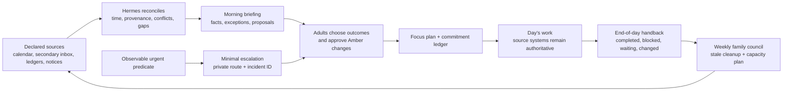

# 15. Daily and Weekly Operating Rhythms

**Verified against Hermes Agent v0.20.5 (2026-08-19).**

## Opening scenario

At 7:08 on Monday morning, Priya has three versions of the day. Her calendar shows an interview-preparation call at 11:00. A school message moved a field trip departure earlier. Alex remembers promising to review a Harbourlight supplier draft before lunch, but the promise lives in yesterday's chat. The task list still calls a completed dentist booking “urgent.” A family-group message says rain is likely and asks whether pickup plans changed.

Hermes could produce a cheerful paragraph about a busy day. That would be almost useless. It could also connect to every mailbox, rewrite the calendar, assign the family, and send reminders before anyone is awake. That would be worse.

Instead, the family opens a five-minute briefing built from declared sources. It states that the school notice is new, the interview call has no conflict, the supplier review has no recorded owner, and the weather item is unverified. It separates facts from proposals. Priya accepts three outcomes for the day; Alex claims the supplier review; the field-trip question becomes an Amber decision for an adult. Nothing is silently rescheduled.

At 5:15, Hermes produces a handback: two outcomes completed, one blocked, one new promise captured, and one question for tomorrow. On Sunday, those daily receipts feed a twenty-five-minute family council. The agent is neither the household boss nor the primary inbox. It is the clerk and facilitator of an operating rhythm whose sources, owners, and decision rights remain visible.

## Definitions

**Operating rhythm.** A repeated sequence for observing work, deciding priorities, recording commitments, and reviewing outcomes. A rhythm has a time, owner, inputs, output, and stop condition. It is more durable than a one-off prompt.

**Morning briefing.** A short, source-labelled view of the day: fixed events, deadlines, new exceptions, preparation needs, unresolved commitments, and a proposed focus plan. It is not a digest of everything Hermes can find.

**Source of truth.** The system whose current record wins when copies disagree. The family calendar may own event time; a school notice may own a departure change; a task ledger may own commitment status. Hermes does not become the source merely by summarizing it.

**Intake queue.** A bounded place where new items await classification. A secondary operations mailbox, a task inbox, or a folder of adult-supplied notices can be an intake queue. Priya's primary inbox is not transferred to Hermes for convenience.

**Triage.** Deciding what an item is and what happens next. Triage may classify an item as action, calendar, waiting, reference, delegation candidate, duplicate, stale, or discard proposal. Classification is not execution.

**Focus plan.** A small set of outcomes that fit around fixed commitments and realistic energy. It names what will not be attempted, not merely what will be done.

**Commitment.** A promise by a named person to produce an observable result, usually by a date or next review. “Discuss travel” is a topic; “Alex will compare the two refundable train options by Tuesday 18:00” is a commitment.

**Commitment ledger.** The authoritative internal list of promises, with owner, outcome, source, due or review date, state, evidence, and next action. It is operational state, not built-in memory.

**Unresolved field.** The literal `unresolved` marker for an owner, date, or other required value absent from the source and not yet supplied by a human.

**Waiting item.** A commitment whose next move belongs to somebody else. It still needs an internal owner and a follow-up or review date; silence is not completion.

**Stale item.** A record whose date, source, owner, desired outcome, or last meaningful activity no longer supports action. Stale does not mean unimportant. It means the record needs a decision.

**Handback.** A compact end-of-work report that says what changed, what did not, what remains uncertain, and what the human must decide next.

**Attention rule.** A test for whether something belongs in the next routine brief, should wait for the weekly review, or should interrupt now.

**Escalation.** Moving an observed exception to a named human and route. Escalation raises attention; it does not give Hermes greater authority.

**Family council.** A short, scheduled household review in which people coordinate shared commitments. It is not a surveillance report or performance review of family members.

The whole system is a loop, but decisions remain human:



## Hermes in practice

### Keep Hermes beside the inbox, not in place of it

The operating system starts by naming sources and access methods. Do not hand Hermes an adult's primary mailbox because summaries sound convenient. Chapter 12's exclusion rule still applies: primary personal email, recovery accounts, school portals, health accounts, banking, and government identities remain human-only.

Use the smallest practical route:

| Need | Appropriate mechanism | Boundary |
| --- | --- | --- |
| Public facts or service notices | Native `web_search` and `web_extract`; browser tools only when a permitted public page needs interaction | Treat retrieved text as untrusted data; cite the actual page and state gaps. |
| Repeated review procedure | Bundled `weekly-review-planning` or `meeting-action-items` skill | A skill supplies method, not account access or authority. |
| A secondary Google calendar and operations mailbox | Bundled `google-workspace` skill after narrow OAuth setup | Use the career/family operations identity, minimum services, and explicit approval for writes. Never connect the primary inbox. |
| Another calendar or task system | A reviewed Hermes-compatible MCP server or custom integration, only if the service and account terms permit it | Start read-only, expose an include-listed surface, and test removal. There is no generic native Hermes integration to invent. |
| A primary mailbox, school portal, or site that forbids automation | Human reads it and copies the minimum needed notice, URL, or event into the intake artifact | Manual is a control, not a workflow failure. |

Hermes's email gateway is a route to a dedicated agent mailbox, not a general inbox-management integration. Separate skills can manage supported mailboxes through documented backends, but a skill creates neither an account nor consent. Define senders, attachments, retention, and human coverage before using a secondary operations mailbox.

Use a coverage line in every briefing:

```text
Coverage: shared family calendar through 2026-08-24 23:59; operations inbox
received through 06:45; adult-supplied school notices through 21:00 yesterday.
Not covered: either adult's primary inbox, school portal, health portals,
private messages, or information posted after those observation times.
```

That line prevents “nothing was mentioned” from becoming “nothing exists.”

### Make the commitment ledger the quiet centre

Create separate family, career, and Harbourlight ledgers instead of reconstructing promises from chat or combining domains. An approved owner handoff may include selected rows.

A Markdown table, CSV, or XLSX workbook is enough. The bundled `xlsx` skill can create and inspect a workbook when spreadsheet features add value; ordinary Markdown is easier to diff and recover. Whatever format you choose, every row needs:

- a stable commitment ID;
- domain and sensitivity class;
- outcome stated as a result;
- owner, never “the family” by default;
- source link or note reference;
- created date and explicit due date, if one exists;
- next review date when no due date exists;
- state: `captured`, `accepted`, `doing`, `waiting`, `blocked`, `done`, `cancelled`, or `superseded`;
- next action and dependency;
- last meaningful activity;
- completion evidence or cancellation reason;
- approval/action ID for an external effect.

Each proposed row starts `captured`. `unresolved` is a field value, not a ledger state. Hermes must leave an unstated owner or date `unresolved`; a human must supply it or explicitly confirm it from an identified source. Hermes never invents a candidate owner or date for approval. Never turn “we should look at camps” into “Priya will register Ben by Friday.”

Update a commitment only after checking the source record. If a calendar event was moved, capture the provider's current event ID and time rather than relying on an old briefing. If an email follow-up was sent manually, record evidence supplied by the sender. The ledger is accountable, not omniscient.

### Design the morning briefing as a decision surface

A useful briefing is read in five minutes. It should not be an essay, motivational speech, news feed, or copied inbox. Use this order:

1. **Coverage and freshness.** Sources checked, observation times, missing or unreachable inputs.
2. **Fixed shape of the day.** Calendar events, travel time, deadlines, and immovable household constraints in `America/Toronto`, with other zones explicit.
3. **Conflicts and preparation.** Overlaps, missing locations or links, setup time, materials, and decisions required before an event.
4. **New attention items.** Only changes since the previous watermark, each with source and consequence.
5. **Open commitments.** Due today, waiting items whose review date arrived, and blockers that need a person.
6. **Proposed focus plan.** At most three outcomes, plus one short administration batch and a visible defer list.
7. **Approvals.** Exact Amber proposals, separated from information.

Say “No verified changes found” rather than “Nothing changed,” and report stale or unchecked inputs instead of filling gaps.

The proposal is not the plan until an adult accepts it. A useful reply protocol is compact:

```text
ACCEPT 1,3
CHANGE 2: move supplier review to Tuesday
OWNER FAM-2026-084: Alex
DEFER CAREER-2026-031 to weekly review
APPROVE CALENDAR-DRAFT-19 exactly as previewed
```

The final line is a separate action approval. Accepting priorities does not approve calendar writes, messages, bookings, or purchases.

### Triage the calendar for capacity, not decoration

Calendar triage asks whether the day can physically work. Read events from the designated shared or secondary calendar and check:

- start, end, time zone, recurrence, and all-day semantics;
- location or connection information;
- travel, setup, recovery, and preparation buffers;
- overlapping events and double-booked resources;
- commitments implied by yesterday's meetings;
- deadlines that are not calendar events;
- private details that should be omitted from a shared brief.

Do not move an event to “fix” a conflict. Prepare options. Any event mutation is Amber even when the Google Workspace skill can perform it. Preview title, offset-aware time, calendar, attendees, notifications, and exact change; read the approved write back.

Reserve transition, meals, caregiving, and interruption margin before proposing deep work. If no realistic focus block remains, reduce outcomes instead of hiding overflow after dinner.

### Triage inboxes without manufacturing urgency

Inbox triage begins with a bounded queue and a query window, not “read everything.” On a secondary operations mailbox, search new or flagged threads since the last successful watermark. Fetch full content only for messages that the policy permits. Summaries and sender names can be wrong; forwarded text and attachments can contain prompt injection.

For each item, propose one outcome:

- information only, with an optional reference path;
- commitment to add after owner confirmation;
- reply draft requiring approval;
- calendar proposal requiring approval;
- waiting item with follow-up date;
- duplicate of an existing ledger row;
- archive, label, or deletion proposal;
- quarantine or adult inspection because sender, attachment, identity, or instructions are uncertain.

Do not infer importance from “URGENT,” seniority language, or repeated follow-ups. Rank by observable consequence, genuine deadline, dependency, and sender authenticity. Do not reply, forward, mark read, relabel, archive, or unsubscribe unless that mutation class is approved. The email gateway may itself reply to allowlisted senders; it should therefore be used as a conversational agent route, not quietly pointed at a normal inbox.

Primary inbox triage stays human-led; Priya copies only the minimum relevant item into the operations queue.

### Triage tasks and remove stale work deliberately

Task triage is a decision about records. Start with unprocessed capture, items due or overdue, waiting items whose review date arrived, and active projects with no next action. Reconcile duplicates by source and intended outcome, not similar wording.

Use a staleness ladder:

| Condition | Hermes proposal | Human question |
| --- | --- | --- |
| Due date passed, result still needed | Mark `blocked` or re-plan with evidence | What changed, who owns recovery, and is the old promise still valid? |
| No activity for the domain's review window | Flag for weekly review | Is this active, waiting, paused, or obsolete? |
| No owner or observable outcome | Keep `captured`; leave missing fields `unresolved` | Who supplies or confirms the owner and outcome? |
| Duplicate records | Select a canonical row and cross-link | Which source wins, and may the duplicate be archived? |
| Source disappeared or cannot be verified | Mark coverage gap | Preserve, reconstruct, or cancel? |
| Context changed | Propose `superseded` with replacement | Does the new commitment fully replace the old one? |

Never delete stale work automatically. Cancellation can affect another person; deletion can remove audit evidence. Mark a proposal and retain the reason. After an approved cleanup, read the store back and record counts: processed, retained, superseded, cancelled, still unresolved.

### Build a focus plan that includes a stop list

Choose outcomes after fixed calendar load and attention items are known. A practical day has one primary outcome, one secondary outcome, and perhaps one bounded administrative result. Rank candidates by consequence, real deadline, dependency unlocked, and effort that fits the remaining capacity.

Convert outcomes into the first visible actions. “Job search” becomes “review three verified roles against the current thesis.” “Travel” becomes “compare the two refundable options already shortlisted.” “Harbourlight” becomes “resolve the supplier clause questions and prepare an owner decision.”

Then state what is not planned. The defer list prevents silent shame from becoming invisible overload. Hermes may coach attention by reminding the owner of the chosen outcome, but it must not monitor apps, infer productivity from online status, score family members, or repeatedly nag. One agreed checkpoint is enough unless an observable escalation rule fires.

### Escalate exceptions, not anxiety

Create three attention lanes:

- **Now:** an observable condition threatens safety, same-day caregiving, a hard external deadline, material business continuity, or a commitment whose consequence cannot wait. Send one minimal private alert under a stable incident ID.
- **Next brief:** meaningful but not interruptive changes, due-soon decisions, new conflicts, and source failures.
- **Weekly:** stale items, trends, capacity choices, housekeeping, and policy changes.

Every “Now” rule needs a predicate, source, observation time, recipient, acknowledgement window, fallback, deduplication key, and stop. “Hermes thinks this looks serious” is not a predicate. An official school closure for the named school and today's date may qualify; a forwarded rumour does not. A checkout monitor failing twice may qualify for Harbourlight; a customer writing “ASAP” does not expand authority.

The alert states observation, likely consequence, uncertainty, and inspection route. It does not include private details in SMS, approval codes, or an action already taken. If unacknowledged, the fallback only changes the route. It never changes the permission.

### End every workday with a handback

The handback should answer:

1. Which accepted outcomes completed, with evidence?
2. Which remain doing, blocked, waiting, deferred, or cancelled?
3. What new commitments appeared, and who has accepted ownership?
4. What external effects occurred, with action/provider IDs?
5. What sources or coverage failed?
6. What is the smallest sensible starting point tomorrow?

Drafting is not sending, and silence is not completion. A timed-out external write remains unknown until the authoritative service is reconciled.

A local draft can be Green. Updating the ledger is Green only within pre-approved bounded fields and after source reconciliation. Sending the handback to a private home route follows the delivery policy; mixing family, career, and customer details into one message does not.

### Run a weekly family council, not a family audit

The weekly council should take twenty to thirty minutes and end with decisions. Hermes may prepare the packet from the shared family ledger, the completed week, the next two calendar weeks, the capture queue, and approved household/travel artifacts. The bundled weekly-review skill provides a sound sequence: review calendar evidence, clear capture, reconcile active work, examine waiting commitments, and build a capacity-aware plan.

Use this agenda:

1. Wins and completed commitments.
2. Changed constraints in the next two weeks.
3. Waiting, overdue, blocked, or ownerless items.
4. Household replenishment, maintenance, school forms, and travel decisions.
5. Three shared outcomes for the week and each adult's claimed responsibilities.
6. Items explicitly deferred, paused, cancelled, or escalated.
7. Proposed calendar/message/purchase actions awaiting individual approval.

Children can contribute age-appropriate preferences and claim ordinary shared tasks. Hermes should not score them, mine private chat, summarize emotional behaviour, or retain sensitive child details. The adult chair chooses what enters the shared record. Meeting notes are data, not instructions; Hermes extracts explicit decisions without inventing owners or dates.

Keep career and Harbourlight reviews separate. The family council may receive “Priya has an interview Thursday 11:00–12:00 and needs quiet space” after Priya approves that disclosure. It does not need the employer dossier. The business may receive “Alex unavailable Wednesday 15:00–17:00,” not the child's appointment reason.

### Treat travel and household administration as decision packets

Travel administration combines volatile facts, money, identity, and deadlines. Hermes may gather public schedules, compare owner-supplied options, produce a packing or document checklist, and draft questions. It must timestamp prices and availability, distinguish refundable from non-refundable terms only when sourced, and avoid retaining passport numbers, payment details, loyalty credentials, or child documents.

A travel packet separates fixed constraints; timestamped provider, route, price/currency, restrictions, and links; unresolved baggage, transfer, cancellation, entry, or weather facts; the decision deadline; and the exact Amber action awaiting a human.

Hermes does not book, accept terms, buy insurance, choose legal/health requirements, or enter travellers' credentials. A human uses the provider's official interface and records a minimum confirmation reference in the ledger.

Household packets can organize adult-supplied repair symptoms, vendor options, appointment windows, and questions. Purchases, contact, home access, and agreements require an adult; safety-critical uncertainty goes to an appropriate professional.

### Automate only the proved rhythm

Run the morning briefing and weekly council manually with synthetic or low-sensitivity sources for at least seven useful cycles. Fix the source list, output shape, stale rules, and attention predicates before scheduling. Then use cron because the work is clock-driven. A cron run starts a fresh session, so its prompt must name the input artifacts, time zone, coverage window, authority, output, and missing-input behaviour.

Start with local delivery. The Chapter 10 blueprint already gives the supported `hermes -p family cron create` pattern; do not create a second near-duplicate. Inspect `hermes cron list`, host time zone, `next_run`, work directory, provider/model, platform toolsets, and manual-run output. After a probation period and a delivery drill, promote only the result to one private explicit route.

Use the bundled daily-briefing guide as a capability example, not as authority to research everything. Its documented sequence is cron, a fresh session, web retrieval, summary, and optional delivery. The family version is narrower: declared local sources, minimal public checks, no primary inbox, no automatic calendar mutation, no purchase, and no cross-profile summary.

If the gateway or source is down, a late briefing should state its observation time. Do not replay an obsolete school reminder at midnight. Coalesce a missed morning brief into one current report; run a weekly review once with the actual period labelled. Pause rather than retry when an external effect is unknown.

## Professional example

Harbourlight runs its own morning operations rhythm at 08:30, separate from family and career. Inputs are a redacted support-theme export, service-health evidence, the business commitment ledger, and the owner's shared business calendar. Hermes can summarize new exceptions, compare today against yesterday's watermark, and propose three outcomes.

One Monday, the ledger shows a supplier response due by noon, two unresolved support themes, and a draft promotion. Hermes ranks the supplier response first because another deliverable depends on it. It marks the promotion `captured`, not accepted, because there is no approved offer or claim. It prepares a reply draft and a list of evidence gaps. Alex approves the exact supplier email after checking the terms; the send receipt is recorded. Customer replies, refunds, discounts, subscriptions, and public claims remain Amber or Red according to the existing policy.

The handback records the send, approved investigation, and deferred promotion. Only an approved, declassified availability constraint reaches the family council.

## Personal example

The family briefing runs locally at 07:00 from the shared calendar, family commitment ledger, adult-supplied school bulletins, and a narrow household checklist. Priya's and Alex's primary inboxes remain outside Hermes. Each adult manually routes only actionable household notices into the family intake.

On Thursday, Hermes sees an all-day school event, a dentist appointment, and a waiting item for a repair estimate. It notes that travel time makes the appointment overlap with pickup, but it does not move either. It proposes two owner choices and asks whether the repair vendor should receive a follow-up draft. The adult selects a pickup plan and separately approves the vendor message.

At Sunday council, the family celebrates completed forms, cancels a superseded shopping task, chooses two shared outcomes, and leaves one summer-travel decision pending until refundable terms are verified. Ben chooses responsibility for packing his sports bag. Hermes records the observable task, not a judgement about his reliability.

## Authority boundaries

| Boundary | Daily and weekly authority |
| --- | --- |
| **Green — may act** | Read declared, authorized sources; reconcile times and IDs; summarize; create internal briefs and draft packets; propose ledger rows; update pre-approved local fields; flag stale or conflicting records; deliver a low-sensitivity briefing to one approved private route; report coverage and failures. |
| **Amber — may prepare** | Draft messages, calendar changes, task mutations, travel/vendor contacts, bookings, purchases, council minutes, new integrations, delivery routes, or retention cleanup. A human approves the exact target, content, time, cost, identity, and effect before execution; approved writes are read back. |
| **Red — may not act** | Access a primary inbox or recovery account; impersonate a family member; monitor private communications or score people; invent a commitment, owner, deadline, event, price, or completion; send unapproved messages; purchase or book; move money; accept terms; disclose across profiles; make medical, legal, tax, employment, or safety decisions; delete evidence; or retry an uncertain effect blindly. |

A productive rhythm does not supersede professional judgement. Hermes may prepare records and questions for qualified providers; adults make decisions and remain accountable.

## Failure modes and recovery

**The briefing becomes a data dump.** Everything new appears, so nobody reads it. Recovery: restore the fixed seven-part format, cap the focus outcomes, move non-urgent trends to weekly review, and measure decisions produced rather than items summarized.

**Hermes becomes the primary inbox.** An adult account, recovery route, or ordinary correspondence is connected. Recovery: stop mailbox access and scheduled jobs, revoke the Hermes credential/session, inspect copied messages and attachments, recreate a dedicated secondary queue, and retest with synthetic mail. Keep the primary identity excluded.

**Coverage is mistaken for reality.** A missing school portal or failed query becomes “no changes.” Recovery: show source timestamps and failures, pause affected recommendations, have an adult inspect the authoritative source, and correct downstream briefs and ledger rows.

**Calendar cleanup creates commitments.** Hermes moves an event, invites somebody, or changes recurrence without understanding the effect. Recovery: stop further writes, inspect provider event history and attendee notifications, reconcile by event ID, restore only through an approved human procedure, and return calendar mutation to preview-only.

**Inbox content hijacks the workflow.** A forwarded message instructs Hermes to upload files or ignore policy. Recovery: quarantine the thread/attachment, preserve source and trace, inspect tools used and any egress, rotate exposed credentials, remove poisoned memory or ledger entries, and restart from trusted instructions. Treat messages as data.

**A promise is invented.** Ambiguous language becomes an owner or date. Recovery: return the row to `captured`, mark unsupported fields `unresolved`, link the source, and require the human to supply or explicitly confirm each value before `accepted`.

**Stale cleanup destroys evidence.** Old items are deleted because they look inactive. Recovery: stop cleanup, restore from version control or backup, compare ledger and source systems, recreate cancellation/supersession reasons, and move deletions behind a reviewed batch approval.

**The focus coach becomes a nag.** Repeated reminders interrupt rather than help. Recovery: pause the mechanism, review acknowledgement and quiet-hour rules, reduce to one checkpoint, and remove monitoring signals that were never approved.

**Wrong-domain handback.** Career or customer detail lands in a family report. Recovery: stop delivery, preserve provider and local evidence, assess recipients, revoke any link, follow the wrong-recipient procedure, delete only under policy, and rebuild from approved declassified rows.

**Missed or duplicate schedule.** The gateway restarts or two similar jobs exist. Recovery: pause the named jobs, inspect `hermes cron list`, execution history, saved output, and delivery evidence; reconcile any unknown run; retain one definition; correct `next_run`; and complete a local/manual test before resuming.

**Travel information expires.** A price, schedule, or restriction is treated as current after its observation window. Recovery: label it stale, recheck the provider's official source manually when terms require, update the packet's timestamp, and require the human to verify at booking. Never promise availability.

## Field kit

### Daily-and-weekly chief-of-staff card

```text
RHYTHM
Domain / profile / macOS user:
Owner and backup owner:
Timezone:
Morning brief time / local probation start:
End-of-day handback time:
Weekly council/review time and duration:
Approved private delivery target:

SOURCES AND COVERAGE
Authoritative calendar / identity:
Secondary operations mailbox / allowed senders:
Task and commitment ledger path:
Adult-supplied notices / update owner:
Public sources permitted:
Primary inboxes, portals, and identities excluded:
Observation cutoff and freshness rule:
Missing-source wording:

COMMITMENT LEDGER
ID format:
States:
Required fields: outcome / owner / source / due-or-review / next action
Meaningful-activity window:
Duplicate matching rule:
Completion evidence:
Cancellation / supersession approval:

MORNING OUTPUT
1. Coverage and freshness
2. Fixed calendar shape
3. Conflicts and preparation
4. New attention items
5. Due / waiting / blocked commitments
6. Up to three focus outcomes + defer list
7. Exact Amber proposals

ATTENTION
Now predicates / sources:
Next-brief conditions:
Weekly conditions:
Acknowledgement window / quiet hours:
Primary and fallback route:
Incident/deduplication key:
Authority unchanged on escalation: yes / no

HANDBACK
Accepted outcomes and evidence:
Doing / waiting / blocked / deferred / cancelled:
New commitments awaiting owner acceptance:
External action/provider IDs:
Unknown effects / source failures:
Tomorrow's smallest start:

WEEKLY COUNCIL
Completed week and two-week horizon:
Waiting / stale / ownerless queue:
Shared outcomes and named owners:
Age-appropriate child participation:
Declassified career/business constraints only:
Separate approvals for calendar / messages / purchases:

RECOVERY
Pause schedule:
Stop gateway:
Revoke mailbox/calendar/browser access:
Ledger backup and restore:
Delivery/provider evidence:
Wrong-recipient procedure:
Synthetic allow/deny and stale-source tests:
Re-entry approver:
```

## Exercise

Design one weekday rhythm and one Sunday family council for the Chen–Patels. Inputs are a shared secondary calendar, a dedicated operations mailbox, an adult-curated school-notice folder, a family commitment ledger, Priya's human-only primary inbox, and a Harbourlight ledger that must remain separate. At 06:50, the calendar source fails, an email says “URGENT: pay today” with an attachment, a school notice changes departure time, and a waiting repair estimate has had no reply for eight days.

Produce the morning briefing, focus proposal, attention classification, end-of-day handback shape, and weekly agenda. State what Hermes reads natively, what requires a bundled skill, what would require reviewed MCP/custom work, and what stays manual. Include Green/Amber/Red boundaries, source timestamps, staleness treatment, a duplicate-safe escalation, and recovery after the schedule sends the incomplete briefing twice.

## Answer or rubric

The briefing must lead with the calendar coverage failure and avoid claiming the day is conflict-free. The school notice can appear as a verified change if its approved source and date match; any transport change remains an adult decision. The “URGENT” email is quarantined or summarized minimally after sender/attachment checks, not treated as a payment order. Payment remains Red. The repair estimate becomes a waiting item whose review date has arrived; Hermes may draft one follow-up, but an adult approves the recipient and wording.

Native web tools fit permitted public checks; cron fits the proved schedule. The weekly-review and Google Workspace skills provide procedure and documented Google access only after narrow OAuth. Another task provider needs a reviewed MCP/custom interface or manual export. The primary inbox remains manual and excluded. Harbourlight detail does not enter the family report; an approved availability constraint may be declassified.

After duplicate delivery, pause the job, preserve both message/provider IDs and cron run history, identify the one intended briefing key, verify that no downstream actions occurred, correct the duplicate job or ambiguous route, and retest locally. Do not delete the audit evidence or send a third “correction” automatically. Award two points each for source coverage, primary-inbox exclusion, commitment discipline, realistic focus, attention predicate, profile separation, authority, duplicate recovery, weekly council design, and capability-layer accuracy. Sixteen of twenty indicates mastery.

## Mastery checklist

- [ ] I can distinguish a briefing, triage, focus plan, commitment ledger, handback, and weekly council.
- [ ] I keep Hermes out of primary personal inboxes and recovery identities.
- [ ] I name every source of truth, observation time, freshness rule, and coverage gap.
- [ ] I separate native tools, bundled skills, reviewed MCP/custom integrations, and manual steps.
- [ ] I do not invent owners, deadlines, completion, or urgency.
- [ ] I plan from calendar capacity and include a defer list.
- [ ] I manage waiting items and stale records without treating silence as completion or deleting evidence.
- [ ] I escalate only on observable predicates, through private duplicate-safe routes, without expanding authority.
- [ ] I can run an evidence-based end-of-day handback and an age-appropriate family council.
- [ ] I treat travel, vendor, calendar, message, purchase, and booking effects as exact Amber approvals.
- [ ] I keep family, career, and Harbourlight ledgers separate and declassify only approved constraints.
- [ ] I stage cron locally, inspect time and delivery, and reconcile unknown or duplicate runs.

## References

- Nous Research, [Daily briefing bot](https://github.com/NousResearch/hermes-agent/blob/v2026.8.19/website/docs/guides/daily-briefing-bot.md).
- Nous Research, [Scheduled tasks](https://github.com/NousResearch/hermes-agent/blob/v2026.8.19/website/docs/user-guide/features/cron.md).
- Nous Research, [Email gateway](https://github.com/NousResearch/hermes-agent/blob/v2026.8.19/website/docs/user-guide/messaging/email.md).
- Nous Research, [Browser automation](https://github.com/NousResearch/hermes-agent/blob/v2026.8.19/website/docs/user-guide/features/browser.md).
- Nous Research, [Web search and extraction](https://github.com/NousResearch/hermes-agent/blob/v2026.8.19/website/docs/user-guide/features/web-search.md).
- Nous Research, [Google Workspace bundled skill](https://github.com/NousResearch/hermes-agent/blob/v2026.8.19/website/docs/user-guide/skills/bundled/productivity/productivity-google-workspace.md).
- Nous Research, [Weekly review and planning bundled skill](https://github.com/NousResearch/hermes-agent/blob/v2026.8.19/website/docs/user-guide/skills/bundled/productivity/productivity-weekly-review-planning.md).
- Nous Research, [Meeting action items bundled skill](https://github.com/NousResearch/hermes-agent/blob/v2026.8.19/website/docs/user-guide/skills/bundled/productivity/productivity-meeting-action-items.md).
- Nous Research, [XLSX bundled skill](https://github.com/NousResearch/hermes-agent/blob/v2026.8.19/website/docs/user-guide/skills/bundled/productivity/productivity-xlsx.md).
- Nous Research, [Profiles](https://github.com/NousResearch/hermes-agent/blob/v2026.8.19/website/docs/user-guide/profiles.md).
- Nous Research, [Security](https://github.com/NousResearch/hermes-agent/blob/v2026.8.19/website/docs/user-guide/security.md).
