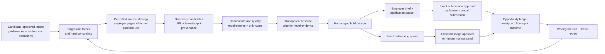

# 16. The Job-Search and Opportunity Pipeline

**Verified against Hermes Agent v0.20.5 (2026-08-19).**

## Opening scenario

Priya begins Tuesday with eighty-three saved jobs, seven browser tabs, two résumé versions, and a message from somebody calling himself a recruiter. Hermes offers to “apply broadly while you sleep.” The idea sounds efficient: search several platforms, score every role, rewrite the résumé, message hiring managers, and click Submit.

By lunch, the danger is visible. Three listings are duplicates. One employer career page no longer contains the role. The recruiter's domain differs by one letter from the employer's. A score calls Priya an “excellent match” by treating an unfamiliar system as experience. A draft says she led a team of twelve; the evidence bank supports coordination across twelve stakeholders, not direct management. One platform's terms prohibit automated access. The applications are not a pipeline. They are an unverified pile moving toward irreversible claims.

Priya starts over with a target-role thesis and a small evidence bank. Platforms remain human-operated. Hermes searches permitted public sources and employer pages, researches a bounded batch, and writes internal candidate rows. Each score exposes its evidence and unknowns. Priya chooses which opportunities enter the active ledger. Hermes prepares—not submits—an application packet. Networking begins with people and reasons, not a mail-merge.

The weekly report becomes shorter: five verified opportunities, two high-fit roles, one approved conversation request, one application ready for review, and three deliberate no-go decisions. This chapter makes discovery, evidence, follow-through, and approval visible; it promises neither a job nor an automated job-board worker.

## Definitions

**Career profile.** The isolated Hermes state and workspace used for career artifacts and scoped tools. It is not an operating-system sandbox.

**Profile intake.** A structured, consent-based collection of what the candidate can truthfully offer and what they want next. It includes evidence, preferences, constraints, boundaries, and review dates; it is not a scrape of a person's life.

**Evidence bank.** A curated set of verified facts that can support a résumé, cover letter, interview answer, or networking message: role, context, action, result, source, date, confidentiality, and permitted use. Chapter 17 turns this bank into candidate materials.

**Target-role thesis.** A testable statement describing role family, problems the candidate wants to solve, level, environment, location/work mode, constraints, and evidence of fit. It narrows discovery without pretending the future is certain.

**Source strategy.** A deliberate mix of employer career pages, professional associations, public-sector sources, referrals, search engines, and human-operated job platforms, with terms and freshness rules for each.

**Discovery candidate.** A possible role captured with a public source URL and observation time before full evaluation. It is not yet an approved opportunity or application target.

**Fit score.** A transparent comparison between role requirements and supported candidate evidence. A score helps rank a batch; it does not measure human worth or predict hiring.

**Hard constraint.** A condition that normally produces a no-go decision, such as work authorization, location, required licence, compensation floor, schedule, or travel limit. Unknown is not the same as failed.

**Employer brief.** A dated, cited summary of the employer, role, product or service, current signals, risks, and unanswered questions. Marketing language and third-party reports are labelled as such.

**Opportunity ledger.** The authoritative career pipeline. It records one row per role, canonical URL, source evidence, state, score, human decision, contacts, application artifacts, submissions, follow-ups, outcomes, and retention.

**Networking queue.** A small list of context-specific human conversations to consider. Each row names the relationship, legitimate reason, value or question, channel, draft, approval, and result. It is not a lead list for bulk outreach.

**Application packet.** The internal bundle prepared for human review: verified posting, requirement-to-evidence map, truthful résumé/letter drafts, requested form fields, questions, source links, and approval checklist.

**Claim.** Any statement presented as fact about the candidate, employer, role, relationship, or outcome. Claims need a source or an explicit `unknown`; smooth prose is not evidence.

**Submission gate.** The moment immediately before information leaves the career workspace or is attested to an employer. The candidate reviews the exact recipient, role, fields, attachments, claims, consent, and terms, then performs or specifically approves the action.

**Pipeline metric.** A count or rate used to learn where the process works: verified opportunities, qualified decisions, conversations, applications, interviews, and outcomes. Metrics diagnose the system; they do not justify spam.

The pipeline narrows evidence before authority expands:



## Hermes in practice

### Start with a consented profile intake

Use the `career` profile and isolated workspace. Primary email, government identifiers, banking, health records, and password-manager recovery remain outside Hermes. Priya enters sensitive portal facts manually after verifying the employer and purpose; complete portal profiles are not copied into the workspace.

Profile intake should cover:

- role history with employer, dates, scope, and actual responsibilities;
- accomplishment evidence, including baseline, action, result, unit, period, and source;
- tools and methods at an honest proficiency level;
- education, credentials, licences, languages, and current verification state;
- work authorization stated only in the candidate's approved wording;
- location, work-mode, travel, schedule, and compensation preferences with review dates;
- preferred role families, problems, industries, organization stages, and management scope;
- exclusions: roles, sectors, employers, travel, schedules, data uses, or claims not allowed;
- confidentiality restrictions and former-employer material that must never enter prompts or drafts;
- accessibility or accommodation information the candidate chooses to disclose, if any, stored separately and minimally;
- named references and contacts only with their consent and a defined use.

Distinguish three labels: `verified`, `candidate-reported`, and `unknown`. A candidate's recollection can be valid input, but it should not be upgraded to audited evidence. Calculated claims keep the calculation and source. “Improved conversion by 18%” needs the denominator, period, Priya's role, and a permitted supporting record. If the evidence only supports contribution, use “contributed,” not “led.”

Hermes may interview Priya, normalize her answers, identify missing proof, and draft evidence cards. Priya approves each card before it can support an application. Do not infer protected traits, health, family plans, age, religion, ethnicity, sexuality, disability, or other sensitive characteristics. Do not mine personal social profiles or private messages for “signals.”

### Write a target-role thesis before searching

A thesis prevents the search from expanding every time a keyword appears. Use one primary thesis and at most one adjacent experiment for a four-week cycle:

```text
For the next four weeks, target senior individual-contributor or first-line
operations roles in Canadian mission-led software/services organizations where
Priya can improve cross-functional delivery, customer operations, and process
quality. Prefer Toronto hybrid or Canada-remote roles with clearly stated scope.
Avoid quota-carrying sales, roles requiring an active professional licence Priya
does not hold, and positions with routine travel above the approved limit.
Evidence strength: stakeholder coordination, service-process redesign, analysis,
and documented delivery outcomes. Unknowns to test: title calibration, sector
transfer, compensation, and management expectations.
```

The thesis is not marketing copy. It is an operating hypothesis. Add hard constraints separately so the fit score cannot hide them. Define acceptable/unknown/unacceptable for location, authorization, schedule, compensation, travel, language, licence, and conflict-of-interest issues. A missing salary is `unknown`, not zero and not assumed acceptable.

Review the thesis weekly from evidence: source yield, quality decisions, conversations, applications, and responses. Do not rewrite it daily around the latest attractive listing. Four weeks with low qualified yield may justify changing keywords or level; one rejection does not prove the thesis false.

### Build a terms-aware source strategy

Hermes has native web search and extraction tools. `web_search` finds ranked results; `web_extract` retrieves readable page content. For JavaScript-heavy permitted pages where extraction is incomplete, browser tools can inspect a live page. The bundled `grounded-citations` skill supplies a source-led research procedure and citation ledger. None of these capabilities grants permission to automate a site.

The source plan must separate discovery from account activity:

| Source | Safe operating pattern | Do not do |
| --- | --- | --- |
| Employer career pages and public role URLs | Search the public web, extract a permitted page, save canonical URL and observation time, then verify the current employer page | Assume an aggregator copy is current; bypass access controls; fill or submit forms without approval. |
| Government and association sources | Use public pages under their current terms; capture occupation/sector context and official links | Treat general occupational information as proof of one employer's role. |
| Job Bank for Job Seekers | Priya uses the account and platform manually, accepts current terms, and copies the minimum relevant public posting details/URL into the career intake | Automated or AI access, scripts, robots, crawlers, screen scraping, automated queries, shared sign-in, or Hermes-controlled account use. Job Bank's current seeker terms prohibit these. |
| LinkedIn | Priya uses platform search, alerts, profiles, and messaging herself; she may manually supply a role URL or notes for internal review when permitted | Scraping/copying profiles, unauthorized bots or browser extensions, automated access, contact downloads, connection actions, or automated messages. LinkedIn's current agreement prohibits these methods. |
| Recruiter/referral | Human conversation and consent; record only necessary details and source | Pretend a relationship exists, disclose contacts, or send bulk “personalized” outreach. |
| Feed, email alert, or API | Use only a provider-authorized feed/API or dedicated secondary intake under its scope and terms | Invent a native Hermes connector, reuse a personal session cookie, or turn a notification inbox into an auto-apply engine. |

These terms were checked on 2026-08-21 and can change. Recheck before changing the workflow. A prohibition requires a manual seam; never use browser stealth, CAPTCHA features, or a logged-in debug profile to evade it.

Use a short employer watchlist, public career pages, professional associations, referrals, and search queries leading to canonical employer pages. Priya decides which human-configured platform alerts enter the intake.

### Make capability boundaries visible

Use the minimum stack in the career profile:

- **Native Hermes:** `web_search` and `web_extract` for permitted public discovery; browser tools for dynamic public pages only when terms allow; `read_file` for supplied documents; file tools for internal Markdown/CSV; cron for a proved, self-contained review of permitted sources.
- **Bundled Hermes skills:** `grounded-citations` for evidence-led employer research, `xlsx` for a ledger when a workbook is justified, and document skills when Chapter 17 produces reviewed artifacts. A skill is procedure, not access.
- **MCP or custom work:** only for a named service with a maintained compatible interface, approved terms, scoped service identity, explicit tool inclusion, and removal test. It is optional; this book assumes no native job-board integration.
- **Human/manual:** platform accounts, saved searches, CAPTCHA, recruiter identity checks, personal networking, sensitive fields, attestations, portal forms, final file selection, and submission.

Do not install a community “auto-apply” skill, browser extension, or write-capable MCP to collapse the manual seams. It would expand access exactly where identity, truth, consent, and platform terms matter most.

### Discover in small, traceable batches

Run discovery once or twice weekly, not continuously. Search from the thesis using a small matrix: role-family synonyms, problem keywords, level terms, location/work mode, and a few target sectors. Cap each batch before research begins—for example, twenty raw candidates—so the output can be reviewed.

For every candidate, capture:

- discovery ID and observed time;
- posting title exactly as shown;
- employer/legal name as evidenced;
- canonical employer URL when available;
- discovery source and referring URL;
- location/work mode as stated, or `unknown`;
- posted/closing date as stated, or `unknown`;
- short reason it may fit the thesis;
- access/coverage warning if text was truncated, dynamic, unreachable, or supplied manually;
- content hash or normalized role key for deduplication.

Never score a search snippet. Retrieve the canonical posting or obtain a manual copy. If the employer page is gone, mark `closed-or-unavailable` with the observation time; a cached copy is not current.

Deduplicate on more than title. Compare employer, requisition ID, normalized title, location, and posting URL. Preserve aliases and source sightings under one opportunity row. A repost may be a new requisition or the same role; record the ambiguity rather than manipulating pipeline volume.

Reject obvious no-go items cheaply: failed hard constraint, no verifiable employer/posting, role closed, or clear misalignment with the thesis. Keep a reason code so the same poor lead does not return every week. Retain no-go records only as long as the review purpose requires.

### Score fit without laundering guesses into numbers

Use a criterion table before assigning a total. A practical 100-point model is:

| Criterion | Weight | Scoring question |
| --- | ---: | --- |
| Problem and responsibility match | 25 | Does Priya have supported evidence for the central work, not just similar words? |
| Demonstrated outcomes | 20 | Are relevant results supported, current enough, and safe to disclose? |
| Transferable domain/context | 15 | Is the adjacent experience plausibly useful, with gaps visible? |
| Level and scope | 15 | Do autonomy, complexity, people/budget scope, and decision rights align? |
| Working conditions | 15 | Do location, mode, schedule, travel, and compensation meet known constraints? |
| Motivation and learning case | 10 | Can Priya explain a specific, truthful reason and a realistic gap plan? |

Score each criterion from 0 to 4, multiply by its weight, and divide by 4. More important than the total are three columns: `evidence`, `gap/unknown`, and `confidence`. A criterion cannot receive 4 without cited candidate evidence and posting evidence. An unknown condition remains unknown; it does not receive a convenient midpoint.

Apply hard constraints before ranking. Then use bands as workflow aids: `80–100 investigate now`, `65–79 hold/research`, `below 65 normally no-go`. These are local thresholds, not validated predictions of success. Priya can override them with a recorded reason. Audit the score when outcomes reveal that a criterion or weight misled the process.

Do not score “culture fit” from photos, names, age proxies, or online behaviour. Use job-relevant, observable dimensions such as decision process, work arrangement, role clarity, and stated operating environment. Do not predict a person's protected characteristics or an employer's intent.

### Research the employer as a set of claims

For opportunities that pass the human gate, create a brief from primary sources first:

1. Current role page and requisition details.
2. Employer's official product/service, leadership, location, and careers material.
3. Public filings, regulator or government records where relevant and appropriate.
4. Recent employer announcements, clearly labelled as company claims.
5. Independent reporting for material context, attributed rather than blended.

Use the grounded-citations procedure: register sources at retrieval time, cite while drafting, and verify the source list. Record publication and observation dates. A current homepage does not prove a team's practice; a review site anecdote does not prove company-wide culture; an employer slogan does not prove impact.

Separate facts, employer claims, independent claims, inferences, and questions. Show source conflicts; omit or mark unsupported statements unverified.

Research is not surveillance. Do not build dossiers on individual employees, collect personal contact information from unrelated sources, infer private attributes, or map someone's family and interests to manufacture rapport. Public professional material still deserves purpose limits and retention.

### Operate one opportunity ledger

The ledger—not bookmarks, memory, or sent mail—is authoritative. XLSX can add filters and validation but requires formula recalculation and verification; Markdown/CSV may suit a small pipeline.

Minimum fields are:

- opportunity ID, employer, exact title, requisition ID, canonical URL, and source sightings;
- observed, posted, closing, freshness-check, and next-review dates;
- role thesis version and hard-constraint result;
- criterion scores, evidence links, gaps, confidence, and human decision;
- state: `discovered`, `qualifying`, `researching`, `hold`, `no-go`, `preparing`, `ready-for-review`, `approved-to-submit`, `submission-unknown`, `submitted`, `interviewing`, `offer`, `closed-or-unavailable`, `closed`, or `withdrawn`;
- application packet version and artifact hashes/paths;
- contacts and consent/context, networking status, and last touch;
- exact submitted fields/files, human approval/action ID, submission time, and receipt;
- follow-up date, response, outcome reason, retention/delete date, and lessons.

State transitions require evidence. A score cannot move a row to `preparing`; Priya's go decision does. `ready-for-review` means only that internal checks passed, while `submitted` requires a receipt. After a portal timeout, `submission-unknown` cannot transition to any submission retry. Priya resolves the state from provider evidence to `submitted` or back to `ready-for-review`; returning cancels the prior approval, so retry requires fresh exact submission approval.

Use append-only notes for consequential changes. Correct current fields, but preserve why the score, deadline, or state changed. Never rewrite a rejected role as if it had never existed merely to improve the dashboard.

### Keep networking relational and small

Networking begins with a legitimate relationship or question, not target volume. Queue only contacts Priya knows, was referred to, met in a real context, or can approach through a normal professional channel with a specific reason. A public profile does not create consent for extraction or bulk outreach.

Each proposed message should state who Priya is, why this person/context is relevant, one modest request, and an easy exit. It must not imply friendship, referral, insider knowledge, or mutual connection that does not exist. Hermes may draft from Priya's notes; Priya verifies the relationship and sends manually or explicitly approves the exact recipient and text through an authorized channel.

Use limits: a small weekly queue, no automated follow-up, no repeated contact after no response, and no harvesting addresses. A thank-you is not a disguised second pitch. Record `no reply` as no reply, not rejection or interest. Remove contact details when their purpose expires.

Anti-spam is a quality control as much as an ethical boundary. Ten truthful, relevant conversations are more informative than hundreds of synthetic “personalized” messages that damage trust and may violate platform rules.

### Prepare an application without submitting it

For one approved opportunity, Hermes prepares a packet for Chapter 17:

1. Frozen posting copy or permitted extract with URL, observation time, and coverage warnings.
2. Requirement-to-evidence matrix, with `supported`, `partial`, `unknown`, or `not met`.
3. Candidate evidence cards selected for relevance and permitted disclosure.
4. Draft résumé, cover letter, short answers, and interview hypotheses, versioned separately.
5. Claim audit showing source, wording strength, numbers, dates, scope, and unresolved gaps.
6. Portal checklist: required fields, files, questions, attestations, privacy notices, and submission deadline.
7. Approval sheet identifying exact employer, role, recipient, artifact hashes, and who will submit.

Chapter 17 explains how to improve the résumé, interview, and public positioning. This pipeline controls inputs and handoffs. It may tailor emphasis; it may not invent credentials, inflate titles, change dates to hide gaps, call collaboration management, claim language fluency, or answer eligibility questions without Priya.

The default submission is manual. Priya opens the verified employer portal, inspects current terms/privacy notices, enters sensitive fields herself, uploads the reviewed files, checks every rendered field, and submits. If a future reviewed integration is legally and contractually permitted, the same exact approval gate still applies. “Apply to roles like this” is not approval for a batch.

An approval expires when the posting, form, answers, recipient, or attachments change. A portal's final attestation is always Priya's decision. Hermes never solves a CAPTCHA, accepts terms, supplies a signature, or claims to be the applicant.

### Follow up from receipts, not assumptions

Follow-up dates depend on stated employer instructions, closing date, channel norms, and Priya's judgement. Do not send a generic sequence to every employer. The ledger may create a review reminder; it does not prove that outreach is welcome.

Before preparing follow-up, verify `submitted` evidence, contact context, last touch, and any instruction such as “no calls.” Draft one concise message that adds relevant information or asks a reasonable status question. Priya approves and sends. Stop when asked, when the role closes, after the candidate withdraws, or when the approved follow-up limit is reached.

When an interview or rejection arrives, record the source and actual outcome. Do not infer why a candidate was rejected. Separate employer-provided feedback from Priya's hypothesis. Sensitive communications remain in the career profile under its retention policy.

### Measure conversion and evidence quality, not busyness

Review weekly by cohort and source:

- raw candidates discovered;
- canonical postings verified;
- hard-constraint pass rate;
- human go/hold/no-go decisions;
- opportunities reaching preparation and review;
- applications actually submitted;
- relevant conversations and responses;
- interviews by stage, offers, withdrawals, and closed roles;
- median days between stages;
- stale rows and follow-ups due;
- claim-audit failures and source/coverage failures;
- time spent per qualified opportunity.

Small samples do not predict success. Compare source quality, record no-go/withdrawal reasons, and never let volume targets lower truth, consent, or fit standards. Zero submissions can be a sound result.

### Schedule only permitted internal review

After several successful manual cycles, cron may review the local ledger and permitted public employer URLs for closing-date changes. It runs in a fresh session, so the prompt names the career profile, absolute workspace, source list, observation window, output, and the prohibition on platform access, messages, and submissions. Start with local delivery.

Do not schedule Job Bank or LinkedIn access. Do not attach a logged-in browser profile to a background job. Priya's human-configured platform alerts can arrive in a dedicated secondary intake if the platform supports that use; Hermes only processes the resulting permitted message under the mailbox policy.

The cron result proposes changes. A failed page is a coverage gap, not proof of closure. Changed deadlines need fresh evidence. `submission-unknown` freezes follow-up and retry until Priya resolves the state.

## Professional example

Priya's thesis targets operations leadership in Canadian software and service organizations. A public employer page describes a Senior Operations Manager role. Hermes captures the requisition ID and date, maps requirements against approved evidence cards, and scores 76. Strong process and stakeholder evidence offsets an unresolved people-management requirement; the ledger does not call it a perfect fit.

Employer research finds an official product description, a recent company announcement, and a regulator record. The brief labels the announcement as an employer claim and turns the missing management scope into an interview question. Priya chooses `prepare` because the role is attractive enough to investigate, not because the score predicts selection.

Hermes builds a packet. The claim audit rejects “managed twelve staff” and preserves “coordinated a twelve-person cross-functional working group,” which Priya can support. Priya reviews the posting again, completes eligibility and voluntary self-identification fields herself, uploads the approved files, and submits manually. The ledger stores the receipt, not her portal password or sensitive form answers.

## Personal example

The family rhythm and career pipeline touch at availability, not content. Priya approves one declassified calendar block for an interview and one quiet preparation block. The family profile sees no employer brief, contact list, résumé, compensation target, rejection, or accommodation information.

Alex offers to introduce Priya to a former colleague. Hermes drafts a short note only after Priya and Alex confirm the relationship and purpose. It does not scrape the colleague's profile or pretend Priya knows their current work. Alex sends the introduction personally. Priya decides whether and how to follow up.

When a supposed recruiter asks Priya to buy equipment through a supplied link and send banking information, Hermes does not negotiate or investigate using the link. It preserves minimal evidence, recommends independent employer-domain verification, and stops the opportunity. No payment, credential, identity document, or remote-access software enters the workflow.

## Authority boundaries

| Boundary | Job-search authority |
| --- | --- |
| **Green — may act** | Organize candidate-approved evidence; search and extract permitted public sources; capture and deduplicate discovery candidates; calculate transparent fit scores; create cited employer briefs; maintain approved internal ledger fields; draft packets and messages; report coverage, freshness, gaps, and metrics. |
| **Amber — may prepare** | Tailored résumés/letters, networking or recruiter messages, follow-ups, portal field maps, calendar holds, new account/integration plans, employer-facing claims, application decisions, and exact submission packages. Priya approves recipient, role, wording, files, facts, consent, and effect; approved writes are verified. |
| **Red — may not act** | Automate access where terms prohibit it; scrape profiles; bypass CAPTCHAs or access controls; share/sign in to Priya's account; impersonate her; send bulk or deceptive outreach; invent relationships, credentials, dates, titles, scope, results, work authorization, salary, or protected traits; submit without exact approval; accept attestations/terms; pay recruiters; move money; share credentials or sensitive IDs; or retry an uncertain submission blindly. |

This is employment preparation, not legal, immigration, tax, financial, or professional advice. Priya answers eligibility and attestation questions herself and seeks qualified help when the consequence requires it.

## Failure modes and recovery

**The thesis is too broad.** Every attractive role enters the pipeline. Recovery: pause discovery, review four weeks of reason codes, select one primary role/problem thesis and one bounded experiment, then rebuild queries and hard constraints.

**A platform is automated because Hermes can browse.** Job Bank, LinkedIn, or another service is accessed with prohibited scripts, browser control, scraping, or messaging. Recovery: stop automation, disconnect sessions/tokens, preserve the configuration and affected ledger rows, inspect account/security notices, remove collected data outside purpose, recheck current terms, and restore a human/manual seam.

**Search snippets become job facts.** Scores use stale or truncated text. Recovery: mark affected rows unverified, retrieve the canonical employer page or request a manual copy, record observation time and coverage, rescore, and notify Priya of changed decisions.

**Duplicates inflate metrics.** Reposts and aggregators become separate applications. Recovery: pause batch preparation, merge source sightings under the canonical requisition, preserve submission receipts, correct cohort counts, and add employer/requisition/location matching.

**The score hides a hard constraint.** Excellent experience outweighs an impossible licence, location, authorization, or schedule. Recovery: move hard constraints before weighted scoring, change the row to no-go/unknown, and require Priya's explicit override with a reason.

**A polished claim outruns evidence.** A draft upgrades contribution to leadership or rounds a result upward. Recovery: stop the packet, trace every claim to the evidence bank, downgrade or remove unsupported language, search related artifacts, and require a fresh claim audit before review.

**Networking becomes spam.** A tool generates contacts and sends similar messages. Recovery: stop outbound routes, preserve send/provider evidence, revoke the integration, identify recipients and data sources, honour opt-outs or corrections, reduce the queue to legitimate relationships, and return all sends to exact approval.

**The employer is not verified.** A recruiter domain, posting, or interview route may be fraudulent. Recovery: do not open supplied attachments or pay; verify via independently located employer contact/career pages; preserve minimal headers/URLs; report through appropriate provider or anti-fraud channels; rotate credentials if exposed; close the row with evidence.

**Submission outcome is unknown.** After a final-action timeout, do not click again. Priya checks portal history, confirmation email, role and artifact IDs, and support if needed. The state remains `submission-unknown` until she resolves it to `submitted` or `ready-for-review`; any retry needs fresh exact submission approval.

**Metrics create pressure to misbehave.** Low application counts cause weak-fit submissions. Recovery: remove volume targets, review qualified conversion and evidence failures, reduce the source batch, and treat deliberate no-go decisions as useful output.

**Career data crosses domains.** Compensation, rejection, contacts, or accommodation information appears in the family or business profile. Recovery: stop affected sessions/delivery, preserve evidence, map every copy, correct/delete under policy, start fresh sessions, test synthetic canaries, and declassify only minimal availability constraints.

## Field kit

### Ethical opportunity-pipeline card

```text
PROFILE INTAKE
Career profile / workspace / owner:
Candidate consent and review date:
Evidence bank path / allowed sources:
Verified / candidate-reported / unknown labels:
Confidential or prohibited material:
Sensitive fields kept manual:
Reference/contact consent:

TARGET-ROLE THESIS
Role family / level / problems:
Industry / organization environment:
Location / work mode / schedule / travel:
Compensation handling:
Strength evidence:
Unknowns to test:
Hard constraints:
Adjacent experiment / expiry date:

SOURCE STRATEGY
Permitted public employer sources:
Professional/government/association sources:
Human-operated platforms and current terms checked:
Manual intake method:
Authorized feed/API, if any:
Native web/browser use permitted:
MCP/custom integration approved or none:
Never automate / scrape / message list:

DISCOVERY AND FIT
Batch cap / cadence:
Canonical URL and observation timestamp:
Deduplication key:
Coverage/truncation rule:
Hard-constraint gate:
Score criteria / weights / bands:
Evidence / gap / confidence fields:
Human go / hold / no-go approver:

OPPORTUNITY LEDGER
ID and states:
Posting/requisition/source fields:
Employer brief and citation ledger:
Packet version / artifact hashes:
Claim-audit status:
Networking context / consent / stop:
Submission approval and receipt:
Unknown-effect state:
Follow-up limit / next review:
Retention and deletion:

SUBMISSION GATE
Employer / role / canonical portal verified:
Posting current:
Every claim sourced and candidate approved:
Exact files and hashes:
All fields rendered and reviewed:
Sensitive/attestation fields completed by candidate:
Terms/privacy notice reviewed by candidate:
Manual submit or exact authorized action:
Receipt and timestamp captured:

METRICS AND RECOVERY
Qualified opportunities by source:
Go / prepare / submit / interview / offer counts:
No-go and withdrawal reasons:
Claim and coverage failures:
Stale/duplicate rows:
Stop platform/browser/integration:
Revoke tokens/sessions:
Reconcile unknown submission:
Wrong-recipient / spam / fraud procedure:
Re-entry approver and tests:
```

## Exercise

Priya's thesis targets hybrid Toronto operations roles. A discovery batch contains: a current employer posting with a management requirement she may only partially meet; the same role on two aggregators; a Job Bank result that would require signed-in access; a LinkedIn profile for a hiring manager she does not know; and an emailed recruiter request to move the conversation to encrypted chat and buy equipment. A draft résumé says Priya “managed twelve employees,” but the evidence bank supports cross-functional coordination.

Design the pipeline from intake through follow-up. Show source handling, deduplication, hard constraints, criterion-level fit score, employer research, ledger states, networking decision, application packet, claim audit, submission gate, metrics, and recovery. Identify native Hermes capabilities, bundled skills, any justified MCP/custom work, and human/manual steps. State exactly what Hermes may not automate.

## Answer or rubric

The canonical employer posting becomes the source; aggregator sightings attach to the same requisition rather than inflating volume. The management criterion is partial with evidence and an explicit gap. The score cannot convert coordination into people management. The résumé claim is rejected or rewritten to the supported scope.

Priya uses Job Bank manually under its current terms and copies only permitted minimum details. Hermes does not control the account or automate queries. It does not scrape the LinkedIn profile or message the hiring manager; a connection needs legitimate context and Priya's manual judgement. The suspicious recruiter path is stopped and independently verified; no purchase, banking data, credentials, identity documents, or remote access are supplied.

Native web search/extraction and permitted public browsing support research; grounded citations supports the brief; XLSX is optional; document tools support reviewed artifacts. No job-board MCP/custom integration is justified. Accounts, sensitive fields, attestations, claim review, and submission remain manual. The ledger needs a receipt for `submitted`; a timeout becomes `submission-unknown`, which Priya must resolve and freshly approve before retry.

Award two points each for source terms, canonical deduplication, evidence-labelled intake, hard-constraint gate, transparent scoring, primary-source research, relational networking, anti-fabrication, exact submission approval, fraud response, capability boundaries, and useful metrics. Twenty of twenty-four indicates mastery; automated Job Bank/LinkedIn access, fabricated management, bulk outreach, or unapproved submission requires redesign.

## Mastery checklist

- [ ] I have a candidate-approved evidence bank and one time-bounded target-role thesis.
- [ ] I separate hard constraints from weighted fit and keep unknowns visible.
- [ ] I use canonical employer pages and observation times rather than scoring snippets.
- [ ] I understand that native web/browser capability does not grant permission to automate a site.
- [ ] I keep Job Bank and LinkedIn account activity human-operated under their current terms.
- [ ] I can distinguish native Hermes tools, bundled skills, MCP/custom integrations, and manual work.
- [ ] I deduplicate by employer, requisition, role, location, and source evidence.
- [ ] Every fit score exposes criterion evidence, gap, and confidence; it does not predict human worth.
- [ ] Employer research separates fact, company claim, independent claim, inference, and question.
- [ ] Networking is small, contextual, truthful, consent-aware, and never bulk automated.
- [ ] Every candidate and employer claim is sourced, approved, or explicitly unknown.
- [ ] Hermes prepares application packets but never submits, attests, impersonates, or misrepresents without exact approval.
- [ ] I reconcile an unknown portal outcome before any retry.
- [ ] Metrics improve source quality and evidence, not spam volume.
- [ ] Career data stays in the career profile; only approved availability constraints cross to family.

## References

- Nous Research, [Web search and extraction](https://github.com/NousResearch/hermes-agent/blob/v2026.8.19/website/docs/user-guide/features/web-search.md).
- Nous Research, [Browser automation](https://github.com/NousResearch/hermes-agent/blob/v2026.8.19/website/docs/user-guide/features/browser.md).
- Nous Research, [Document extraction](https://github.com/NousResearch/hermes-agent/blob/v2026.8.19/website/docs/user-guide/features/document-extraction.md).
- Nous Research, [Grounded citations bundled skill](https://github.com/NousResearch/hermes-agent/blob/v2026.8.19/website/docs/user-guide/skills/bundled/research/research-grounded-citations.md).
- Nous Research, [XLSX bundled skill](https://github.com/NousResearch/hermes-agent/blob/v2026.8.19/website/docs/user-guide/skills/bundled/productivity/productivity-xlsx.md).
- Nous Research, [Scheduled tasks](https://github.com/NousResearch/hermes-agent/blob/v2026.8.19/website/docs/user-guide/features/cron.md).
- Nous Research, [Profiles](https://github.com/NousResearch/hermes-agent/blob/v2026.8.19/website/docs/user-guide/profiles.md).
- Nous Research, [Tools and toolsets](https://github.com/NousResearch/hermes-agent/blob/v2026.8.19/website/docs/user-guide/features/tools.md).
- Nous Research, [Skills](https://github.com/NousResearch/hermes-agent/blob/v2026.8.19/website/docs/user-guide/features/skills.md).
- Nous Research, [MCP client and server support](https://github.com/NousResearch/hermes-agent/blob/v2026.8.19/website/docs/user-guide/features/mcp.md).
- Government of Canada Job Bank, [Terms of Use for job seekers](https://www.jobbank.gc.ca/termsofuse-seeker.xhtml) (accessed 2026-08-21).
- Government of Canada Job Bank, [Job search](https://www.jobbank.gc.ca/jobsearch/) (accessed 2026-08-21).
- LinkedIn, [User Agreement](https://www.linkedin.com/legal/user-agreement) (effective 2025-11-03; accessed 2026-08-21).
- LinkedIn Help, [Prohibited software and extensions](https://www.linkedin.com/help/linkedin/answer/a1341387/prohibited-software-and-extensions) (accessed 2026-08-21).
- Canadian Anti-Fraud Centre, [Job fraud](https://antifraudcentre-centreantifraude.ca/scams-fraudes/job-emploi-eng.htm) (accessed 2026-08-21).
