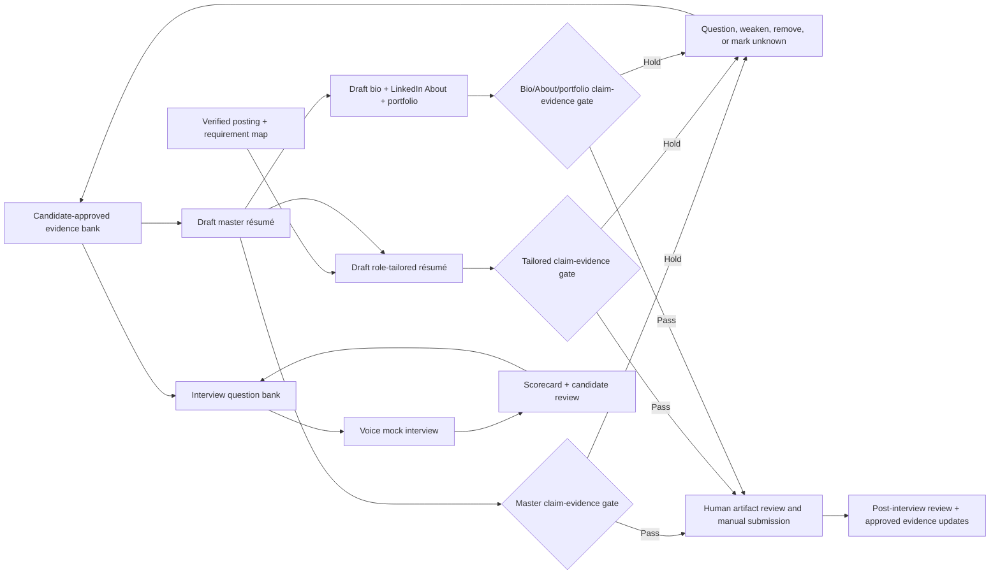

# 17. Résumé, Interview, and Brand Overhaul

**Verified against Hermes Agent v0.20.5 (2026-08-19).**

## Opening scenario

Priya has reached the `ready-for-review` stage for an operations role from Chapter 16. The posting asks for people leadership, service improvement, executive communication, and experience with a system she has used only as an end user. Her old résumé is seven pages. Her LinkedIn About section says she is a “transformational leader,” while her notes say that she coordinated a cross-functional working group. A portfolio slide reports a 30% improvement, but nobody can locate the baseline. Tomorrow's interview invitation lists four interviewers and forty-five minutes.

Hermes can make every sentence sharper. That is precisely the danger. A polished unsupported statement is harder to notice than an awkward one. If the agent turns twelve collaborators into twelve direct reports, expands a pilot into a company-wide program, or invents a missing number, the document may read better while becoming less true.

Priya does not ask for a résumé rewrite first. She asks Hermes to reconcile claims. Each accomplishment receives a source, scope, wording ceiling, confidentiality rule, and candidate approval. The people-leadership requirement remains partial. The missing percentage becomes `unknown`, not a plausible estimate. Only then does Hermes prepare a targeted résumé, an executive bio, LinkedIn About copy, two portfolio narratives, and an interview practice set.

At the mock interview, Priya speaks in Hermes CLI voice mode. Hermes asks one question at a time and scores the transcript against a declared rubric. It does not speak for her in the real interview. Afterward, she reviews the scorecard, retries two weak answers, and saves only supported additions to the evidence bank. The resulting brand is narrower than the first draft and far more defensible.

## Definitions

**Evidence bank.** The candidate-approved collection introduced in Chapter 16. Each card records the situation, action, result, scope, source, verification state, confidentiality, and permitted uses. It is the source of career claims, not a store of aspirational phrases.

**Master résumé.** A private, comprehensive inventory of supported experience. It may be longer than a submitted résumé because it holds variants, dates, tools, and evidence links. It is not sent to employers.

**Tailored résumé.** A selected and reordered view of the master résumé for one verified role. Tailoring changes emphasis and vocabulary where meanings match; it does not change history.

**Claim unit.** The smallest factual assertion that can be checked independently: title, employer, date, action, scope, number, outcome, credential, tool proficiency, or relationship.

**Wording ceiling.** The strongest language an evidence card supports. “Participated,” “contributed,” “coordinated,” “owned,” and “led” are not interchangeable.

**Claim-strength ladder.** A four-level label: `verified`, `candidate-reported`, `inference`, or `unknown`. Only the first two may appear as candidate facts, and candidate-reported wording must stay within Priya's explicit account. Inference may guide a question; unknown remains a gap.

**Evidence gate.** A fail-closed review that checks every claim unit against the bank before an artifact becomes `ready-for-review`. A failed gate returns the artifact to drafting; it never asks the model to “make it sound plausible.”

**Executive bio.** A short third- or first-person account of professional focus, selected experience, and current direction. “Executive” describes the audience and compression, not a licence to elevate seniority.

**LinkedIn About.** Candidate-controlled profile copy for a public professional platform. Hermes can draft it from approved evidence. Priya reviews and publishes it manually under the platform's current rules.

**Portfolio narrative.** A problem–decision–work–result–learning story supported by material the candidate may disclose. It communicates judgement, not confidential work product.

**Interview question bank.** A role-specific curriculum of likely questions, evidence cards, gaps, questions for the employer, and practice status. It is not a script for predicting exact questions.

**Voice mock interview.** A practice session in which Hermes asks questions and transcribes Priya's spoken answers. It rehearses retrieval and delivery; it is not identity proof and is never used to attend a live interview.

**Interview scorecard.** A rubric applied to observable answer qualities such as relevance, evidence, ownership, structure, concision, and uncertainty handling. It does not score charisma, accent, personality, or human worth.

**Post-interview review.** A factual reconstruction after the meeting: questions asked, evidence used, unanswered items, commitments, observations, and next actions. It separates what the interviewer said from Priya's interpretation.

The chapter's production line keeps evidence upstream of prose:



## Hermes in practice

### Keep one claim ledger across every surface

Create the claim ledger before opening a document template. Give each row a stable ID and these fields:

- claim text in neutral language;
- claim type: role, action, scope, result, tool, credential, education, or relationship;
- employer/project and date range;
- source identifier and restricted location;
- evidence state: `verified`, `candidate-reported`, `inference`, or `unknown`;
- wording ceiling and prohibited upgrades;
- number, unit, baseline, comparison period, and calculation when quantitative;
- Priya's contribution versus team outcome;
- confidentiality and permitted surfaces: private résumé, application, public profile, portfolio, or spoken interview;
- last candidate review and expiry/recheck date.

The ledger holds claims, not copies of every source. A source pointer may refer to a restricted performance review, project report, calendar entry, or candidate note without placing that material in Hermes memory. Employment records stay in the career workspace under Chapter 14's retention policy. Government identifiers, background reports, accommodation details, reference contact information, tax documents, and primary credentials remain outside ordinary drafting.

One source can support several claims, but the wording ceiling is still claim-specific. A project closeout showing a ten-day reduction may support the result and period. It may not prove that Priya alone caused the change or had budget authority. If the team result is supported and individual attribution is not, write “contributed to” or describe Priya's documented action before the team result.

Numbers deserve a calculation card. Record original values, formula, unit, period, rounding rule, and known confounders. If baseline data cannot be recovered, use a supported non-numeric result. Never estimate a percentage because the document “needs impact.”

Add a contradiction review whenever two sources disagree. Preserve both source IDs, the exact conflict, and the candidate's resolution; do not silently choose the version that fits the posting. Dates may differ because one source records employment while another records a project. Team size may change over time. A title used internally may differ from the payroll title. Priya decides the accurate public wording and records why. If she cannot resolve the difference, the claim stays on hold. This review also catches stale facts: an expired credential, old portfolio link, or current-tense role description must not survive simply because it once passed.

### Run the anti-hallucination gate before style review

The gate evaluates claims before grammar, tone, or page length. Copy this into the career workspace:

```text
EVIDENCE GATE: PASS / HOLD

Artifact / version / role ID:
Candidate / reviewer / review time:

For every claim unit:
- Claim ID:
- Exact artifact wording:
- Source ID and evidence state:
- Actor and contribution:
- Scope: people / budget / geography / system / duration:
- Number / unit / baseline / period / calculation:
- Wording ceiling:
- Confidentiality and permitted surface:
- Status: PASS / HOLD
- If HOLD: ask candidate / weaken / remove / mark unknown

Artifact result:
- All candidate facts pass: yes / no
- Unsupported implication scan complete: yes / no
- Posting language preserves meaning: yes / no
- Candidate approved every changed claim: yes / no
- Ready for style and document QA: yes / no
```

The gate catches implication as well as literal error. “Selected to drive adoption” may imply authority absent from “asked to help colleagues learn the tool.” “Managed a $2 million portfolio” may imply financial control when Priya only reported on it. Dates aligned to hide a gap are false even if each year appears somewhere in a source.

Treat absent evidence as a choice among four honest responses: ask Priya, narrow the statement, remove it, or retain `unknown` in the internal requirement map. Do not use internet research to establish Priya's achievements. Public sources can support employer and occupation context; only candidate-approved sources support candidate facts.

### Build the master résumé as controlled inventory

The master résumé should be rich enough that tailoring becomes selection, not invention. Organize it by role and project, with an approved title, employer, dates, location, one-sentence mandate, scope facts, accomplishment bullets, tools at a stated proficiency, education, and credentials. Keep alternate bullets tied to the same claim IDs.

A useful bullet has four layers: situation, action, scope, and result. It need not force all four into one long sentence. Prefer “Rebuilt weekly service review across three teams; introduced a common exception log and reduced unresolved handoffs from 18 to 7 over one quarter” when each element is sourced. If only the action is supported, stop after the action.

Keep a visible coverage note for every artifact: which roles, projects, and time periods were reviewed, which sources were unavailable, and which claims were intentionally omitted. The note stays internal. It prevents a short tailored résumé from being mistaken for a complete employment record and makes later updates repeatable.

Keep official titles official. A clarifying parenthetical may explain a company-specific title when Priya approves it, but it cannot replace the title with the target role. Separate direct reports, dotted-line collaborators, vendors, and stakeholders. Separate tool exposure from working proficiency and administration.

The master file is private because it may contain more employment detail than any employer needs. Do not put source paths, confidence labels, or confidential project names in submitted versions. Keep those in the ledger and artifact manifest.

### Tailor truthfully to one frozen posting

Start from Chapter 16's frozen posting and requirement-to-evidence matrix. For each requirement, choose `supported`, `partial`, `unknown`, or `not met`. Select the strongest relevant evidence; do not stretch weak evidence to fill every line.

Tailoring may:

- reorder roles and bullets by relevance;
- choose an approved variant of a supported claim;
- use the employer's vocabulary when the meaning is genuinely equivalent;
- remove less relevant detail;
- surface transferable evidence and name a gap honestly;
- adjust summary length and document structure.

Tailoring may not upgrade title, authority, credential, tool skill, result, team size, duration, work authorization, relationship, or reason for leaving. It may not add invisible keywords, copy whole phrases from the posting, or imply that keyword overlap proves competence.

Create a change table from master to tailored version: claim ID, old wording, new wording, reason, and meaning-preserved check. A candidate reviews the exact PDF or DOCX that will be uploaded, not only a Markdown draft.

### Separate Hermes capability from the manual seam

The workflow uses four layers:

- **Native Hermes:** `read_file` can inspect supplied text and supported document formats; `web_search` and `web_extract` can research permitted public occupation or employer sources; CLI voice mode can run spoken practice; file tools can maintain internal Markdown artifacts.
- **Bundled Hermes skills:** `docx` can create, read, edit, and template Word files and requires re-reading output; `pdf` can create and inspect PDFs but scanned pages need OCR or visual recovery; `grounded-citations` can maintain a retrieval-backed source ledger for external facts.
- **MCP or custom work:** an approved applicant-tracking export, portfolio CMS, or other named system needs a reviewed interface, scoped identity, terms check, explicit tools, and removal test. No custom truth engine is assumed.
- **Human/manual:** Priya approves evidence, resolves ambiguity, checks visual rendering, publishes profile edits, chooses sensitive disclosures, enters portal data, accepts terms, submits applications, and participates in live interviews.

Document generation is not document assurance. After the bundled DOCX skill creates or edits a file, re-read its text and structure. Render and visually inspect the final PDF for pagination, headings, links, symbols, and accidental hidden content. Text extraction can miss scanned pages; empty extraction is a coverage warning, not proof of emptiness.

### Write an executive bio without manufacturing altitude

Prepare three lengths from the same claims: a one-line introduction, a short paragraph, and a longer event or portfolio bio. Each should answer current focus, relevant experience, distinctive supported strength, and direction. Avoid adjectives that cannot be tested—“visionary,” “world-class,” “renowned”—unless an attributable source and context make them necessary.

First-person copy suits candidate-controlled pages. Third person suits an event organizer or speaker page. Neither changes facts. If Priya is moving toward management, say she is pursuing roles with that scope; do not call her an executive before she is one.

Put a date and intended audience on every bio. Public copy should use fewer details than a private application. Remove old employer-sensitive numbers and expired credentials. A bio is not permanent identity; review it when the target thesis changes.

### Make LinkedIn About and portfolio copy public by choice

Treat LinkedIn as a public publishing surface governed by the candidate and the platform. Hermes may draft an About section, headline options, role descriptions, and a change list from approved evidence. Priya manually edits and publishes. Do not automate access, scrape profiles, or infer what the algorithm rewards.

A useful About section combines professional focus, two or three supported patterns of work, one human reason for the direction, and an invitation appropriate to the target thesis. Avoid stuffing every keyword. Do not disclose job-search urgency, family constraints, confidential clients, compensation, or contact details merely because public copy allows them.

For each portfolio narrative, use:

1. **Context:** what problem existed and what Priya was responsible for.
2. **Constraints:** time, resources, stakeholders, or uncertainty she may disclose.
3. **Decision:** alternatives and why she chose an approach.
4. **Work:** her specific actions, collaborators, and artefacts.
5. **Result:** supported outcome, limits, and attribution.
6. **Learning:** what she would repeat or change.

Use reconstructed diagrams and de-identified patterns rather than former-employer files. If confidentiality prevents enough detail, omit the story. Redaction is not permission to republish intellectual property.

### Build an interview curriculum, not a script

Generate the interview question bank from the posting, employer brief, evidence gaps, and interview format. Include:

- opening and career-direction questions;
- one question for each central responsibility;
- behavioural questions about conflict, failure, prioritization, ambiguity, influence, and learning;
- scope checks for people, budget, decision rights, and tools;
- gap questions the employer is likely to ask;
- role-specific scenarios clearly labelled hypothetical;
- questions Priya wants to ask each interviewer;
- legal or sensitive questions Priya wants professional guidance on, without rehearsing a fabricated response.

Map each question to one primary evidence card and one alternate. Reusing the same story for every competency makes experience appear thin and can force distortion. Mark stories `unused`, `practising`, `ready`, or `retire`. “Ready” means Priya can explain it accurately, not that Hermes predicts success.

Use a simple answer frame: direct answer, relevant context, Priya's action, supported outcome, reflection. The frame prevents wandering; it should not make every answer sound identical. A gap answer can state current limit, adjacent evidence, learning action, and what Priya would verify before taking responsibility.

### Run voice mock interviews safely

On the Mac mini, Priya can start Hermes interactively, use `/voice on`, and press `Ctrl+B` to speak. The pinned release transcribes the utterance and can speak the response when TTS is enabled. Start with a synthetic warm-up, confirm the microphone and transcript, then use only approved career-profile material.

Give Hermes this contract:

```text
Run a 30-minute voice mock interview for role OP-042. Ask one question at a
time from interview-bank-v3. Do not supply an answer until I finish. After each
answer, ask at most one clarification. Score only against the declared rubric.
Quote my transcript when identifying a claim; compare claims to evidence-bank-v5.
If a claim is unsupported, label HOLD and ask me to correct it. Do not infer
confidence, honesty, personality, protected traits, or suitability from my
voice, accent, pace, or emotion. Stop when I say stop. Save only the scorecard
and candidate-approved learning notes; do not promote transcript details to
memory.
```

Voice transcription can be wrong. Priya checks material words, numbers, employer names, and negations before a score affects practice. Do not record other people without consent. Do not use a hosted speech provider for confidential material without reviewing the data route. A local option can reduce routing, but host access and retained session text still matter.

Hermes never joins the live interview, feeds hidden answers, alters Priya's voice, or impersonates her. Accessibility support is candidate-directed and must comply with the interview process; Priya requests accommodations through the appropriate human channel.

### Score observable answer quality

Use a 0–3 rubric for each dimension:

| Dimension | 0 | 1 | 2 | 3 |
| --- | --- | --- | --- | --- |
| Relevance | Does not answer | Indirect | Answers with extra material | Direct and appropriately scoped |
| Evidence | Unsupported | Vague example | Supported example | Supported example with precise provenance |
| Ownership | Role unclear | Team-only language | Contribution mostly clear | Contribution and collaboration both clear |
| Structure | Hard to follow | Partial sequence | Coherent | Coherent and concise |
| Result | Invented/absent | Outcome vague | Supported result | Result plus limits and learning |
| Uncertainty | Conceals gap | Defensive | Names gap | Names gap and safe next step |

The total is a practice signal, not a hiring prediction. Keep transcript quotes beside deductions so Priya can challenge the score. Do not score vocal identity, accent, disability, appearance, age, emotion, or “culture fit.” Compare the same candidate against the same rubric over time, not against invented norms.

After each mock, choose no more than two repairs. Rewrite the answer outline, not a memorized speech. Repeat after a break and check whether evidence retrieval improved.

### Conduct a factual post-interview review

Within an hour, Priya dictates or writes notes while memory is fresh. Hermes separates:

- interviewer names and roles as supplied;
- questions actually asked;
- answers and evidence cards used;
- unsupported or ambiguous statements requiring correction;
- facts the employer stated;
- Priya's interpretations and feelings, labelled as such;
- commitments, promised materials, and dates;
- questions still open;
- follow-up draft and approval status.

Do not infer why an interviewer reacted, predict an offer, or convert silence into rejection. If Priya misstated a material fact, prepare a concise correction for her review. The candidate decides whether and how to send it.

Move a new accomplishment into the evidence bank only after Priya supplies a source and approves the card. Interview practice can reveal forgotten evidence; it cannot verify it by repetition.

### Network with context and restraint

Prepare networking messages only for legitimate relationships or normal professional contexts from Chapter 16. Use four parts: true context, specific relevance, modest request, easy exit. Examples include a thank-you after an introduction, a question to a former colleague who consented to reconnect, or a brief follow-up after an event.

Never claim a referral, familiarity, shared interest, or recent profile detail without Priya's source. Never harvest addresses or automate a sequence. Priya checks the person, relationship, channel, current purpose, and exact text. No reply remains `no reply`; it does not trigger a persuasive escalation.

### Review the brand as one system

Once a month, compare the résumé summary, bio, LinkedIn About, portfolio, networking notes, and interview stories against the current claim ledger. The same fact should not have different scope across surfaces. Public copy may be narrower, never stronger.

Track useful quality measures: evidence-gate holds, candidate corrections, unsupported-number removals, duplicated interview stories, scorecard dimensions improved, and public claims due for review. Do not optimize keyword count, message volume, or a model's “hireability score.”

## Professional example

The operations posting requires “led managers across multiple regions.” Priya's bank supports coordination of a twelve-person working group across Ontario and Quebec, with no direct reports. Hermes marks the requirement `partial`. The résumé says, “Coordinated a twelve-person cross-functional working group across two provinces,” and the interview bank includes a question about the difference between influence and formal management.

Her supported project story explains that she standardized an exception log, assigned issue owners with agreement, and chaired weekly reviews. A project report supports a reduction in unresolved handoffs. The portfolio omits the former employer's customer names and internal screenshots. In practice, Priya initially says, “I managed the team.” The evidence gate holds the phrase; she corrects it to “I coordinated the working group and escalated decisions to the accountable managers.”

The tailored DOCX is re-read for content and rendered to PDF for visual inspection. Priya verifies the final file, uploads it manually, and retains the artifact hash in the Chapter 16 packet. Hermes has improved the presentation without changing the employment record.

## Personal example

Priya schedules two thirty-minute practice blocks around the family calendar. The family profile sees only “quiet interview preparation,” not the employer, compensation, transcript, or score. Alex offers a mock audience, but Priya chooses which stories may be discussed at home.

After one practice, Hermes notes that her answer contains a confidential customer name. Priya removes it, replaces it with a permitted description, and deletes the practice transcript under the career retention rule after preserving the minimal scorecard. A generic lesson—“name my own action before the team outcome”—stays in the interview curriculum. It does not enter shared family memory.

## Authority boundaries

| Boundary | Career-brand authority |
| --- | --- |
| **Green — may act** | Organize candidate-approved evidence; split artifacts into claim units; calculate supported metrics transparently; draft internal résumé, bio, About, portfolio, question-bank, scorecard, and review variants; research permitted public occupational/employer context; flag conflicts, gaps, confidentiality, and stale claims. |
| **Amber — may prepare** | Final employer-facing files, public-profile edits, portfolio publication, networking messages, interview follow-ups, corrections, document exports, and evidence-bank additions. Priya reviews exact wording, source, recipient/surface, privacy, rendering, and effect before publishing, sending, or submitting. |
| **Red — may not act** | Invent or embellish achievements, credentials, titles, dates, authority, numbers, tool skill, relationships, or outcomes; conceal gaps; publish profile changes; bulk-message people; disclose confidential work; impersonate Priya; answer a live interview for her; infer protected traits or character from voice; submit an application; accept terms; or retain sensitive employment records for convenience. |

Career preparation is not employment, legal, immigration, accessibility, or platform advice. Priya makes attestations and disclosure choices and seeks an appropriate professional when rights, obligations, accommodations, contracts, or immigration status require it.

## Failure modes and recovery

**A number has no baseline.** Hold every artifact containing it. Recover the source and calculation or replace the number with a supported qualitative result. Search résumé, bio, portfolio, and interview bank for propagated variants.

**Contribution becomes leadership.** Restore the wording ceiling, identify direct reports and decision rights explicitly, and re-run the claim gate. Keep the target requirement `partial`; do not solve it through synonyms.

**Tailoring changes a fact.** Compare the tailored artifact against the master change table. Revert the changed claim, invalidate the old approval, rebuild the PDF, and have Priya approve the exact new version.

**Document extraction looks empty.** Treat it as a coverage failure. Inspect metadata and page coverage; render only needed pages or use the appropriate OCR path. Never conclude that a scanned certificate, résumé page, or form is blank from text extraction alone.

**Public copy exposes confidential work.** Stop publication or remove the post where possible, preserve minimal evidence, notify the candidate and former-employer/privacy owner as appropriate, and rebuild from disclosure-approved claims. De-identification must be reviewed, not assumed.

**Voice transcript changes a material word.** Correct the transcript before scoring, mark the affected score invalid, and retry the question. Review microphone and speech-to-text route; do not coach against a transcription error.

**The scorecard becomes a personality judgement.** Delete those fields, return to observable answer evidence, and review prior scores for bias. Accent, pace, eye contact, emotion, and “executive presence” are not default model judgements.

**A networking draft implies a relationship.** Do not send. Restore the true context, remove manufactured familiarity, and have Priya verify the person and channel. If a message already left, stop follow-ups and correct only when the candidate judges that useful.

**Interview notes become fact.** Reclassify observations as interviewer statement, candidate recollection, interpretation, or unknown. Do not add a new achievement to the bank until a source and candidate approval exist.

**Wrong artifact was uploaded.** Stop further submissions, reconcile the portal and receipt, withdraw or replace only through the employer's human process, and preserve version evidence. Any new submission requires Chapter 16's exact gate.

## Field kit

### Career evidence, artifact, and interview card

```text
EVIDENCE BANK
Claim ID / neutral claim / type:
Employer or project / period:
Source ID / restricted location:
State: verified / candidate-reported / inference / unknown
Candidate action / team action:
Scope / number / unit / baseline / calculation:
Wording ceiling / prohibited upgrade:
Confidentiality / permitted surfaces:
Candidate approval / review date:

ARTIFACT
Type: master résumé / tailored résumé / bio / About / portfolio
Role and posting version:
Selected claim IDs:
Master-to-tailored changes:
Evidence-gate holds resolved:
DOCX text/structure re-read:
PDF visual inspection:
Candidate-approved file / hash / date:
Manual publish or submit owner:

INTERVIEW
Question / competency / likely gap:
Primary and alternate evidence cards:
Answer status: unused / practising / ready / retire
Voice route / transcript checked:
Relevance / evidence / ownership / structure / result / uncertainty:
Two repair actions:

POST-INTERVIEW
Questions actually asked:
Evidence used / unsupported statement:
Employer facts / candidate interpretations:
Commitments / dates / unresolved items:
Follow-up or correction draft:
Exact human approval / send evidence:
Retention and deletion date:

NETWORKING
Person / true context / consent or normal channel:
Specific reason / modest request / easy exit:
Claim IDs used:
Exact draft / candidate review:
Send owner / result / stop condition:
```

## Exercise

Priya is applying for a regional operations role. Her notes support coordination of twelve stakeholders, a service-review redesign, and a result described only as “materially fewer escalations.” A draft says she “managed twelve employees and cut escalations by 35%.” Her old LinkedIn page calls her a director. A portfolio contains an internal customer screenshot. The interview is tomorrow by video, and a colleague suggests that Hermes listen live and send answers in chat.

Design the evidence bank, master and tailored résumé workflow, executive bio, LinkedIn About revision, one safe portfolio narrative, ten-question interview bank, voice mock, scorecard, post-interview review, and one networking message. Identify the supported wording, holds, manual seams, capability layers, approvals, retention, and recovery if the wrong résumé is uploaded.

## Answer or rubric

The management, director, and 35% claims fail. The supported ceiling is coordination of twelve stakeholders; the result stays qualitative until a source establishes a number. The internal screenshot is removed and replaced only with a candidate-created, disclosure-safe representation. Every surface references the same claim IDs, with public copy narrower than the private master.

Hermes can inspect supplied files, draft Markdown, create/re-read DOCX, create/inspect PDF, research permitted public context, and conduct a CLI voice mock. Priya verifies evidence, rendering, public edits, networking, sensitive disclosure, portal fields, and submission. Hidden live assistance and impersonation are Red.

The interview bank tests leadership scope directly and gives Priya honest gap language. The scorecard uses observable relevance, evidence, ownership, structure, result, and uncertainty. Post-interview notes separate facts from interpretation. Recovery from a wrong upload starts with stopping, portal reconciliation, candidate-led correction or withdrawal, version invalidation, and a fresh exact approval.

Award two points each for claim decomposition, wording ceilings, quantitative evidence, truthful tailoring, cross-surface consistency, confidentiality, capability seams, voice boundaries, scorecard design, networking restraint, post-interview provenance, and wrong-file recovery. Twenty of twenty-four indicates mastery; any fabricated claim, hidden live assistance, automated profile publication, or confidential screenshot requires redesign.

## Mastery checklist

- [ ] Every career statement is decomposed into claim units with a source or explicit unknown.
- [ ] I use a wording ceiling and distinguish contribution, coordination, ownership, and formal management.
- [ ] Numbers preserve unit, baseline, period, calculation, and attribution.
- [ ] The master résumé is private inventory; tailoring selects and reorders without changing history.
- [ ] The same claim cannot become stronger in a bio, LinkedIn About, portfolio, or interview.
- [ ] I run the evidence gate before style and document QA.
- [ ] I distinguish native tools, bundled document/research skills, reviewed custom interfaces, and human/manual work.
- [ ] I re-read DOCX output and visually inspect the final PDF.
- [ ] Portfolio stories use only disclosure-approved material.
- [ ] Voice mocks practise Priya's answers and never impersonate or covertly assist her.
- [ ] Scorecards assess observable answers, not accent, emotion, personality, or protected traits.
- [ ] Post-interview notes separate employer statements, candidate recollection, interpretation, and unknowns.
- [ ] Networking remains small, contextual, truthful, candidate-approved, and easy to decline.
- [ ] Public edits, messages, applications, attestations, and live interviews remain human-controlled.

## References

- Nous Research, [Document extraction and scanned-PDF coverage](https://github.com/NousResearch/hermes-agent/blob/v2026.8.19/website/docs/user-guide/features/document-extraction.md).
- Nous Research, [DOCX bundled skill](https://github.com/NousResearch/hermes-agent/blob/v2026.8.19/website/docs/user-guide/skills/bundled/productivity/productivity-docx.md).
- Nous Research, [PDF bundled skill](https://github.com/NousResearch/hermes-agent/blob/v2026.8.19/website/docs/user-guide/skills/bundled/productivity/productivity-pdf.md).
- Nous Research, [Voice mode](https://github.com/NousResearch/hermes-agent/blob/v2026.8.19/website/docs/user-guide/features/voice-mode.md).
- Nous Research, [Web search and extraction](https://github.com/NousResearch/hermes-agent/blob/v2026.8.19/website/docs/user-guide/features/web-search.md).
- Nous Research, [Grounded citations bundled skill](https://github.com/NousResearch/hermes-agent/blob/v2026.8.19/website/docs/user-guide/skills/bundled/research/research-grounded-citations.md).
- Government of Canada Job Bank, [Search job outlooks](https://www.jobbank.gc.ca/trend-analysis/search-job-outlooks) (accessed 2026-08-21).
