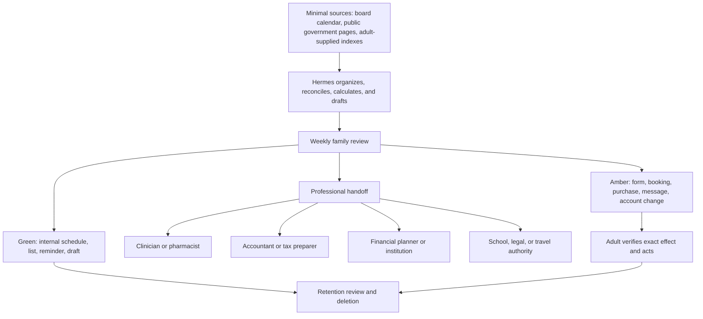

# 18. Family Operations in Canada

**Verified against Hermes Agent v0.20.5 (2026-08-19).**

## Opening scenario

The first week of September brings a school calendar, two activity registrations, a lunch-policy update, a dental appointment, a tax instalment reminder for Alex's side business, and a notice that one family benefit will be recalculated. Priya has an interview on Thursday. The family wants to plan winter travel before prices change. Receipts sit in three inboxes and a kitchen drawer.

Hermes offers to “centralize the family.” That phrase hides a bad design. A central family record could combine children's school identifiers, health history, tax slips, banking information, passport details, location, and adult career data. It would be convenient, attractive to an attacker, and unnecessary for most household decisions.

The Chen–Patels build a thinner system. Hermes sees a school event index, not school accounts; activity deadlines and form status, not signed consent; meal options and a grocery list, not diagnoses; routine check dates, not a medical chart; budget categories and candidate totals, not banking credentials; tax-document metadata, not a tax portal; public benefit pages, not eligibility decisions; retirement questions and owner-supplied inputs, not trading authority; and a travel checklist without passport numbers.

Sunday's family review now answers five questions: What changed? What is due? Which decision needs an adult? Which professional needs a clean packet? What should be deleted? A school form is found early. A benefit page is rechecked instead of relying on last year's amount. A tax preparer receives a reviewed document set. Nobody mistakes a reminder for advice or a shared calendar for consent.

## Definitions

**Family operating system.** The small set of calendars, indexes, routines, decision packets, and review meetings used to coordinate household work. It is not a complete model of family members.

**Family operations profile.** The isolated Hermes profile and workspace used for approved household artifacts. A profile separates state and tools for organization; Chapter 11's OS/process boundary still provides containment.

**Operating index.** A minimal table pointing to an authoritative source. It stores event date, document type, owner, status, restricted location, review date, and source—not the full underlying record.

**School-year map.** The board-verified calendar plus family-specific terms, breaks, professional-activity days, events, transitions, and preparation windows. Provincial dates are planning inputs; the local school board remains the source for its calendar.

**Form register.** A list of forms with purpose, issuer, child or activity alias, due date, responsible adult, fields needing human input, submission channel, and receipt. It does not hold signatures or every completed form.

**Routine.** A repeated, low-consequence pattern for preparation: meal planning, grocery review, movement time, refill checks, or document capture. A routine can support health; it is not diagnosis or treatment.

**Budget preparation.** Collecting owner-supplied income and expense categories, reconciling periods, calculating transparent totals, and presenting scenarios for human review. It does not authorize spending, borrowing, investing, or financial advice.

**Tax-document index.** A tax-year checklist recording issuer, slip/document type, expected/received state, restricted source location, and reviewer. It is not the tax return and contains no tax-account password.

**Benefit and deadline monitor.** A recurring check of named official public pages for changes, paired with human verification. It identifies possible action; it does not determine eligibility or apply.

**Retirement-goal inputs.** Human-supplied assumptions and official statement figures used to prepare questions or estimates: desired timing, spending scenarios, CPP/QPP history, OAS residence history, pension information, and registered/non-registered savings summaries. Inputs are not recommendations.

**Professional handoff.** A bounded packet that gives a clinician, pharmacist, accountant, tax preparer, financial planner, lawyer, school official, or travel authority the facts and questions needed for their role. Hermes prepares and indexes; the professional and family decide.

**Household declassification.** Deliberately reducing a sensitive fact to the minimum coordination fact another profile needs. “Unavailable Tuesday 15:00–16:00” may cross profiles; the medical or interview reason does not.

**Changeable claim.** A deadline, benefit amount, tax threshold, school date, health direction, travel advisory, or program rule that can change. It requires an official source and observation date; do not copy it forward silently.

The system routes each domain toward a person, not toward more agent authority:



## Hermes in practice

### Establish the family data ceiling

Write the exclusion list before importing a calendar. No raw child dossier belongs in Hermes. Keep children's portal credentials, student numbers unless narrowly necessary, grades, discipline, private messages, detailed health records, identity documents, photographs of identification, signatures, and activity histories outside the family workspace. Keep adult primary email, banking, CRA, My Service Canada Account, health, passport, and password-manager access outside too: **no primary credentials**.

Use aliases such as `Child A` in shared indexes when names add no value. Store the authoritative form or health record in the adult-controlled system that already owns it. The index may say `FORM-026 / Child A / provider-plan update / guardian review / restricted source`, but the condition and clinical content remain with the guardian and care/school channel. Apply the strictest classification when school, health, travel, and identity fields overlap.

Hermes memory does not hold household dossiers. The memory is loaded into sessions and designed for preferences and operating facts—not raw data dumps. For the family profile, enable write approval or disable built-in memory if the operating policy requires it. Store procedure in a context file; store family facts in the indexed source with retention.

### Build the school-year map from the local board

Ontario publishes school-year planning information and states that parents should contact their school board for the calendar the board actually uses. Therefore, treat the provincial page as context and the named board calendar as authoritative. Capture its URL or adult-supplied copy, revision/observation date, timezone, first/last day, breaks, professional-activity days, examination periods when relevant, and school-specific events.

Layer family preparation around, not into, the school record:

- four weeks before term: verify board calendar, transport arrangements, activity availability, and supplies;
- two weeks before each break: decide caregiving, travel, and quiet-work coverage;
- weekly: review notices, form dates, activity collisions, and special preparation;
- after a calendar update: invalidate affected plans and ask an adult to reconcile.

Dates are not consent. Hermes can add a proposed event to a local planning file. A calendar invitation, school reply, absence notice, registration, or pickup authorization is Amber. The guardian verifies the child, school, date, recipients, disclosure, and effect.

Do not infer a school closure from a weather forecast or social post. Use the school board's official channel and observation time. A failed page means coverage is missing. It does not mean school is open or closed.

### Coordinate activities and forms without signing

Use one activity row per current commitment: activity ID, season, provider, public location name, ordinary schedule, transport owner, fee status, equipment list, registration/form status, due date, and official contact route. Omit child-health details and payment credentials. Keep the signed form and receipt in the provider/guardian-controlled source.

For activities and forms, Hermes can extract dates from an adult-supplied notice, compare them with the shared calendar, flag a conflict, prepare a packing list, and draft questions. It cannot choose the activity for a child without family discussion, accept waivers, provide medical consent, sign, pay, or submit.

Form extraction needs a coverage check. PDFs may be scanned, and native document extraction reads only a text layer. If required fields appear empty, an adult inspects the original. Render or OCR only the needed pages inside the approved boundary; never invent an answer. Fields about health, custody, emergency contacts, photo consent, liability, or legal attestations go to the guardian, and sometimes to a clinician or lawyer.

Set form states to `noticed`, `reviewing`, `waiting-on-person`, `ready-for-guardian`, `submitted`, `confirmed`, `declined`, or `expired`. `Submitted` requires a provider receipt or guardian confirmation. A due date passing never changes a row to submitted.

### Design a meal routine for logistics, not clinical nutrition

A practical meal routine begins with adult-supplied preferences or restrictions, time, budget, available food, and cooking capacity. Hermes can propose meals from Canada's Food Guide resources, produce a grocery list, and group preparation tasks. It should not present general guidance as individualized care.

Use a weekly pattern:

1. Check evening constraints and leftovers.
2. Ask adults for fixed dietary constraints and the week's budget ceiling.
3. Propose a small set of breakfasts, packed lunches, dinners, and backups.
4. Check ingredient duplication, preparation time, storage, and school/provider rules.
5. Produce a purchase proposal; an adult checks inventory, prices, labels, allergens, and buys.
6. Record only reusable preferences that the family approved; delete temporary meal notes.

The meal routine must not calculate a child's weight-loss target, diagnose deficiency, override clinical dietary instructions, or shame eating. Allergies, diabetes, eating disorders, swallowing issues, pregnancy, medication interactions, growth concerns, and therapeutic diets require the appropriate clinician or registered dietitian. In an urgent reaction, use the family's emergency plan and emergency services, not Hermes.

### Keep the health routine administrative

The health routine manages dates and questions: preventive appointment reminders, medication refill review dates, vaccination-document reminder, dental/vision scheduling, adult-approved symptom notes for a visit, and follow-up tasks from a clinician. It does not decide what care is needed.

Record minimum metadata: person alias, appointment type, date, provider contact route, preparation checklist, transport, question-list path, follow-up owner, and restricted record location. Do not copy the diagnosis, prescription, laboratory result, or full visit note into the shared calendar. Use a private event title such as “appointment.”

Ontario's Health811 offers a route to a registered nurse and service navigation. It is a professional/human handoff, not an agent tool. Immediate danger uses 911. Hermes should not triage an emergency from chat, tell someone to wait, or use Health811 as a substitute for an established clinician. Follow current provincial instructions because services and routes change.

Unexpected health information triggers minimization: stop, move the information to the adult-controlled source, remove propagated copies under policy, and preserve only the logistics needed. Do not write diagnoses or child health history into memory.

### Make the fitness routine opt-in and adaptable

A fitness routine coordinates chosen activities and recovery time. Canada's public-health page links age-specific movement guidance and emphasizes that recommendations vary by age. Use the current official guidance as a discussion source, not a quota enforced by Hermes.

Each person chooses whether and how to participate. A shared plan can contain activity options and rest days without collecting weight, body measurements, performance rankings, injury narratives, or location traces. Children are not scored.

Hermes can identify calendar space, suggest weather-independent alternatives, and summarize completed sessions if a person volunteers that information. It cannot diagnose injury, prescribe rehabilitation, set unsafe targets, or decide return-to-play. Pain, new symptoms, pregnancy, chronic conditions, disability adaptations, and recovery decisions go to a qualified clinician or physiotherapist as appropriate.

### Prepare a household budget without controlling money

FCAC's Budget Planner begins from income, savings, and expense categories. The family can use that structure while keeping financial accounts human-only. Adults export or manually enter a period's category totals into a restricted budget-preparation artifact. Hermes never logs into banking, downloads statements from a primary session, or retains account numbers.

Normalize each figure by period and currency. Distinguish gross income, net inflow, fixed commitments, variable essentials, discretionary spending, irregular annual costs, debt payments, transfers, and savings. Keep source, period, owner, and reconciliation status. A transfer between family accounts is not spending; a credit-card payment may duplicate underlying purchases.

Present current facts before scenarios:

- observed monthly-equivalent income and expenses;
- irregular obligations due in the next three months;
- categories with missing or stale input;
- cash-flow timing risks;
- scenario assumptions such as changed income, childcare, travel, or activity fees;
- decisions requiring adults or a financial professional.

Hermes may calculate arithmetic and show formulas. It does not decide what a family “should” spend, choose credit, recommend a security, move money, or initiate transfers. A budget scenario is not a forecast guarantee. If debt stress, insolvency, investment, insurance, mortgage, or major retirement decisions are involved, prepare a packet for an appropriately qualified professional or regulated institution.

### Operate tax-document collection as an index

For the 2026 tax-filing season, the CRA states that most individuals' 2025 return and payment were due April 30, 2026; a self-employed filer and their spouse or common-law partner generally had a June 15, 2026 filing deadline while amounts owing were still due April 30. These are dated examples verified on 2026-08-21, not permanent rules. Recheck the CRA's current page for the relevant tax year and facts.

Create the next year's checklist from last year's reviewed categories and current life events, not by guessing entitlement. Rows may include employment slips, pension/investment slips, benefit slips, donation or medical receipts, childcare documentation, business records, instalment evidence, prior return, and assessment notices as applicable. The accountant or taxpayer confirms what is required.

For tax-document collection, store tax year, issuer, document type, expected date if officially sourced, received status, restricted path, duplicate/version status, and reviewer. Do not place the slip values, SIN, full account numbers, or CRA correspondence text into the general family ledger. Missing slips are followed up with the issuer; the CRA explains that it does not issue employer or financial-institution slips.

The CRA's general individual guidance says to keep tax documents and records for at least six years, but exceptions can apply. That threshold was checked on 2026-08-21. The tax professional or current CRA guidance determines retention for the actual document and transaction. Chapter 14's operational deletion defaults do not override tax requirements.

Hermes can detect missing metadata, group documents, calculate transparent candidate totals, produce a checksum manifest, and draft questions. A person or authorized tax professional classifies deductions/credits, determines positions, accesses CRA, attests, files, pays, and responds to the CRA. Never give Hermes primary government credentials or filing authority.

### Monitor benefits and deadlines without deciding eligibility

Benefits change with programs, family facts, tax filings, and dates. Use the Government of Canada's Benefits Finder to identify programs for human investigation and the official payment-date page to monitor named schedules. The Finder presents possibilities; it does not prove eligibility. Provincial and municipal programs require their own official source.

A benefit and deadline monitor row needs program, administering authority, official URL, observed date, family owner, current known status, next human review, required document categories, and change reason. Store neither account credentials nor a copied application dossier. Follow only programs the adults selected; do not infer disability, income, marital status, immigration status, or eligibility from household data.

Cron can check official public pages in a fresh session and deliver a local change report. Pin the source list and require a content comparison. A changed page creates `review-needed`; a failed request creates `coverage-gap`; neither creates an application or account change. Dates, amounts, thresholds, and program names must be rechecked at the official page before action.

Any application, renewal, attestation, change of address, marital-status update, direct-deposit change, or disclosure is Amber and human-operated. Suspected overpayment, disagreement, appeal, or complex eligibility goes to the administering agency or qualified adviser.

### Collect retirement-goal inputs for a professional conversation

The Canadian Retirement Income Calculator lists useful inputs: CPP or QPP contribution information, Canadian residence history for OAS, employer pension information, registered savings statements, and other retirement income. Its page says results are estimates and should not be used as financial planning. Respect that boundary.

Adults gather statements themselves and provide only the inputs needed for a scenario. Keep input provenance: source date, dollars, inflation assumption, retirement age, expected spending, debt, housing, dependants, pension assumptions, and unknowns. Preserve a minimal dated result, not primary credentials or browser history.

Hermes can compare scenarios arithmetically, explain changed assumptions, and prepare questions about contributions, indexing, fees, tax treatment, survivor options, and risk. It cannot recommend investments, select accounts, time pension elections, or move assets.

Hand the packet to a qualified financial planner, pension administrator, tax professional, or regulated institution depending on the question. Ask about credentials, scope, compensation, conflicts, and written assumptions. The family approves every action separately.

### Prepare travel without collecting identity documents

A family travel packet starts with destination, dates, travellers by alias, budget ceiling, accessibility needs the travellers choose to disclose, and decision deadlines. Hermes may research public transport and accommodation options, compare owner-supplied prices, and check the Government of Canada's Travel Advice and Advisories. Advisories change; record observation time and recheck before booking and departure.

The packet includes:

- official destination advisory and update time;
- passport-validity question and destination entry/exit source;
- transport/lodging options with price, currency, refundable terms, and observation time;
- insurance questions for the provider;
- medication or vaccination questions for a clinician/pharmacist;
- child-travel document and consent questions;
- local emergency and Canadian assistance sources;
- packing, home, pet, and school absence tasks;
- exact booking decisions awaiting adults.

Travel.gc.ca recommends a consent letter when a child travels abroad without one or both parents or decision-makers and notes that family situations and destination rules differ. Hermes may surface the current official template and a legal-review question. It cannot decide who has decision-making responsibility, sign the letter, assess custody risk, or say a document guarantees entry. A guardian and, when facts warrant, a family lawyer or destination authority handle it.

Keep passport numbers, birth certificates, citizenship documents, signatures, court orders, credit cards, loyalty credentials, and medical details outside Hermes. A local checklist can say `passport checked by Priya / expiry suitable per destination source / date`, without copying the number.

### Hold a respectful family review

Run a thirty-minute family review weekly and a deeper seasonal review before school terms, tax season, summer, and year-end. Children can raise preferences and choose age-appropriate tasks; adults control sensitive records and decisions.

Use this agenda:

1. Coverage and new source changes.
2. Next two weeks of school, activity, appointment, and travel constraints.
3. Forms and documents waiting on a person.
4. Meal, grocery, and movement options for the coming week.
5. Budget exceptions and upcoming irregular costs.
6. Tax, benefit, retirement, or professional handoffs due.
7. Decisions, named adult owners, and exact Amber proposals.
8. Retention: temporary notes and expired copies to remove after approval.

Do not display one person's health, financial, career, or private communication detail to the whole family. Share only the coordination fact they approved. Hermes records explicit decisions; missing owners and dates remain `unresolved`.

### Separate organization from advice at every handoff

The governing sentence is: **this is organization, not medical, financial, or tax advice**. The same distinction applies to legal, educational, travel, insurance, and benefits decisions.

Use the following named artifact in the workspace:

```text
PROFESSIONAL HANDOFF MATRIX

Health or nutrition concern:
  Prepare: timeline, adult-approved observations, medication list held by adult,
  questions, prior professional instructions, source dates.
  Decide: clinician, pharmacist, registered dietitian, or emergency service.

Tax question:
  Prepare: tax-year index, issuers, documents received/missing, transparent
  candidate totals, CRA source dates, questions.
  Decide: taxpayer or authorized accountant/tax professional; CRA where needed.

Budget, debt, retirement, pension, investment, or insurance question:
  Prepare: owner-supplied inputs, periods, formulas, scenarios, unknowns.
  Decide: adults with qualified planner, pension administrator, licensed/regulated
  provider, or insolvency professional appropriate to the question.

School, child consent, custody, or travel-document question:
  Prepare: official form/source, deadlines, factual family instructions, gaps.
  Decide: guardian, school/board, destination authority, or family lawyer.

Benefit eligibility, overpayment, appeal, or account change:
  Prepare: official program URL, observed date, requested document categories,
  timeline, questions, and minimal correspondence index.
  Decide: administering agency, authorized representative, or qualified adviser.
```

The packet states what Hermes did not verify. Professionals receive authoritative documents through a human-approved secure channel.

### Automate only public checks and internal preparation

Use the minimum capability layer:

- **Native Hermes:** file tools maintain minimal indexes; `web_search` and `web_extract` research named public sources; `read_file` extracts adult-supplied documents with coverage warnings; cron can schedule proved public checks and internal reviews.
- **Bundled Hermes skills:** grounded citations can anchor changeable public claims; document or XLSX skills can prepare reviewed handoff packets when the format adds value.
- **MCP or custom work:** a municipal recreation feed, family calendar provider, or expense export requires a named, terms-compatible, scoped read-only interface with removal tests. It is optional.
- **Human/manual:** primary inboxes and portals, banking, government and health accounts, signatures, consent, payments, bookings, applications, filing, investment decisions, and professional communication remain controlled by adults.

The email gateway is for a dedicated agent mailbox and can reply to processed messages; it is not a passive connection to an adult's ordinary mailbox. Keep school, CRA, health, and financial accounts human-only. Adults copy the minimum notice or export into the correct intake.

Run monitors manually, pin official URLs, set local delivery, and record freshness. Cron starts a fresh session, so the prompt must name sources, workspace, date handling, outputs, exclusions, and stop conditions. Pause on repeated failure. Never broaden to a logged-in portal because a public page failed.

## Professional example

Alex's side business and Priya's job transition make the tax season less routine. Hermes creates a 2025 document index from the prior accountant's checklist and current issuer list. It records received/missing states and restricted paths, but not slip values or SINs. A calculation sheet groups owner-supplied expense totals and shows formulas. Unknown classifications remain questions.

The accountant receives the source documents through the family's approved secure route plus a concise issue list: job-transition income, business expenses, instalments, and a benefits question. Hermes does not classify deductions, sign an authorization, access CRA, file, or pay. After the accountant confirms the retention schedule, the family records it against the relevant files rather than applying one deletion rule to everything.

For retirement, Hermes prepares two separate input sheets and scenario questions. Priya and Alex use official tools themselves, then meet a qualified planner to review assumptions, pension options, fees, tax interaction, and risk. The family ledger stores the decision and review date, not account credentials or trading instructions.

## Personal example

The school board revises one professional-activity day. The scheduled public check reports the page change, but the family board calendar is the authoritative source. Alex verifies the board notice. Hermes flags a childcare conflict and prepares three schedule options; the adults decide.

At the same review, Child A's activity form requests emergency medical details and photo consent. Hermes indexes the due date and marks both fields `guardian decision`; it does not fill or sign them. The meal plan proposes four dinners based on adult-approved preferences and current Food Guide resources. A new dietary concern is routed to the family's clinician/dietitian, not added as an agent-generated restriction.

The travel packet shows that destination advice was checked that morning and that child consent documentation needs guardian/legal review. Priya books manually. The shared calendar receives dates and a generic confirmation reference; passports and payment details never enter the workspace.

## Authority boundaries

| Boundary | Family-operations authority |
| --- | --- |
| **Green — may act** | Read approved public pages and minimal adult-supplied indexes; reconcile calendars and due dates; calculate transparent budget/tax working totals; draft meals, grocery lists, routines, packets, questions, and reminders; report freshness, conflicts, missing documents, and coverage gaps; run synthetic tests and local public-source monitors. |
| **Amber — may prepare** | School/activity forms, messages, calendar writes, registrations, appointments, purchases, bookings, benefit/account changes, tax or professional packets, retention/deletion batches, and travel documents. An adult verifies the exact person, source, facts, fields, recipient, price, terms, consent, and effect before acting. |
| **Red — may not act** | Hold primary credentials or raw child dossiers; access banking, CRA, health, school, or travel accounts; diagnose, prescribe, triage emergencies, set therapeutic diets, or decide return-to-play; sign consent, impersonate a child/guardian, apply for benefits, file taxes, choose investments, move money, book travel, accept terms, disclose across profiles, or infer eligibility, custody, health, or family values. |

This chapter prepares household decisions and professional handoffs. It does not replace a clinician, pharmacist, dietitian, accountant, tax preparer, financial planner, pension administrator, lawyer, school/board, government program administrator, insurer, or destination authority.

## Failure modes and recovery

**A child dossier forms by accumulation.** Stop the profile and scheduled jobs, map copied fields across indexes, sessions, memory, outputs, sync, and backups, retain only task-minimum metadata, delete under guardian policy, and test that restricted source locations remain inaccessible.

**A board or government date was copied forward.** Mark the item stale, inspect the current official source and local board/provider page, correct dependent plans, and record observation time. Notify affected adults; do not silently rewrite a past briefing.

**A scanned form looks blank.** Stop completion. Inspect the original visually or use approved page-specific rendering/OCR. Route signatures, consent, health, custody, and attestations to the guardian/professional. Never fill a gap from last year's form.

**Meal planning becomes medical advice.** Remove diagnostic, therapeutic, calorie, weight, or medication language; preserve only adult-approved logistics; route the concern to the appropriate clinician or dietitian. In urgent cases follow emergency procedures.

**Budget arithmetic duplicates spending.** Reconcile transfers, credit-card payments, refunds, tax, and period conversions against owner-supplied sources. Mark totals provisional until an adult confirms. Do not make a transfer to “fix” the budget.

**Tax deadline or retention rule is stale.** Stop the checklist from presenting it as current. Recheck the relevant CRA tax-year page and facts, record the date, and ask the taxpayer/professional how exceptions apply. Preserve records while uncertain.

**A benefit monitor implies eligibility.** Change the row to `possible-review`, remove inferred family facts, and hand the current official link to the adult. No application, account change, or expected amount enters the calendar without authoritative confirmation.

**A retirement estimate becomes a recommendation.** Separate inputs, assumptions, arithmetic, official calculator result, and professional advice. Label the estimate, remove action language, and obtain the appropriate qualified review before any pension or investment decision.

**A travel advisory changed after booking.** Alert the adults with source and observation time, freeze agent-generated recommendations, and have them contact providers, insurer, destination authority, clinician, or legal adviser as relevant. Hermes does not cancel or rebook autonomously.

**A scheduled report is missing or duplicated.** Pause the named cron job, inspect execution history and delivery evidence, reconcile the current source manually, keep one definition, and retest locally. A missing run is not “no change”; an unknown run is not retried blindly.

**Sensitive detail crosses profiles.** Stop delivery, preserve minimal evidence, identify recipients and copies, follow Chapter 14's wrong-recipient procedure, and rebuild with a declassified coordination fact. Do not ask the child to manage the incident.

## Field kit

### Canadian family operating card

```text
BOUNDARY
Family profile / workspace / adult owners:
Authorized public and adult-supplied sources:
Excluded primary accounts and credentials:
Child aliases / prohibited dossier fields:
Memory policy / retention / deletion owner:
Cross-profile declassification rule:

SCHOOL AND ACTIVITIES
Board calendar URL / revision / observation time:
School-year terms / breaks / PA days / local events:
Activity ID / schedule / transport / equipment:
Form state / due date / guardian-only fields:
Receipt or confirmation / next review:

MEAL, HEALTH, FITNESS
Adult-approved preferences and restrictions:
Meal routine / grocery review / storage check:
Appointment and refill logistics:
Opt-in movement choices / rest / accessibility:
Clinician, pharmacist, dietitian, or emergency handoff:

BUDGET AND TAX
Periods / currencies / source owners:
Income / fixed / variable / irregular / transfer categories:
Formula and reconciliation status:
Tax year / issuer / document type / restricted path / state:
Current CRA source / observation date / professional questions:

BENEFITS AND RETIREMENT
Program / authority / official URL / observed date:
Possible-review status / human owner / next check:
Retirement input source dates / assumptions / unknowns:
Official estimator result labelled estimate:
Planner, pension, tax, or institution handoff:

TRAVEL
Destination / dates / aliases / decision deadline:
Official advisory and entry source / observation time:
Prices / currency / terms / provider links:
Child consent / passport / health questions kept manual:
Exact booking owner / confirmation reference:

FAMILY REVIEW
Coverage gaps / changed sources:
Two-week constraints / unresolved forms:
Meal and movement options:
Budget exceptions / professional handoffs:
Explicit decisions / owners / due dates:
Amber proposals / deletion batch:
```

## Exercise

It is August 21, 2026. The family has a provincial school-calendar printout, an unverified board-calendar screenshot, two scanned activity forms, a child's allergy note, grocery receipts, a banking export, 2025 tax slips, a CRA login, a message promising a benefit increase, retirement account statements, and a plan for one parent to travel internationally with both children.

Design the school-year map, activity/form register, meal/health/fitness routines, budget preparation, tax-document index, benefit monitor, retirement-input packet, travel packet, weekly family review, and professional handoffs. State what stays outside Hermes, which current official sources need checking, what native/skill/custom/manual capability applies, which actions are Green/Amber/Red, and how to recover if the allergy note and CRA credential enter memory.

## Answer or rubric

The board calendar must be verified at the board's official source; the provincial page is context. Scanned forms require coverage recovery and guardian handling for consent, health, custody, or signatures. The allergy note stays in the adult-controlled clinical/school channel; the family index holds only the action and restricted source. The CRA login is Red and must be removed/revoked if exposed.

The meal and movement routines offer adult-approved logistics without diagnosis, weight targets, or treatment. Budget work uses minimized category totals and transparent reconciliation, never bank access or transfers. The tax index records metadata and current 2026 CRA deadlines as dated examples; a taxpayer or professional decides and files. The benefit message is untrusted until the official program page is checked. Retirement statements yield owner-supplied inputs and questions, not investment choices.

Travel uses current destination advice and guardian/legal review of child consent requirements without storing passport details. Public-source checks and internal drafts can be Green; forms, calendar changes, purchases, bookings, applications, messages, and deletion are Amber; medical, tax, financial, consent, credential, and identity decisions are Red.

After sensitive memory exposure, stop the profile and jobs, remove/revoke the credential at the authoritative service, map session/memory/output/backups, delete under policy, restart cleanly, and test absence with synthetic canaries. Award two points each for child minimization, source authority, scanned-form handling, health boundary, budget reconciliation, tax handoff, benefit freshness, retirement boundary, travel consent, capability seams, family review, and incident recovery. Twenty of twenty-four indicates mastery; any stored CRA password, autonomous filing, diagnosis, investment choice, or signed child form requires redesign.

## Mastery checklist

- [ ] I run a minimal family operating index, not a central dossier.
- [ ] I keep child portals, health detail, identity documents, signatures, and private messages outside Hermes.
- [ ] The local school board is authoritative for its calendar; every changeable date has a source and observation time.
- [ ] Form status never becomes consent or submission without guardian evidence.
- [ ] Meal, health, and fitness routines organize logistics and route clinical questions to professionals.
- [ ] Budget preparation uses category totals, periods, formulas, and reconciliation without banking access or money movement.
- [ ] Tax-document collection stores metadata and restricted paths; humans/professionals decide positions, file, and pay.
- [ ] Benefits Finder and payment pages create review tasks, not eligibility claims.
- [ ] Retirement scenarios separate inputs, assumptions, estimates, and qualified advice.
- [ ] Travel packets use current official sources and exclude passport, payment, signature, and custody documents.
- [ ] I can name the clinician, tax, financial, legal, school, agency, and travel handoff points.
- [ ] I distinguish native Hermes tools, bundled skills, reviewed custom interfaces, and manual account work.
- [ ] Scheduled monitors use public sources, fresh sessions, local delivery, and explicit coverage failures.
- [ ] The family review shares only approved coordination facts and deletes temporary copies on schedule.

## References

- Nous Research, [Scheduled tasks](https://github.com/NousResearch/hermes-agent/blob/v2026.8.19/website/docs/user-guide/features/cron.md).
- Nous Research, [Persistent memory](https://github.com/NousResearch/hermes-agent/blob/v2026.8.19/website/docs/user-guide/features/memory.md).
- Nous Research, [Tools and toolsets](https://github.com/NousResearch/hermes-agent/blob/v2026.8.19/website/docs/user-guide/features/tools.md).
- Nous Research, [Email gateway](https://github.com/NousResearch/hermes-agent/blob/v2026.8.19/website/docs/user-guide/messaging/email.md).
- Nous Research, [Document extraction](https://github.com/NousResearch/hermes-agent/blob/v2026.8.19/website/docs/user-guide/features/document-extraction.md).
- Nous Research, [Web search and extraction](https://github.com/NousResearch/hermes-agent/blob/v2026.8.19/website/docs/user-guide/features/web-search.md).
- Nous Research, [Grounded citations bundled skill](https://github.com/NousResearch/hermes-agent/blob/v2026.8.19/website/docs/user-guide/skills/bundled/research/research-grounded-citations.md).
- Nous Research, [XLSX bundled skill](https://github.com/NousResearch/hermes-agent/blob/v2026.8.19/website/docs/user-guide/skills/bundled/productivity/productivity-xlsx.md).
- Ontario Ministry of Education, [School year calendars](https://www.ontario.ca/page/school-year-calendars) (accessed 2026-08-21).
- Health Canada, [Canada's Food Guide](https://food-guide.canada.ca/en/) (accessed 2026-08-21).
- Public Health Agency of Canada, [Physical activity for your health](https://www.canada.ca/en/public-health/services/being-active/physical-activity-your-health.html) (accessed 2026-08-21).
- Government of Ontario, [Your health and Health811](https://www.ontario.ca/page/your-health) (accessed 2026-08-21).
- Financial Consumer Agency of Canada, [Making a budget](https://www.canada.ca/en/financial-consumer-agency/services/make-budget.html) (accessed 2026-08-21).
- Canada Revenue Agency, [What you need to know for the 2026 tax-filing season](https://www.canada.ca/en/revenue-agency/news/newsroom/tax-tips/tax-tips-2026/what-you-need-for-2026-tax-filing-season.html) (published 2026-01-27; accessed 2026-08-21).
- Canada Revenue Agency, [Tax slips at tax time](https://www.canada.ca/en/revenue-agency/news/newsroom/tax-tips/tax-tips-2026/tax-slips-what-they-are-where-find-why-waiting-can-help-avoid-mistakes.html) (published 2026-02-03; accessed 2026-08-21).
- Canada Revenue Agency, [How long should you keep your income tax records?](https://www.canada.ca/en/revenue-agency/services/tax/individuals/topics/about-your-tax-return/long-should-you-keep-your-income-tax-records.html) (modified 2026-01-20; accessed 2026-08-21).
- Government of Canada, [Benefits Finder](https://www.canada.ca/en/services/benefits/finder.html) (modified 2026-04-16; accessed 2026-08-21).
- Government of Canada, [Benefits payment dates](https://www.canada.ca/en/services/benefits/calendar.html) (accessed 2026-08-21).
- Government of Canada, [Canadian Retirement Income Calculator](https://www.canada.ca/en/services/benefits/publicpensions/cpp/retirement-income-calculator.html) (modified 2025-11-25; accessed 2026-08-21).
- Global Affairs Canada, [Travel Advice and Advisories](https://travel.gc.ca/travelling/advisories) (accessed 2026-08-21).
- Global Affairs Canada, [Recommended consent letter for children travelling abroad](https://travel.gc.ca/travelling/children/consent-letter) (modified 2026-02-11; accessed 2026-08-21).
