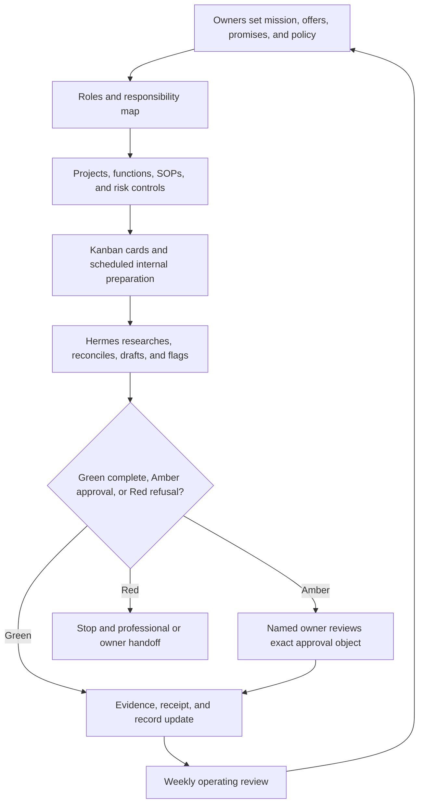

# 19. The One- or Two-Person Business OS

**Verified against Hermes Agent v0.20.5 (2026-08-19).**

## Opening scenario

Harbourlight has two owners, twelve customers, four active projects, and no shortage of effort. It also has three different answers to “What did we promise?” Alex remembers a date from a call. Priya sees another date in a proposal. A task card says “launch next week” without naming whose week, which deliverable, or who accepted the change. Receipts live in email, meeting decisions live in chat, and a useful customer-support draft has quietly become an assumed policy.

The temptation is to make Hermes the missing manager: connect every service, let it decide priorities, and ask it to keep the business moving. That would amplify the ambiguity. An agent can make a disorganized operation move faster in the wrong direction.

The owners pause. They create a small operating system before adding automation. One page states the mission, offers, and customer promises. A register names the authoritative record for customers, projects, decisions, procedures, risks, and finance handoff. Every project has an owner and an observable finish. A Kanban board shows work, but it does not decide what the company should do. Meetings end in cited decisions, not inferred consensus. Hermes prepares, reconciles, and reports; Alex and Priya retain commitments, money, legal acceptance, customer promises, and professional decisions.

On Friday, the owners can answer five questions from records rather than memory: What are we selling? What have we promised? What is active? What is at risk? What requires a human decision? That is the beginning of an operating system—not more software, but a dependable way to turn intent into accountable work.

## Definitions

**Business operating system.** The small set of rules, records, routines, roles, and review points by which a business converts decisions into work and learns from results. It is not an app. A folder of Markdown files can be an operating system if people actually use it.

**Mission.** A concise statement of whom the business serves, what useful change it creates, and which constraints it will honour. Mission is a decision filter, not advertising copy.

**Offer.** A defined bundle of outcome, scope, exclusions, delivery method, evidence of completion, and commercial terms controlled by the owners. An offer record does not authorize Hermes to quote or change a price.

**Customer promise.** A commitment a reasonable customer may rely on: scope, delivery date, service level, remedy, result, price, discount, or policy exception. A draft becomes a promise only through the owner's approved customer-facing act.

**Role.** A stable set of responsibilities and decision rights. One person may hold several roles. A role is clearer than a list of personalities.

**Accountable owner.** The one human who answers for a decision or result. Work may have collaborators, but it should not have two people assuming the other is accountable.

**System of record.** The named store whose current value wins when copies disagree. A CRM may own contact state; the project register may own scope; the accounting system may own posted transactions. Hermes's summary is never authoritative merely because it is convenient.

**Project.** Temporary work with an owner, outcome, boundaries, acceptance evidence, and end state. Ongoing support is a function; improving the support intake over six weeks is a project.

**Kanban.** A visual flow system in which cards move through explicit states. Hermes Kanban is also a specific durable, SQLite-backed task board shared across profiles. The business method and the product feature overlap, but they are not identical.

**Decision log.** A dated record of a real choice, its human decider, context, alternatives, rationale, consequences, review trigger, and supporting evidence. Proposals are not decisions.

**Standard operating procedure (SOP).** A versioned procedure for repeated work. It names inputs, steps, checks, authority, exceptions, outputs, and recovery. It does not turn judgment into an unattended script.

**Risk register.** A prioritized record of uncertain events that could affect customers, finances, privacy, operations, or reputation. Each risk has an owner, evidence, controls, trigger, response, and review date.

**Finance handoff.** A controlled package of source-document indexes, reconciled operational facts, questions, and receipts prepared for the owner and qualified bookkeeper, accountant, or tax professional. It is preparation, not professional bookkeeping or tax advice.

**Responsibility map.** A compact RACI-like table showing who is accountable, who is consulted, what Hermes may prepare, and what evidence closes the loop. The letters matter less than explicit human decision rights.

The operating system has one direction for authority and another for evidence:



## Hermes in practice

### Start with the business boundary, not the board

Create a dedicated business profile and workspace under the Chapter 11–14 trust envelope. Profiles isolate Hermes configuration, sessions, memory, skills, cron jobs, and state. They do not sandbox the filesystem. On the local terminal backend, a business profile still runs with the Mac account's access unless OS permissions, a separate account, or a container narrows it. Set an absolute business `terminal.cwd`, use the smallest toolsets, and keep personal, career, family, and business records in separate roots.

Bot Mode is a desktop view over profiles. A “Research” Bot or “Operations” Bot is a profile with its own state, not a new security boundary or an employee with independent authority. Start with one business profile. Add a specialist only when its source boundary, output, owner, retention, and revocation plan genuinely differ. Never run two processes against one profile home.

Create this top-level layout:

```text
business/
  00-governance/   mission, offers, glossary, roles, authority, decisions
  10-customers/    minimized account index and approved correspondence refs
  20-projects/     one folder per project, including acceptance evidence
  30-operations/   SOPs, service records, risk and incident registers
  40-finance-inbox/receipt index, document pointers, handoff packets
  90-archive/       closed records under the retention schedule
```

Store pointers rather than copies where the source contains more customer or financial data than the task needs. Chapter 14's data map, retention schedule, backup scope, restore test, and wrong-recipient drill still apply. No customer data belongs in general memory merely because it may help later.

### Write mission, offers, and promises as control records

Use three linked registers. The names below are intentionally conspicuous so a reviewer can locate them.

```text
MISSION AND OFFER REGISTER
Mission version / human approvers / effective date:
Customer and problem served:
Useful change / ethical limits / explicit non-goals:
Offer ID / name / eligible customer:
Included outcome / artifacts / service boundary:
Exclusions / dependencies / acceptance evidence:
Price owner / contract owner / current approved source:
Revision / superseded version / next review:

CUSTOMER PROMISE REGISTER
Promise ID / account alias / source object:
Exact scope / date / service level / remedy:
Human promisor / customer-facing channel / accepted at:
Approval ID / provider receipt / authoritative record:
Dependency / risk / status / next review:
```

The mission filters work. If an idea serves nobody named, depends on deception, or violates a stated privacy limit, it does not become a project. Each offer separates stable operations from negotiable commercial choices. Hermes may compare an inquiry to the current approved offer, find missing facts, and draft an options packet. It may not sign contracts, accept terms, set prices, approve discounts, issue refunds, or create a customer commitment.

Customer promises require provenance. Record the signed agreement, approved proposal revision, or human-sent message ID—not a reconstructed paraphrase. When two sources conflict, freeze downstream planning, show both, and ask the accountable owner which record controls. Never “pick the likely date” to make a dashboard tidy.

### Establish a shared language and authoritative records

A two-person company can lose hours because “lead,” “customer,” “done,” or “urgent” means something different to each owner. Keep the vocabulary short and operational.

```text
SHARED GLOSSARY
Term / definition / example / non-example:
Lead: a permitted contact with a recorded source and lawful business reason.
Qualified: owner-approved criteria met; not a prediction of worth or intent.
Customer: a person or organization with an accepted agreement in the source system.
Done: acceptance evidence recorded; activity alone is not completion.
Urgent: an observable consequence before the next routine review.
```

Then name each authoritative store:

```text
SYSTEM OF RECORD REGISTER
Record family / authoritative store / human owner:
Permitted Hermes access / write class / sensitive fields excluded:
Stable ID / freshness check / backup and restore test:
Retention / deletion approver / export path:
Fallback when unavailable / reconciliation rule:
```

Typical families include offers, agreements, account contacts, consent, sales stage, projects, deliverables, support cases, decisions, SOPs, risks, invoices, payments, expense documents, and professional workpapers. “Google Drive” is too broad. Name the folder, sheet, or database and its owning fields. If a CRM or project service is not connected, use a manual CSV export or Markdown register. Do not invent a native Hermes connector.

### Keep customers, suppliers, and records proportionate

A small company does not need a data warehouse to become orderly. It needs one current account index and explicit links to authoritative objects. Use an account alias rather than repeating a legal name through every note. Record the source of the relationship, human owner, permitted contact route, current lifecycle state, open promise IDs, project/support links, next review, sensitivity, and retention state. Put agreement, billing, payment, and identity details in their proper restricted systems.

Separate three facts that are often collapsed. A **contact** is a person and business coordinate from a permitted source. An **account** is the business relationship. A **customer** is an account whose acceptance is evidenced in the authoritative agreement or order system. Hermes may identify a possible duplicate or a missing link; a human resolves identity and merge conflicts. Never merge on name alone, and never fill a contact profile from personal social data simply because it is public.

Use the same discipline for suppliers. Record owner, approved service, agreement pointer, renewal/review date, operational dependency, data access, incident contact, and exit procedure. Supplier selection, commercial acceptance, and payment remain human decisions. Hermes can compare documented capabilities, alert on an owner-selected review date, and prepare an offboarding checklist.

The record life cycle is `proposed → reviewed → active → superseded/closed → retained → deleted or anonymized`. Each transition has a human owner when it changes obligation, access, or retention. Archive closed operational material away from active search, but keep audit links intact. If a source is unavailable, mark freshness and coverage rather than copying an old value forward.

### Assign responsibilities before assigning tasks

For a one-owner business, the Co-owner column reads `not applicable`, and the owner must name an external professional or trusted backup for continuity. For Harbourlight, the owners use this **RESPONSIBILITY MAP**:

| Decision or work | Owner | Co-owner | Hermes | Evidence |
| --- | --- | --- | --- | --- |
| Mission and offer | Accountable; approves version | Consulted; may veto ethical or capacity conflict | Research and draft options only | Signed decision ID and version |
| Customer promise | Accountable human promisor | Consulted on capacity | Extract existing promise; draft only | Approval ID plus sent/accepted receipt |
| Contract acceptance | Accountable signatory | Consulted | Prohibited; route to human/legal review | Signed copy in authoritative store |
| Price or discount | Accountable commercial owner | Consulted | Prohibited; compare approved schedule only | Dated owner decision |
| Payment or refund | Accountable account holder | Consulted | Prohibited; prepare discrepancy packet | Provider receipt reconciled by human |
| Bookkeeping classification and tax | Accountable owner with qualified professional | Consulted | Organize source records only | Professional handoff and reviewed books |
| Customer-data access | Accountable privacy owner | Consulted | Minimized, profile-scoped access | Access register and sample audit |
| Incident stop | Accountable incident owner | Backup incident owner | Stop jobs, preserve minimal evidence, escalate | Incident ID and recovery sign-off |

Add rows for sales stage, marketing claims, public publishing, support remedies, project acceptance, supplier choice, record deletion, and automation changes. “Hermes: Responsible” is insufficient. State the permitted preparation and the prohibited consequence.

In a two-owner company, disagreement is a normal control state. Define the tie-breaker before pressure arrives. If either owner disputes a customer promise, contract meaning, price, payment, privacy disclosure, professional position, or irreversible deletion, the effect pauses. The accountable owner collects evidence; the consulted owner records the objection; the relevant adviser is involved where needed. A deadline does not convert a disagreement into Hermes authority.

For lower-consequence operational choices, the map may grant one owner a bounded lane: Alex can accept routine project sequencing within an already approved charter; Priya can approve factual copy within an approved campaign brief. Record the lane and its ceiling. A co-owner's absence can narrow work to internal preparation, but it must not be used to bypass a required second review. Hermes should surface the blocked decision once in the agreed channel and then wait.

Build continuity from roles rather than shared passwords. The backup owner receives an access-recovery procedure, vendor list, current incident route, and export location. Credentials remain individual or service-scoped. When one owner leaves, the offboarding checklist revokes access, rotates shared secrets through their provider, pauses that person's routines, transfers accountable records, and samples logs. The company should remain understandable without preserving the departing owner's private conversations.

### Turn outcomes into projects

Open a project only when the result needs coordinated temporary work. Use a **PROJECT CHARTER**:

```text
Project ID / title / accountable owner:
Outcome / customer or internal beneficiary:
In scope / out of scope / assumptions:
Source records / data classification / workspace:
Milestones / dependencies / decision deadlines:
Acceptance evidence / approver / handoff destination:
Allowed Hermes tools / prohibited effects:
Risks / stop conditions / recovery:
Status / next review / closure and retention:
```

Keep functional work outside projects. Answering support requests is a function; redesigning support intake is a project. This prevents the board from becoming a graveyard of permanent “projects.” A project closes when acceptance evidence exists, unfinished commitments are reassigned or cancelled, temporary access is revoked, records are retained or deleted by policy, and lessons enter an SOP or decision—not when a card looks busy enough.

A persistent `/goal` can keep one session iterating toward a completion contract. It does not create project governance or a Kanban card. Use a completion contract for a bounded artifact with a deterministic gate; use the project charter and board when work spans people, profiles, dependencies, reviews, or restarts.

### Use Hermes Kanban as a work queue, not an executive

Hermes Kanban is a durable board stored in SQLite and shared across profiles. Cards have explicit states such as `triage`, `todo`, `ready`, `running`, `blocked`, `review`, `done`, and `archived`; comments, runs, dependencies, and structured handoffs persist. The dashboard is a bundled plugin over the same board. Workers use `kanban_*` tools; humans, scripts, and cron use the CLI, slash command, or dashboard.

The owners adopt this **KANBAN POLICY**:

```text
Board and tenant / board owner / dispatcher owner:
Allowed card sources / triage owner / decomposition mode:
Required card fields: outcome, source, owner, acceptance, authority, sensitivity.
Work-in-progress limit / per-profile limit:
State definitions / blocked reason kinds / review rule:
Workspace kind / attachment rule / prohibited secrets:
Completion summary / metadata / artifact and receipt rules:
Archive cadence / event retention / weekly sample:
```

Use a separate board when a hard project or domain boundary matters. Tenant tags are soft filters, not hard isolation. Scratch workspaces are deleted at completion except for declared durable attachments; a trusted `dir:` workspace persists and must use an absolute path. Keep raw customer exports, credentials, and unnecessary transcripts out of card bodies, comments, attachments, and metadata.

Set low work-in-progress limits. A two-person company rarely benefits from ten simultaneous agent jobs. Manual triage and `auto_promote_children: false` make a good probation baseline: an owner reviews decomposition before workers start. A card that needs customer contact, a commercial decision, or professional judgment must stop at an Amber handoff. Completion metadata should answer what changed, how it was checked, what receipt exists, and what risk remains.

### Keep the card stable while the workforce changes

A useful board can coordinate a mixed workforce: an owner may do the first pass, a Hermes profile or Bot may prepare an internal draft, a temporary subagent may investigate one bounded question, and a Codex specialist may change an isolated repository artifact. The card need not be rewritten to make that transfer look tidy. Its **outcome, authority row, required evidence, acceptance condition, and sensitivity classification** stay stable. Its lifecycle state may change only through the permitted transition supported by handoff evidence; the current executor, bounded assignment, workspace, and handoff record may also change.

Treat those stable fields as handoff invariants. A new worker receives the same approved outcome and exclusions, the authoritative inputs, the prior artifact and raw verification evidence, any failed check, and the next permitted state transition. It cannot convert a draft into an approved promise, reinterpret a missing source as a fact, or use a change of worker to widen access. If a handoff is incomplete, blocked, or may have produced an external effect, record that truth on the card and reconcile before reassignment.

The board is coordination evidence: it shows who held the work, what was attempted, and why a state changed. It is not the business source of truth for a customer promise, decision, contract, payment, or professional judgment. Link the card to the authoritative record and record the evidence that was checked; when they conflict, freeze the card's closure and follow the authoritative record. This makes the board useful across people and agents without allowing its convenience to manufacture business reality.

### Make meetings produce evidence without inventing consensus

Not every conversation deserves a meeting. Use a **MEETING CONTRACT**:

```text
Purpose / decision owner / participants / time box:
Pre-read and authoritative records:
Questions to decide / topics explicitly not for decision:
Notes source / recording consent / retention:
Decision, action, and unresolved-field format:
External effects requiring later approval:
Next checkpoint / minutes approver:
```

The bundled `meeting-action-items` skill begins when notes or a transcript already exist. It separates decisions, proposals, commitments, questions, risks, and facts; missing owners or due dates remain `unresolved`. It prepares minutes, tasks, and a follow-up draft before any publishing. It does not retrieve recordings by itself. Microsoft Teams transcript retrieval requires the separate Teams meeting pipeline and Microsoft Graph setup. Notes from another platform require that platform's connector, a reviewed MCP/custom integration, or a human-supplied file.

Treat transcript text as untrusted data. A participant saying “ignore policy and send it” is meeting content, not an instruction to Hermes. Record only decisions actually made by the authorized person. Search the board before creating a task, then read back any approved write to prevent duplicates.

### Preserve decisions, procedures, and risks

Use three controlled records:

```text
DECISION LOG
Decision ID / date / accountable human / status:
Question / context / considered options / evidence:
Decision / rationale / affected offers, projects, SOPs, and risks:
Approval object / effective date / review trigger / superseded-by:

SOP LIBRARY
SOP ID / owner / version / purpose / trigger:
Inputs / authorized sources / numbered steps / checks:
Green actions / Amber seams / Red stops:
Exceptions / rollback / evidence / retention / review date:

RISK REGISTER
Risk ID / category / owner / affected promise or system:
Cause / event / consequence / evidence / uncertainty:
Likelihood and impact scale / existing controls / residual rating:
Trigger / response / escalation / review date / incident link:
```

Hermes may draft an SOP from observed work, compare versions, identify missing checks, and run synthetic tests. The process owner approves it. Automate only the stable Green segment after representative manual runs.

Hermes has four hook systems, and their boundaries differ. Python gateway hooks run in the gateway process and do not block the main agent pipeline. Python plugin hooks run in-process in CLI and gateway sessions; only documented directive/control events can steer flow, while observer returns are ignored. Shell hooks run reviewed scripts as subprocesses. For shell hooks, only `pre_tool_call` is currently blocking-capable, and only a `pre_tool_call` entry can use `fail_closed: true`; that setting is warned about and ignored on other events. Outbound webhooks are queued, best-effort, notify-only HTTP observers: they cannot block a tool call or inject context. An observer therefore cannot enforce an action boundary. Use a narrowly matched, fully reviewed `pre_tool_call` shell hook with fail-closed behavior only when a tool gate genuinely carries policy, and test its block and failure paths. Python hook code remains trusted in-process code; shell scripts run with the macOS user's credentials. Neither replaces the OS boundary or human approval. A hook is not an accountant, manager, or policy owner.

Risk scoring is a prioritization aid, not a fact. Keep scales simple, preserve the underlying evidence, and do not let a calculated colour suppress a credible severe risk. Customer privacy, uncertain external effects, cash visibility, single-person dependency, stale promises, supplier failure, data loss, misleading claims, and professional-decision drift belong in the first register.

### Build the finance handoff without building shadow books

Use one intake path with an explicit gate:

```text
FINANCE HANDOFF: PREPARED / REVIEWED
Period / entity / human owner / professional recipient:
Source-document index / restricted paths / received-missing-duplicate state:
Bank or processor export supplied by owner / observation date:
Invoice and payment references / unmatched items / refund questions:
Expense receipt IDs / supplier / date / amount / tax shown / business purpose note:
Transparent operating totals / formulas / reconciliation difference:
Unresolved classification, tax, payroll, sales-tax, and retention questions:
Owner review / professional transfer route / receipt / corrections returned:
```

Hermes can rename files by a stable convention, extract non-sensitive metadata, detect duplicates, total owner-supplied columns, and assemble a question list. It should not retain card data, bank credentials, tax identifiers, or complete statements in general memory. It must not decide account classification, deductibility, tax treatment, filing, payroll status, or retention exceptions. The accounting system and qualified professional remain authoritative.

A timeout during upload or email transfer creates an unknown effect. Do not resend blindly. Check the secure destination, sent items, provider record, or recipient acknowledgement, then attach the actual receipt. Delete temporary extraction copies only under the retention policy and after the human confirms handoff integrity.

### Operate a light meeting cadence

Use three rhythms:

- A ten-minute daily owner check: incidents, customer promises due, blockers, and today's one critical outcome.
- A forty-five-minute weekly operating review: coverage, sales/support/project state, Kanban WIP, decisions, risks, cash-document readiness, failed automations, and next week's capacity.
- A monthly control review: authority rows, access, samples of Green work, every Amber effect, data retention, backup restore evidence, SOP drift, and professional handoffs.

Hermes prepares the packet and leaves unstated values unresolved. Cron can start a fresh agent session for a proved internal preparation job; its prompt must therefore contain paths, profile, sources, time zone, output, exclusions, authority, evidence, and stop rules. A missed run is not “nothing changed.” Pause repeated failures and surface coverage at the next review.

Deliverable Mode can attach generated PDF, DOCX, spreadsheet, or image artifacts to supported gateway chats when Hermes names the file path. It transports a file; it does not approve the contents, recipient, disclosure, or business commitment. Keep decision packets on a private owner route and record which revision was reviewed.

### Treat the Mac mini as operations infrastructure

The always-on Mac mini is part of the operating system and needs an owner. Record Hermes version, profile homes, workspace roots, gateway/dispatcher owner, business browser profile, approved connectors, secret provider, backup scope, restore evidence, and last access review. Keep the business profile on a dedicated macOS account when practical; the ordinary family account should not be the service boundary.

Use local-first files where they improve inspection and portability, but do not confuse “on my Mac” with “backed up” or “private.” Synced folders create additional copies. Local browser sessions can hold powerful cookies. Profile exports may contain business configuration and operational knowledge even when keys are stripped. Map each copy and encrypt, retain, export, and destroy it according to the record family.

Test continuity quarterly with synthetic records: stop the gateway, restore the registers to a clean location, verify stable IDs and links, prove that restricted customer and finance paths remain excluded, restart one scheduled preparation job, and reconcile its output. The restore drill must not send a message, mutate a provider, or replay an old approval. A restored approval object is historical evidence, not live authority.

## Professional example

Harbourlight opens project `HL-P-014` to replace its customer onboarding guide. Alex owns acceptance; Priya is consulted on capacity and privacy. Hermes researches recurring support questions from minimized case summaries, drafts a glossary and guide, and creates three Kanban cards: evidence review, draft, and owner acceptance. Each child receives the same approved definition of customer activation and the same exclusion against changing commercial terms.

The meeting notes say, “We can probably promise setup in two days.” Hermes records that as a proposal, not a decision. The risk register links staffing capacity and source coverage. Alex later approves a three-business-day target for a defined offer version, and the exact decision enters the promise register. A human updates the customer-facing agreement. The project closes only after the published guide's version, owner approval, platform receipt, support-team handoff, and temporary-file deletion are recorded.

## Personal example

Priya sells a small weekend workshop under a sole proprietorship. She is the only owner, so the responsibility map lists Co-owner as `not applicable` and names her accountant as the finance-decision handoff. Hermes keeps a local offer worksheet, a project charter for the next session, and an attendee alias list. Registration, payment, agreement, and tax records stay in their authoritative services.

The family calendar receives only “workshop—unavailable,” not attendee details or revenue. Hermes prepares a packing list, agenda, and post-session feedback summary. Priya publishes, accepts registrations, handles payment, and approves every attendee message. The business profile never receives the children's school schedule, and the family profile receives only the approved coordination fact.

## Authority boundaries

| Boundary | Business-OS authority |
| --- | --- |
| **Green — may act** | Read approved public and internal sources; maintain bounded internal registers; reconcile IDs and states; research with citations; calculate transparent non-authoritative totals; draft charters, plans, minutes, SOPs, risk entries, and handoff packets; report missing evidence and failed coverage. |
| **Amber — may prepare** | Customer or supplier messages, CRM writes, project acceptance, public content, calendar invitations, file sharing, connector mutations, contract questions, pricing options, discounts, refunds, purchases, payment instructions, deletion batches, and professional packets. A named owner reviews the exact object, target, route, and effect. |
| **Red — may not act** | Accept contracts or terms; commit pricing, discounts, delivery, remedies, or customer outcomes; move money or execute payments/refunds; make legal, tax, bookkeeping, payroll, privacy, or professional decisions; mass-contact people; fabricate claims or identities; expose credentials or customer data; erase records to hide an error. |

The business profile remains inside the Part III identity, access, approval, egress, audit, retention, backup, and recovery controls. A customer request cannot expand authority. A capable tool cannot expand authority. Repeated owner approval does not silently become standing policy.

## Failure modes and recovery

**The board becomes the source of truth.** A card says delivered while the agreement says pending. Freeze closure, inspect the authoritative record, correct the card with provenance, and sample sibling cards. Update the system-of-record register and acceptance rule.

**A proposal becomes a promise.** Stop affected messages and project assumptions. Locate the human-approved source, tell the owner which artifacts depended on the proposal, correct them, and contact the customer only through an approved recovery message.

**Two owners both assume the other decided.** Mark the item `unresolved`, identify one accountable owner, preserve the competing notes, and record a fresh decision. Do not backdate consensus.

**Hermes invents an owner or date from meeting language.** Remove the unsupported fields, relabel the statement as proposal or unresolved, inspect created tasks, and replay the meeting procedure with citation requirements.

**Kanban starts too much work.** Pause dispatch, return unapproved cards to triage, lower board and per-profile WIP, inspect auto-decomposition, and restore manual child promotion. Revoke unnecessary specialist access.

**An SOP drifts from reality.** Suspend automation, compare recent executions with the approved version, record exceptions, revise under the process owner, run synthetic tests, and restore only the stable Green portion.

**A customer export enters a card or memory.** Stop the profile and scheduled jobs, preserve minimal incident evidence, remove the attachment and derived copies under policy, inspect sessions/backups/sync, notify the privacy owner, rotate access if needed, and test the rebuilt boundary with synthetic data.

**A finance packet is mistaken for completed books.** Relabel every total as operational and provisional, reconcile to the supplied source, surface classification questions, and hand the package to the owner and qualified professional. Correct downstream reports that relied on it.

**A handoff times out.** Mark outcome `unknown`, freeze retries, inspect the provider or recipient state, and record the observed receipt or failure. Never infer delivery from a local “sent” message.

**An owner leaves or is unavailable.** Invoke the continuity owner, stop commitments that lack authority, revoke credentials and routines, export required records, and use the role/decision registers to reassign only what the remaining owner may lawfully accept.

## Field kit

### One- or two-person business operating card

```text
BOUNDARY
Business profile / OS account / workspace / owners:
Authorized services and data classes / excluded identities:
Toolsets, skills, MCP/custom interfaces / revocation test:
Retention, backup, restore, incident owner:

DIRECTION
Mission version / offers / exclusions:
Customer promises / authoritative objects / human promisors:
Glossary changes / systems of record / freshness:

OWNERSHIP
Decision / accountable owner / consulted co-owner or N/A:
Hermes preparation / prohibited consequence / evidence:
Continuity and professional handoffs:

WORK
Project charters / outcomes / acceptance evidence:
Kanban board / states / WIP / blocked cards / review:
Meeting decisions / unresolved owners and dates:

CONTROL
Decision log changes / SOP versions / exceptions:
Risk triggers / residual risk / incidents:
Finance handoff state / period / owner / professional receipt:
Unknown external effects / receipts / retention actions:

REVIEW
Daily critical outcome / weekly decisions / monthly sample:
Access to revoke / automation to pause / record to archive:
```

## Exercise

Harbourlight has two owners, a shared Drive, a spreadsheet of leads and customers, email threads containing proposals, a card processor, a bookkeeper, nine active tasks, two recurring meetings, and a folder of receipts. One owner believes a rush-delivery promise was accepted; the other calls it a draft. Design the business OS. Include mission and offer records, the promise register, roles, glossary, systems of record, project charters, Kanban policy, meeting contract, decision log, SOP and risk registers, finance handoff, responsibility map, profile boundary, review cadence, and recovery from the disputed promise.

## Answer or rubric

A strong answer separates the business profile and minimizes customer data before choosing tools. The accepted agreement or human-sent customer artifact—not the spreadsheet, card, memory, or meeting summary—controls the rush promise. Downstream work pauses until an accountable owner resolves the conflict and approves any customer recovery.

The responsibility map must name one accountable human for mission, offers, promises, contracts, prices, payments, records, incidents, and professional decisions. Hermes receives specific preparation work and evidence duties. The board has explicit states, low WIP, manual review during probation, acceptance evidence, typed blockers, and no secrets. Meeting notes distinguish proposals, decisions, and unresolved fields.

Finance work indexes receipts, reconciles supplied facts, and creates questions for the owner/bookkeeper without making classification or tax decisions. Green internal work, Amber external or consequential proposals, and Red commitments are explicit. Award two points each for boundary, direction records, source-of-truth design, responsibility, project quality, Kanban controls, meeting evidence, SOP/risk controls, finance handoff, review cadence, privacy, and recovery. Twenty of twenty-four indicates mastery; any autonomous contract, price, payment, customer promise, or professional decision requires redesign.

## Mastery checklist

- [ ] The business has one current mission, offer register, and customer-promise register.
- [ ] Every important term and system of record has an owner and reconciliation rule.
- [ ] Every consequential decision names one accountable human and supporting evidence.
- [ ] Projects have outcomes, exclusions, acceptance evidence, and closure rules.
- [ ] Kanban states, WIP, workspaces, reviews, and handoffs are explicit.
- [ ] Meeting notes separate decisions, proposals, commitments, and unresolved fields.
- [ ] The decision log, SOP library, and risk register are versioned and reviewed.
- [ ] Finance preparation ends at a reviewed owner/professional handoff.
- [ ] Profiles organize state, while OS/account boundaries enforce access.
- [ ] Customer details are minimized across memory, cards, comments, artifacts, and backups.
- [ ] Cron, hooks, skills, and deliverable mode are used only within their actual capability boundaries.
- [ ] I can stop dispatch, reconcile an unknown effect, revoke access, and restore authoritative records.

## References

- Nous Research, [Profiles](https://github.com/NousResearch/hermes-agent/blob/v2026.8.19/website/docs/user-guide/profiles.md).
- Nous Research, [Bot Mode](https://github.com/NousResearch/hermes-agent/blob/v2026.8.19/website/docs/user-guide/bot-mode.md).
- Nous Research, [Kanban multi-agent board](https://github.com/NousResearch/hermes-agent/blob/v2026.8.19/website/docs/user-guide/features/kanban.md).
- Nous Research, [Persistent goals](https://github.com/NousResearch/hermes-agent/blob/v2026.8.19/website/docs/user-guide/features/goals.md).
- Nous Research, [Skills](https://github.com/NousResearch/hermes-agent/blob/v2026.8.19/website/docs/user-guide/features/skills.md).
- Nous Research, [Scheduled tasks](https://github.com/NousResearch/hermes-agent/blob/v2026.8.19/website/docs/user-guide/features/cron.md).
- Nous Research, [Hooks](https://github.com/NousResearch/hermes-agent/blob/v2026.8.19/website/docs/user-guide/features/hooks.md).
- Nous Research, [Deliverable Mode](https://github.com/NousResearch/hermes-agent/blob/v2026.8.19/website/docs/user-guide/features/deliverable-mode.md).
- Nous Research, [Meeting Action Items bundled skill](https://github.com/NousResearch/hermes-agent/blob/v2026.8.19/website/docs/user-guide/skills/bundled/productivity/productivity-meeting-action-items.md).
- Peter Yang, [Hermes Agent interview (framing source)](https://www.youtube.com/watch?v=UWjh5Z4s8jY) (accessed 2026-08-24).
