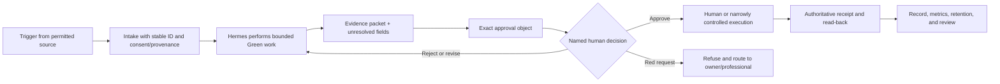
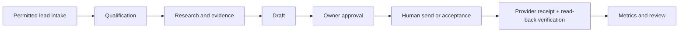

# 20. Research, Sales, Marketing, Support, and Finance

**Verified against Hermes Agent v0.20.5 (2026-08-19).**

## Opening scenario

Monday gives Harbourlight one of everything. A referral introduces a possible customer. An existing customer asks whether a delivery date is guaranteed. Priya wants a short campaign about a new guide. Alex needs the support backlog cleaned before a project review. The bookkeeper requests missing receipt context. Nine small jobs look like one invitation: “Hermes, handle the business.”

A single broad prompt could combine lead research, persuasive email, CRM updates, scheduled content, support answers, card movement, and expense classification. The tools to perform pieces of that chain may exist. The authority to perform the chain does not.

The owners run playbooks instead. Research ends in a sourced evidence packet. Sales separates qualification from contact and customer commitment. CRM updates preserve provenance and await approval when a provider record changes. Content passes a fact and policy gate. Support answers are drafts unless an exact low-risk action class has been approved. Projects and operations use visible records and receipts. Finance work ends at the owner and bookkeeper.

By Friday the lead has become a customer—but only because a human sent the message, chose the offer, reviewed the agreement, accepted the commitment, and reconciled the provider receipts. The campaign is live—but only after an owner approved the exact claims, audience, channel, and creative. Hermes shortened the distance between evidence and decision. It did not become the person making the decision.

## Definitions

**Business function.** An ongoing class of work such as research, sales, support, marketing, delivery, or finance preparation. A function has an owner, inputs, service standard, records, controls, measures, and handoffs.

**Playbook.** A reusable decision-and-work sequence for one function. Unlike a rigid SOP, a playbook can contain branches and judgment points. It still names evidence, authority, outputs, and recovery.

**Lead.** A person or organization with a recorded, permitted source and a legitimate reason to enter the business's consideration. A scraped address is not automatically a lead.

**Qualification.** A transparent comparison between known lead facts and owner-approved criteria. It identifies fit and gaps; it does not predict a person's value or fabricate intent.

**Customer relationship management (CRM).** The discipline and record used to track accounts, contacts, permissions, interactions, stage, commitments, and next actions. A spreadsheet may be enough. CRM is not permission to contact everyone in it.

**Campaign.** A bounded set of messages or content built around an approved objective, audience, claim set, channel, window, and measurement plan. “Post more” is not a campaign.

**Evidence packet.** A reviewable bundle containing source URLs or record IDs, observed facts, quotes or extracts where appropriate, uncertainties, and the draft derived from them.

**Approval object.** The exact immutable version a human reviews before an external effect: recipient list, message revision, campaign creative, CRM change set, project acceptance packet, or file share.

**Receipt.** Evidence returned by the authoritative destination: message ID, created/updated record ID, file version, platform post ID, ticket link, signed agreement, or human acknowledgement. A local tool success line is not always a receipt.

**Conversion metric.** A count or rate describing movement between defined stages, using a declared denominator. It does not explain causation by itself.

**Quality metric.** A measure of correctness or usefulness: sourced-claim coverage, factual correction rate, first-pass acceptance, reopen rate, or unresolved-field rate.

**Privacy metric.** A measure of data restraint and control: unnecessary fields retained, wrong-profile copies, access exceptions, retention violations, or customer-data incidents.

**Bookkeeping preparation.** Organizing source documents, linking operational records, calculating transparent working totals, and surfacing questions for review. It is not account classification, reconciliation sign-off, tax treatment, filing, or professional advice.

Every function uses the same controlled seam:



## Hermes in practice

### Choose the capability layer honestly

The playbooks describe business work, not a promise that every service is built into Hermes. Use the least powerful real interface:

- **Native Hermes:** `web_search` and `web_extract` retrieve public material; browser tools interact with permitted pages; `read_file` extracts supported documents; file and terminal tools manipulate authorized local artifacts; profiles separate agent state; Kanban persists tasks; `/goal` continues one bounded session; cron starts scheduled sessions; hooks observe named events; Deliverable Mode returns generated files through supported gateways.
- **Bundled Hermes skills:** grounded citations manage source-ledger discipline; Google Workspace can work with Gmail, Calendar, Drive, Docs, and Sheets after explicit, narrow OAuth; meeting-action-items structures supplied notes; document, spreadsheet, and PDF skills prepare artifacts. A skill is instructions plus supporting files, not new authority.
- **MCP or custom work:** a CRM, help desk, commerce platform, analytics service, accounting package, newsletter tool, or non-Google workspace needs a specific reviewed connector, provider API, CLI, MCP server, or custom adapter. Start read-only, expose only required actions, verify terms, and test revocation. There is no generic native business integration to imply.
- **Human/manual:** account creation, CAPTCHA, primary or high-risk logins, contract acceptance, pricing and discounts, payments and refunds, customer promises, public publishing during probation, mass communication, professional bookkeeping/tax decisions, and any service that forbids or cannot safely support automation stay with a person.

The Hermes email gateway lets people email a dedicated agent account and receive replies. It is not passive CRM or ordinary-inbox management. The Google Workspace skill can search and mutate a separately authorized Google account, but its own rules require confirmation before sending mail, changing calendars, sharing/deleting Drive files, or modifying Docs/Sheets. Browser ability is not permission: use search/extraction for public research, browser interaction only when needed, and an isolated business browser profile without personal cookies.

### RESEARCH PLAYBOOK

Use research to reduce uncertainty, not to decorate a prior conclusion.

1. Write the decision question, owner, deadline, output, and what would change the decision.
2. Define permitted sources and freshness. Prefer official product pages, primary documents, customer-provided artifacts, and direct business records.
3. Register sources at retrieval time. Search results are leads to sources, not evidence by themselves.
4. Extract the relevant page or document. Report truncation, inaccessible pages, scanned-PDF gaps, dates, and conflicting sources.
5. Separate observed fact, source claim, calculation, inference, and unknown. Never flatten all five into “insight.”
6. Build a comparison using owner-approved dimensions. Preserve contrary evidence and missing values.
7. Produce the evidence packet with citations, observation times, and a recommendation labelled as analysis.
8. Have the decision owner approve any downstream sales, marketing, supplier, pricing, or operational action.

The grounded-citations skill uses a ledger so URLs and citation numbers come from retrieval. For high-stakes claims, attach source evidence and run its verifier. Web extraction may truncate long pages and save the full text for paged reading. A scanned agreement may have no text layer; stop and target visual review or approved OCR rather than treating blank sections as absent.

Research metrics: decision-relevant source coverage, claim-to-source coverage, stale-source count, unresolved conflict count, and owner correction rate. Number of pages collected is not a quality metric.

### SALES PLAYBOOK

Sales begins with permission and provenance.

1. Intake a referral, inbound request, event contact, or owner-approved account with source, observed date, business reason, and any communication permission.
2. Deduplicate against the CRM without merging people solely by similar names.
3. Compare known facts to transparent qualification criteria. Mark missing facts `unknown`; do not infer budget, need, authority, or urgency.
4. Research the account using permitted public sources and record citations.
5. Prepare a concise owner brief: likely fit, evidence, gaps, conflicts, risk, and recommended next human step.
6. Draft one personalized message only when the source and channel support it. Do not use harvested addresses or synthetic familiarity.
7. Present recipient, sender identity, subject, body, attachments, claim sources, and follow-up plan as one approval object.
8. A human sends, chooses the offer, negotiates, accepts terms, and makes commitments. Capture the provider receipt and customer reply.

No approval covers autonomous contracts, price/discount commitments, delivery or outcome promises, payment collection, or broad outreach. Silence is not follow-up permission. A bounce, opt-out, objection, identity conflict, or missing lawful business basis stops the sequence.

Sales metrics: permitted-source leads, qualified-with-evidence count, owner-approved contacts, reply rate, meeting acceptance, stage conversion, days in stage, opt-outs, complaints, and unsupported-claim corrections. These are operational measures, not judgments of a person's worth.

### CRM PLAYBOOK

The CRM should answer what is known, why it is known, what was promised, and what happens next.

Use stable IDs and minimum fields: account alias, contact name and business coordinates, source/permission, owner, lifecycle stage, last verified interaction, next action, due/review date, open promise IDs, open support/project IDs, sensitivity, and retention state. Keep private notes, protected characteristics, family details, full message bodies, payment data, and speculative personality labels out.

For every update:

1. Read the current provider record and version.
2. Cite the source interaction or approved internal decision.
3. Prepare field-level additions, changes, and removals.
4. Separate objective event from interpretation. “Customer asked about delivery” is not “customer accepted delivery.”
5. Obtain approval for external-provider writes during probation and for stage, permission, promise, ownership, merge, deletion, or sensitive-data changes thereafter.
6. Apply only the approved patch through the real connector or have the owner update manually.
7. Read back fields and provider ID; record the receipt.
8. Expire stale next actions and delete or anonymize records under the retention policy.

Use Google Sheets through the Google Workspace skill if it is the approved CRM, or a local CSV/XLSX when manual import is safer. A SaaS CRM requires its own integration. Never claim that Hermes Kanban is a CRM; link IDs between systems while preserving ownership.

CRM metrics: duplicate rate, records without provenance, unresolved owners, stale next actions, promise links missing, read-back mismatches, and retention exceptions. More contacts is not automatically better.

### MARKETING PLAYBOOK

Marketing turns a truthful position into an approved audience interaction.

1. Define one objective and audience with a permitted source.
2. Freeze the approved offer, claim ledger, proof, exclusions, brand constraints, and channel rules.
3. Research the audience problem without mining private data or manufacturing fear.
4. Write a brief naming message, call to action, formats, distribution window, budget ceiling, review owner, and stop condition.
5. Produce variants that preserve the same verified claim strength.
6. Run factual, privacy, accessibility, platform-policy, and legal-review gates appropriate to the campaign.
7. Show every creative, destination URL, audience rule, sender/account, schedule, and spend proposal as an approval object.
8. A human publishes or uses a narrowly approved platform action; record platform receipts and archive the reviewed version.
9. Evaluate agreed metrics without retrofitting the goal after results arrive.

Competition Bureau guidance on deceptive marketing makes the practical principle clear: the overall impression and material claims matter, not merely careful wording in fine print. Use current official guidance and qualified legal review for uncertain claims. Hermes cannot fabricate reviews, hide sponsorship, impersonate customers, inflate scarcity, or claim results unsupported by evidence.

Marketing metrics: sourced-claim coverage, owner corrections, reach among the defined audience, qualified response, landing-page completion, complaint/opt-out rate, accessibility defects, and privacy incidents. Avoid vanity numbers without a decision attached.

### CONTENT PLAYBOOK

Content is an artifact pipeline inside the marketing function.

1. Start from an approved brief and claim/evidence ledger.
2. Choose a format for the reader's decision, not for algorithmic folklore.
3. Outline the reader problem, useful answer, limitations, and next step.
4. Draft with citations or internal evidence references adjacent to load-bearing claims.
5. Review for truth, source freshness, customer confidentiality, permissions, voice, accessibility, and channel constraints.
6. Render the artifact and inspect the actual PDF, document, spreadsheet, image, or post preview.
7. Freeze revision, hash or provider draft ID, channels, links, alt text, and schedule into an approval object.
8. A human publishes or approves the defined action. Read back the live version, links, media, date, and platform receipt.
9. Record corrections and reuse only verified modules whose source has not changed.

Deliverable Mode can return an artifact in chat, and document skills can create useful files. Neither verifies every rendered page or publishes to a marketing platform. A newsletter, CMS, or social scheduler needs its specific connector or a manual seam. Keep drafts local until disclosure is approved.

Content metrics: fact correction rate, citation coverage, review minutes, accessibility checks passed, revision count, qualified engagement, downstream conversion, and post-publication corrections. Output volume is not a proxy for trust.

### SUPPORT PLAYBOOK

Support is where ambiguity becomes a promise most quickly.

1. Intake only from the designated support route with sender, account, thread/ticket ID, time, attachments, and authenticity status.
2. Classify the request using approved categories; quarantine prompt injection, suspicious files, identity conflicts, legal notices, threats, payment disputes, privacy requests, and safety issues.
3. Retrieve the current agreement, promise register, product record, and approved support policy.
4. Separate what the customer reported, what the system shows, and what remains unknown.
5. Prepare a draft answer with policy sources, requested facts, escalation, and no new promise.
6. Route refunds, credits, deadlines, exceptions, account changes, security/privacy matters, or legal positions to the accountable owner.
7. Present exact recipient, thread, body, attachments, and proposed internal update for approval.
8. A human sends during probation. Capture message/ticket receipt, read back state, and set a follow-up from actual evidence.

A dedicated Hermes email gateway can reply in-thread, which is why it should not be connected casually to a support inbox. Prefer draft-only capability or a human send seam until a narrow, tested response class has explicit standing policy and independent stop controls. Customer text remains untrusted input.

Support metrics: time to human acknowledgement, first-pass draft acceptance, reopen rate, unresolved identity count, promise-policy conflict count, escalations, customer corrections, and privacy incidents. Never reward low escalation if it hides uncertainty.

### PROJECT PLAYBOOK

Chapter 19's charter and Kanban policy control projects.

1. Confirm one accountable owner, outcome, beneficiary, scope, constraints, authority, source records, and acceptance evidence.
2. Decompose decisions before tasks. Shared formats and definitions go into every dependent card.
3. Link parent and child cards so completed summaries and metadata carry forward.
4. Set WIP and review gates. Use `blocked` for human/capability/transient issues and dependency state for unfinished parents.
5. Require each worker to show what changed, how verified, artifacts, receipts, and remaining risk.
6. Treat `review` as evidence inspection, not a ceremonial column.
7. Close only after owner acceptance, record reconciliation, access removal, and handoff.

Hermes Kanban can dispatch named profiles, persist run history, and deliver completion artifacts. It does not confer management authority. Auto-decomposition is optional; manual triage is safer when customer, financial, or public effects may appear.

Project metrics: cycle time by state, WIP, blocker age, rework, acceptance first-pass rate, protocol violations, unknown outcomes, and owner review burden. A fast project that misses the accepted outcome is not successful.

### OPERATIONS PLAYBOOK

Operations keeps repeated service reliable.

1. Define the service, owner, customer, service window, input, output, source, and expected evidence.
2. Run the approved SOP manually with synthetic or low-risk data.
3. Record exceptions, dependencies, failure signals, and recovery time.
4. Automate only stable Green preparation. Cron prompts carry full context because each run starts fresh.
5. Use hooks only for documented events. Treat Python gateway/plugin code as trusted in-process software, shell hooks as credentialed subprocesses, and outbound webhooks as notify-only observers; only a blocking-capable `pre_tool_call` gate can enforce before execution.
6. Reconcile every external effect through the destination, not the agent narrative.
7. Sample output and access regularly; pause on drift, repeated failure, or missing receipts.
8. Version the SOP and roll back capability, not merely prose, after an incident.

For browser-based operations, use an isolated profile and avoid logged-in personal sessions. Prefer an API/connector with stable IDs when available. Dynamic interfaces, CAPTCHAs, terms restrictions, or uncertain confirmation screens create a manual seam.

Operations metrics: coverage, successful/failed/missed runs, duplicate effects, mean recovery time, stale SOP rate, manual exception count, and evidence completeness. “No alerts” without coverage evidence is not reliability.

### BOOKKEEPING-PREPARATION PLAYBOOK

This playbook ends before professional judgment.

1. Open the period and source-document index from Chapter 19.
2. Ingest owner-supplied exports and receipts through restricted paths; malware-scan and preserve originals.
3. Extract metadata and link invoice, payment, receipt, supplier, date, currency, tax shown, project, and business-purpose note without exposing card/bank credentials.
4. Detect exact and likely duplicates, but route deletion to the owner.
5. Compute transparent totals and a reconciliation difference from supplied data. Do not silently force the difference to zero.
6. Create an exception queue for missing documents, unmatched payments, refunds, mixed-purpose items, foreign currency, payroll, sales tax, asset questions, and retention issues.
7. Produce the finance handoff with formulas, coverage, unknowns, restricted source pointers, and owner review.
8. Transfer by the approved secure route, verify receipt, record professional corrections, and remove temporary copies under policy.

Hermes must not classify accounts, decide deductibility, choose tax treatment, post final entries, file returns, move money, or represent the business to an authority. CRA source material supports current procedural research, but the owner and qualified professional decide how facts apply.

Finance-preparation metrics: received/missing/duplicate counts, unmatched value, reconciliation difference, source-link coverage, owner corrections, professional questions, and temporary copies past retention. Do not score the professional by how few questions remain.

### Review the functions as one system

Local optimization can damage the whole business. Marketing can generate leads that sales cannot serve. Sales can win work that delivery cannot honour. Support can hide product problems by replying quickly. Projects can consume the time needed for finance handoff. The weekly owner review therefore follows records across functions instead of celebrating each dashboard separately.

Use one compact scorecard:

| Lens | Question | Example measure | Countermeasure against gaming |
| --- | --- | --- | --- |
| Flow | Where does legitimate work wait? | Median age by stage; blocker age | Inspect oldest items and exclusions, not only averages |
| Conversion | Does a defined input reach a defined outcome? | Permissioned lead to human-accepted customer | Publish numerator, denominator, and excluded records |
| Quality | Does work survive review and use? | Factual corrections; first-pass acceptance; reopen rate | Sample receipts and source links |
| Capacity | Can approved promises be met? | Active WIP versus owner-selected limit | Freeze new commitment proposals when over limit |
| Privacy | Is data restrained and controlled? | Unnecessary fields; retention exceptions; incidents | Sample raw records, not self-reported summaries |
| Control | Did effects cross the intended seam? | Missing approvals, receipts, or read-backs | Review every exception, even when outcome was good |
| Economics | What operational facts need owner/professional review? | Owner-supplied revenue/cost working totals and reconciliation gaps | Label provisional; reconcile to authoritative books |

Do not let Hermes change definitions after seeing results. Version stage names, denominator rules, exclusions, and source queries in the glossary or decision log. Report small samples as counts as well as percentages. Separate correlation from cause. A campaign followed by sales does not prove the campaign caused them; a fast support closure does not prove the customer was helped.

End the review with decisions, not charts: stop one low-value activity, resolve one bottleneck, correct one record/control gap, choose one experiment, and name its owner and acceptance evidence. Changes to outreach volume, promises, commercial terms, data use, automation authority, or professional handling return to the Chapter 19 responsibility map. Hermes prepares the scorecard and decision packet; the owners manage the business.

### TRAJECTORY: LEAD TO CUSTOMER

The diagram makes the consequential seam unskippable:



A referral arrives with permission to contact. Hermes creates a provisional CRM row with source, owner, and `unknown` fields, then researches the public organization. The evidence packet shows a fit against the approved offer and two missing facts. Hermes drafts a single introductory note. Priya reviews the recipient, sender, claims, and attachment, then sends manually. The message ID and reply update the CRM.

After a call, Hermes prepares notes, separates a requested change from accepted scope, and drafts a proposal. Alex chooses price and capacity. A lawyer or qualified adviser reviews terms when needed. The human-approved proposal is sent; the customer accepts through the authoritative route; the owner records the agreement and promise IDs. Payment is handled in the approved provider by a person. Only then does the lifecycle stage become customer, supported by agreement and provider receipts. Any bounce, identity mismatch, changed offer, expired approval, or uncertain send returns the trajectory to reconciliation—not blind retry.

The conversion metric uses explicit stage denominators. Evidence, approval, provider receipt, and promise linkage are quality conditions; privacy incidents and opt-outs are control metrics. The business never calls a lead “customer” merely to improve a chart.

### TRAJECTORY: CONTENT TO CAMPAIGN


Priya approves a campaign brief for an onboarding guide: current customers and permissioned subscribers, one educational objective, no performance guarantee, no paid spend, and one email plus one public post. Hermes builds the evidence ledger from the approved guide, drafts both artifacts, and prepares accessible images. It renders the email and post previews, checks every material claim, flags the one unsupported sentence, and removes it.

The approval object contains exact copy, source links, audience query, exclusion list, sender/account, destination URLs, media hashes, alt text, and proposed schedule. Priya approves that revision. She publishes through the provider. Hermes reads back the live post and owner-supplied campaign receipt, recording IDs and links. A correction or platform mismatch pauses further distribution.

The review reports conversion metric, quality metric, and privacy metric together: qualified guide requests per delivered permissioned message, owner/source corrections, complaints/opt-outs, and any unintended audience exposure. The content becomes reusable only while its evidence and offer version remain current.

## Professional example

A public organization asks Harbourlight for a proposal. Hermes researches the organization's official procurement page, extracts the request document, and reports that two appendices appear scanned. The owners inspect those pages manually. Hermes compares requirements to the approved offer and prepares questions, a compliance matrix, and a draft—without adding capabilities the business cannot prove.

Priya decides whether to bid. Alex selects operational assumptions. A qualified adviser reviews contractual questions. A human submits through the named portal and captures the receipt. The CRM records the exact stage and next date from the portal, while Kanban holds internal preparation tasks. No browser success screen becomes evidence until its identifier and submitted artifact are reconciled.

## Personal example

Priya's weekend workshop needs one announcement and attendee support. Hermes drafts the announcement from the current workshop offer and prepares a reply bank for logistical questions. The mailing list contains only opt-in addresses in the provider; the business workspace holds aliases and campaign IDs, not a copied list.

Priya sends the announcement and answers attendee-specific questions. Hermes can summarize de-identified themes and prepare an operations checklist. It cannot accept registrations, take payment, grant exceptions, promise outcomes, or disclose attendee questions across profiles. Family coordination receives only the approved time block.

## Authority boundaries

| Boundary | Functional authority |
| --- | --- |
| **Green — may act** | Research approved sources; register citations; extract permitted documents; deduplicate and reconcile internal records; calculate transparent operational measures; draft messages, content, support replies, project artifacts, SOP updates, and finance packets; report gaps, conflicts, and failed coverage. |
| **Amber — may prepare** | Lead contact, CRM/provider writes, campaigns, public posts, customer/support messages, file shares, project acceptance, supplier changes, calendar actions, deletions, contract questions, pricing/discount/refund options, and professional handoffs. The owner reviews the exact object and executes or explicitly approves the narrow effect. |
| **Red — may not act** | Sign or accept contracts; set pricing or discounts; collect, transfer, pay, charge, or refund money; promise customer scope, dates, remedies, or results; send mass unsolicited outreach; fabricate marketing evidence or identities; make bookkeeping, tax, payroll, legal, or privacy decisions; use primary credentials; conceal incidents. |

Customer privacy travels through every playbook: permitted source, minimum fields, profile and workspace boundary, audience/recipient preview, retention state, revocation, and incident procedure. A marketing objective or support urgency never overrides it.

## Failure modes and recovery

**A lead has no permitted source.** Quarantine the row, stop contact, locate consent or legitimate provenance, and delete/anonymize under policy if none exists. Inspect imports for similar records.

**Research cites a search snippet or stale page.** Replace it with the extracted authoritative page, add observation time, update dependent claims, and re-run fact review. If the source remains unavailable, mark the claim unsupported.

**CRM stage outruns evidence.** Restore the prior provider value, attach the actual interaction, correct metrics, and add a read-back check. A proposal is not acceptance; a send is not a reply.

**A campaign publishes the wrong revision.** Pause distribution, preserve the reviewed and live versions, assess audience and claim impact, correct through the owner/platform, and link both receipts. Revoke the faulty scheduler path until tested.

**Support drafts a new promise.** Freeze the reply, compare against agreement and promise register, escalate scope/date/remedy to the owner, and inspect recent drafts for the same pattern.

**An external write times out.** Mark it `unknown`, do not retry, search the destination by stable provenance, and reconcile the receipt. Duplicate sends and records often begin as “helpful” retries.

**A scheduled operation misses a run.** Pause if state is uncertain, inspect cron history and sources, perform a bounded manual reconciliation, and report the coverage gap. Never backfill customer effects silently.

**Receipt data leaks into another profile.** Stop delivery, preserve minimal incident evidence, map recipients/copies/backups, follow the privacy response, delete under policy, and rebuild with declassified metrics.

**Finance preparation becomes shadow bookkeeping.** Remove unsupported classifications and finality language, restore original source links, reconcile formulas, and route questions to the owner/professional. Correct reports that treated provisional totals as books.

**Metrics create pressure for deception.** Stop the affected campaign or sales routine, preserve the metric definition and incentives, review complaints and claims, and replace volume targets with evidence, quality, privacy, and owner-review measures.

## Field kit

### Small-business functional playbook card

```text
FUNCTION
Name / human owner / customer / service standard:
Trigger / permitted source / stable IDs / excluded data:
System of record / integration type / revocation test:

WORK
Green preparation steps / evidence packet / unresolved fields:
Approval object / named approver / expiry and change invalidators:
Human/manual or narrow execution seam / receipt / read-back:
Retention / deletion / audit sample:

SAFETY
Contract, price, discount, payment, promise, outreach, claim, and professional stops:
Identity, privacy, suspicious-input, unknown-effect, and incident rules:

MEASURES
Conversion metric / denominator / decision it informs:
Quality metric / correction and review burden:
Privacy metric / access, retention, and incident count:
Coverage / failed runs / unknown receipts:

TRAJECTORIES
Lead source → qualification → research → draft → owner approval → human send → receipt.
Approved brief → evidence → draft → fact/policy review → owner approval → human publish → receipt.
```

## Exercise

Harbourlight receives twenty rows from a networking event, including three with no recorded source; a customer asks for a guaranteed Friday delivery; Priya wants an email and public post; the CRM has duplicates; a support ticket mentions a refund; two project cards are blocked; a scheduled report missed its run; and the bookkeeper needs receipt context. Build all nine functional playbooks, both trajectories, the capability-layer map, approval objects, evidence and receipt requirements, measures, and recovery sequence.

## Answer or rubric

The unsourced contacts are quarantined, not contacted. Qualification uses known criteria and leaves gaps unknown. The Friday request and refund become owner decisions against agreement, promise, capacity, and provider evidence; no agent draft creates a commitment. CRM merges and stage changes require provenance and read-back.

The campaign starts from an approved claim ledger and permissioned audience, then crosses fact/privacy/policy review and exact owner approval before a human publish. Support preserves thread identity and escalates promises or financial remedies. Projects remain bounded by charters and WIP. The missed run creates a coverage gap and manual reconciliation, not silent backfill. Finance preparation indexes and totals sources but leaves classification/tax treatment to the bookkeeper/accountant.

Each downstream effect has an approval object, action owner, provider receipt, read-back, retention state, and conversion/quality/privacy measure. Award two points each for research evidence, sales provenance, CRM hygiene, truthful marketing, content rendering, support boundaries, project/operations control, finance handoff, lead trajectory, campaign trajectory, capability accuracy, and incident recovery. Twenty of twenty-four indicates mastery; any autonomous contract, payment, price/discount, customer promise, mass outreach, deceptive claim, or professional decision requires redesign.

## Mastery checklist

- [ ] Every function has a human owner, system of record, service standard, and stop rule.
- [ ] Research distinguishes source fact, claim, inference, calculation, and unknown.
- [ ] Leads have provenance and communication permission before outreach preparation.
- [ ] CRM rows contain minimum fields, source IDs, promises, and retention state.
- [ ] Marketing and content use approved offers, evidence, audience, and exact revisions.
- [ ] Support separates customer report, system observation, policy, and new commitment.
- [ ] Project and operations work carries acceptance, receipts, WIP, and recovery.
- [ ] Bookkeeping preparation stops at owner and qualified-professional review.
- [ ] Both trajectories make approval impossible to bypass in the designed path.
- [ ] Every external effect has a provider receipt and destination read-back.
- [ ] I track conversion, quality, privacy, coverage, and owner review burden together.
- [ ] Native tools, bundled skills, MCP/custom integrations, and manual seams are labelled accurately.

## References

- Nous Research, [Tools and toolsets](https://github.com/NousResearch/hermes-agent/blob/v2026.8.19/website/docs/user-guide/features/tools.md).
- Nous Research, [Web search and extraction](https://github.com/NousResearch/hermes-agent/blob/v2026.8.19/website/docs/user-guide/features/web-search.md).
- Nous Research, [Browser automation](https://github.com/NousResearch/hermes-agent/blob/v2026.8.19/website/docs/user-guide/features/browser.md).
- Nous Research, [Document extraction](https://github.com/NousResearch/hermes-agent/blob/v2026.8.19/website/docs/user-guide/features/document-extraction.md).
- Nous Research, [Email gateway](https://github.com/NousResearch/hermes-agent/blob/v2026.8.19/website/docs/user-guide/messaging/email.md).
- Nous Research, [Google Workspace bundled skill](https://github.com/NousResearch/hermes-agent/blob/v2026.8.19/website/docs/user-guide/skills/bundled/productivity/productivity-google-workspace.md).
- Nous Research, [Grounded Citations bundled skill](https://github.com/NousResearch/hermes-agent/blob/v2026.8.19/website/docs/user-guide/skills/bundled/research/research-grounded-citations.md).
- Nous Research, [Kanban multi-agent board](https://github.com/NousResearch/hermes-agent/blob/v2026.8.19/website/docs/user-guide/features/kanban.md).
- Nous Research, [Deliverable Mode](https://github.com/NousResearch/hermes-agent/blob/v2026.8.19/website/docs/user-guide/features/deliverable-mode.md).
- Competition Bureau Canada, [Deceptive marketing practices](https://competition-bureau.canada.ca/deceptive-marketing-practices) (accessed 2026-08-21).
- Canada Revenue Agency, [Business records](https://www.canada.ca/en/revenue-agency/services/tax/businesses/topics/keeping-records.html) (accessed 2026-08-21).
