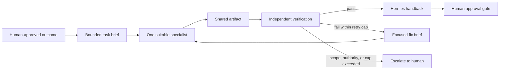

# 21. Hermes as Manager

**Verified against Hermes Agent v0.20.5 (2026-08-19).**

## Opening scenario

At 8:10 on Tuesday, Priya has three jobs that look as if they should happen at once. A promising employer has published a technical role that deserves careful comparison with her evidence bank. The family business needs a broken checkout test investigated before a campaign draft can be approved. The school has sent a long activity notice whose dates need to be entered on the family review sheet. Hermes could attempt all three in one conversation, but the work would collide: different data, different tools, different standards of proof, and different consequences.

Priya does not say, “Spin up a team and handle everything.” She asks Hermes to manage three bounded assignments. A temporary Hermes research subagent receives the public job description and a redacted skills matrix, with read-only web and file access. Codex receives a clean worktree, the failing test, an acceptance condition, and permission to change only that repository. The persistent Family Admin Bot receives the school PDF in its own profile and may prepare dates, uncertainties, and a draft checklist; it may not message the school or modify the family calendar. Hermes remains accountable for the handback.

The point is not the number of agents. The point is that each worker has one job, a narrow context, an explicit evidence requirement, and a stopping condition. Hermes is useful as a manager only when it makes responsibility clearer than a single-agent session would.

## Definitions

**Delegation** means assigning a bounded outcome to another worker while retaining responsibility for scope, evidence, review, and handback. Delegation is not permission to reinterpret the goal or enlarge authority.

**Manager** is the role Hermes plays when it decomposes approved work, chooses a suitable specialist, supplies a complete brief, monitors progress, verifies the result, and reports one coherent outcome to the human owner. “Manager” describes coordination, not legal authority or employment status.

**Specialist** is a worker chosen for a particular task family. In this chapter, that may be a temporary Hermes subagent, a persistent named Bot, or OpenAI Codex for repository-centred coding and artifact work.

**Hermes subagent** is a fresh child `AIAgent` created through `delegate_task`. It starts with no parent conversation history, receives only its `goal` and `context`, gets a separate terminal session, inherits the parent’s enabled toolsets subject to child blocks, and returns a summary. A leaf child cannot delegate again, ask the user through `clarify`, write shared memory, send messages, or create cron jobs. Nested orchestration is opt-in and is normally the wrong shape for a household or very small business.

**Named Bot** is a Hermes profile presented through Bot Mode. It has persistent configuration, memory, skills, credentials, model choice, and chat history under its profile. A Bot is therefore suitable for a recurring role such as Research Desk or Family Admin, provided its account and OS boundaries match that role. It is not a new security primitive and is not an employee with independent authority.

**Codex specialist** is OpenAI Codex used for a repository or artifact task. Hermes v0.20.5 includes a bundled Hermes Codex skill that can launch the Codex CLI from a terminal, and it also offers an opt-in Codex app-server runtime for OpenAI turns. These are different integrations. The CLI skill delegates a bounded job to an external coding harness. The app-server runtime moves the current Hermes turn into Codex’s runtime and tool model; while it is active, Hermes `delegate_task`, `memory`, `session_search`, and `todo` are unavailable.

**Task brief** is the complete instruction packet sent to a specialist: outcome, inputs, boundaries, acceptance tests, budget, evidence, failure behaviour, and handback format.

**Context boundary** states what the specialist may know. It names the exact documents, folders, prior decisions, and assumptions supplied—and what is deliberately withheld.

**Tool boundary** states what the specialist may use. Tool access is capability, not decoration. A child that can read one folder and search public pages has a different job from one that can edit a repository, operate a browser, or reach a customer system.

**Shared artifact** is the controlled object through which manager and specialist coordinate: a worktree, evidence packet, source table, draft document, checklist, or review ledger. It is preferable to relying on summaries alone.

**Verification evidence** is observable proof that the requested outcome meets its acceptance conditions: tests, a diff, cited source rows, rendered output, a destination read-back, or a reconciled count. A worker saying “done” is a status claim, not evidence.

**Retry/fix loop** is a bounded response to failed verification: classify the failure, issue one focused correction with the failed evidence, rerun the relevant check, and stop at the retry cap or escalation condition.

**Handback** is the manager’s final package to the human: outcome, changed artifacts, evidence, open risks, cost/time, approvals still required, and the next reversible action.

**Mixture of Agents (MoA)** is a Hermes virtual model provider, not a team of independently acting workers. Reference models provide private advice and one aggregator model writes the response and calls tools. MoA can improve perspective on a difficult decision, but it does not create separate task ownership, artifacts, or approval seams.

## Hermes in practice

### Decide whether delegation reduces risk

Delegation has overhead. A manager must describe the job, transfer context, supervise another trajectory, and verify a handback. Keep work in the main Hermes session when it is short, sequential, highly interactive, or dependent on tacit context that would be expensive to restate. Use a deterministic script or `execute_code` for mechanical collection or transformation that does not need another reasoning loop.

Delegate when at least one of these benefits is material:

- isolation keeps a large investigation from flooding the main session;
- independent tasks can proceed without touching the same files or records;
- a specialist harness has clearly better tools for the deliverable;
- a fresh context can challenge a built-up assumption;
- a persistent role needs its own memory, credentials, and routine history;
- the work can be accepted by evidence rather than by continuous conversation.

Do not delegate merely to make a task feel advanced. Do not split one tightly coupled decision among several workers and hope that synthesis will repair contradictory assumptions. Do not delegate an Amber approval or a Red prohibition. Hermes may prepare the evidence for a decision; the accountable human still decides.

Use this selection table before dispatch:

| Work shape | Best first mechanism | Why | Avoid |
| --- | --- | --- | --- |
| One bounded research comparison | Hermes leaf subagent | Fresh context and isolated summary | Persistent Bot for a one-off |
| Three independent source checks | Parallel leaf batch, maximum three initially | Bounded concurrency with ordered results | Workers editing one shared file |
| Repeat family or business role | Named Bot/profile | Persistent role, memory, skills, model, and routine history | Treating profile isolation as OS isolation |
| Repository feature, refactor, or review | Codex in a clean repo/worktree | Repository-native edits, diffs, tests, sandbox controls | Giving Codex unrelated inbox or family data |
| Hard answer needing several model perspectives | MoA preset or second review | Advice is aggregated into one acting model | Calling MoA a delegated workforce |
| Durable scheduled work | Cron or a bounded background terminal job | Survives beyond a conversational turn by design | Assuming a child survives process restart |
| Mechanical parsing or count | Script / `execute_code` | Lower cost and deterministic output | Paying for a full child loop |

The smallest viable roster is usually Hermes plus one specialist. Add another only when the second assignment is independent and its output can be verified separately.

### Use the nine-part delegation contract

Every assignment should answer nine questions before it starts.

1. **Outcome:** What single observable result is required?
2. **Inputs:** Which exact files, links, records, and prior decisions are authoritative?
3. **Context boundary:** What may the worker see, and what is excluded or redacted?
4. **Tool and data boundary:** Which tools, accounts, network destinations, and write roots are permitted?
5. **Shared artifact:** Where will work appear without overwriting another worker?
6. **Acceptance evidence:** Which tests, citations, renders, reconciliations, or receipts prove correctness?
7. **Budget:** What are the time, iteration, token/cost, and concurrency limits?
8. **Failure policy:** What should the worker do when uncertain, blocked, or outside scope?
9. **Handback:** Which facts, changes, evidence, caveats, and next approvals must be returned?

A compact brief is better than an inspiring speech. “Improve our website” has no stop condition. “In the isolated worktree at this path, fix the failing mobile navigation test; do not change copy or dependencies; run the named test and full UI suite; return the diff summary, command outputs, and unresolved risks” can be managed.



The loop has no edge from specialist directly to external effect. The manager verifies; the human approves any consequential step.

### Dispatch temporary Hermes subagents carefully

On the default Hermes runtime, `delegate_task` can create one child or a batch. The child knows nothing about the parent conversation. Pass exact paths, relevant facts, desired output, and verification commands in `goal` and `context`. A vague request forces the child either to guess or to spend iterations rediscovering what Hermes already knew.

```python
delegate_task(
    goal="Compare the supplied job posting with Priya's approved evidence matrix.",
    context="""Read only /work/career/job-184/posting.md and
    /work/career/evidence/redacted-matrix.md. Create
    /work/career/job-184/fit-review.md. Separate requirements, matched evidence,
    gaps, and questions. Cite source headings. Do not browse, contact anyone,
    edit the evidence matrix, or infer credentials. Stop after one draft and
    return the file path plus a claim-to-source count.""",
    max_iterations=12,
)
```

Hermes v0.20.5 defaults to three concurrent children, configurable through `delegation.max_concurrent_children`. More is not a target. Start with one; use two or three only for independent files or evidence lanes. Batches above the configured limit fail rather than being silently truncated. Results are ordered to match the input tasks even if completion order differs.

Children inherit the parent’s enabled toolsets; the model-facing `delegate_task` call cannot broaden them per task. Configure the parent narrowly before the conversation. The public plugin lifecycle API is different: a plugin or hook may use `allowed_toolsets` to narrow a fresh child, but requests that broaden the parent, forge a handle, override work directories, or add unsupported per-launch controls fail closed. Its states include `PENDING`, `RUNNING`, terminal success/failure/cancellation states, and `UNKNOWN`; cancellation is cooperative and completion must be observed rather than assumed.

For model-facing delegation, use `delegate_task(action="list")` to inspect live children, `action="steer"` to queue a correction, and `action="stop"` to end one at its next boundary. A queued steer is not proof that the child saw it. Hermes preserves a missed or pending steer in the result so the manager can issue a fresh follow-up. The TUI `/agents` overlay shows the tree, per-branch cost, token use, touched files, status, and histories. Live transcripts are append-only under `~/.hermes/cache/delegation/live/<delegation_id>/`; they are operational evidence, but those directories are pruned after seven days on new dispatches, so promote any retained evidence into the case folder.

Top-level background completions are tied to their owning session and Hermes process. `/stop`, session reset/closure, or a process exit can interrupt work. A completion persisted before delivery can be recovered; an in-flight worker cannot be resumed after a crash and may become `unknown`. Reconcile possible external effects before retrying. Use cron for truly durable scheduled work, not a child that happens to run in the background.

### Keep delegation flat

Hermes allows opt-in orchestrator children when `delegation.max_spawn_depth` is raised above its default flat depth. That is an advanced capability, not a recommended small-business operating model. Three children at three levels can expand to twenty-seven leaves before considering retries. Cost, file contention, inconsistent assumptions, and review burden multiply faster than useful insight.

Adopt a flat-roster rule:

- Hermes may supervise at most three simultaneous specialists during probation;
- only Hermes assigns tasks and accepts results;
- specialists do not create other specialists;
- each worker owns different artifacts or a separate worktree;
- the owner sees one budget and one handback;
- any need for a deeper tree is redesigned as sequential stages first.

Leave `max_spawn_depth` at `1` and `orchestrator_enabled` off unless a tested business case demonstrates that nested orchestration beats a simpler pipeline. “We can” is not evidence that “we should.”

### Use named Bots for roles, not swarms

Bot Mode turns profiles into a visible roster. A Research Desk Bot can hold public-source methods and a research-only model. A Family Admin Bot can hold the household checklist and family-safe routine history. A Business Operations Bot can work inside the business profile. Because a Bot is a profile, its persistent state lives with the machine that owns that profile; `hermes -p <bot> chat` opens the same agent and its routines appear in `hermes cron list`.

Create a Bot only when the role recurs and needs separate state. Define its title as a service, not a personality: “Family Admin — prepares dates and checklists from supplied notices” is better than “Super Mom Bot.” Start fresh or clone only after reviewing what configuration, skills, memory, and credentials the clone would copy. Enable only the required skills, toolsets, and MCP servers. If the Bot needs separate Codex auth or plugin state under the app-server runtime, explicitly scope `CODEX_HOME`; Hermes profiles otherwise share the default `~/.codex/` state.

Groups and `@mentions` are coordination surfaces, not authority grants. Bot group rooms cap rounds and messages, but a lively discussion can still produce duplicate work and consensus theatre. Use a group to compare two named views on a prepared artifact, with one Bot assigned to synthesize and one human question to resolve. Do not put customer replies, financial actions, health choices, school disputes, or legal decisions to a Bot vote.

Routines are ordinary cron jobs namespaced to the Bot. They run in the Bot’s context and land in its chat, but cron still uses fresh agent sessions and the configured cron toolset. A recurring role needs a self-contained prompt, a delivery target, error review, and a stop rule. Hiding a Bot in the desktop roster does not stop its routines.

### Delegate to Codex at the repository boundary

Codex is strongest when the job is organized around a repository, explicit artifacts, and executable checks. The bundled Hermes Codex skill launches the Codex CLI through the terminal. Use a clean git status or an isolated worktree, an exact working directory, `codex exec` for a one-shot, a workspace-write sandbox where it works, and background process monitoring for a long job. Review the diff and rerun tests outside the specialist’s own narrative.

Do not treat the Hermes Codex skill as a Hermes marketplace extension, and do not treat a Codex app plugin as a Hermes native skill. The bundled skill is Hermes-authored procedure for invoking the Codex CLI. OpenAI’s Codex/ChatGPT skills package workflow instructions and optional resources/scripts; Codex plugins distribute reusable skills and connectors through OpenAI’s plugin directory. Hermes skills, Hermes plugins, Hermes-compatible MCP servers, and Codex plugins have different installation, credential, review, and runtime boundaries.

The optional `/codex-runtime codex_app_server` route is broader than launching one CLI job. It sends eligible OpenAI turns through Codex’s app-server, where Codex supplies shell, patch, planning, image-viewing, sandbox, MCP, and configured native plugin capabilities. Hermes remains the outer session and gateway shell. This can be appropriate for a dedicated coding profile, but it is not required for Codex delegation and never auto-enables. Verify the runtime with `/codex-runtime`, and return to `/codex-runtime auto` for a new session when Hermes-native delegation or memory tools are needed.

OpenAI’s official App Server protocol is thread-and-turn based over bidirectional JSON-RPC: initialize, start or resume a thread, start a turn, consume streamed notifications, and answer approval requests. That explains why “Codex finished” must be grounded in the terminal status, app-server turn result, diff, and checks—not in a single chat phrase. OpenAI’s skill documentation also uses progressive disclosure: metadata is visible first and full `SKILL.md` instructions load when selected. Neither mechanism grants blanket access; sandbox and approval configuration still matter.

For a no-code operator, the practical Codex contract is:

- give Codex one clean folder or worktree;
- state allowed files and forbidden surfaces;
- name the acceptance command and expected evidence;
- require it to stop before commit, push, publish, or external message unless the owner separately approves;
- ask Hermes to inspect the diff and run the checks independently;
- keep credentials and family/business records outside the repository.

### Route models and MoA as management decisions

Worker routing belongs in the task contract. Hermes subagents inherit the parent model unless `delegation.model` is configured; `delegation.provider` can route children through another provider, and a direct `delegation.base_url` takes precedence. The pin is global for delegated children, not per task. Use a capable planner to shape the brief and a cheaper worker only after a trial demonstrates adequate quality on that task family.

Provider routing and fallback answer different questions. `provider_routing` orders sub-providers behind OpenRouter or Nous Portal by price, latency, throughput, allow/deny list, parameter support, or data-collection policy. `fallback_providers` switches to another provider/model after eligible failures. A fallback preserves progress but can cause a full prompt reread and quality drift. Record the actual route in consequential handbacks.

MoA is useful for a hard architecture review, high-value comparison, or adversarial second view. The acting aggregator alone emits tool calls. Reference models receive trimmed conversation text without Hermes’s tool transcript or full system prompt. In v0.20.5, `fanout: user_turn` is the lower-cost default; `per_iteration` multiplies advisor calls as tools iterate. Set `reference_max_tokens`, privacy filtering, and a test budget before adopting it. Do not use extra models to compensate for an untestable acceptance condition.

### Budget cost, time, tokens, and attention

A budget should constrain the whole management job, not only model output. Record:

- maximum simultaneous workers;
- maximum child iterations and any opt-in wall-clock limit;
- model/provider lane for manager, worker, goal judge, and auxiliary work;
- elapsed-time target and escalation deadline;
- token or currency ceiling where the provider exposes it;
- maximum retries after verification failure;
- human review minutes expected;
- artifact and trace retention period.

Hermes subagents default to 50 iterations and no delegation wall-clock timeout. Set fewer iterations for simple work. An optional `delegation.child_timeout_seconds` provides a hard cap, but a stopwatch cannot judge useful progress. Hermes separately monitors background stalls using activity signals. If a child times out before its first model call, inspect the structured diagnostic in `~/.hermes/logs/subagent-timeout-<session>-<timestamp>.log` before retrying.

The most expensive failure is not always tokens. A cheap worker that produces unverifiable work consumes owner attention. Track total cost per accepted artifact, not model price per call. A ten-cent draft requiring forty minutes of repair is not cheaper than a two-dollar draft accepted after five minutes.

### Verify, fix once, then escalate

Hermes should verify specialist output from the shared artifact. For code: inspect the diff, run the targeted regression, then the agreed suite. For research: open cited sources, sample claim-to-source mappings, and confirm dates. For documents: render, inspect pages, and compare required fields. For automation: inspect run state, output, delivery receipt, and destination read-back. For family work: compare dates and names against the supplied notice without expanding data collection.

When evidence fails, classify before retrying:

| Failure | Focused response | Escalate when |
| --- | --- | --- |
| Brief ambiguity | Clarify one acceptance condition | Human intent would change |
| Missing context | Add the exact source or path | Source is unavailable or sensitive |
| Tool/permission error | Narrowly correct access or choose another mechanism | Broader authority would be required |
| Implementation defect | Return failing evidence and request a minimal fix | Same defect survives the retry cap |
| Source disagreement | Preserve both claims and ask for adjudication | Consequential decision depends on it |
| Timeout/stall | Inspect activity and diagnostic; resume only if safe | External effect may be unknown |
| Budget overrun | Stop and hand back partial evidence | More spend needs owner approval |

Use one focused correction at a time. “Try again and be better” erases the diagnostic. “The mobile navigation test still fails at this assertion; change only the menu-state implementation, rerun these two commands, and return their raw exit status” creates a testable fix loop.

### Hand back accountability, not activity

Hermes’s final answer should not dump three specialist summaries on the owner. It should reconcile them into one management record:

- approved outcome and current disposition;
- specialists used and why;
- exact artifacts created or changed;
- verification commands, samples, and results;
- route, elapsed time, tokens/cost if available, and retry count;
- assumptions, disagreements, and unknown effects;
- Amber actions awaiting approval and Red actions excluded;
- next reversible step, owner, and deadline.

If workers disagree, Hermes should describe the disagreement and evidence, not average the answers. If a worker claims success but verification fails, the handback says failed. If an effect may have happened before a crash, the handback says unknown and starts reconciliation. Management quality is the quality of this truth-preserving compression.

## Professional example

The checkout regression is a good Codex assignment because it lives in a repository and has a failing test. Hermes creates or selects an isolated worktree, records the clean baseline, and prepares a brief: reproduce the failure; modify only navigation and related tests; add no dependency; run the targeted test and full UI suite; provide the diff and output; do not commit, push, open a pull request, deploy, access production, or message customers.

Codex works in the bounded folder. Hermes monitors without repeatedly interrupting, then reads the diff and runs the checks itself. If the targeted test passes but the full suite reveals an accessibility regression, Hermes returns only that failing evidence for one repair. The owner receives a concise handback with changed files, green and red checks, elapsed time, remaining risk, and a request to approve the commit. Codex never receives the CRM, inbox, payment dashboard, or family workspace because none is relevant to the acceptance condition.

## Personal example

The Family Admin Bot repeatedly turns school notices into review sheets, so persistence is useful. Its profile contains the checklist format and a family-selected retention rule, but not medical records, banking credentials, or unrestricted mail. For this notice, Hermes supplies one PDF and asks for dates, costs stated in the notice, required forms, ambiguous items, and a draft calendar list. The Bot may not infer consent, enrol a child, pay a fee, or contact the school.

Hermes samples every extracted date against the PDF and flags one unclear pickup time. Priya resolves the ambiguity and manually approves any calendar entries. The Bot’s memory stores only the stable formatting preference, not the children’s temporary activity details. This is a specialist role with a small data boundary, not a family surveillance system.

## Authority boundaries

| Level | Hermes as manager may do | Specialist may do | Human responsibility |
| --- | --- | --- | --- |
| **Green — may act** | Decompose an approved internal job, choose one bounded specialist, prepare a brief, monitor, verify, reconcile, and draft a handback. | Read approved inputs, use allowed tools, create isolated drafts/artifacts, run approved checks, and report uncertainty. | Define the role, resources, budget, acceptance evidence, and retention. |
| **Amber — may prepare** | Propose a new Bot, model route, tool access, retry, recurring routine, code commit, external message, calendar update, purchase, booking, or business change. | Prepare the proposed artifact only; stop at the named approval seam. | Approve the exact effect, destination, amount, account, version, and validity window. |
| **Red — may not act** | Create an uncontrolled swarm; broaden access to rescue a task; conceal a failed check; approve its own work; retry an unknown external effect; or delegate legal, medical, financial, tax, employment, school-consent, or destructive authority. | Move money, sign or accept terms, submit applications, impersonate a person, publish claims, contact people, change production, share credentials, or destroy records without a specific human-controlled procedure. | Perform or supervise prohibited/consequential actions and obtain professional advice where required. |

Delegation never raises the authority ceiling. A child, Bot, Codex process, MoA aggregator, goal continuation, or cron run stays inside the original job’s Green/Amber/Red row.

## Failure modes and recovery

**Context starvation.** The specialist guesses because the brief omits a path, definition, or prior decision. Stop, preserve the partial artifact, add the missing fact, and restart only the affected assignment.

**Context spill.** A worker sees unrelated personal, customer, or credential data. Stop the worker, revoke access, record what was exposed, remove copied artifacts under the retention plan, rotate any exposed secret, and narrow the mount/account before reuse.

**Shared-file collision.** Two workers edit the same artifact. Stop both, preserve separate diffs, select an authoritative baseline, reconcile manually, and move future work to separate worktrees or output files.

**False completion.** A summary says success while acceptance evidence is absent or red. Mark the assignment failed, retain the claim and check output, issue one focused fix if within budget, and never pass the claim upstream as fact.

**Runaway fan-out.** Child count, MoA calls, or Bot discussion expands. Stop dispatch, disable nested orchestration, return to one manager and a flat queue, inspect costs and active processes, and redesign the brief.

**Route drift.** A fallback or session model differs from the planned lane. Inspect `/status`, `/model`, provider records, and the handback. Reverify high-value output on the approved lane when the route materially affects quality or data handling.

**Codex boundary failure.** The process writes outside the intended repository or requires a dangerous sandbox bypass. Stop it, inspect the diff and process, restore through git/worktree/checkpoint controls, and redesign the host boundary. Do not weaken sandboxing simply to finish.

**Stalled or interrupted child.** Inspect `/agents`, the live transcript, and timeout diagnostics. Stop only the affected child. If any external action might have occurred, reconcile the destination before retrying; process restart does not prove non-execution.

**Bot role drift.** Persistent memory or routines gradually extend the role. Pause routines, review profile config, tools, memory, cron jobs, and recent sessions, delete stale role facts, and re-probation the Bot with read-only cases.

**Unreviewable handback.** The owner gets activity logs instead of a decision. Require Hermes to restate outcome, artifacts, evidence, exceptions, cost, and approval request in the field-kit format below.

## Field kit

### BOUNDED SPECIALIST ASSIGNMENT CARD

```text
ASSIGNMENT ID:
OWNER / REVIEWER:
APPROVED OUTCOME:
WHY DELEGATE:
SPECIALIST: [Hermes leaf / named Bot / Codex / other approved]

INPUTS AND AUTHORITY
Authoritative files/links/records:
Context supplied:
Explicitly excluded data:
Allowed tools/toolsets/accounts:
Allowed read roots / write roots / network destinations:
External effects: [none / prepare only with approval object]

DELIVERABLE
Shared artifact path:
Required format:
Acceptance evidence:
Forbidden changes or claims:

BUDGET
Concurrency cap:
Iteration cap:
Elapsed-time cap or review time:
Token/currency ceiling if observable:
Retry cap:

FAILURE POLICY
On ambiguity:
On blocked permission:
On failed verification:
On possible external effect:
Stop/escalate conditions:

HANDBACK
Outcome: [accepted / failed / partial / blocked / unknown]
Artifacts changed:
Verification evidence and raw status:
Route/model/provider:
Elapsed time / token or cost / retries:
Assumptions and unresolved risks:
Amber approval requested:
Next reversible step and owner:
Retention/deletion date for transient traces:
```

### Manager’s dispatch prompt

```text
You are managing one bounded assignment. Before dispatch, restate the outcome,
authoritative inputs, exclusions, tool/data boundary, artifact path, acceptance
evidence, budget, retry cap, and escalation conditions. Choose the smallest
suitable mechanism. Keep the specialist roster flat. Do not allow any worker
to broaden scope, contact people, commit money, accept terms, publish, deploy,
or perform another consequential effect. Verify from the artifact and raw
evidence, not the worker's completion claim. Return one reconciled handback
using the BOUNDED SPECIALIST ASSIGNMENT CARD.
```

## Exercise

You have three proposed assignments: (A) compare five public software plans and write a source table; (B) fix a failing export test in a repository; (C) watch a child’s school inbox, decide which events matter, enrol the child, pay fees, and notify relatives. Design the smallest specialist roster. For each assignment, select a mechanism, context and tool boundary, artifact, evidence, budget, and authority seam. Explain what you refuse or redesign.

## Answer or rubric

A strong answer keeps A with one Hermes leaf subagent or the main session, using public web plus a source-table artifact, citation sampling, and a modest iteration cap. It gives B to Codex in a clean worktree with the failing test, allowed files, no deployment or push, and independent diff/test verification. It refuses C as written: monitoring may use a dedicated family identity and a read-only Family Admin Bot or cron workflow, but deciding significance, enrolling, paying, and messaging are separate consequential actions. The redesign produces a draft event sheet and approval objects; a parent decides and performs or explicitly approves each effect.

Award two points each for mechanism selection, complete brief, context minimization, tool boundary, artifact isolation, acceptance evidence, budget, retry/escalation, flat roster, handback, and Green/Amber/Red separation. Eighteen of twenty-two indicates mastery. Any answer that treats a Bot group, MoA, nested subagents, or Codex as self-authorizing requires redesign.

## Mastery checklist

- [ ] I delegate only when isolation, expertise, parallelism, or persistence exceeds management overhead.
- [ ] Every specialist receives one observable outcome and a complete context packet.
- [ ] Tool, data, write-root, network, and external-effect boundaries are explicit.
- [ ] Temporary subagents, persistent Bots, Codex, MoA, goals, and cron are not conflated.
- [ ] The roster is flat and initially capped at no more than three independent workers.
- [ ] Shared files are avoided; each writer has a separate artifact or worktree.
- [ ] Model/provider route and fallback implications are recorded for consequential work.
- [ ] Budgets cover iterations, elapsed time, tokens/cost, retries, and human review.
- [ ] Verification uses raw tests, diffs, citations, renders, reconciliations, or receipts.
- [ ] A failed check triggers a focused fix, not a vague restart.
- [ ] Unknown external effects are reconciled before any retry.
- [ ] Hermes returns one truthful handback with approvals still outstanding.
- [ ] Delegation never raises the Green/Amber/Red authority ceiling.

## References

- Nous Research, [Subagent delegation](https://github.com/NousResearch/hermes-agent/blob/v2026.8.19/website/docs/user-guide/features/delegation.md).
- Nous Research, [Delegation and parallel-work patterns](https://github.com/NousResearch/hermes-agent/blob/v2026.8.19/website/docs/guides/delegation-patterns.md).
- Nous Research, [Public subagent lifecycle API](https://github.com/NousResearch/hermes-agent/blob/v2026.8.19/website/docs/developer-guide/subagent-lifecycle-api.md).
- Nous Research, [Bot Mode](https://github.com/NousResearch/hermes-agent/blob/v2026.8.19/website/docs/user-guide/bot-mode.md).
- Nous Research, [Codex app-server runtime](https://github.com/NousResearch/hermes-agent/blob/v2026.8.19/website/docs/user-guide/features/codex-app-server-runtime.md).
- Nous Research, [Bundled Codex skill](https://github.com/NousResearch/hermes-agent/blob/v2026.8.19/website/docs/user-guide/skills/bundled/autonomous-ai-agents/autonomous-ai-agents-codex.md).
- Nous Research, [Mixture of Agents](https://github.com/NousResearch/hermes-agent/blob/v2026.8.19/website/docs/user-guide/features/mixture-of-agents.md).
- Nous Research, [Provider routing](https://github.com/NousResearch/hermes-agent/blob/v2026.8.19/website/docs/user-guide/features/provider-routing.md).
- Nous Research, [Fallback providers](https://github.com/NousResearch/hermes-agent/blob/v2026.8.19/website/docs/user-guide/features/fallback-providers.md).
- OpenAI, [Codex App Server](https://learn.chatgpt.com/docs/app-server) (accessed 2026-08-21).
- OpenAI, [Build skills for ChatGPT and Codex](https://learn.chatgpt.com/docs/build-skills) (accessed 2026-08-21).
- OpenAI, [Codex subagents](https://learn.chatgpt.com/docs/agent-configuration/subagents) (accessed 2026-08-21).
