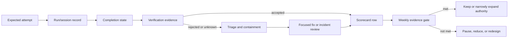

# 22. Evaluation, Observability, and the 90-Day Capstone

**Verified against Hermes Agent v0.20.5 (2026-08-19).**

## Opening scenario

At Friday’s review, Hermes has completed fourteen scheduled runs, prepared six business drafts, closed three goals, and delegated two research jobs. The green counts imply a productive week. Then Priya samples the work.

One “completed” morning brief omitted a school closure because the source feed failed. A support draft answered the customer’s question correctly but proposed a delivery date that no owner had approved. A research subagent returned excellent citations after exceeding the planned cost. A cron job ran successfully but delivered into the wrong test channel. The family budget summary used a stale category rule remembered from an earlier session. Nothing in the completion count distinguishes these cases.

Priya changes the management question from “Did it run?” to “What happened, how do we know, and was it worth the authority granted?” She and Hermes build a small scorecard, sample artifacts, inspect traces when needed, classify incidents, and reduce authority when evidence weakens. The final step is a ninety-day sequence of earned permissions.

## Definitions

**Evaluation** is a deliberate comparison between an output or trajectory and a stated standard. The standard may be exact, such as a passing test, or judgement-based, such as whether an escalation gave the owner enough evidence to decide.

**Observability** is the ability to reconstruct what Hermes did from its visible state and records: session identity, model/provider route, tool calls and results, artifacts, approvals, costs, delivery receipts, cron attempts, and error logs. Observability supports judgement; it does not make the system correct.

**Metric** is one measured property. A metric becomes useful only when its definition, numerator, denominator, owner, review cadence, and decision rule are recorded.

**Operational scorecard** is a small balanced set of measures covering outcomes, correctness, safety, cost, latency, escalation, and reliability. It should change operating decisions, not decorate a dashboard.

**Completion** means the worker or scheduler reached a terminal “done” state. **Correctness** means independent evidence shows the result met its acceptance condition. Completion is necessary for many jobs but never substitutes for correctness.

**Trace** is a record of steps between request and result. Hermes sessions and tool histories are practical operational traces. Hermes can also save ShareGPT-compatible trajectory JSONL from library/batch paths when explicitly enabled; the ordinary `hermes` CLI does not expose a trajectory-saving flag or config key. A trace is sensitive data and should be collected only for a defined diagnostic or evaluation purpose.

**Sampled review** is human inspection of a representative subset of completed and failed work. A small, risk-weighted sample finds failure classes that aggregate counts hide.

**Latency** is elapsed time from an agreed start to a useful state. Separate time to first useful response, time to verified artifact, time waiting for approval, and time to recovery; they answer different questions.

**Cost** includes provider spend or subscription usage, tokens where available, tool/service fees, machine time, and human review or repair time. Cost per accepted outcome is more informative than cost per model call.

**Escalation quality** measures whether Hermes stopped at the right boundary and gave the human a decision-ready package: what happened, evidence, uncertainty, impact, options, and requested action.

**Memory drift** is a mismatch between current authoritative facts and what the agent retrieves or assumes from persistent memory, an old session, compressed context, a Bot profile, or a stale shared artifact.

**Automation failure** is any mismatch among scheduled intent, execution, outcome, and delivery. A job can fail to fire, run and fail, run successfully with wrong content, or produce correct content that never reaches the intended destination.

**Incident** is an event that crossed or seriously threatened the operating boundary: unauthorized external effect, data exposure, destructive change, repeated silent failure, uncontrolled spend, or consequential misinformation.

**Evidence gate** is a condition that must be satisfied before authority expands. Time elapsed, confidence, or the absence of complaints is not a gate.

**Bounded digital employee** is the final operating stage in this book: Hermes performs a documented set of internal tasks and prepares specified external actions within fixed identities, tools, data, budgets, approvals, and recovery procedures. It does not receive general business authority.

## Hermes in practice

### Start with decisions, not telemetry

Collect a measure only if someone will make a decision from it. A one- or two-person business does not need a large observability platform to learn whether Hermes is dependable. It needs a ledger that can answer five questions:

1. Did the intended job start and reach a terminal state?
2. Did independent evidence show the output was correct enough for its risk class?
3. Did Hermes remain inside the approved authority, data, and tool boundary?
4. What time, money, tokens, and owner attention did the accepted outcome consume?
5. When something went wrong, did Hermes stop, explain, and recover well?

Define the unit before the percentage. “Success rate 95%” is meaningless if different people count deliveries, completed runs, or approved artifacts. Use an assignment or scheduled attempt as the base row, with an ID, task family, risk class, expected evidence, and disposition.

### Use a balanced operational scorecard

The following scorecard is intentionally small. Adopt only rows tied to real work.

| Dimension | Definition | Evidence | Review trigger |
| --- | --- | --- | --- |
| Attempt coverage | Attempts observed / attempts expected | Cron run ledger, session list, assignment IDs | Any missing high-risk attempt |
| Verified correctness | Accepted after evidence / reviewed attempts | Tests, citation samples, reconciliations, destination read-backs | Below task-family floor |
| False completion | Completed claims that fail review / reviewed completed claims | Claimed status versus review result | Any consequential case; rising trend |
| Boundary compliance | Reviewed attempts with no authority/data/tool breach / reviewed attempts | Brief, trace, artifact, approval ledger | Any breach pauses promotion |
| Escalation quality | Decision-ready escalations / reviewed escalations | Escalation rubric | Any silent or late escalation |
| Automation reliability | Correct executions delivered correctly / expected fires | Cron run state, output, receipt, destination | Miss, duplicate, wrong target, silent failure |
| Accepted-outcome latency | Median and tail time to verified acceptance | Start, artifact, check, approval timestamps | Tail grows or deadlines missed |
| Cost per accepted outcome | Total observed cost / accepted outcomes | Route, tokens/cost, service fees, review minutes | Budget or repair burden exceeded |
| Memory freshness | Current sampled facts / sampled memory-dependent facts | Source comparison and memory review | Any consequential stale fact |
| Recovery quality | Incidents restored and reconciled inside target / incidents | Incident record, restore test, effect reconciliation | Missed target or repeated cause |

Set task-family floors, not one global pass mark. A public article summary can tolerate a small phrasing defect; a customer commitment cannot tolerate an invented term. A family-selected operating policy might sample three low-risk briefs weekly, every Amber approval object, every unknown effect, and every Red-boundary attempt. Document the sampling rule before selecting cases so the sample is not just the easiest work.

Completion and correctness must be separate columns, as must execution and delivery. A cron `succeeded`, subagent `SUCCEEDED`, or goal judge’s “done” can coexist with a failed destination, incorrect artifact, or unmet acceptance evidence.

### Build one evaluation record per attempt

Use a plain CSV, spreadsheet, or Markdown table that the owner can inspect. Each attempt row should contain:

- assignment/job ID and task family;
- risk class and authority level;
- expected start or trigger and actual start;
- session, profile/Bot, and specialist IDs;
- model/provider/runtime route, including fallback if known;
- artifact path or destination;
- completion state and timestamp;
- required verification and raw result;
- correctness disposition: accepted, rejected, partial, blocked, or unknown;
- approval ID for any Amber effect;
- external receipt and read-back result where applicable;
- input/output tokens or cost when exposed, elapsed time, and reviewer minutes;
- escalation score, failure class, corrective action, and incident link;
- retention/deletion date.

Do not paste full prompts, private files, hidden reasoning, or customer content into the scorecard. Store references to controlled evidence; the scorecard is an index, not another data lake.



The scorecard consumes evidence from the system; it does not manufacture evidence after the fact.

### Inspect sessions before exporting trajectories

Hermes sessions preserve conversation continuity and tool history in the active profile. Use the session list/search/resume surfaces and the TUI to inspect the exact case. For delegated work, `/agents` and live child transcripts reveal branch status, cost/token rollups, touched files, tool progress, and the final summary. For Bot work, inspect the Bot’s canonical chat, profile memory, routines, and the group session if one was involved.

Hermes’s documented trajectory exporter is a developer/library feature. With `python run_agent.py --save_trajectories --query=...`, successful entries go to `trajectory_samples.jsonl` and failed or interrupted entries to `failed_trajectories.jsonl`. Batch entries can include API-call counts, used toolsets, tool statistics, and normalized error counts. The records contain system content, conversation turns, normalized reasoning markup, tool calls, and tool results. That makes them useful for controlled debugging or evaluation—and unsuitable for casual permanent collection.

Apply a trace-minimization rule:

- use normal session and artifact evidence for routine review;
- export a trajectory only for a named diagnostic, regression set, or authorized research purpose;
- exclude secrets and minimize personal/customer content before collection;
- restrict access and record retention/deletion;
- do not treat normalized reasoning as a guaranteed causal explanation;
- correlate events with artifacts and destination evidence.

For OpenAI API work outside Hermes, official webhooks can report when background responses complete, fail, cancel, or become incomplete. An event is not verification of a business outcome. Verify signatures with the official SDK, return quickly, and make handlers idempotent. Do not confuse OpenAI API webhooks with Hermes hooks or cron delivery.

### Run risk-weighted sampled reviews

Review every consequential or anomalous case and a smaller sample of routine cases. A practical owner-selected operating policy is:

- 100% of Amber approval objects, external-effect receipts, fallback routes, failed checks, unknown states, and incident-linked attempts;
- 100% of new task families during probation;
- three random Green attempts per active task family each week, or all if fewer than three;
- one deliberately difficult or edge case per task family each month;
- one restored or replayed case after any control change.

For each sampled attempt, inspect four layers:

1. **Input fidelity:** Were authoritative sources current and complete? Was the context boundary respected?
2. **Process fidelity:** Were permitted tools and routes used? Did the agent stop at approvals? Were retries bounded?
3. **Output fidelity:** Does the artifact satisfy factual, structural, and task-specific acceptance criteria?
4. **Effect fidelity:** Did the approved destination receive exactly what was reviewed? Is there a receipt and read-back?

Use pass, fail, and not-observable. Never convert “not-observable” to pass. Sample failures on purpose: they expose unclear briefs, missing credentials, model mismatch, context pressure, recovery quality, and whether unknown effects are reconciled before retry.

### Measure cost and latency without gaming them

Capture route and observed usage at the attempt level where Hermes or the provider exposes it. `/usage` and `/context` help diagnose a live session’s token and context pressure. `/agents` provides delegated branch rollups. Provider dashboards or account records may provide billed amounts. If exact monetary cost is unavailable, record tokens, subscription lane, elapsed time, and human minutes without inventing a dollar figure.

Break latency into timestamps:

- queued or scheduled;
- actual start;
- first useful response;
- artifact ready;
- verification finished;
- approval requested and decided;
- external effect confirmed;
- recovery complete, if needed.

Then ask where waiting is useful. Codex may take longer but reduce repair; cron jobs due together may run sequentially; MoA adds reference latency; fallback may restore service while changing cache cost and quality. Test those trade-offs instead of optimizing one number.

Use median plus a tail measure only when the sample supports it. Track review and repair time. Prefer the route minimizing effort per accepted outcome while meeting quality and privacy floors.

### Score escalation quality

Hermes is safer when it knows how to stop well. Evaluate an escalation on six observable fields, zero or one point each:

| Field | Pass condition |
| --- | --- |
| Trigger | Names the policy, ambiguity, failed check, cap, or unknown effect that caused the stop |
| Evidence | Links the relevant source, artifact, log, receipt, or raw status |
| Impact | Explains what is affected and what is not |
| Containment | States what was paused, revoked, preserved, or not retried |
| Options | Offers bounded alternatives with trade-offs rather than a disguised recommendation |
| Request | Asks the authorized person for one explicit decision or action |

Five of six is a useful probation floor; any missing containment for an unknown effect is an automatic failure. Reward early, accurate escalation. Penalizing every escalation as a productivity loss trains the system toward unsafe silence.

Separate “blocked” from “failed.” A child requesting a missing approved source, a goal pausing at its turn cap, or cron returning `blocked_config` may be operating safely. Evaluation should recognize boundary-respecting stops.

### Detect memory and context drift

Memory is a convenience index, not an authority. Hermes built-in memory is bounded and injected as a frozen snapshot when a session begins. A fact saved during a session is available to the next session’s prompt; it does not rewrite the current prompt. Long sessions may compress earlier detail. Bot profiles retain separate histories and memory, while a shared source document can change underneath them.

Create a monthly memory review for each active profile or Bot:

1. list memory and role-defining context;
2. classify each fact as stable preference, current operational fact, temporary case detail, sensitive data, or unsupported claim;
3. compare operational facts with authoritative records and dates;
4. delete temporary, stale, sensitive, or duplicated entries;
5. confirm what must live in the workspace instead of memory;
6. start a fresh session and test retrieval on a few approved facts.

Signs of drift include obsolete policies, cross-profile facts, approvals without scope or expiry, or old routine output treated as truth. Pause affected automation, correct the authoritative source, clean memory, start fresh, and rerun acceptance cases. Do not store more of everything.

When quality drops, use the official Hermes troubleshooting order: confirm `/model` or `/status`; inspect `/usage` and `/context`; verify detected context length; account for frozen memory; distinguish bounded memory from `session_search`; check `/skills` and `/tools list`; and inspect compression. This sequence tests concrete causes before changing prompts or providers.

### Evaluate goals as controlled continuation

`/goal` keeps an objective active across turns and uses an auxiliary judge to return `done`, `continue`, or `wait`. The goal state persists with the session and the default continuation budget is finite. This is useful for multi-turn work, but judge completion is not acceptance evidence.

For every goal, record:

- exact objective and acceptance evidence;
- maximum turns and cost/time cap;
- background processes on which it may wait;
- pause/clear conditions;
- final judge verdict and independent verification disposition.

The judge fails open to `continue` on errors, so the turn budget is the backstop. Use pause, resume, clear, wait controls, and user messages. Treat `done` as “ready for verification,” not “approved.” Codex app-server continuations are fresh Codex turns and may re-evaluate approval policy.

### Evaluate cron from schedule to destination

Cron reliability has four separate stages: due, claimed, executed, delivered. The gateway’s scheduler fires due jobs in fresh sessions. Execution attempts move through claimed/running states to an immutable terminal state; process loss can leave an attempt `unknown`, which is not automatically retried. Inspect `hermes cron runs <job> --limit 20` and `hermes cron list`, not only the latest message.

Use this failure taxonomy:

| Symptom | First evidence | Likely layer | Safe response |
| --- | --- | --- | --- |
| Job absent or paused | `hermes cron list` | Definition/lifecycle | Correct or resume after review |
| Expected fire missing | next run, `last_fire_error`, gateway status | Scheduler/hand-off | Restore gateway, test manual run, reconcile catch-up |
| `blocked_config` | job status and validation reason | Model/provider/delivery config | Fix config; no token spend occurred |
| Run failed | run history and agent/error logs | Script, provider, tool, skill | Classify, fix narrowly, rerun once |
| Run unknown | immutable attempt state | Process loss | Reconcile external effects before manual rerun |
| Correct output, wrong/no destination | local output plus delivery status | Delivery routing | Correct target, send only after approval if consequential |
| Duplicate effect | receipts and destination state | Idempotency/late retry | Stop, reconcile, repair duplicate-safe design |
| Slow or overlapping jobs | timestamps, tick lock, active attempts | Scheduling/concurrency | Stagger schedules or simplify work |

Cron output is retained locally even when `[SILENT]` suppresses successful delivery. Failed jobs should still surface. Recurring prompts must be self-contained because runs are fresh sessions; `continuity` and `context_from` provide explicit prior output, not general conversational memory. The cron platform has its own configured toolset, and scheduled runs disable recursive scheduling by default. Review any capability change and manually trigger a test before relying on the next fire.

### Run incidents as learning loops

An incident review creates and proves a control change; it is not a blame report.

Immediate response:

1. stop the affected session, child, Bot routine, goal, cron job, or gateway path;
2. revoke or narrow credentials, tools, mounts, and egress if exposure is possible;
3. preserve the minimum logs, session IDs, artifacts, receipts, and timestamps needed to understand the event;
4. reconcile external destinations before rollback or retry;
5. restore authoritative state from a known source;
6. notify the accountable person and any required professional/service owner.

Review within a defined window:

- expected behaviour and control;
- actual sequence and evidence;
- first divergence from expectation;
- impact, including data and external effects;
- containment and recovery;
- contributing factors in brief, context, model/route, tool, permission, memory, automation, verification, and human review;
- one owner and due date per corrective action;
- regression case and evidence gate for return to service.

Use checkpoints only for local filesystem recovery. Hermes checkpoints are opt-in, make shadow-git snapshots before documented local mutations, and `/rollback diff <N>` previews recovery. A default rollback preserves later human edits where the agent-write ledger can identify them; `--all` is broader. Checkpoints do not reverse emails, payments, calendar events, deployed changes, API calls, or other external effects. They also are not a full backup. Reconcile those systems first.

### Troubleshoot in a fixed order

Random prompt edits destroy evidence. Use this order:

1. **Reproduce or bound:** identify task ID, expected result, actual result, and whether the problem persists.
2. **Check identity and route:** profile/Bot, session, model, provider, runtime, fallback, and working directory.
3. **Check inputs:** source availability, freshness, permissions, redaction, and system of record.
4. **Check context:** `/usage`, `/context`, compression, memory snapshot, loaded skills, and toolsets.
5. **Check execution:** tool errors, subagent status/transcript, goal judge reason, cron run state, locks, scripts, and logs.
6. **Check artifact:** diff, citations, render, calculation, or record reconciliation.
7. **Check effect:** approval ID, destination, receipt, and read-back.
8. **Apply one change:** narrow correction, version it, and rerun the smallest failing acceptance case.
9. **Restore service gradually:** Green/read-only first, then the prior evidence gate.

If the cause remains unknown after this sequence, reduce authority. Mystery is a reason for containment, not for broader access.

### Complete the staged 90-day capstone

The capstone uses the business operations role from Chapters 19–21 and one family-safe workflow. Choose real but low-risk records, or realistic synthetic data during the first stages. The owner-selected cadence below is an operating policy, not a product guarantee.

#### Days 1–15: observe and establish the baseline

Create a dedicated macOS account, Hermes workspace, business profile, and separate family profile. Confirm model routing, tools, skills, identities, egress, retention, backup, and stop procedures. Select three read-only task families: source-labelled morning brief, public business research table, and school-notice extraction from supplied files. No external sends, writes to systems of record, scheduled actions, subagents, Bots, or Codex changes.

Build twenty reference cases across the three families. Record expected fields, sources, and explicit unknowns. Run Hermes manually and score input fidelity, correctness, boundary compliance, latency, and reviewer effort. Rehearse `/stop`, session identification, log inspection, and removal of a supplied document.

**Gate 1:** at least fifteen completed reference cases; every consequential fact traceable to an approved source; no boundary breach; every unknown labelled; restore and deletion drill demonstrated; the owner can explain the actual model/profile/tool route. Otherwise remain read-only and fix the first failing layer.

#### Days 16–30: prepare drafts and approval objects

Add bounded draft production: a business research memo, a customer-response draft from supplied facts, a career fit review, and proposed calendar rows. Hermes may create internal artifacts in named folders. It may not send, publish, submit, book, pay, enrol, change production, or alter authoritative customer/family records. Adopt the evaluation record and sample every draft.

Introduce immutable approval objects for proposed external effects: exact content, destination, account, data fields, expiry, and approving human. The human performs the effect manually and attaches a provider receipt plus destination read-back. Measure false completion and escalation quality.

**Gate 2:** ten consecutive sampled drafts meet their task-family acceptance criteria; all consequential proposals stop at approval; every human-performed effect has a matching receipt/read-back; no stale-memory dependency; median reviewer effort is stable or falling. Any unauthorized or untraceable proposal resets the affected task family to Gate 1.

#### Days 31–45: add one specialist at a time

Introduce one temporary Hermes leaf subagent for public research and Codex for one isolated repository test/fix family. Use separate artifacts/worktrees, complete assignment cards, maximum one worker initially, bounded iterations, one retry, and independent verification. Keep nested orchestration disabled. Do not connect Codex to customer, family, payment, or inbox data.

After five accepted cases for each specialist, optionally create one persistent named Bot for a recurring read-only role. Review its profile, memory, skills, tools, MCP servers, credentials, and routine state. It gets no external authority. Do not create a group until a specific comparison case proves that two roles add value.

**Gate 3:** five consecutive accepted outputs per specialist; zero shared-artifact collision; costs and reviewer minutes inside the recorded budget; every failed check truthfully handed back; stopping and steering tested; interrupted-worker drill ends with correct `unknown` reconciliation. A failed gate removes the specialist while the base Hermes workflow continues.

#### Days 46–60: schedule quiet, reversible operations

Schedule two Green jobs: a local daily source brief and a weekly internal operating review. Use cron with self-contained prompts, explicit timezone, isolated output folders, named delivery targets, and no-agent/script gates where reasoning is unnecessary. Manually trigger and inspect each job. Record expected fires, run states, outputs, delivery receipts, and destination read-backs. Stagger schedules.

Add one `/goal` workflow for a bounded multi-turn artifact with a finite turn budget and explicit acceptance test. Test pause, resume, clear, and a wait on a real background process. The goal may produce an internal draft only.

**Gate 4:** fourteen calendar days with no unexplained missed or duplicate fire; every attempt visible in history; delivery tested; unknown process-loss drill reconciled without blind retry; goal completion independently verified; kill and pause procedures executed by the owner. Any silent failure pauses the affected automation.

#### Days 61–75: operate a supervised business function

Choose one low-consequence function from Chapter 20, such as public-source market research plus internal content preparation. Hermes may collect approved sources, update a draft workspace, create Kanban tasks, delegate the bounded evidence table, and prepare an approval object. The owner approves and performs publication or customer communication. The finance path remains receipt organization and professional handoff only.

Run a weekly sampled review and a memory review. Compare the everyday route with a higher-capability route or one tested MoA review only on difficult cases; adopt the more complex route only if accepted-outcome quality improves enough to justify cost and latency. Exercise checkpoint preview and restore on a synthetic local edit.

**Gate 5:** four weekly reviews completed; scorecard denominators and samples are reproducible; no false completion on consequential work; escalation average at least five of six; memory sample current; cost and tail latency inside owner-selected budgets; synthetic incident restore and external-effect reconciliation passed.

#### Days 76–90: qualify the bounded digital employee

Write the final role charter. Enumerate task families, profiles, identities, tools, data roots, model routes, specialists, schedules, budgets, approvals, professional handoffs, evidence, retention, backup, incident owner, and offboarding steps. Remove experimental access. Freeze a regression set containing normal, ambiguous, missing-source, stale-memory, provider-failure, permission-denied, duplicate-delivery, and unknown-effect cases.

Hermes now may execute only the proven Green internal steps and recurring jobs. It may prepare the specific Amber actions proven in probation. Humans still approve contracts, customer commitments, prices, payments/refunds, public claims, applications, bookings, enrolment, calendar invitations to others, health/tax/legal decisions, production changes, and destructive actions. No “general autonomy” checkbox exists.

Run the full regression set, restore drill, credential-revocation drill, missed-cron drill, specialist interruption drill, and one incident tabletop. Review ninety-day totals and cost per accepted outcome. Decide separately for each task family: retire, redesign, keep, or expand one dimension.

**Gate 6 — qualification:** all prior gates retained; regression set passes; every external effect requires the designed human approval and receipt; zero unresolved incidents or unknown effects; recovery targets met; owner can disable sessions, children, goals, routines, cron, credentials, and gateway access; offboarding leaves no active job or orphaned credential. Only then call the system a bounded digital employee.

The ninety-day outcome is not maximum autonomy. It is a role whose useful behaviour and failure handling are evidenced well enough to operate inside a known envelope.

## Professional example

The business content pipeline records twelve attempts in a month. Eleven finish, ten are reviewed, nine are accepted, and eight are published manually after approval. The useful figures are not “92% completion.” Verified correctness is nine of ten reviewed attempts; false completion is one of the eleven completed claims; effect fidelity is eight of eight published items with matching approval, platform receipt, and read-back. The rejected draft contains an unsupported comparison, and its escalation score is only three because Hermes named uncertainty but did not contain the scheduled campaign.

The owners pause that task family, add claim-to-source acceptance rows, and run three regression cases. They do not replace the model first. After the focused change, the same difficult case escalates before scheduling and includes the exact unsupported sentence. The task family returns to draft-only service; publication authority was never delegated.

## Personal example

The Family Admin Bot’s weekly notice review completes four times. One week’s PDF source is unavailable, yet the Bot repeats last week’s activity time from memory. Because the scorecard separates completion from correctness, the attempt fails. The routine is paused. Priya deletes the temporary activity fact from memory, confirms that each run must cite the current notice, adds a missing-source escalation case, and starts a fresh session.

For two weeks the workflow returns either source-backed rows or a clear “notice unavailable” escalation. It may again prepare calendar rows, but Priya still approves entries. The recovery improved a narrow workflow without giving the Bot direct school-inbox, payment, or enrolment authority.

## Authority boundaries

| Level | Hermes may do | Human role |
| --- | --- | --- |
| **Green — may act** | Record attempt metadata, calculate defined metrics, inspect authorized sessions/logs/artifacts, sample internal outputs, run approved tests, pause faulty internal automation, prepare incident evidence, and execute proven internal read/draft workflows. | Define metrics, sample policy, evidence gates, budgets, retention, and recovery targets. |
| **Amber — may prepare** | Propose authority expansion, score thresholds, model/route changes, memory edits, automation changes, retries, restoration, external messages, publications, bookings, purchases, applications, or production changes. | Approve each material control or external effect after reviewing evidence and scope. |
| **Red — may not act** | Hide or alter adverse evidence; grade itself without sampling; treat completion as correctness; retry unknown effects; expand authority after an incident; collect unlimited traces; or autonomously make financial, tax, legal, medical, employment, school-consent, privacy, destructive, or contractual decisions. | Own consequential decisions, incident notification, professional handoffs, and final qualification. |

Metrics never create permission. A high pass rate does not authorize a new destination, account, data class, tool, or decision. Each expansion requires its own evidence gate.

## Failure modes and recovery

**Vanity dashboard.** Many green counts, no denominators or decisions. Remove metrics without an owner and trigger; add reviewed correctness and boundary rows.

**Completion laundering.** Terminal success is reported as correct. Reopen the artifact, run the acceptance evidence, and correct the scorecard disposition.

**Selective sampling.** Only easy or successful cases are reviewed. Predeclare a risk-weighted random rule and include failures, fallbacks, and unknowns.

**Trace hoarding.** Full sessions or trajectories are retained indefinitely. Stop export, restrict access, delete under the retention procedure, and replace raw content with evidence references.

**Metric gaming.** The system becomes faster by omitting checks or escalations. Balance latency/cost with correctness, boundary compliance, escalation, and recovery; never reward unsafe silence.

**Memory drift.** A stale fact enters a draft or schedule. Pause the task family, correct the system of record, clean memory, start fresh, and pass stale/missing-source regressions.

**Automation split-brain.** A job runs on duplicate gateways or produces duplicate effects. Stop both paths, inspect locks and receipts, reconcile destinations, and add idempotency before resuming.

**Unknown after restart.** A child or cron attempt lost process ownership. Mark unknown, inspect destination and artifact state, and never infer failure from absence of a final message.

**Rollback overreach.** A local checkpoint is treated as external undo. Preview the diff, preserve human edits, restore local files only after effect reconciliation, and use authoritative backup for disaster recovery.

**Premature promotion.** Calendar time passes but evidence gates do not. Keep or reduce current authority. The ninety-day plan is a maximum progression speed, not a deadline for autonomy.

## Field kit

### OPERATIONAL EVIDENCE AND CAPSTONE CARD

```text
TASK FAMILY / RISK CLASS:
OWNER / REVIEWER:
CURRENT AUTHORITY STAGE:

ATTEMPT RECORD
Expected attempt / actual start:
Session, profile/Bot, specialist, job/goal IDs:
Model/provider/runtime/fallback:
Artifact or destination:
Completion state:
Acceptance evidence and raw result:
Correctness: [accepted / rejected / partial / blocked / unknown]
Approval ID / receipt / read-back:
Elapsed time / tokens or cost / reviewer minutes:
Failure class / incident ID:
Retention/deletion date:

WEEKLY SCORECARD
Expected / observed attempts:
Reviewed sample rule and selected IDs:
Verified correctness:
False completion:
Boundary compliance:
Escalation quality:
Automation execution and delivery:
Accepted-outcome latency:
Cost per accepted outcome:
Memory freshness:
Recovery results:

EVIDENCE GATE
Stage and task family:
Required cases and controls:
Evidence links:
Gate result: [met / not met / not observable]
Decision: [retire / redesign / keep / expand one dimension]
Exact authority change, if any:
Rollback/offboarding trigger:
Owner and next review date:

INCIDENT REVIEW
Expected / actual / first divergence:
Impact and unknowns:
Containment and external-effect reconciliation:
Recovery evidence:
Contributing factors:
Corrective action / owner / due date:
Regression case and return-to-service evidence:
```

## Exercise

Design the first thirty days of the capstone for one business workflow and one family workflow. Define attempt records, a five-to-ten-row scorecard, sample policy, acceptance evidence, escalation rubric, memory rule, incident trigger, and Gates 1 and 2. Include one missing-source case, one completed-but-wrong case, and one delivery failure. State which permissions remain unavailable.

## Answer or rubric

A strong answer begins with read-only source work and a dedicated profile/data boundary. It distinguishes expected fires, terminal completion, reviewed correctness, and delivered effects. The business case might create a public-source research table; the family case might extract dates from a supplied notice. Both require source links, explicit unknowns, retention, and no external action. Gate 1 requires a fixed case count, traceable facts, no breach, and a tested stop/delete/restore procedure.

Days 16–30 may add internal drafts and immutable approval objects. Humans perform any send or calendar action and attach receipts/read-backs. The sample includes every Amber proposal plus random Green cases, failures, and the three specified edge cases. Memory stores stable formatting preferences, not temporary dates or approvals. Gate 2 requires consecutive accepted samples and flawless approval stops. Sending, enrolment, payment, publication, production changes, professional decisions, and general inbox access remain unavailable.

Award two points each for unit definitions, balanced metrics, risk-weighted sampling, correctness evidence, effect evidence, escalation quality, memory control, automation taxonomy, incident/recovery design, evidence gates, and explicit unavailable permissions. Eighteen of twenty-two indicates mastery. Automatic promotion after thirty days, completion-only reporting, or blind retry of a delivery failure requires redesign.

## Mastery checklist

- [ ] Every metric has a definition, denominator, owner, evidence source, cadence, and decision trigger.
- [ ] Completion, correctness, execution, delivery, and approval are separate states.
- [ ] Review samples are predeclared, risk-weighted, and include failures and unknowns.
- [ ] Cost includes human review and repair; latency ends at verified acceptance.
- [ ] Escalations name trigger, evidence, impact, containment, options, and request.
- [ ] Session and artifact evidence is preferred over unnecessary full-trajectory collection.
- [ ] OpenAI API webhooks are not confused with Hermes hooks, cron, or outcome verification.
- [ ] Memory and compressed context are checked against authoritative records.
- [ ] Goals have finite budgets and independent acceptance evidence.
- [ ] Cron is reviewed from expected fire through run state, output, receipt, and read-back.
- [ ] Unknown external effects are reconciled before rollback or retry.
- [ ] Checkpoints are treated as local file recovery, not external undo or full backup.
- [ ] Incidents produce containment, cause analysis, a corrective owner, and a regression case.
- [ ] Authority expands one dimension at a time only after an explicit evidence gate.
- [ ] The day-90 role remains a bounded digital employee, not an uncontrolled autonomous operator.

## References

- Nous Research, [Trajectory format](https://github.com/NousResearch/hermes-agent/blob/v2026.8.19/website/docs/developer-guide/trajectory-format.md).
- Nous Research, [Sessions](https://github.com/NousResearch/hermes-agent/blob/v2026.8.19/website/docs/user-guide/sessions.md).
- Nous Research, [Troubleshooting agent quality](https://github.com/NousResearch/hermes-agent/blob/v2026.8.19/website/docs/guides/troubleshooting-agent-quality.md).
- Nous Research, [Persistent goals](https://github.com/NousResearch/hermes-agent/blob/v2026.8.19/website/docs/user-guide/features/goals.md).
- Nous Research, [Scheduled tasks](https://github.com/NousResearch/hermes-agent/blob/v2026.8.19/website/docs/user-guide/features/cron.md).
- Nous Research, [Cron troubleshooting](https://github.com/NousResearch/hermes-agent/blob/v2026.8.19/website/docs/guides/cron-troubleshooting.md).
- Nous Research, [Checkpoints and rollback](https://github.com/NousResearch/hermes-agent/blob/v2026.8.19/website/docs/user-guide/checkpoints-and-rollback.md).
- Nous Research, [Fallback providers](https://github.com/NousResearch/hermes-agent/blob/v2026.8.19/website/docs/user-guide/features/fallback-providers.md).
- Nous Research, [Subagent delegation](https://github.com/NousResearch/hermes-agent/blob/v2026.8.19/website/docs/user-guide/features/delegation.md).
- OpenAI, [Webhooks](https://developers.openai.com/api/docs/guides/webhooks) (accessed 2026-08-21).
- OpenAI, [Webhook events](https://developers.openai.com/api/reference/resources/webhooks) (accessed 2026-08-21).
- NIST, [AI Risk Management Framework](https://www.nist.gov/itl/ai-risk-management-framework) (accessed 2026-08-21).
